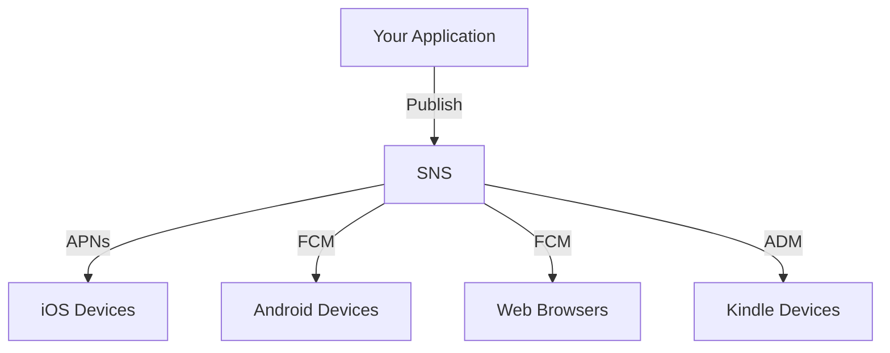

# How to Send Push Notifications with SNS

Author: [nawazdhandala](https://github.com/nawazdhandala)

Tags: AWS, SNS, Push Notifications, Mobile

Description: Learn how to send push notifications to iOS, Android, and web applications using Amazon SNS, including platform setup, device registration, and targeted messaging.

---

Amazon SNS can deliver push notifications to mobile devices and web browsers through Apple Push Notification Service (APNs), Firebase Cloud Messaging (FCM), and other platform services. Instead of integrating with each push service directly, you use SNS as a unified layer that handles the delivery mechanics.

## How SNS Push Notifications Work



The key concepts are:
- **Platform Application**: Represents your app on a specific push service (APNs, FCM, etc.)
- **Platform Endpoint**: Represents a specific device registered with your app
- **Topic**: Optional grouping for broadcasting to multiple devices

## Setting Up FCM (Firebase Cloud Messaging)

First, create a platform application for FCM in SNS.

```bash
# Create an SNS platform application for FCM (Android/Web)
# You'll need the FCM API key from the Firebase console
aws sns create-platform-application \
  --name MyApp-FCM \
  --platform GCM \
  --attributes '{
    "PlatformCredential": "YOUR_FCM_SERVER_KEY"
  }'
```

For FCM v1 API (recommended), you'll use a service account JSON key instead.

```python
import json
import boto3

sns = boto3.client('sns')

# Create platform application for FCM v1
# Use the service account JSON from Firebase console
with open('firebase-service-account.json', 'r') as f:
    service_account = f.read()

response = sns.create_platform_application(
    Name='MyApp-FCM',
    Platform='GCM',
    Attributes={
        'PlatformCredential': service_account,
    }
)

platform_app_arn = response['PlatformApplicationArn']
print(f'Platform application: {platform_app_arn}')
```

## Setting Up APNs (Apple Push Notification Service)

For iOS push notifications, you need either a certificate (.p12) or a signing key (.p8) from Apple.

```python
import boto3

sns = boto3.client('sns')

# Create platform application for APNs using token-based auth
# This is the recommended approach (uses .p8 signing key)
response = sns.create_platform_application(
    Name='MyApp-APNs',
    Platform='APNS',  # Use 'APNS_SANDBOX' for development
    Attributes={
        'PlatformPrincipal': 'YOUR_SIGNING_KEY_ID',
        'PlatformCredential': open('AuthKey_XXXXXX.p8').read(),
        'ApplePlatformTeamID': 'YOUR_TEAM_ID',
        'ApplePlatformBundleID': 'com.yourcompany.yourapp',
    }
)

apns_arn = response['PlatformApplicationArn']
print(f'APNs platform: {apns_arn}')
```

## Registering Devices

When a user installs your app and grants notification permission, the app gets a device token from the push service. You register this token with SNS to get a platform endpoint.

```python
import boto3

sns = boto3.client('sns')

def register_device(platform_app_arn, device_token, user_data=None):
    """Register a device token with SNS and return the endpoint ARN.

    Call this when your app receives a device token from APNs/FCM.
    """
    params = {
        'PlatformApplicationArn': platform_app_arn,
        'Token': device_token,
    }

    if user_data:
        # Custom data you can associate with the endpoint
        params['CustomUserData'] = user_data

    response = sns.create_platform_endpoint(**params)
    endpoint_arn = response['EndpointArn']
    print(f'Registered device: {endpoint_arn}')
    return endpoint_arn

# Register an Android device
android_endpoint = register_device(
    platform_app_arn='arn:aws:sns:us-east-1:123456789012:app/GCM/MyApp-FCM',
    device_token='fcm_device_token_from_client',
    user_data='user_id:u-12345'
)

# Register an iOS device
ios_endpoint = register_device(
    platform_app_arn='arn:aws:sns:us-east-1:123456789012:app/APNS/MyApp-APNs',
    device_token='apns_device_token_from_client',
    user_data='user_id:u-12345'
)
```

### Handling Token Updates

Device tokens can change. Your app should re-register tokens when they update, and your backend needs to handle this gracefully.

```python
import boto3
from botocore.exceptions import ClientError

sns = boto3.client('sns')

def register_or_update_device(platform_app_arn, device_token, user_id):
    """Register a new device or update an existing one.

    Handles the case where the token has changed for an existing device.
    """
    try:
        response = sns.create_platform_endpoint(
            PlatformApplicationArn=platform_app_arn,
            Token=device_token,
            CustomUserData=f'user_id:{user_id}'
        )
        endpoint_arn = response['EndpointArn']

    except ClientError as e:
        if 'already exists' in str(e):
            # Endpoint exists but token might have changed
            # Extract the existing endpoint ARN from the error
            endpoint_arn = str(e).split('Endpoint ')[1].split(' ')[0]

            # Update the token and re-enable the endpoint
            sns.set_endpoint_attributes(
                EndpointArn=endpoint_arn,
                Attributes={
                    'Token': device_token,
                    'Enabled': 'true',
                    'CustomUserData': f'user_id:{user_id}',
                }
            )
        else:
            raise

    # Ensure the endpoint is enabled
    attrs = sns.get_endpoint_attributes(EndpointArn=endpoint_arn)
    if attrs['Attributes'].get('Enabled') == 'false':
        sns.set_endpoint_attributes(
            EndpointArn=endpoint_arn,
            Attributes={'Enabled': 'true', 'Token': device_token}
        )

    return endpoint_arn
```

## Sending Push Notifications

### Direct to a Single Device

```python
import json
import boto3

sns = boto3.client('sns')

def send_push_notification(endpoint_arn, title, body, data=None):
    """Send a push notification to a specific device.

    Uses platform-specific message formatting for proper
    display on iOS and Android.
    """
    # Build platform-specific payloads
    fcm_payload = {
        'notification': {
            'title': title,
            'body': body,
        },
    }
    if data:
        fcm_payload['data'] = data

    apns_payload = {
        'aps': {
            'alert': {
                'title': title,
                'body': body,
            },
            'sound': 'default',
            'badge': 1,
        },
    }
    if data:
        apns_payload.update(data)

    # SNS message structure for cross-platform delivery
    message = {
        'default': body,
        'GCM': json.dumps(fcm_payload),
        'APNS': json.dumps(apns_payload),
        'APNS_SANDBOX': json.dumps(apns_payload),
    }

    response = sns.publish(
        TargetArn=endpoint_arn,
        Message=json.dumps(message),
        MessageStructure='json',
    )

    return response['MessageId']

# Send a notification
send_push_notification(
    endpoint_arn='arn:aws:sns:us-east-1:123456789012:endpoint/GCM/MyApp-FCM/abc123',
    title='Order Shipped',
    body='Your order ORD-12345 has been shipped!',
    data={'order_id': 'ORD-12345', 'screen': 'order_detail'}
)
```

### Broadcast to All Devices via Topic

For broadcasting to multiple devices, subscribe endpoints to an SNS topic.

```python
import json
import boto3

sns = boto3.client('sns')

# Create a topic for broadcasts
topic_response = sns.create_topic(Name='app-broadcasts')
topic_arn = topic_response['TopicArn']

# Subscribe device endpoints to the topic
def subscribe_device_to_topic(topic_arn, endpoint_arn):
    """Subscribe a device to a broadcast topic."""
    sns.subscribe(
        TopicArn=topic_arn,
        Protocol='application',
        Endpoint=endpoint_arn,
    )

# Send to all subscribed devices
def broadcast_notification(topic_arn, title, body):
    """Send a push notification to all devices subscribed to a topic."""
    message = {
        'default': body,
        'GCM': json.dumps({
            'notification': {'title': title, 'body': body}
        }),
        'APNS': json.dumps({
            'aps': {'alert': {'title': title, 'body': body}, 'sound': 'default'}
        }),
    }

    response = sns.publish(
        TopicArn=topic_arn,
        Message=json.dumps(message),
        MessageStructure='json',
    )
    return response['MessageId']

# Send a broadcast to all devices
broadcast_notification(
    topic_arn,
    'New Feature Available',
    'Check out our latest update with improved performance!'
)
```

## Cleaning Up Disabled Endpoints

Endpoints get disabled when device tokens become invalid (app uninstalled, token expired). Regularly clean these up to avoid unnecessary costs.

```python
import boto3

sns = boto3.client('sns')

def cleanup_disabled_endpoints(platform_app_arn):
    """Delete endpoints that are no longer valid."""
    paginator = sns.get_paginator('list_endpoints_by_platform_application')
    deleted_count = 0

    for page in paginator.paginate(PlatformApplicationArn=platform_app_arn):
        for endpoint in page['Endpoints']:
            endpoint_arn = endpoint['EndpointArn']
            enabled = endpoint['Attributes'].get('Enabled', 'true')

            if enabled == 'false':
                sns.delete_endpoint(EndpointArn=endpoint_arn)
                deleted_count += 1

    print(f'Cleaned up {deleted_count} disabled endpoints')

# Run periodically
cleanup_disabled_endpoints(
    'arn:aws:sns:us-east-1:123456789012:app/GCM/MyApp-FCM'
)
```

## Monitoring Delivery

Track delivery success and failure rates through CloudWatch metrics.

```bash
# Check notification delivery success rate
aws cloudwatch get-metric-statistics \
  --namespace AWS/SNS \
  --metric-name NumberOfNotificationsDelivered \
  --dimensions Name=Application,Value=arn:aws:sns:us-east-1:123456789012:app/GCM/MyApp-FCM \
  --start-time 2026-02-11T00:00:00Z \
  --end-time 2026-02-12T00:00:00Z \
  --period 86400 \
  --statistics Sum
```

For setting up comprehensive alerting, see [using SNS with CloudWatch alarms](https://oneuptime.com/blog/post/2026-02-12-use-sns-with-cloudwatch-alarms/view). Push notifications through SNS work well at scale - you handle device registration and message formatting, and SNS takes care of the delivery to APNs, FCM, and other services.
