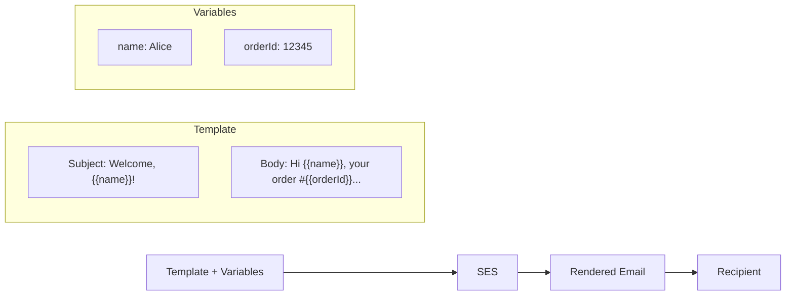

# How to Send Templated Emails with Amazon SES

Author: [nawazdhandala](https://github.com/nawazdhandala)

Tags: AWS, SES, Email Templates, Messaging

Description: Create and use email templates in Amazon SES for consistent, personalized transactional and marketing emails with dynamic content, bulk sending, and template management.

---

Hardcoding email content in your application code is a maintenance nightmare. Every time marketing wants to change the wording of a welcome email or design wants to update the footer, a developer has to make a code change and deploy it. SES email templates solve this by separating email content from application logic.

With SES templates, you define the email structure and layout once, then send personalized versions by passing in template variables. You can update templates without deploying code, send bulk emails efficiently, and maintain consistent branding across all your communications.

## How SES Templates Work

An SES template consists of:
- A template name (for referencing it in your code)
- A subject line (can include variables)
- An HTML body (with Handlebars-style template variables)
- A text body (plain text alternative, also with variables)

Variables use double curly braces: `{{variableName}}`. SES replaces them with the values you provide at send time.



## Step 1: Create an Email Template

Let's create a template for order confirmations:

```bash
# Create an email template
aws ses create-template \
  --template '{
    "TemplateName": "OrderConfirmation",
    "SubjectPart": "Order Confirmed - #{{orderId}}",
    "HtmlPart": "<!DOCTYPE html><html><head><style>body{font-family:Arial,sans-serif;max-width:600px;margin:0 auto;padding:20px;}h1{color:#333;}.order-details{background:#f5f5f5;padding:15px;border-radius:5px;margin:20px 0;}.footer{color:#888;font-size:12px;margin-top:30px;border-top:1px solid #eee;padding-top:15px;}</style></head><body><h1>Thanks for your order, {{name}}!</h1><p>Your order <strong>#{{orderId}}</strong> has been confirmed and is being processed.</p><div class=\"order-details\"><h3>Order Summary</h3><p>Items: {{itemCount}}</p><p>Total: ${{total}}</p><p>Shipping: {{shippingMethod}}</p><p>Estimated Delivery: {{estimatedDelivery}}</p></div><p>You can track your order at any time by visiting your <a href=\"{{trackingUrl}}\">order dashboard</a>.</p><div class=\"footer\"><p>This email was sent by Example Corp, 123 Main St, San Francisco, CA 94105</p><p><a href=\"{{unsubscribeUrl}}\">Unsubscribe</a></p></div></body></html>",
    "TextPart": "Thanks for your order, {{name}}!\n\nOrder #{{orderId}} confirmed.\n\nItems: {{itemCount}}\nTotal: ${{total}}\nShipping: {{shippingMethod}}\nEstimated Delivery: {{estimatedDelivery}}\n\nTrack your order: {{trackingUrl}}\n\nExample Corp, 123 Main St, San Francisco, CA 94105\nUnsubscribe: {{unsubscribeUrl}}"
  }' \
  --region us-east-1
```

## Step 2: Create More Templates

Here's a welcome email template:

```bash
# Welcome email template
aws ses create-template \
  --template '{
    "TemplateName": "WelcomeEmail",
    "SubjectPart": "Welcome to Example, {{name}}!",
    "HtmlPart": "<!DOCTYPE html><html><body style=\"font-family:Arial,sans-serif;max-width:600px;margin:0 auto;padding:20px;\"><h1>Welcome aboard, {{name}}!</h1><p>We are excited to have you. Here are a few things to get you started:</p><ul><li><a href=\"{{dashboardUrl}}\">Set up your profile</a></li><li><a href=\"{{docsUrl}}\">Read our getting started guide</a></li><li><a href=\"{{supportUrl}}\">Contact support if you need help</a></li></ul><p>Your account details:</p><p>Email: {{email}}<br>Plan: {{planName}}<br>Trial ends: {{trialEndDate}}</p><p>Best regards,<br>The Example Team</p></body></html>",
    "TextPart": "Welcome aboard, {{name}}!\n\nWe are excited to have you. Your account details:\nEmail: {{email}}\nPlan: {{planName}}\nTrial ends: {{trialEndDate}}\n\nGet started:\n- Dashboard: {{dashboardUrl}}\n- Docs: {{docsUrl}}\n- Support: {{supportUrl}}\n\nBest regards,\nThe Example Team"
  }' \
  --region us-east-1
```

And a password reset template:

```bash
# Password reset template
aws ses create-template \
  --template '{
    "TemplateName": "PasswordReset",
    "SubjectPart": "Reset your password",
    "HtmlPart": "<!DOCTYPE html><html><body style=\"font-family:Arial,sans-serif;max-width:600px;margin:0 auto;padding:20px;\"><h1>Password Reset Request</h1><p>Hi {{name}},</p><p>We received a request to reset your password. Click the button below to choose a new one:</p><p style=\"text-align:center;margin:30px 0;\"><a href=\"{{resetUrl}}\" style=\"background:#007bff;color:white;padding:12px 30px;text-decoration:none;border-radius:5px;font-size:16px;\">Reset Password</a></p><p>This link expires in {{expiryHours}} hours.</p><p>If you did not request this reset, you can safely ignore this email.</p></body></html>",
    "TextPart": "Hi {{name}},\n\nWe received a request to reset your password.\n\nReset your password here: {{resetUrl}}\n\nThis link expires in {{expiryHours}} hours.\n\nIf you did not request this reset, you can safely ignore this email."
  }' \
  --region us-east-1
```

## Step 3: Send a Templated Email

Now send an email using the template:

```bash
# Send a single templated email
aws ses send-templated-email \
  --source "orders@example.com" \
  --destination '{
    "ToAddresses": ["customer@gmail.com"]
  }' \
  --template "OrderConfirmation" \
  --template-data '{
    "name": "Alice Johnson",
    "orderId": "ORD-2026-78901",
    "itemCount": "3",
    "total": "149.97",
    "shippingMethod": "Express (2-day)",
    "estimatedDelivery": "February 14, 2026",
    "trackingUrl": "https://example.com/orders/ORD-2026-78901",
    "unsubscribeUrl": "https://example.com/unsubscribe?id=abc123"
  }' \
  --region us-east-1
```

## Step 4: Send Bulk Templated Emails

SES supports bulk sending where you send the same template to many recipients with personalized data for each:

```bash
# Send bulk templated emails (up to 50 recipients per call)
aws ses send-bulk-templated-email \
  --source "orders@example.com" \
  --template "OrderConfirmation" \
  --default-template-data '{
    "name": "Customer",
    "shippingMethod": "Standard",
    "estimatedDelivery": "February 18, 2026",
    "unsubscribeUrl": "https://example.com/unsubscribe"
  }' \
  --destinations '[
    {
      "Destination": {"ToAddresses": ["alice@example.com"]},
      "ReplacementTemplateData": "{\"name\":\"Alice\",\"orderId\":\"ORD-001\",\"itemCount\":\"3\",\"total\":\"149.97\",\"trackingUrl\":\"https://example.com/orders/ORD-001\"}"
    },
    {
      "Destination": {"ToAddresses": ["bob@example.com"]},
      "ReplacementTemplateData": "{\"name\":\"Bob\",\"orderId\":\"ORD-002\",\"itemCount\":\"1\",\"total\":\"49.99\",\"trackingUrl\":\"https://example.com/orders/ORD-002\"}"
    },
    {
      "Destination": {"ToAddresses": ["charlie@example.com"]},
      "ReplacementTemplateData": "{\"name\":\"Charlie\",\"orderId\":\"ORD-003\",\"itemCount\":\"5\",\"total\":\"249.95\",\"trackingUrl\":\"https://example.com/orders/ORD-003\"}"
    }
  ]' \
  --region us-east-1
```

The `default-template-data` provides fallback values for any variables not specified in a recipient's `ReplacementTemplateData`. This is handy for values that are the same across all recipients.

## Step 5: Send Templated Emails with the SDK

Here's a Python example for programmatic sending:

```python
# send_templated.py
import boto3
import json

ses = boto3.client('ses', region_name='us-east-1')

def send_order_confirmation(customer_email, order_data):
    """Send an order confirmation using the SES template."""
    try:
        response = ses.send_templated_email(
            Source='orders@example.com',
            Destination={
                'ToAddresses': [customer_email]
            },
            Template='OrderConfirmation',
            TemplateData=json.dumps(order_data),
            ConfigurationSetName='production-tracking'
        )
        print(f"Sent to {customer_email}: {response['MessageId']}")
        return response['MessageId']
    except Exception as e:
        print(f"Failed to send to {customer_email}: {e}")
        return None

# Usage
send_order_confirmation('alice@example.com', {
    'name': 'Alice Johnson',
    'orderId': 'ORD-2026-78901',
    'itemCount': '3',
    'total': '149.97',
    'shippingMethod': 'Express (2-day)',
    'estimatedDelivery': 'February 14, 2026',
    'trackingUrl': 'https://example.com/orders/ORD-2026-78901',
    'unsubscribeUrl': 'https://example.com/unsubscribe?id=abc123'
})
```

For bulk sending with the SDK:

```python
# bulk_send.py
import boto3
import json

ses = boto3.client('ses', region_name='us-east-1')

def send_bulk_orders(orders):
    """Send order confirmations to multiple customers."""
    destinations = []
    for order in orders:
        destinations.append({
            'Destination': {
                'ToAddresses': [order['email']]
            },
            'ReplacementTemplateData': json.dumps({
                'name': order['name'],
                'orderId': order['order_id'],
                'itemCount': str(order['item_count']),
                'total': f"{order['total']:.2f}",
                'trackingUrl': f"https://example.com/orders/{order['order_id']}"
            })
        })

    # SES allows max 50 destinations per call
    # Chunk the list if needed
    chunk_size = 50
    for i in range(0, len(destinations), chunk_size):
        chunk = destinations[i:i + chunk_size]
        response = ses.send_bulk_templated_email(
            Source='orders@example.com',
            Template='OrderConfirmation',
            DefaultTemplateData=json.dumps({
                'name': 'Customer',
                'shippingMethod': 'Standard',
                'estimatedDelivery': 'February 18, 2026',
                'unsubscribeUrl': 'https://example.com/unsubscribe'
            }),
            Destinations=chunk,
            ConfigurationSetName='production-tracking'
        )
        # Check for per-recipient errors
        for j, status in enumerate(response['Status']):
            if status['Status'] != 'Success':
                print(f"Failed: {chunk[j]['Destination']['ToAddresses'][0]}")
                print(f"  Error: {status.get('Error', 'Unknown')}")

# Usage
orders = [
    {'email': 'alice@example.com', 'name': 'Alice', 'order_id': 'ORD-001', 'item_count': 3, 'total': 149.97},
    {'email': 'bob@example.com', 'name': 'Bob', 'order_id': 'ORD-002', 'item_count': 1, 'total': 49.99},
]
send_bulk_orders(orders)
```

## Step 6: Manage Templates

List, update, and delete templates:

```bash
# List all templates
aws ses list-templates --region us-east-1

# Get a specific template
aws ses get-template \
  --template-name "OrderConfirmation" \
  --region us-east-1

# Update a template
aws ses update-template \
  --template '{
    "TemplateName": "OrderConfirmation",
    "SubjectPart": "Your Order #{{orderId}} is Confirmed!",
    "HtmlPart": "<html>...updated HTML...</html>",
    "TextPart": "Updated text version..."
  }' \
  --region us-east-1

# Delete a template
aws ses delete-template \
  --template-name "OldTemplate" \
  --region us-east-1
```

## Step 7: Test Templates Before Sending

Always test your templates to make sure variables render correctly:

```bash
# Test template rendering without actually sending
aws ses test-render-template \
  --template-name "OrderConfirmation" \
  --template-data '{
    "name": "Test User",
    "orderId": "TEST-001",
    "itemCount": "2",
    "total": "99.98",
    "shippingMethod": "Express",
    "estimatedDelivery": "Tomorrow",
    "trackingUrl": "https://example.com/test",
    "unsubscribeUrl": "https://example.com/unsub"
  }' \
  --region us-east-1
```

This returns the rendered HTML and text without sending anything. It's also great for catching missing variable errors before they affect real customers.

## Template Conditionals and Loops

SES templates support Handlebars-style conditionals and loops for more dynamic content:

```bash
# Template with conditionals and loops
aws ses create-template \
  --template '{
    "TemplateName": "OrderWithItems",
    "SubjectPart": "Order #{{orderId}} Confirmed",
    "HtmlPart": "<html><body><h1>Order for {{name}}</h1>{{#if isPremium}}<p style=\"color:gold;\">Thank you for being a Premium member!</p>{{/if}}<h2>Items:</h2><table>{{#each items}}<tr><td>{{name}}</td><td>{{quantity}}</td><td>${{price}}</td></tr>{{/each}}</table><p><strong>Total: ${{total}}</strong></p></body></html>",
    "TextPart": "Order for {{name}}\n{{#if isPremium}}Thank you for being a Premium member!\n{{/if}}\nItems:\n{{#each items}}- {{name}} x{{quantity}} ${{price}}\n{{/each}}\nTotal: ${{total}}"
  }' \
  --region us-east-1
```

Send with nested data:

```bash
# Send with array data for loops
aws ses send-templated-email \
  --source "orders@example.com" \
  --destination '{"ToAddresses": ["customer@example.com"]}' \
  --template "OrderWithItems" \
  --template-data '{
    "name": "Alice",
    "orderId": "ORD-001",
    "isPremium": true,
    "items": [
      {"name": "Widget", "quantity": 2, "price": "19.99"},
      {"name": "Gadget", "quantity": 1, "price": "49.99"}
    ],
    "total": "89.97"
  }' \
  --region us-east-1
```

SES templates are a clean separation of concerns between your application logic and your email content. Your developers write the sending code once, and then designers and marketers can update the templates without any code changes. It's the right way to handle email at scale.
