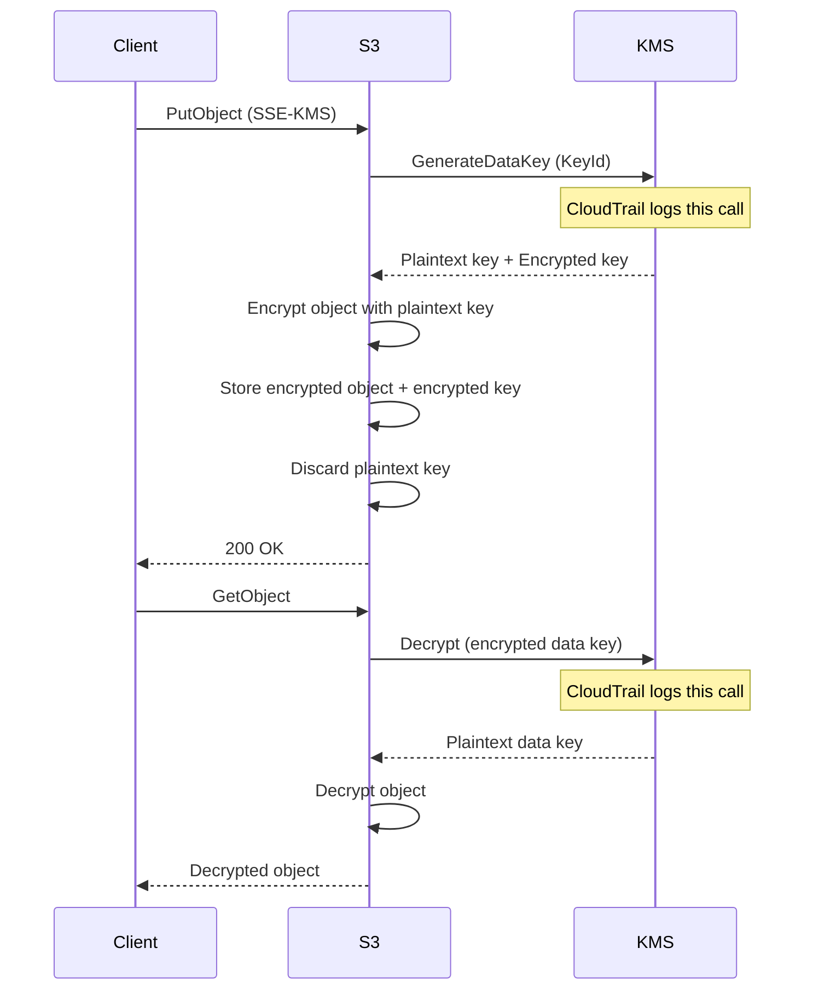

# How to Enable Server-Side Encryption with AWS KMS (SSE-KMS)

Author: [nawazdhandala](https://github.com/nawazdhandala)

Tags: AWS, S3, KMS, Encryption, Security

Description: Learn how to configure SSE-KMS encryption for S3 buckets using AWS Key Management Service for enhanced key control, audit logging, and compliance.

---

SSE-KMS takes S3 encryption a step further than SSE-S3 by giving you control over the encryption keys through AWS Key Management Service. Every key usage gets logged in CloudTrail, you can set fine-grained access policies on the keys themselves, and you can choose between AWS-managed keys or customer-managed keys. If your compliance framework requires you to demonstrate key management controls, SSE-KMS is what you need.

## Why SSE-KMS Over SSE-S3?

The main advantages of SSE-KMS are:

- **CloudTrail logging**: Every Encrypt, Decrypt, and GenerateDataKey call is logged. You can see exactly who accessed what, and when.
- **Key policies**: You can restrict which IAM principals can use which keys, adding another layer of access control on top of S3 bucket policies.
- **Key rotation**: AWS-managed keys rotate automatically every year. Customer-managed keys can be configured for automatic rotation.
- **Separation of duties**: You can give someone access to the S3 bucket but not the KMS key, effectively denying them access to the data.

For a comparison with simpler encryption, see our post on [SSE-S3 encryption](https://oneuptime.com/blog/post/2026-02-12-server-side-encryption-s3-managed-keys-sse-s3/view).

## Step 1: Create a KMS Key

You can use the AWS-managed S3 key (alias `aws/s3`) or create your own customer-managed key. Customer-managed keys give you more control.

```bash
# Create a customer-managed KMS key
aws kms create-key \
  --description "S3 encryption key for production data" \
  --key-usage ENCRYPT_DECRYPT \
  --key-spec SYMMETRIC_DEFAULT

# Note the KeyId from the output, then create an alias
aws kms create-alias \
  --alias-name alias/s3-production-key \
  --target-key-id <key-id>
```

## Step 2: Configure the Key Policy

The key policy controls who can use the key. Here's a policy that allows specific roles to encrypt and decrypt.

```json
{
  "Version": "2012-10-17",
  "Statement": [
    {
      "Sid": "EnableRootAccountAccess",
      "Effect": "Allow",
      "Principal": {
        "AWS": "arn:aws:iam::123456789012:root"
      },
      "Action": "kms:*",
      "Resource": "*"
    },
    {
      "Sid": "AllowKeyAdministration",
      "Effect": "Allow",
      "Principal": {
        "AWS": "arn:aws:iam::123456789012:role/KeyAdminRole"
      },
      "Action": [
        "kms:Create*",
        "kms:Describe*",
        "kms:Enable*",
        "kms:List*",
        "kms:Put*",
        "kms:Update*",
        "kms:Revoke*",
        "kms:Disable*",
        "kms:Get*",
        "kms:Delete*",
        "kms:ScheduleKeyDeletion",
        "kms:CancelKeyDeletion"
      ],
      "Resource": "*"
    },
    {
      "Sid": "AllowEncryptDecrypt",
      "Effect": "Allow",
      "Principal": {
        "AWS": [
          "arn:aws:iam::123456789012:role/AppServerRole",
          "arn:aws:iam::123456789012:role/DataProcessingRole"
        ]
      },
      "Action": [
        "kms:Encrypt",
        "kms:Decrypt",
        "kms:ReEncrypt*",
        "kms:GenerateDataKey",
        "kms:DescribeKey"
      ],
      "Resource": "*"
    }
  ]
}
```

Apply the key policy.

```bash
aws kms put-key-policy \
  --key-id <key-id> \
  --policy-name default \
  --policy file://key-policy.json
```

## Step 3: Set Default Bucket Encryption to SSE-KMS

Configure your bucket to use SSE-KMS by default. Enable the S3 Bucket Key too - it reduces KMS API calls and saves money.

```bash
# Set SSE-KMS as default encryption with S3 Bucket Key
aws s3api put-bucket-encryption \
  --bucket my-secure-bucket \
  --server-side-encryption-configuration '{
    "Rules": [
      {
        "ApplyServerSideEncryptionByDefault": {
          "SSEAlgorithm": "aws:kms",
          "KMSMasterKeyID": "arn:aws:kms:us-east-1:123456789012:key/<key-id>"
        },
        "BucketKeyEnabled": true
      }
    ]
  }'
```

The `BucketKeyEnabled` flag is important. Without it, S3 makes a KMS API call for every single object, which gets expensive fast and can hit KMS request limits. With a bucket key, S3 generates a bucket-level key that's used to create data keys locally, reducing KMS calls significantly.

## Step 4: Upload Objects with SSE-KMS

When default encryption is set, uploads are automatically encrypted. You can also specify it explicitly.

```python
import boto3

s3 = boto3.client('s3')

kms_key_arn = 'arn:aws:kms:us-east-1:123456789012:key/your-key-id'

# Upload with explicit SSE-KMS
s3.put_object(
    Bucket='my-secure-bucket',
    Key='sensitive-data/financial-report.pdf',
    Body=open('financial-report.pdf', 'rb'),
    ServerSideEncryption='aws:kms',
    SSEKMSKeyId=kms_key_arn,
    BucketKeyEnabled=True
)

# Verify encryption
response = s3.head_object(
    Bucket='my-secure-bucket',
    Key='sensitive-data/financial-report.pdf'
)

print(f"Encryption: {response['ServerSideEncryption']}")
print(f"KMS Key: {response.get('SSEKMSKeyId', 'N/A')}")
print(f"Bucket Key: {response.get('BucketKeyEnabled', False)}")
```

## Step 5: Enforce SSE-KMS with a Bucket Policy

Deny any uploads that don't use your specific KMS key.

```json
{
  "Version": "2012-10-17",
  "Statement": [
    {
      "Sid": "DenyNonKMSEncryption",
      "Effect": "Deny",
      "Principal": "*",
      "Action": "s3:PutObject",
      "Resource": "arn:aws:s3:::my-secure-bucket/*",
      "Condition": {
        "StringNotEquals": {
          "s3:x-amz-server-side-encryption": "aws:kms"
        }
      }
    },
    {
      "Sid": "DenyWrongKMSKey",
      "Effect": "Deny",
      "Principal": "*",
      "Action": "s3:PutObject",
      "Resource": "arn:aws:s3:::my-secure-bucket/*",
      "Condition": {
        "StringNotEqualsIfExists": {
          "s3:x-amz-server-side-encryption-aws-kms-key-id": "arn:aws:kms:us-east-1:123456789012:key/<key-id>"
        }
      }
    }
  ]
}
```

## How SSE-KMS Encryption Works



## Step 6: Monitor Key Usage with CloudTrail

Every KMS operation shows up in CloudTrail. You can query these events to see who's accessing encrypted data.

```python
import boto3
from datetime import datetime, timedelta

cloudtrail = boto3.client('cloudtrail')

# Look up recent KMS decrypt events for our key
response = cloudtrail.lookup_events(
    LookupAttributes=[
        {
            'AttributeKey': 'EventName',
            'AttributeValue': 'Decrypt'
        }
    ],
    StartTime=datetime.utcnow() - timedelta(hours=24),
    EndTime=datetime.utcnow(),
    MaxResults=50
)

for event in response['Events']:
    print(f"Time: {event['EventTime']}")
    print(f"User: {event.get('Username', 'N/A')}")
    print(f"Event: {event['EventName']}")
    print("---")
```

## Step 7: Enable Automatic Key Rotation

For customer-managed keys, enable automatic rotation so the key material changes annually.

```bash
# Enable automatic rotation (rotates every year)
aws kms enable-key-rotation \
  --key-id <key-id>

# Verify rotation is enabled
aws kms get-key-rotation-status \
  --key-id <key-id>
```

Old key material is kept so existing objects can still be decrypted. New objects use the new key material automatically.

## Cost Considerations

SSE-KMS isn't free like SSE-S3. Here's what to budget for:

- **KMS key**: $1/month per customer-managed key (AWS-managed keys are free)
- **API requests**: $0.03 per 10,000 requests
- **S3 Bucket Key impact**: Reduces KMS API calls by up to 99% for workloads with many objects

Without bucket keys, a bucket with 10 million objects accessed once per day would generate 10 million KMS Decrypt calls daily - that's $30/day or $900/month just for KMS. With bucket keys, the same workload might only generate 10,000 KMS calls - $0.03/day.

Always enable bucket keys. There's almost no reason not to.

## Cross-Account Access

If you need to share encrypted data across AWS accounts, the KMS key policy must explicitly allow the other account.

```json
{
  "Sid": "AllowCrossAccountDecrypt",
  "Effect": "Allow",
  "Principal": {
    "AWS": "arn:aws:iam::999888777666:role/CrossAccountRole"
  },
  "Action": [
    "kms:Decrypt",
    "kms:DescribeKey"
  ],
  "Resource": "*"
}
```

The other account also needs an IAM policy allowing `kms:Decrypt` on your key ARN.

## Wrapping Up

SSE-KMS gives you the encryption controls that regulated industries demand. The combination of key policies, CloudTrail logging, and separation of duties between bucket access and key access makes it possible to implement genuine least-privilege encryption. Just don't forget to enable S3 Bucket Keys - they'll save you a lot of money and keep you from hitting KMS rate limits on high-throughput workloads.
