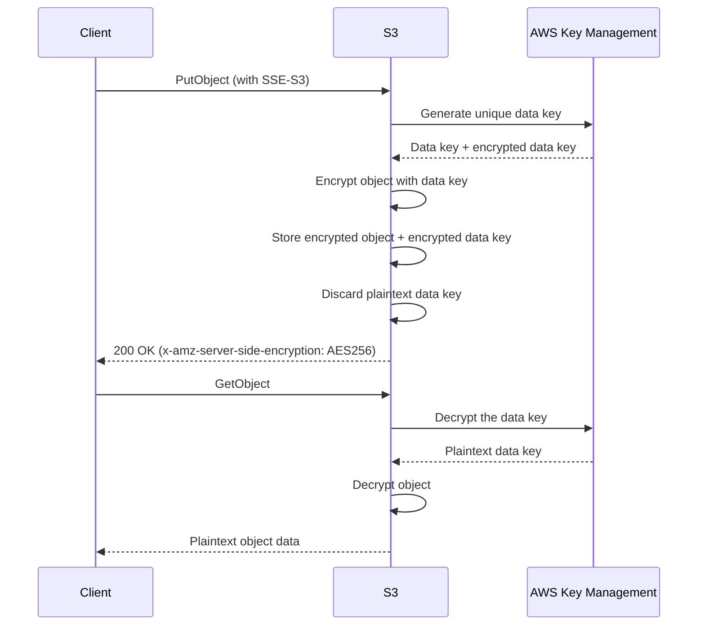

# How to Enable Server-Side Encryption with S3-Managed Keys (SSE-S3)

Author: [nawazdhandala](https://github.com/nawazdhandala)

Tags: AWS, S3, Encryption, Security

Description: A step-by-step guide to enabling SSE-S3 encryption on S3 buckets to protect data at rest using Amazon-managed encryption keys.

---

Every object in S3 should be encrypted at rest. It's not a nice-to-have anymore - it's table stakes. SSE-S3 is the simplest encryption option AWS offers. Amazon manages the keys, handles all the rotation, and you don't need to set up KMS or manage any key material yourself. Since January 2023, AWS automatically encrypts all new objects with SSE-S3 by default, but there are still reasons to explicitly configure it - especially for compliance documentation and legacy buckets.

## How SSE-S3 Works

When you upload an object with SSE-S3 encryption:

1. S3 encrypts the object using AES-256
2. S3 generates a unique data key for each object
3. The data key itself is encrypted with a root key that AWS manages
4. The encrypted data key is stored as metadata alongside the object
5. On retrieval, S3 automatically decrypts - you don't need to do anything special

You never see or manage the encryption keys. The process is completely transparent to your application.

## SSE-S3 vs. SSE-KMS vs. SSE-C

Before configuring SSE-S3, make sure it's the right choice for your use case.

| Feature | SSE-S3 | SSE-KMS | SSE-C |
|---------|--------|---------|-------|
| Key management | AWS manages everything | You manage via KMS | You provide keys |
| Cost | Free | KMS key + API costs | Free (you manage keys) |
| Audit trail | Limited | Full CloudTrail logging | None from AWS |
| Key rotation | Automatic | Configurable | You handle it |
| Access control | Standard S3 policies | KMS key policies + S3 policies | You control |
| Best for | General purpose | Regulated data | Maximum control |

If you need audit trails for key usage or fine-grained access control on a per-key basis, look at [SSE-KMS instead](https://oneuptime.com/blog/post/2026-02-12-server-side-encryption-aws-kms-sse-kms/view).

## Step 1: Set Default Encryption on a Bucket

Even though AWS now encrypts by default, explicitly setting the configuration makes your intent clear and satisfies auditors.

```bash
# Set SSE-S3 as the default encryption for a bucket
aws s3api put-bucket-encryption \
  --bucket my-app-bucket \
  --server-side-encryption-configuration '{
    "Rules": [
      {
        "ApplyServerSideEncryptionByDefault": {
          "SSEAlgorithm": "AES256"
        },
        "BucketKeyEnabled": false
      }
    ]
  }'
```

Verify the configuration.

```bash
# Check the current encryption configuration
aws s3api get-bucket-encryption \
  --bucket my-app-bucket
```

## Step 2: Upload Objects with Explicit SSE-S3

While the default encryption handles new uploads automatically, you can also specify encryption explicitly per object.

```bash
# Upload with explicit SSE-S3 encryption
aws s3api put-object \
  --bucket my-app-bucket \
  --key data/customer-records.json \
  --body ./customer-records.json \
  --server-side-encryption AES256
```

Using the AWS SDK in Python:

```python
import boto3

s3 = boto3.client('s3')

# Upload with SSE-S3
s3.put_object(
    Bucket='my-app-bucket',
    Key='data/customer-records.json',
    Body=open('customer-records.json', 'rb'),
    ServerSideEncryption='AES256'
)

# Verify encryption on the uploaded object
response = s3.head_object(
    Bucket='my-app-bucket',
    Key='data/customer-records.json'
)

print(f"Encryption: {response.get('ServerSideEncryption')}")
# Output: Encryption: AES256
```

## Step 3: Enforce Encryption with a Bucket Policy

To make sure nobody can upload unencrypted objects (even if they explicitly try to disable encryption), add a bucket policy that denies unencrypted uploads.

```json
{
  "Version": "2012-10-17",
  "Statement": [
    {
      "Sid": "DenyUnencryptedObjectUploads",
      "Effect": "Deny",
      "Principal": "*",
      "Action": "s3:PutObject",
      "Resource": "arn:aws:s3:::my-app-bucket/*",
      "Condition": {
        "StringNotEquals": {
          "s3:x-amz-server-side-encryption": "AES256"
        }
      }
    },
    {
      "Sid": "DenyNoEncryptionHeader",
      "Effect": "Deny",
      "Principal": "*",
      "Action": "s3:PutObject",
      "Resource": "arn:aws:s3:::my-app-bucket/*",
      "Condition": {
        "Null": {
          "s3:x-amz-server-side-encryption": "true"
        }
      }
    }
  ]
}
```

Apply the policy.

```bash
aws s3api put-bucket-policy \
  --bucket my-app-bucket \
  --policy file://encryption-policy.json
```

Note: With AWS's default encryption, the second statement (denying null encryption header) might not be necessary, but it's good defense-in-depth.

## Step 4: Verify Existing Objects Are Encrypted

If you have an existing bucket, some older objects might not be encrypted. Use S3 Inventory to find them.

```bash
# Set up inventory to check encryption status
aws s3api put-bucket-inventory-configuration \
  --bucket my-app-bucket \
  --id encryption-audit \
  --inventory-configuration '{
    "Id": "encryption-audit",
    "IsEnabled": true,
    "Destination": {
      "S3BucketDestination": {
        "AccountId": "123456789012",
        "Bucket": "arn:aws:s3:::my-inventory-bucket",
        "Format": "CSV",
        "Prefix": "encryption-audit"
      }
    },
    "Schedule": {
      "Frequency": "Weekly"
    },
    "IncludedObjectVersions": "Current",
    "OptionalFields": ["EncryptionStatus"]
  }'
```

For more on using S3 Inventory, see our post on [auditing S3 objects at scale](https://oneuptime.com/blog/post/2026-02-12-s3-inventory-audit-objects-at-scale/view).

## Step 5: Encrypt Existing Unencrypted Objects

If you find unencrypted objects, you can encrypt them by copying them in place. S3's copy operation lets you copy an object to itself with new encryption settings.

```python
import boto3

s3 = boto3.client('s3')
bucket = 'my-app-bucket'

# List objects and check encryption
paginator = s3.get_paginator('list_objects_v2')
pages = paginator.paginate(Bucket=bucket)

encrypted_count = 0
for page in pages:
    for obj in page.get('Contents', []):
        key = obj['Key']

        # Check current encryption
        head = s3.head_object(Bucket=bucket, Key=key)
        encryption = head.get('ServerSideEncryption')

        if encryption is None:
            # Copy in place with encryption
            s3.copy_object(
                Bucket=bucket,
                Key=key,
                CopySource={'Bucket': bucket, 'Key': key},
                ServerSideEncryption='AES256'
            )
            encrypted_count += 1
            print(f"Encrypted: {key}")

print(f"\nTotal objects encrypted: {encrypted_count}")
```

For millions of objects, use S3 Batch Operations instead of scripting it yourself. See our guide on [S3 Batch Operations](https://oneuptime.com/blog/post/2026-02-12-s3-batch-operations-process-millions-objects/view).

## How SSE-S3 Encryption Works Under the Hood



## Using SSE-S3 with Multipart Uploads

For large files uploaded via multipart upload, each part is encrypted individually. The SDK handles this transparently.

```python
import boto3
from boto3.s3.transfer import TransferConfig

s3 = boto3.client('s3')

# Configure multipart upload with encryption
config = TransferConfig(
    multipart_threshold=100 * 1024 * 1024,  # 100MB threshold
    multipart_chunksize=100 * 1024 * 1024    # 100MB chunks
)

# Upload a large file with SSE-S3
s3.upload_file(
    'large-dataset.tar.gz',
    'my-app-bucket',
    'backups/large-dataset.tar.gz',
    ExtraArgs={'ServerSideEncryption': 'AES256'},
    Config=config
)
```

## Monitoring Encryption Status

Use S3 Storage Lens to continuously monitor the encryption status across all your buckets. It'll flag any buckets that don't have default encryption configured. Check out our guide on [S3 Storage Lens](https://oneuptime.com/blog/post/2026-02-12-s3-storage-lens-visibility-storage-usage/view) for setup details.

You should also set up AWS Config rules to detect and auto-remediate buckets without encryption.

```bash
# AWS Config rule that checks for S3 bucket encryption
aws configservice put-config-rule \
  --config-rule '{
    "ConfigRuleName": "s3-bucket-server-side-encryption-enabled",
    "Source": {
      "Owner": "AWS",
      "SourceIdentifier": "S3_BUCKET_SERVER_SIDE_ENCRYPTION_ENABLED"
    },
    "Scope": {
      "ComplianceResourceTypes": ["AWS::S3::Bucket"]
    }
  }'
```

## Wrapping Up

SSE-S3 is the lowest-friction path to encrypting your S3 data. There's no key management overhead, no additional cost, and no changes needed in your application code for reading data. Set the default encryption on your buckets, add a bucket policy to enforce it, and audit regularly to catch any gaps. If you need more control over keys or audit trails, step up to SSE-KMS - but for most workloads, SSE-S3 is all you need.
