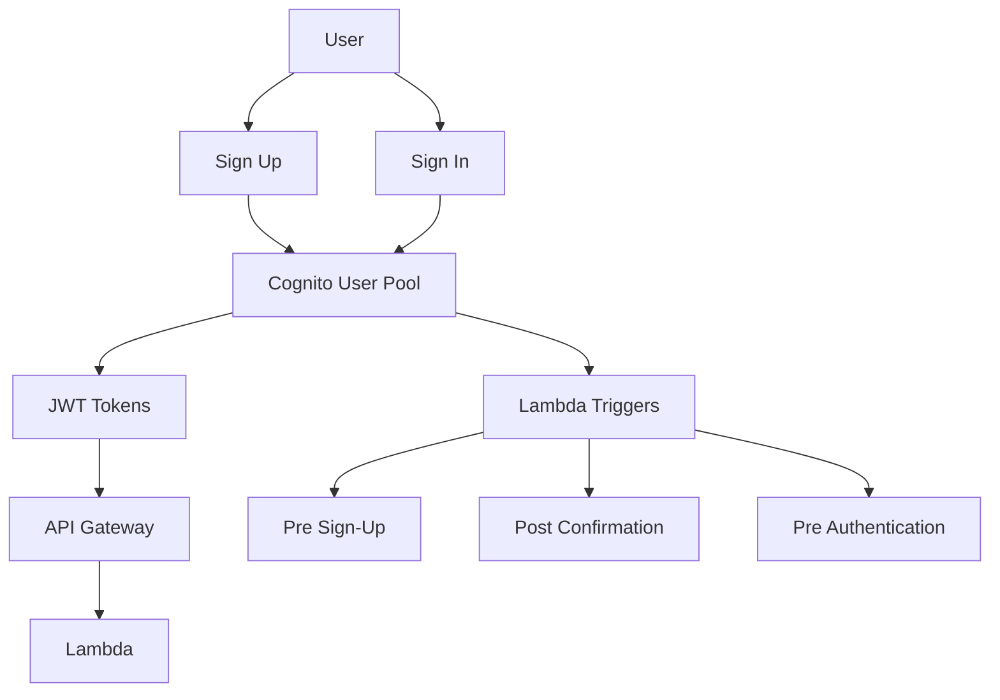

# Build a Serverless Authentication Flow with Lambda and Cognito

Author: [nawazdhandala](https://github.com/nawazdhandala)

Tags: AWS, Lambda, Cognito, Serverless, Authentication

Description: Complete guide to implementing serverless user authentication using AWS Cognito and Lambda triggers for custom auth workflows.

---

Authentication is the kind of thing you really don't want to build from scratch. Password hashing, token management, MFA, account recovery - there are too many ways to get it wrong. AWS Cognito handles the heavy lifting, and when you pair it with Lambda triggers, you get a fully customizable auth system without managing any servers.

Let's build a complete authentication flow that handles sign-up, sign-in, token refresh, and custom logic during the auth process.

## How Cognito Works

Cognito gives you two main components: User Pools and Identity Pools. User Pools handle authentication - storing user credentials, managing sign-up/sign-in flows, and issuing JWT tokens. Identity Pools handle authorization - mapping authenticated users to IAM roles so they can access AWS resources.

For most applications, you only need a User Pool.



## Creating a User Pool

Start by creating a User Pool with sensible defaults.

This creates a pool with email-based sign-up and strong password requirements:

```bash
aws cognito-idp create-user-pool \
  --pool-name MyAppUserPool \
  --auto-verified-attributes email \
  --username-attributes email \
  --policies '{
    "PasswordPolicy": {
      "MinimumLength": 8,
      "RequireUppercase": true,
      "RequireLowercase": true,
      "RequireNumbers": true,
      "RequireSymbols": false
    }
  }' \
  --schema '[
    {
      "Name": "email",
      "Required": true,
      "Mutable": true
    },
    {
      "Name": "name",
      "Required": true,
      "Mutable": true
    }
  ]'
```

Next, create an app client. This is what your application uses to interact with the pool.

This creates a client without a secret, suitable for single-page applications:

```bash
aws cognito-idp create-user-pool-client \
  --user-pool-id YOUR_POOL_ID \
  --client-name MyAppClient \
  --no-generate-secret \
  --explicit-auth-flows ALLOW_USER_PASSWORD_AUTH ALLOW_REFRESH_TOKEN_AUTH \
  --access-token-validity 1 \
  --id-token-validity 1 \
  --refresh-token-validity 30
```

## Sign-Up Flow

Here's a Lambda function that handles user registration.

This function creates a new Cognito user and returns appropriate status codes:

```javascript
// signUp.js - Handles new user registration
const { CognitoIdentityProviderClient, SignUpCommand }
  = require('@aws-sdk/client-cognito-identity-provider');

const cognitoClient = new CognitoIdentityProviderClient({});
const CLIENT_ID = process.env.COGNITO_CLIENT_ID;

exports.handler = async (event) => {
  try {
    const { email, password, name } = JSON.parse(event.body);

    // Basic validation
    if (!email || !password || !name) {
      return {
        statusCode: 400,
        body: JSON.stringify({ message: 'Email, password, and name are required' })
      };
    }

    // Register the user with Cognito
    const result = await cognitoClient.send(new SignUpCommand({
      ClientId: CLIENT_ID,
      Username: email,
      Password: password,
      UserAttributes: [
        { Name: 'email', Value: email },
        { Name: 'name', Value: name }
      ]
    }));

    return {
      statusCode: 201,
      body: JSON.stringify({
        message: 'User registered successfully. Check your email for verification code.',
        userSub: result.UserSub
      })
    };
  } catch (error) {
    // Handle specific Cognito errors
    if (error.name === 'UsernameExistsException') {
      return {
        statusCode: 409,
        body: JSON.stringify({ message: 'An account with this email already exists' })
      };
    }

    if (error.name === 'InvalidPasswordException') {
      return {
        statusCode: 400,
        body: JSON.stringify({ message: 'Password does not meet requirements' })
      };
    }

    console.error('Sign-up error:', error);
    return {
      statusCode: 500,
      body: JSON.stringify({ message: 'Registration failed' })
    };
  }
};
```

## Email Verification

After sign-up, users need to verify their email. Cognito sends a verification code automatically.

This function confirms the user's email with the code they received:

```javascript
// confirmSignUp.js - Verifies user email with confirmation code
const { CognitoIdentityProviderClient, ConfirmSignUpCommand }
  = require('@aws-sdk/client-cognito-identity-provider');

const cognitoClient = new CognitoIdentityProviderClient({});
const CLIENT_ID = process.env.COGNITO_CLIENT_ID;

exports.handler = async (event) => {
  try {
    const { email, confirmationCode } = JSON.parse(event.body);

    await cognitoClient.send(new ConfirmSignUpCommand({
      ClientId: CLIENT_ID,
      Username: email,
      ConfirmationCode: confirmationCode
    }));

    return {
      statusCode: 200,
      body: JSON.stringify({ message: 'Email verified successfully' })
    };
  } catch (error) {
    if (error.name === 'CodeMismatchException') {
      return {
        statusCode: 400,
        body: JSON.stringify({ message: 'Invalid verification code' })
      };
    }

    if (error.name === 'ExpiredCodeException') {
      return {
        statusCode: 400,
        body: JSON.stringify({ message: 'Verification code has expired' })
      };
    }

    console.error('Confirmation error:', error);
    return {
      statusCode: 500,
      body: JSON.stringify({ message: 'Verification failed' })
    };
  }
};
```

## Sign-In Flow

Once verified, users can sign in to get their JWT tokens.

This function authenticates the user and returns access, ID, and refresh tokens:

```javascript
// signIn.js - Authenticates user and returns JWT tokens
const { CognitoIdentityProviderClient, InitiateAuthCommand }
  = require('@aws-sdk/client-cognito-identity-provider');

const cognitoClient = new CognitoIdentityProviderClient({});
const CLIENT_ID = process.env.COGNITO_CLIENT_ID;

exports.handler = async (event) => {
  try {
    const { email, password } = JSON.parse(event.body);

    const result = await cognitoClient.send(new InitiateAuthCommand({
      AuthFlow: 'USER_PASSWORD_AUTH',
      ClientId: CLIENT_ID,
      AuthParameters: {
        USERNAME: email,
        PASSWORD: password
      }
    }));

    const { AccessToken, IdToken, RefreshToken, ExpiresIn }
      = result.AuthenticationResult;

    return {
      statusCode: 200,
      body: JSON.stringify({
        accessToken: AccessToken,
        idToken: IdToken,
        refreshToken: RefreshToken,
        expiresIn: ExpiresIn
      })
    };
  } catch (error) {
    if (error.name === 'NotAuthorizedException') {
      return {
        statusCode: 401,
        body: JSON.stringify({ message: 'Invalid email or password' })
      };
    }

    if (error.name === 'UserNotConfirmedException') {
      return {
        statusCode: 403,
        body: JSON.stringify({ message: 'Please verify your email first' })
      };
    }

    console.error('Sign-in error:', error);
    return {
      statusCode: 500,
      body: JSON.stringify({ message: 'Authentication failed' })
    };
  }
};
```

## Lambda Triggers for Custom Logic

This is where Cognito gets really powerful. You can hook Lambda functions into various points of the auth flow.

### Pre Sign-Up Trigger

This trigger runs before a user is registered, letting you validate or modify the sign-up:

```javascript
// preSignUp.js - Runs before user registration completes
exports.handler = async (event) => {
  const email = event.request.userAttributes.email;

  // Block sign-ups from disposable email providers
  const blockedDomains = ['tempmail.com', 'throwaway.email', 'guerrillamail.com'];
  const domain = email.split('@')[1];

  if (blockedDomains.includes(domain)) {
    throw new Error('Registration from disposable email addresses is not allowed');
  }

  // Auto-verify email for internal company users
  if (domain === 'mycompany.com') {
    event.response.autoVerifyEmail = true;
    event.response.autoConfirmUser = true;
  }

  return event;
};
```

### Post Confirmation Trigger

This runs after a user confirms their email - perfect for setting up their profile:

```javascript
// postConfirmation.js - Runs after user verifies their email
const { DynamoDBClient } = require('@aws-sdk/client-dynamodb');
const { DynamoDBDocumentClient, PutCommand } = require('@aws-sdk/lib-dynamodb');

const ddbClient = DynamoDBDocumentClient.from(new DynamoDBClient({}));

exports.handler = async (event) => {
  // Create a user profile in DynamoDB
  await ddbClient.send(new PutCommand({
    TableName: process.env.USERS_TABLE,
    Item: {
      userId: event.request.userAttributes.sub,
      email: event.request.userAttributes.email,
      name: event.request.userAttributes.name,
      plan: 'free',
      createdAt: new Date().toISOString()
    }
  }));

  console.log(`Created profile for user: ${event.request.userAttributes.email}`);
  return event;
};
```

## Protecting API Routes

With Cognito issuing tokens, you can use a Cognito authorizer on API Gateway to protect your routes.

This SAM template configures a Cognito authorizer on a protected endpoint:

```yaml
Resources:
  MyApi:
    Type: AWS::Serverless::Api
    Properties:
      StageName: prod
      Auth:
        DefaultAuthorizer: CognitoAuth
        Authorizers:
          CognitoAuth:
            UserPoolArn: !GetAtt UserPool.Arn

  ProtectedFunction:
    Type: AWS::Serverless::Function
    Properties:
      Handler: protected.handler
      Runtime: nodejs20.x
      Events:
        GetProfile:
          Type: Api
          Properties:
            RestApiId: !Ref MyApi
            Path: /profile
            Method: get
```

Inside the protected Lambda, you can access the user's identity from the request context:

```javascript
// protected.js - Endpoint that requires authentication
exports.handler = async (event) => {
  // The user's claims are available in the request context
  const claims = event.requestContext.authorizer.claims;
  const userId = claims.sub;
  const email = claims.email;

  return {
    statusCode: 200,
    body: JSON.stringify({
      message: `Hello, ${email}`,
      userId: userId
    })
  };
};
```

## Monitoring Auth Failures

Keep an eye on failed authentication attempts. A spike in failures could mean a brute-force attack or a broken client. Cognito publishes metrics to CloudWatch, and you can set up alarms on `SignInFailures`. For a comprehensive approach to monitoring your authentication infrastructure, see our guide on [setting up effective monitoring](https://oneuptime.com/blog/post/2026-01-24-apm-monitoring/view).

## Wrapping Up

Cognito paired with Lambda triggers gives you a production-grade authentication system that handles the boring parts (password storage, token management, email verification) while letting you customize the interesting parts (validation rules, post-registration workflows, custom claims). The whole thing runs serverless, so you're not paying for idle auth servers.
