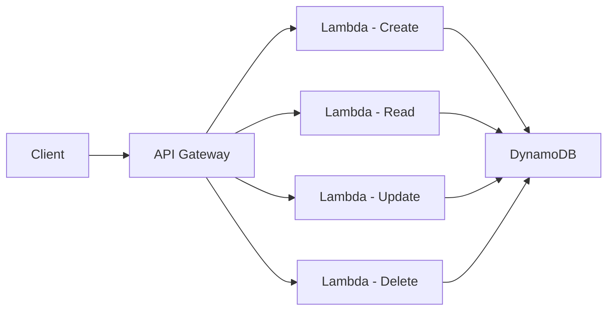

# Build a Serverless CRUD API with Lambda and API Gateway

Author: [nawazdhandala](https://github.com/nawazdhandala)

Tags: AWS, Lambda, API Gateway, Serverless, DynamoDB

Description: Learn how to build a fully functional serverless CRUD API using AWS Lambda and API Gateway with DynamoDB as the data store.

---

Building REST APIs used to mean provisioning servers, configuring web frameworks, and managing load balancers. With AWS Lambda and API Gateway, you can skip all of that and go straight to writing business logic. In this post, we'll build a complete CRUD API for managing items - the kind of thing you'd need for almost any application.

## Why Serverless for CRUD APIs?

There are a few reasons serverless works so well for CRUD operations. You don't pay when nobody's making requests. You don't worry about scaling - Lambda handles that for you. And the deployment model is simple enough that a single developer can ship a production-ready API in an afternoon.

The tradeoff? Cold starts can add latency, and you give up some control over the runtime environment. For most CRUD workloads, that's a trade worth making.

## Architecture Overview

Here's what we're building:



API Gateway receives HTTP requests, routes them to the appropriate Lambda function, and returns the response. Each Lambda function talks to DynamoDB, which stores our data.

## Setting Up DynamoDB

First, let's create a DynamoDB table using the AWS CLI.

This command creates a simple table with `id` as the partition key:

```bash
aws dynamodb create-table \
  --table-name Items \
  --attribute-definitions AttributeName=id,AttributeType=S \
  --key-schema AttributeName=id,KeyType=HASH \
  --billing-mode PAY_PER_REQUEST
```

PAY_PER_REQUEST billing means you only pay for what you use - perfect for a serverless setup where traffic might be unpredictable.

## Writing the Lambda Functions

We'll write our functions in Node.js. Each function handles one CRUD operation.

### Create Item

This function generates a unique ID, saves the item to DynamoDB, and returns the created resource:

```javascript
// create.js - Handles POST requests to create new items
const { DynamoDBClient } = require('@aws-sdk/client-dynamodb');
const { DynamoDBDocumentClient, PutCommand } = require('@aws-sdk/lib-dynamodb');
const { randomUUID } = require('crypto');

const client = new DynamoDBClient({});
const docClient = DynamoDBDocumentClient.from(client);

exports.handler = async (event) => {
  try {
    const body = JSON.parse(event.body);

    const item = {
      id: randomUUID(),
      ...body,
      createdAt: new Date().toISOString(),
      updatedAt: new Date().toISOString()
    };

    // Write the item to DynamoDB
    await docClient.send(new PutCommand({
      TableName: 'Items',
      Item: item
    }));

    return {
      statusCode: 201,
      headers: { 'Content-Type': 'application/json' },
      body: JSON.stringify(item)
    };
  } catch (error) {
    console.error('Create failed:', error);
    return {
      statusCode: 500,
      body: JSON.stringify({ message: 'Internal server error' })
    };
  }
};
```

### Read Item

This function retrieves a single item by its ID from the path parameters:

```javascript
// read.js - Handles GET requests to fetch a single item
const { DynamoDBClient } = require('@aws-sdk/client-dynamodb');
const { DynamoDBDocumentClient, GetCommand } = require('@aws-sdk/lib-dynamodb');

const client = new DynamoDBClient({});
const docClient = DynamoDBDocumentClient.from(client);

exports.handler = async (event) => {
  try {
    const { id } = event.pathParameters;

    // Fetch the item from DynamoDB by primary key
    const result = await docClient.send(new GetCommand({
      TableName: 'Items',
      Key: { id }
    }));

    if (!result.Item) {
      return {
        statusCode: 404,
        body: JSON.stringify({ message: 'Item not found' })
      };
    }

    return {
      statusCode: 200,
      headers: { 'Content-Type': 'application/json' },
      body: JSON.stringify(result.Item)
    };
  } catch (error) {
    console.error('Read failed:', error);
    return {
      statusCode: 500,
      body: JSON.stringify({ message: 'Internal server error' })
    };
  }
};
```

### Update Item

This function uses DynamoDB's update expression to modify existing items:

```javascript
// update.js - Handles PUT requests to modify an existing item
const { DynamoDBClient } = require('@aws-sdk/client-dynamodb');
const { DynamoDBDocumentClient, UpdateCommand } = require('@aws-sdk/lib-dynamodb');

const client = new DynamoDBClient({});
const docClient = DynamoDBDocumentClient.from(client);

exports.handler = async (event) => {
  try {
    const { id } = event.pathParameters;
    const body = JSON.parse(event.body);

    // Build update expression dynamically from request body
    const updateExpressions = [];
    const expressionValues = {};
    const expressionNames = {};

    Object.keys(body).forEach((key, index) => {
      updateExpressions.push(`#field${index} = :val${index}`);
      expressionValues[`:val${index}`] = body[key];
      expressionNames[`#field${index}`] = key;
    });

    // Always update the timestamp
    updateExpressions.push('#updatedAt = :updatedAt');
    expressionValues[':updatedAt'] = new Date().toISOString();
    expressionNames['#updatedAt'] = 'updatedAt';

    const result = await docClient.send(new UpdateCommand({
      TableName: 'Items',
      Key: { id },
      UpdateExpression: `SET ${updateExpressions.join(', ')}`,
      ExpressionAttributeValues: expressionValues,
      ExpressionAttributeNames: expressionNames,
      ReturnValues: 'ALL_NEW'
    }));

    return {
      statusCode: 200,
      headers: { 'Content-Type': 'application/json' },
      body: JSON.stringify(result.Attributes)
    };
  } catch (error) {
    console.error('Update failed:', error);
    return {
      statusCode: 500,
      body: JSON.stringify({ message: 'Internal server error' })
    };
  }
};
```

### Delete Item

This function removes an item and returns the deleted data:

```javascript
// delete.js - Handles DELETE requests to remove an item
const { DynamoDBClient } = require('@aws-sdk/client-dynamodb');
const { DynamoDBDocumentClient, DeleteCommand } = require('@aws-sdk/lib-dynamodb');

const client = new DynamoDBClient({});
const docClient = DynamoDBDocumentClient.from(client);

exports.handler = async (event) => {
  try {
    const { id } = event.pathParameters;

    // Delete and return the old item for confirmation
    const result = await docClient.send(new DeleteCommand({
      TableName: 'Items',
      Key: { id },
      ReturnValues: 'ALL_OLD'
    }));

    if (!result.Attributes) {
      return {
        statusCode: 404,
        body: JSON.stringify({ message: 'Item not found' })
      };
    }

    return {
      statusCode: 200,
      headers: { 'Content-Type': 'application/json' },
      body: JSON.stringify({ message: 'Item deleted', item: result.Attributes })
    };
  } catch (error) {
    console.error('Delete failed:', error);
    return {
      statusCode: 500,
      body: JSON.stringify({ message: 'Internal server error' })
    };
  }
};
```

## Configuring API Gateway

Now we need to wire these Lambda functions up to HTTP routes. You can do this through the console or with infrastructure-as-code tools. Here's a SAM template that does it all at once.

This template defines four API routes and connects each to a Lambda function:

```yaml
# template.yaml - SAM template for the CRUD API
AWSTemplateFormatVersion: '2010-09-09'
Transform: AWS::Serverless-2016-10-31

Globals:
  Function:
    Runtime: nodejs20.x
    Timeout: 10
    Environment:
      Variables:
        TABLE_NAME: Items

Resources:
  CreateFunction:
    Type: AWS::Serverless::Function
    Properties:
      Handler: create.handler
      CodeUri: ./src
      Events:
        CreateItem:
          Type: Api
          Properties:
            Path: /items
            Method: post

  ReadFunction:
    Type: AWS::Serverless::Function
    Properties:
      Handler: read.handler
      CodeUri: ./src
      Events:
        ReadItem:
          Type: Api
          Properties:
            Path: /items/{id}
            Method: get

  UpdateFunction:
    Type: AWS::Serverless::Function
    Properties:
      Handler: update.handler
      CodeUri: ./src
      Events:
        UpdateItem:
          Type: Api
          Properties:
            Path: /items/{id}
            Method: put

  DeleteFunction:
    Type: AWS::Serverless::Function
    Properties:
      Handler: delete.handler
      CodeUri: ./src
      Events:
        DeleteItem:
          Type: Api
          Properties:
            Path: /items/{id}
            Method: delete
```

## Adding Input Validation

Raw user input hitting your database is a bad idea. Let's add basic validation to the create function.

This middleware checks for required fields before processing:

```javascript
// Simple validation helper
function validateItem(body) {
  const errors = [];

  if (!body.name || typeof body.name !== 'string') {
    errors.push('name is required and must be a string');
  }

  if (body.name && body.name.length > 255) {
    errors.push('name must be under 255 characters');
  }

  return errors;
}
```

You could also use API Gateway request validators or a library like Joi for more complex schemas.

## Testing Your API

Once deployed, test with curl.

These commands exercise each CRUD operation against your live endpoint:

```bash
# Create an item
curl -X POST https://your-api-id.execute-api.us-east-1.amazonaws.com/Prod/items \
  -H "Content-Type: application/json" \
  -d '{"name": "Widget", "price": 9.99}'

# Read an item
curl https://your-api-id.execute-api.us-east-1.amazonaws.com/Prod/items/YOUR_ITEM_ID

# Update an item
curl -X PUT https://your-api-id.execute-api.us-east-1.amazonaws.com/Prod/items/YOUR_ITEM_ID \
  -H "Content-Type: application/json" \
  -d '{"price": 12.99}'

# Delete an item
curl -X DELETE https://your-api-id.execute-api.us-east-1.amazonaws.com/Prod/items/YOUR_ITEM_ID
```

## Monitoring Your API

You'll want visibility into how your API is performing. Check out our guide on [monitoring AWS Lambda functions](https://oneuptime.com/blog/post/2025-07-02-python-aws-lambda-serverless/view) for tips on setting up alerts and dashboards.

API Gateway also provides built-in metrics through CloudWatch, including latency, 4xx/5xx error rates, and request counts. Set up alarms for error rates above your threshold so you catch problems before your users do.

## Common Pitfalls

A few things to watch out for. Lambda has a 6MB payload limit for synchronous invocations, so if you're returning large datasets, you'll need pagination. DynamoDB has a 400KB item size limit, which matters if you're storing blobs of JSON. And don't forget to handle CORS headers if your API is called from a browser - API Gateway won't add them automatically unless you configure it.

## Wrapping Up

We've built a complete CRUD API without touching a single server. Lambda handles the compute, DynamoDB stores the data, and API Gateway routes the traffic. The whole thing scales automatically and costs next to nothing at low traffic levels. For most applications, this is the fastest path from idea to production API.
