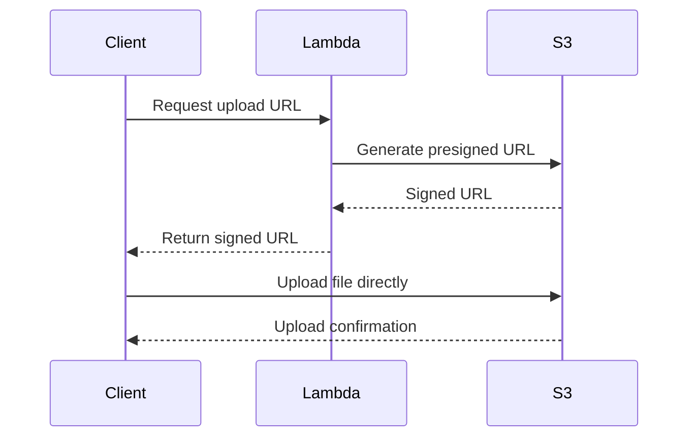

# Build a Serverless File Upload API with Lambda and S3

Author: [nawazdhandala](https://github.com/nawazdhandala)

Tags: AWS, Lambda, S3, Serverless, API Gateway

Description: Step-by-step guide to building a serverless file upload API using AWS Lambda and S3 presigned URLs for secure, scalable uploads.

---

Handling file uploads is one of those problems that seems simple until you actually build it. You've got to deal with large files, timeouts, security, and storage. Fortunately, AWS gives us a clean pattern for this: generate presigned URLs with Lambda and let clients upload directly to S3. No proxy server needed.

In this post, we'll build a serverless file upload API that handles everything from generating upload URLs to processing uploaded files.

## The Presigned URL Pattern

The traditional approach to file uploads sends the file through your API server, which then forwards it to storage. That's wasteful. Your server becomes a bottleneck, and you're paying for compute time while bytes stream through.

The presigned URL pattern flips this around:



The client asks your API for permission to upload. Lambda generates a time-limited, signed URL. The client uploads the file directly to S3. Your Lambda never touches the actual file data.

## Setting Up the S3 Bucket

First, create a bucket with the right configuration.

This creates a private bucket with CORS enabled so browsers can upload directly:

```bash
# Create the upload bucket
aws s3 mb s3://my-upload-bucket-unique-name

# Enable CORS for browser uploads
aws s3api put-bucket-cors --bucket my-upload-bucket-unique-name \
  --cors-configuration '{
    "CORSRules": [
      {
        "AllowedHeaders": ["*"],
        "AllowedMethods": ["PUT", "POST", "GET"],
        "AllowedOrigins": ["*"],
        "ExposeHeaders": ["ETag"],
        "MaxAgeSeconds": 3600
      }
    ]
  }'
```

In production, you'd want to lock down `AllowedOrigins` to your specific domain instead of using a wildcard.

## Generating Presigned URLs

Here's the Lambda function that generates upload URLs.

This function creates a presigned PUT URL with a 15-minute expiry and content type restrictions:

```javascript
// generateUploadUrl.js - Creates presigned URLs for S3 uploads
const { S3Client, PutObjectCommand } = require('@aws-sdk/client-s3');
const { getSignedUrl } = require('@aws-sdk/s3-request-presigner');
const { randomUUID } = require('crypto');

const s3Client = new S3Client({});
const BUCKET = process.env.UPLOAD_BUCKET;

exports.handler = async (event) => {
  try {
    const body = JSON.parse(event.body);
    const { fileName, contentType } = body;

    // Validate the content type to prevent abuse
    const allowedTypes = [
      'image/jpeg', 'image/png', 'image/gif',
      'application/pdf', 'text/csv'
    ];

    if (!allowedTypes.includes(contentType)) {
      return {
        statusCode: 400,
        body: JSON.stringify({
          message: `Content type ${contentType} not allowed`
        })
      };
    }

    // Generate a unique key to prevent collisions
    const fileExtension = fileName.split('.').pop();
    const key = `uploads/${randomUUID()}.${fileExtension}`;

    // Create the presigned URL with a 15-minute expiry
    const command = new PutObjectCommand({
      Bucket: BUCKET,
      Key: key,
      ContentType: contentType
    });

    const uploadUrl = await getSignedUrl(s3Client, command, {
      expiresIn: 900 // 15 minutes
    });

    return {
      statusCode: 200,
      headers: {
        'Content-Type': 'application/json',
        'Access-Control-Allow-Origin': '*'
      },
      body: JSON.stringify({
        uploadUrl,
        key,
        expiresIn: 900
      })
    };
  } catch (error) {
    console.error('Failed to generate upload URL:', error);
    return {
      statusCode: 500,
      body: JSON.stringify({ message: 'Failed to generate upload URL' })
    };
  }
};
```

## Client-Side Upload

On the frontend, uploading with the presigned URL is straightforward.

This code requests a presigned URL then uploads the file directly to S3:

```javascript
// client-upload.js - Browser-side upload using presigned URLs
async function uploadFile(file) {
  // Step 1: Get the presigned URL from our API
  const response = await fetch('https://your-api.execute-api.amazonaws.com/prod/upload-url', {
    method: 'POST',
    headers: { 'Content-Type': 'application/json' },
    body: JSON.stringify({
      fileName: file.name,
      contentType: file.type
    })
  });

  const { uploadUrl, key } = await response.json();

  // Step 2: Upload directly to S3 using the presigned URL
  const uploadResponse = await fetch(uploadUrl, {
    method: 'PUT',
    headers: { 'Content-Type': file.type },
    body: file
  });

  if (!uploadResponse.ok) {
    throw new Error('Upload failed');
  }

  return key; // Return the S3 key for later reference
}

// Usage with a file input element
document.getElementById('fileInput').addEventListener('change', async (e) => {
  const file = e.target.files[0];

  if (file.size > 10 * 1024 * 1024) {
    alert('File must be under 10MB');
    return;
  }

  try {
    const key = await uploadFile(file);
    console.log('File uploaded successfully:', key);
  } catch (err) {
    console.error('Upload error:', err);
  }
});
```

## Processing Uploaded Files

Once a file lands in S3, you'll often want to do something with it. S3 event notifications trigger a Lambda function automatically.

This function runs whenever a new object is created in the uploads prefix:

```javascript
// processUpload.js - Triggered by S3 event when file is uploaded
const { S3Client, GetObjectCommand, HeadObjectCommand } = require('@aws-sdk/client-s3');
const { DynamoDBClient } = require('@aws-sdk/client-dynamodb');
const { DynamoDBDocumentClient, PutCommand } = require('@aws-sdk/lib-dynamodb');

const s3Client = new S3Client({});
const ddbClient = DynamoDBDocumentClient.from(new DynamoDBClient({}));

exports.handler = async (event) => {
  for (const record of event.Records) {
    const bucket = record.s3.bucket.name;
    const key = decodeURIComponent(record.s3.object.key.replace(/\+/g, ' '));

    // Get file metadata
    const headResult = await s3Client.send(new HeadObjectCommand({
      Bucket: bucket,
      Key: key
    }));

    // Store metadata in DynamoDB for querying
    await ddbClient.send(new PutCommand({
      TableName: process.env.METADATA_TABLE,
      Item: {
        id: key,
        bucket: bucket,
        size: headResult.ContentLength,
        contentType: headResult.ContentType,
        uploadedAt: new Date().toISOString()
      }
    }));

    console.log(`Processed upload: ${key} (${headResult.ContentLength} bytes)`);
  }
};
```

## Handling Large Files with Multipart Upload

Presigned URLs work great for files up to a few hundred megabytes, but for larger files you'll want multipart uploads.

This function initiates a multipart upload and returns presigned URLs for each part:

```javascript
// multipartUpload.js - Handles large file uploads in chunks
const { S3Client, CreateMultipartUploadCommand,
        UploadPartCommand, CompleteMultipartUploadCommand } = require('@aws-sdk/client-s3');
const { getSignedUrl } = require('@aws-sdk/s3-request-presigner');

const s3Client = new S3Client({});
const BUCKET = process.env.UPLOAD_BUCKET;

exports.initiateUpload = async (event) => {
  const { fileName, contentType, fileSize } = JSON.parse(event.body);

  // Each part should be at least 5MB (S3 requirement)
  const PART_SIZE = 10 * 1024 * 1024; // 10MB parts
  const numParts = Math.ceil(fileSize / PART_SIZE);

  // Start the multipart upload
  const createResult = await s3Client.send(new CreateMultipartUploadCommand({
    Bucket: BUCKET,
    Key: `uploads/${fileName}`,
    ContentType: contentType
  }));

  const uploadId = createResult.UploadId;

  // Generate presigned URLs for each part
  const partUrls = [];
  for (let i = 1; i <= numParts; i++) {
    const command = new UploadPartCommand({
      Bucket: BUCKET,
      Key: `uploads/${fileName}`,
      UploadId: uploadId,
      PartNumber: i
    });

    const url = await getSignedUrl(s3Client, command, { expiresIn: 3600 });
    partUrls.push({ partNumber: i, url });
  }

  return {
    statusCode: 200,
    body: JSON.stringify({ uploadId, partUrls })
  };
};
```

## Adding File Size Limits

You probably don't want people uploading 50GB files to your bucket. There are a few layers where you can enforce limits.

This bucket policy restricts maximum upload size at the S3 level:

```json
{
  "Version": "2012-10-17",
  "Statement": [
    {
      "Sid": "LimitFileSize",
      "Effect": "Deny",
      "Principal": "*",
      "Action": "s3:PutObject",
      "Resource": "arn:aws:s3:::my-upload-bucket/*",
      "Condition": {
        "NumericGreaterThan": {
          "s3:content-length-range": 52428800
        }
      }
    }
  ]
}
```

That policy caps uploads at 50MB. Even if someone bypasses your client-side validation, S3 will reject the upload.

## Setting Up Lifecycle Rules

Uploaded files shouldn't sit in your bucket forever if they're temporary. Set up lifecycle rules to clean things up.

This moves uploads to cheaper storage after 30 days and deletes them after 90:

```bash
aws s3api put-bucket-lifecycle-configuration \
  --bucket my-upload-bucket-unique-name \
  --lifecycle-configuration '{
    "Rules": [
      {
        "ID": "CleanupUploads",
        "Filter": { "Prefix": "uploads/" },
        "Status": "Enabled",
        "Transitions": [
          {
            "Days": 30,
            "StorageClass": "STANDARD_IA"
          }
        ],
        "Expiration": {
          "Days": 90
        }
      }
    ]
  }'
```

## Monitoring and Troubleshooting

If uploads start failing, you'll want to know quickly. Make sure you have CloudWatch alarms set up for your Lambda errors and S3 request metrics. For a deeper dive into monitoring serverless workloads, check out our post on [AWS CloudWatch monitoring best practices](https://oneuptime.com/blog/post/2026-02-13-aws-cloudwatch-infrastructure-monitoring/view).

Common issues include CORS misconfiguration (the browser will block the upload silently), expired presigned URLs (increase the expiry or retry), and IAM permission errors on the Lambda execution role.

## Wrapping Up

The presigned URL pattern gives you a clean, scalable file upload system without running any servers. The client does the heavy lifting of actually transferring the bytes, your Lambda just handles authorization and URL generation, and S3 stores everything durably. It's the kind of architecture that handles 10 uploads a day or 10,000 without any changes.
