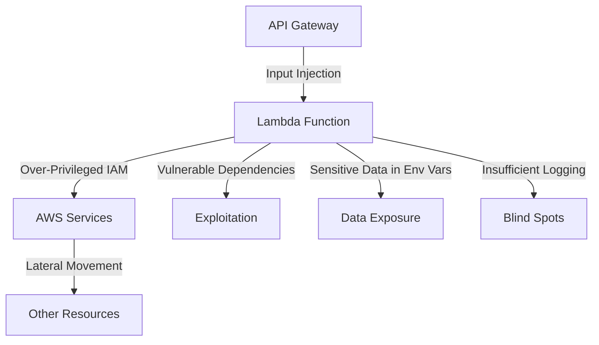

# How to Implement Serverless Security Best Practices on AWS

Author: [nawazdhandala](https://github.com/nawazdhandala)

Tags: AWS, Serverless, Lambda, Security, Best Practices

Description: A practical guide to securing serverless applications on AWS Lambda covering IAM least privilege, input validation, dependency scanning, and runtime protection.

---

Serverless doesn't mean security-free. When people move to Lambda, they often relax their security posture because "AWS handles the servers." That's partly true - you don't have to patch operating systems or manage firewalls. But you're still responsible for your code, your IAM permissions, your data, and how your functions interact with other services. And frankly, the attack surface in serverless is different, not smaller.

Let's cover what you need to do to keep your serverless applications secure on AWS.

## The Serverless Threat Model

Before jumping into controls, it helps to understand where the risks are.



The main threats in serverless are: overly permissive IAM roles, injection attacks through function inputs, vulnerable third-party dependencies, sensitive data leaking through environment variables or logs, and insufficient monitoring that lets attackers operate undetected.

## Least Privilege IAM for Lambda

This is the single most important thing you can do. Every Lambda function should have its own IAM role with only the permissions it needs.

Here's a Terraform configuration that demonstrates tightly scoped IAM for a Lambda function that reads from DynamoDB and writes to S3.

```hcl
# Each Lambda function gets its own role
resource "aws_iam_role" "order_processor" {
  name = "order-processor-lambda-role"

  assume_role_policy = jsonencode({
    Version = "2012-10-17"
    Statement = [
      {
        Effect = "Allow"
        Principal = {
          Service = "lambda.amazonaws.com"
        }
        Action = "sts:AssumeRole"
      }
    ]
  })
}

# Minimal policy - only what this function needs
resource "aws_iam_role_policy" "order_processor" {
  name = "order-processor-policy"
  role = aws_iam_role.order_processor.id

  policy = jsonencode({
    Version = "2012-10-17"
    Statement = [
      {
        Sid    = "ReadOrders"
        Effect = "Allow"
        Action = [
          "dynamodb:GetItem",
          "dynamodb:Query"
        ]
        Resource = [
          "arn:aws:dynamodb:us-east-1:123456789012:table/orders",
          "arn:aws:dynamodb:us-east-1:123456789012:table/orders/index/*"
        ]
      },
      {
        Sid    = "WriteReceipts"
        Effect = "Allow"
        Action = [
          "s3:PutObject"
        ]
        Resource = "arn:aws:s3:::order-receipts/*"
      },
      {
        Sid    = "WriteLogsOnly"
        Effect = "Allow"
        Action = [
          "logs:CreateLogStream",
          "logs:PutLogEvents"
        ]
        Resource = "arn:aws:logs:us-east-1:123456789012:log-group:/aws/lambda/order-processor:*"
      }
    ]
  })
}
```

Notice that the log permissions are scoped to the specific log group for this function. Many teams use the `AWSLambdaBasicExecutionRole` managed policy, which grants access to create log groups - more permissive than needed.

## Input Validation

Every input to your Lambda function is potentially hostile. Validate and sanitize everything.

This Python function demonstrates proper input validation for an API Gateway-triggered Lambda.

```python
import json
import re
from typing import Any

def validate_order_input(body: dict) -> dict:
    """Validate and sanitize order input."""
    errors = []

    # Validate required fields
    required_fields = ['customer_id', 'items', 'shipping_address']
    for field in required_fields:
        if field not in body:
            errors.append(f"Missing required field: {field}")

    if errors:
        return {'valid': False, 'errors': errors}

    # Validate customer_id format (alphanumeric, max 36 chars)
    customer_id = str(body['customer_id'])
    if not re.match(r'^[a-zA-Z0-9-]{1,36}$', customer_id):
        errors.append("Invalid customer_id format")

    # Validate items array
    items = body.get('items', [])
    if not isinstance(items, list) or len(items) == 0 or len(items) > 100:
        errors.append("Items must be a non-empty array with at most 100 items")

    for i, item in enumerate(items):
        if not isinstance(item.get('quantity'), int) or item['quantity'] < 1:
            errors.append(f"Item {i}: quantity must be a positive integer")
        if not isinstance(item.get('price'), (int, float)) or item['price'] < 0:
            errors.append(f"Item {i}: price must be a non-negative number")

    if errors:
        return {'valid': False, 'errors': errors}

    return {'valid': True, 'data': body}


def handler(event, context):
    """Lambda handler with input validation."""
    try:
        # Parse and validate the request body
        body = json.loads(event.get('body', '{}'))
    except json.JSONDecodeError:
        return {
            'statusCode': 400,
            'body': json.dumps({'error': 'Invalid JSON in request body'})
        }

    validation = validate_order_input(body)
    if not validation['valid']:
        return {
            'statusCode': 400,
            'body': json.dumps({'errors': validation['errors']})
        }

    # Process the validated order
    order_data = validation['data']
    # ... business logic here

    return {
        'statusCode': 200,
        'body': json.dumps({'message': 'Order processed successfully'})
    }
```

## Secrets Management

Never put sensitive values in Lambda environment variables. They're visible in the console, they show up in CloudFormation templates, and they're logged in deployment events. Use Secrets Manager or SSM Parameter Store instead.

This shows the right way to handle secrets in Lambda.

```python
import boto3
import json
from functools import lru_cache

# Cache the secrets client and values to avoid repeated API calls
@lru_cache(maxsize=1)
def get_secret(secret_name):
    """Retrieve a secret from AWS Secrets Manager with caching."""
    client = boto3.client('secretsmanager')
    response = client.get_secret_value(SecretId=secret_name)
    return json.loads(response['SecretString'])

def handler(event, context):
    # Secret is fetched once and cached for the lifetime of the execution environment
    db_credentials = get_secret('production/database/credentials')

    db_host = db_credentials['host']
    db_password = db_credentials['password']

    # Use credentials to connect to database
    # Never log credentials
    print(f"Connecting to database at {db_host}")  # OK - no password in logs
    # print(f"Using password: {db_password}")  # NEVER DO THIS
```

For more details on managing secrets in Lambda, see our post on [Lambda Powertools parameters for SSM and Secrets](https://oneuptime.com/blog/post/2026-02-12-lambda-powertools-parameters-ssm-secrets/view).

## Dependency Security

Third-party packages are one of the biggest attack vectors in serverless. A single compromised npm or pip package can expose your entire application.

Set up automated dependency scanning in your CI/CD pipeline.

```yaml
# GitHub Actions workflow for Lambda security scanning
name: Lambda Security Scan
on:
  push:
    branches: [main]
  pull_request:
    branches: [main]

jobs:
  security-scan:
    runs-on: ubuntu-latest
    steps:
      - uses: actions/checkout@v4

      - name: Set up Python
        uses: actions/setup-python@v5
        with:
          python-version: '3.12'

      - name: Install dependencies
        run: pip install -r requirements.txt

      # Scan for known vulnerabilities in dependencies
      - name: Run safety check
        run: |
          pip install safety
          safety check --json --output safety-report.json
          safety check

      # Static analysis for security issues in your code
      - name: Run bandit
        run: |
          pip install bandit
          bandit -r src/ -f json -o bandit-report.json
          bandit -r src/ -ll

      # Check for hardcoded secrets
      - name: Run detect-secrets
        run: |
          pip install detect-secrets
          detect-secrets scan --all-files --baseline .secrets.baseline
```

## Function-Level Resource Controls

Set appropriate memory, timeout, and concurrency limits. An unbounded function can be used for denial-of-wallet attacks.

```hcl
resource "aws_lambda_function" "api_handler" {
  function_name = "api-handler"
  runtime       = "python3.12"
  handler       = "main.handler"
  role          = aws_iam_role.api_handler.arn

  filename         = "deployment.zip"
  source_code_hash = filebase64sha256("deployment.zip")

  # Resource controls
  memory_size = 256       # Don't over-provision
  timeout     = 30        # Fail fast
  reserved_concurrent_executions = 100  # Limit blast radius

  # Use ARM architecture for better price/performance
  architectures = ["arm64"]

  # VPC configuration if the function needs private resource access
  vpc_config {
    subnet_ids         = var.private_subnet_ids
    security_group_ids = [aws_security_group.lambda.id]
  }

  environment {
    variables = {
      # Only non-sensitive configuration here
      TABLE_NAME  = "orders"
      ENVIRONMENT = "production"
      LOG_LEVEL   = "INFO"
    }
  }

  # Enable X-Ray tracing
  tracing_config {
    mode = "Active"
  }
}
```

## API Gateway Security

If your Lambda is behind API Gateway, secure the API layer too.

```hcl
# API Gateway with WAF, throttling, and authorization
resource "aws_api_gateway_rest_api" "api" {
  name = "secure-api"

  endpoint_configuration {
    types = ["REGIONAL"]
  }
}

# Enable request throttling
resource "aws_api_gateway_method_settings" "all" {
  rest_api_id = aws_api_gateway_rest_api.api.id
  stage_name  = aws_api_gateway_stage.prod.stage_name
  method_path = "*/*"

  settings {
    throttling_burst_limit = 100
    throttling_rate_limit  = 50
    logging_level          = "INFO"
    metrics_enabled        = true
    data_trace_enabled     = false  # Don't log request/response bodies
  }
}

# Request validation
resource "aws_api_gateway_request_validator" "validate_body" {
  name                        = "validate-request-body"
  rest_api_id                 = aws_api_gateway_rest_api.api.id
  validate_request_body       = true
  validate_request_parameters = true
}
```

## Monitoring Serverless Security

Enable GuardDuty's Lambda network monitoring to detect compromised functions.

```python
import boto3

def enable_lambda_monitoring():
    """Enable GuardDuty Lambda network activity monitoring."""
    gd = boto3.client('guardduty')
    detectors = gd.list_detectors()['DetectorIds']

    if detectors:
        gd.update_detector(
            DetectorId=detectors[0],
            Features=[
                {
                    'Name': 'LAMBDA_NETWORK_LOGS',
                    'Status': 'ENABLED'
                }
            ]
        )
        print("Lambda network monitoring enabled in GuardDuty")

enable_lambda_monitoring()
```

## Key Takeaways

Serverless security comes down to a few core principles: give each function the minimum permissions it needs, validate all inputs, keep dependencies updated and scanned, protect secrets properly, and monitor everything. The serverless model removes some security responsibilities but introduces others. Don't let the simplicity of Lambda deployments lull you into a false sense of security.

For related topics, see our guides on [container security on AWS](https://oneuptime.com/blog/post/2026-02-12-container-security-best-practices-aws/view) and [API security best practices on AWS](https://oneuptime.com/blog/post/2026-02-12-api-security-best-practices-aws/view).
