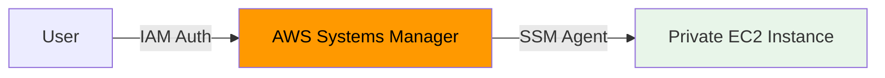

# How to Set Up Session Manager for EC2 Access Without SSH

Author: [nawazdhandala](https://github.com/nawazdhandala)

Tags: AWS, EC2, Session Manager, Systems Manager, Security

Description: Learn how to use AWS Systems Manager Session Manager to access EC2 instances without opening SSH ports or managing SSH keys.

---

Session Manager is one of those AWS features that should be the default for EC2 access, but many teams still haven't adopted it. It gives you shell access to your instances without SSH keys, without opening port 22, without bastion hosts, and with full session logging to S3 or CloudWatch.

If you're still using traditional SSH for instance access in production, this post will show you why and how to make the switch.

## Why Session Manager Over SSH

The security benefits alone make Session Manager worth it:

- **No open inbound ports** - Your security groups don't need port 22 open. Zero inbound rules.
- **No SSH keys to manage** - Access is controlled entirely through IAM.
- **No bastion hosts** - Connect to private instances directly.
- **Full audit trail** - Every command typed in a session can be logged.
- **Centralized access control** - IAM policies determine who can connect to what.
- **Browser and CLI access** - Works from the AWS Console or your terminal.



No VPN, no bastion, no public IP needed. The SSM agent on the instance communicates outbound to the Systems Manager service.

## Prerequisites

To use Session Manager, your instances need:

1. **SSM Agent installed** - Pre-installed on Amazon Linux 2, Amazon Linux 2023, Ubuntu 20.04+, and Windows Server 2016+
2. **IAM instance profile** with SSM permissions
3. **Outbound internet access** or a VPC endpoint for Systems Manager

## Setting Up the IAM Instance Profile

Your EC2 instances need an IAM role that allows the SSM agent to communicate with the Systems Manager service.

This policy gives the instance the minimum permissions needed for Session Manager:

```json
{
  "Version": "2012-10-17",
  "Statement": [
    {
      "Effect": "Allow",
      "Action": [
        "ssm:UpdateInstanceInformation",
        "ssmmessages:CreateControlChannel",
        "ssmmessages:CreateDataChannel",
        "ssmmessages:OpenControlChannel",
        "ssmmessages:OpenDataChannel"
      ],
      "Resource": "*"
    }
  ]
}
```

Or simply attach the AWS managed policy `AmazonSSMManagedInstanceCore`:

```bash
# Create IAM role for EC2 with SSM access
aws iam create-role \
  --role-name EC2-SSM-Role \
  --assume-role-policy-document '{
    "Version": "2012-10-17",
    "Statement": [{
      "Effect": "Allow",
      "Principal": {"Service": "ec2.amazonaws.com"},
      "Action": "sts:AssumeRole"
    }]
  }'

# Attach the managed policy
aws iam attach-role-policy \
  --role-name EC2-SSM-Role \
  --policy-arn arn:aws:iam::aws:policy/AmazonSSMManagedInstanceCore

# Create instance profile
aws iam create-instance-profile \
  --instance-profile-name EC2-SSM-Profile

aws iam add-role-to-instance-profile \
  --instance-profile-name EC2-SSM-Profile \
  --role-name EC2-SSM-Role
```

## Launching an Instance with Session Manager

Here's how to launch an instance that's ready for Session Manager from day one:

```bash
# Launch instance with SSM role - no key pair needed!
aws ec2 run-instances \
  --image-id ami-0abcdef1234567890 \
  --instance-type t3.medium \
  --iam-instance-profile Name=EC2-SSM-Profile \
  --security-group-ids sg-0123456789abcdef0 \
  --subnet-id subnet-0123456789abcdef0 \
  --no-associate-public-ip-address \
  --tag-specifications 'ResourceType=instance,Tags=[{Key=Name,Value=ssm-managed}]'
```

Notice: no `--key-name` parameter. You don't need an SSH key pair at all. And `--no-associate-public-ip-address` - no public IP needed either.

## VPC Endpoints for Private Instances

If your instances don't have internet access (no NAT gateway), you need VPC endpoints for the SSM agent to communicate with the service.

Create these three VPC endpoints:

```bash
# Create VPC endpoints for Session Manager
for service in ssm ssmmessages ec2messages; do
  aws ec2 create-vpc-endpoint \
    --vpc-id vpc-0123456789abcdef0 \
    --service-name com.amazonaws.us-east-1.$service \
    --vpc-endpoint-type Interface \
    --subnet-ids subnet-0123456789abcdef0 \
    --security-group-ids sg-0123456789abcdef0 \
    --private-dns-enabled
done
```

The security group on the VPC endpoints needs to allow inbound HTTPS (port 443) from your instances.

## Connecting via CLI

Once everything is set up, connecting is simple:

```bash
# Start a session
aws ssm start-session --target i-1234567890abcdef0

# You're now in a shell on the instance
$ whoami
ssm-user
$ hostname
ip-10-0-1-50.ec2.internal
```

No SSH, no keys, no port 22. Just an IAM-authenticated shell.

## Connecting via the AWS Console

1. Go to EC2 > Instances
2. Select your instance
3. Click "Connect"
4. Choose "Session Manager"
5. Click "Connect"

A browser-based terminal opens. Same experience as EC2 Instance Connect but without requiring port 22.

## IAM Policies for User Access

Control who can start sessions and to which instances:

```json
{
  "Version": "2012-10-17",
  "Statement": [
    {
      "Effect": "Allow",
      "Action": "ssm:StartSession",
      "Resource": [
        "arn:aws:ec2:us-east-1:123456789012:instance/*"
      ],
      "Condition": {
        "StringEquals": {
          "ssm:resourceTag/Environment": "development"
        }
      }
    },
    {
      "Effect": "Allow",
      "Action": [
        "ssm:TerminateSession",
        "ssm:ResumeSession"
      ],
      "Resource": "arn:aws:ssm:*:*:session/${aws:username}-*"
    }
  ]
}
```

This policy lets users start sessions only on instances tagged `Environment=development` and only terminate their own sessions.

## Enabling Session Logging

One of Session Manager's best features is the ability to log every keystroke. Configure logging to S3 and/or CloudWatch Logs.

This command configures Session Manager preferences with full logging:

```bash
# Create S3 bucket for session logs
aws s3 mb s3://my-session-logs-bucket

# Configure Session Manager preferences
aws ssm update-document \
  --name "SSM-SessionManagerRunShell" \
  --document-version '$LATEST' \
  --content '{
    "schemaVersion": "1.0",
    "description": "Session Manager Preferences",
    "sessionType": "Standard_Stream",
    "inputs": {
      "s3BucketName": "my-session-logs-bucket",
      "s3KeyPrefix": "session-logs",
      "s3EncryptionEnabled": true,
      "cloudWatchLogGroupName": "/aws/ssm/sessions",
      "cloudWatchEncryptionEnabled": true,
      "idleSessionTimeout": "20",
      "maxSessionDuration": "120",
      "kmsKeyId": "",
      "runAsEnabled": true,
      "runAsDefaultUser": "ec2-user",
      "shellProfile": {
        "linux": "/bin/bash",
        "windows": ""
      }
    }
  }'
```

Now every session is recorded. You can review exactly what happened during any session, which is invaluable for incident investigation and compliance.

## Port Forwarding Through Session Manager

Session Manager isn't just for shell access. You can tunnel ports to access services running on the instance:

```bash
# Forward a remote port to localhost
aws ssm start-session \
  --target i-1234567890abcdef0 \
  --document-name AWS-StartPortForwardingSession \
  --parameters '{"portNumber":["8080"],"localPortNumber":["8080"]}'
```

Now `localhost:8080` on your machine is tunneled to port 8080 on the instance. This works for databases, web UIs, and any other service.

You can also forward to remote hosts through the instance:

```bash
# Forward to an RDS instance through EC2
aws ssm start-session \
  --target i-1234567890abcdef0 \
  --document-name AWS-StartPortForwardingSessionToRemoteHost \
  --parameters '{
    "host": ["my-db.cluster-abc123.us-east-1.rds.amazonaws.com"],
    "portNumber": ["5432"],
    "localPortNumber": ["5432"]
  }'
```

This replaces the common pattern of SSHing into a bastion and then connecting to an RDS instance from there.

## Terraform Configuration

Here's a complete Terraform setup:

```hcl
# IAM role for instances
resource "aws_iam_role" "ssm" {
  name = "ec2-ssm-role"

  assume_role_policy = jsonencode({
    Version = "2012-10-17"
    Statement = [{
      Action = "sts:AssumeRole"
      Effect = "Allow"
      Principal = { Service = "ec2.amazonaws.com" }
    }]
  })
}

resource "aws_iam_role_policy_attachment" "ssm" {
  role       = aws_iam_role.ssm.name
  policy_arn = "arn:aws:iam::aws:policy/AmazonSSMManagedInstanceCore"
}

resource "aws_iam_instance_profile" "ssm" {
  name = "ec2-ssm-profile"
  role = aws_iam_role.ssm.name
}

# VPC Endpoints (for private subnets without NAT)
resource "aws_vpc_endpoint" "ssm" {
  for_each = toset(["ssm", "ssmmessages", "ec2messages"])

  vpc_id              = var.vpc_id
  service_name        = "com.amazonaws.${var.region}.${each.key}"
  vpc_endpoint_type   = "Interface"
  subnet_ids          = var.private_subnet_ids
  security_group_ids  = [aws_security_group.vpc_endpoint.id]
  private_dns_enabled = true
}

# Instance with NO public IP, NO SSH key, NO inbound port 22
resource "aws_instance" "app" {
  ami                         = var.ami_id
  instance_type               = "t3.medium"
  iam_instance_profile        = aws_iam_instance_profile.ssm.name
  subnet_id                   = var.private_subnet_ids[0]
  vpc_security_group_ids      = [aws_security_group.app.id]
  associate_public_ip_address = false

  # No key_name - SSH keys not needed!

  tags = {
    Name        = "ssm-managed-instance"
    Environment = "production"
  }
}
```

## Verifying SSM Agent Status

Check that the SSM agent is running and the instance is registered:

```bash
# Check managed instances
aws ssm describe-instance-information \
  --query 'InstanceInformationList[].{
    ID:InstanceId,
    PingStatus:PingStatus,
    AgentVersion:AgentVersion,
    Platform:PlatformType
  }' \
  --output table
```

If an instance doesn't show up, check that the IAM role is attached, the agent is running, and outbound connectivity (or VPC endpoints) is available.

## Summary

Session Manager should be your default method for accessing EC2 instances. It eliminates SSH keys, open ports, bastion hosts, and VPNs while adding full session logging and IAM-based access control. Set up VPC endpoints for private instances, configure session logging for compliance, and use port forwarding to replace bastion-based tunneling. For more access options, see our guide on [EC2 Instance Connect for browser-based SSH](https://oneuptime.com/blog/post/ec2-instance-connect-browser-based-ssh/view) when you specifically need SSH protocol access.
