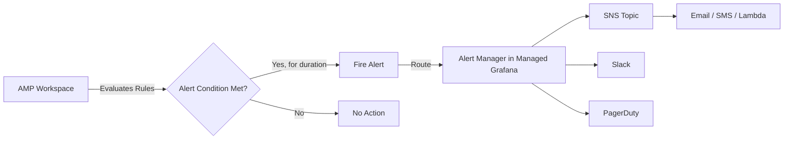

# How to Set Up Alerting Rules in Amazon Managed Prometheus

Author: [nawazdhandala](https://github.com/nawazdhandala)

Tags: AWS, Prometheus, Alerting, AMP, Monitoring, SNS, Observability

Description: Configure alerting rules in Amazon Managed Prometheus to detect issues and route alerts through Amazon SNS for notification delivery

---

Collecting metrics is only half of monitoring. The other half is knowing when those metrics indicate a problem. Amazon Managed Prometheus (AMP) supports alerting rules that continuously evaluate PromQL expressions and fire alerts when conditions are met.

AMP alerting rules work the same way as open-source Prometheus alerting rules. You define conditions using PromQL, set duration thresholds, and route alerts to an alert manager. On AWS, you use Amazon Managed Grafana's alerting or connect to an alert manager that routes notifications through SNS, Slack, PagerDuty, or other channels.

This guide covers creating alerting rules in AMP, configuring the alert manager, and building rules for common production scenarios.

## How AMP Alerting Works



AMP evaluates alerting rules at regular intervals (typically every 60 seconds). When a rule's PromQL expression returns a non-empty result, the alert enters a "pending" state. If the condition persists for the configured `for` duration, the alert fires and is sent to the alert manager.

## Step 1: Create a Rules Namespace

AMP organizes alerting and recording rules into namespaces (also called rule group namespaces). Think of these as files that contain groups of related rules.

```bash
# Create a rule group namespace with alerting rules
aws amp create-rule-groups-namespace \
  --workspace-id ws-abc123-def456 \
  --name "production-alerts" \
  --data "$(base64 -w0 <<'EOF'
groups:
  - name: application_alerts
    interval: 60s
    rules:
      - alert: HighErrorRate
        expr: |
          sum(rate(http_requests_total{status_code=~"5..", namespace="production"}[5m]))
          /
          sum(rate(http_requests_total{namespace="production"}[5m]))
          > 0.05
        for: 5m
        labels:
          severity: critical
          team: platform
        annotations:
          summary: "High error rate detected"
          description: "Error rate is {{ $value | humanizePercentage }} in production namespace"

      - alert: HighLatency
        expr: |
          histogram_quantile(0.99,
            sum(rate(http_request_duration_seconds_bucket{namespace="production"}[5m])) by (le, service)
          ) > 2
        for: 5m
        labels:
          severity: warning
          team: platform
        annotations:
          summary: "High p99 latency for {{ $labels.service }}"
          description: "p99 latency is {{ $value | humanizeDuration }} for {{ $labels.service }}"
EOF
)"
```

Note: Some versions of the CLI require the data as base64-encoded. If your CLI version accepts raw YAML, omit the base64 encoding.

```bash
# Alternative: using a file
aws amp create-rule-groups-namespace \
  --workspace-id ws-abc123-def456 \
  --name "production-alerts" \
  --data fileb://alerting-rules.yaml
```

## Step 2: Define Common Alerting Rules

Here is a comprehensive set of rules for a production Kubernetes environment.

### Application Health Rules

```yaml
groups:
  - name: application_health
    interval: 60s
    rules:
      # High error rate per service
      - alert: ServiceHighErrorRate
        expr: |
          sum(rate(http_requests_total{status_code=~"5.."}[5m])) by (service)
          /
          sum(rate(http_requests_total[5m])) by (service)
          > 0.05
        for: 5m
        labels:
          severity: critical
        annotations:
          summary: "Service {{ $labels.service }} has high error rate"
          description: "Error rate is {{ $value | humanizePercentage }}"

      # Service is completely down
      - alert: ServiceDown
        expr: up{job="kubernetes-pods"} == 0
        for: 2m
        labels:
          severity: critical
        annotations:
          summary: "Service {{ $labels.instance }} is down"
          description: "Prometheus cannot scrape {{ $labels.instance }}"

      # Slow response times
      - alert: ServiceHighLatency
        expr: |
          histogram_quantile(0.95,
            sum(rate(http_request_duration_seconds_bucket[5m])) by (le, service)
          ) > 1
        for: 10m
        labels:
          severity: warning
        annotations:
          summary: "Service {{ $labels.service }} has high latency"
          description: "p95 latency is {{ $value }}s"

      # Request rate dropped significantly
      - alert: ServiceLowTraffic
        expr: |
          sum(rate(http_requests_total[5m])) by (service)
          < 0.1
          and
          sum(rate(http_requests_total[5m] offset 1h)) by (service)
          > 1
        for: 15m
        labels:
          severity: warning
        annotations:
          summary: "Traffic to {{ $labels.service }} dropped significantly"
```

### Kubernetes Infrastructure Rules

```yaml
  - name: kubernetes_infrastructure
    interval: 60s
    rules:
      # Pod crash looping
      - alert: PodCrashLooping
        expr: |
          increase(kube_pod_container_status_restarts_total[1h]) > 5
        for: 10m
        labels:
          severity: warning
        annotations:
          summary: "Pod {{ $labels.pod }} is crash looping"
          description: "Pod {{ $labels.pod }} in {{ $labels.namespace }} restarted {{ $value }} times in the last hour"

      # Pod stuck in non-running state
      - alert: PodNotReady
        expr: |
          kube_pod_status_phase{phase=~"Pending|Unknown"} == 1
        for: 15m
        labels:
          severity: warning
        annotations:
          summary: "Pod {{ $labels.pod }} is not ready"
          description: "Pod {{ $labels.pod }} in {{ $labels.namespace }} has been in {{ $labels.phase }} state for 15 minutes"

      # Deployment replica mismatch
      - alert: DeploymentReplicasMismatch
        expr: |
          kube_deployment_spec_replicas
          !=
          kube_deployment_status_available_replicas
        for: 10m
        labels:
          severity: warning
        annotations:
          summary: "Deployment {{ $labels.deployment }} replica mismatch"
          description: "Deployment {{ $labels.deployment }} has {{ $value }} replicas but expected {{ $labels.spec_replicas }}"
```

### Resource Utilization Rules

```yaml
  - name: resource_utilization
    interval: 60s
    rules:
      # High CPU usage on pod
      - alert: PodHighCPU
        expr: |
          sum(rate(container_cpu_usage_seconds_total{namespace="production"}[5m])) by (pod)
          /
          sum(kube_pod_container_resource_limits{namespace="production", resource="cpu"}) by (pod)
          > 0.9
        for: 15m
        labels:
          severity: warning
        annotations:
          summary: "Pod {{ $labels.pod }} CPU usage above 90%"

      # High memory usage on pod
      - alert: PodHighMemory
        expr: |
          sum(container_memory_working_set_bytes{namespace="production"}) by (pod)
          /
          sum(kube_pod_container_resource_limits{namespace="production", resource="memory"}) by (pod)
          > 0.9
        for: 10m
        labels:
          severity: warning
        annotations:
          summary: "Pod {{ $labels.pod }} memory usage above 90%"

      # Node disk space low
      - alert: NodeDiskSpaceLow
        expr: |
          (node_filesystem_size_bytes{mountpoint="/"} - node_filesystem_avail_bytes{mountpoint="/"})
          / node_filesystem_size_bytes{mountpoint="/"} > 0.85
        for: 10m
        labels:
          severity: warning
        annotations:
          summary: "Node {{ $labels.instance }} disk usage above 85%"
```

## Step 3: Configure Alert Routing in Managed Grafana

AMP fires alerts, but you need an alert manager to route them to notification channels. Managed Grafana includes a built-in alert manager.

In Managed Grafana:

1. Navigate to **Alerting > Contact points**
2. Add a contact point for each notification channel

### SNS Contact Point

```yaml
# Grafana alert manager config for SNS
contact_points:
  - name: sns-critical
    type: sns
    settings:
      topic: arn:aws:sns:us-east-1:123456789012:critical-alerts
      region: us-east-1
```

### Slack Contact Point

```yaml
contact_points:
  - name: slack-warnings
    type: slack
    settings:
      url: https://hooks.slack.com/services/T00/B00/xxxx
      channel: "#alerts-warning"
      title: "{{ .CommonLabels.alertname }}"
      text: "{{ .CommonAnnotations.description }}"
```

### Routing Configuration

Route alerts based on severity labels.

```yaml
# Route critical alerts to SNS, warnings to Slack
routes:
  - receiver: sns-critical
    match:
      severity: critical
  - receiver: slack-warnings
    match:
      severity: warning
  - receiver: slack-warnings  # default
```

## Step 4: Update and Manage Rules

### Listing Rules

```bash
# List all rule group namespaces
aws amp list-rule-groups-namespaces \
  --workspace-id ws-abc123-def456

# Describe a specific rule group namespace
aws amp describe-rule-groups-namespace \
  --workspace-id ws-abc123-def456 \
  --name "production-alerts"
```

### Updating Rules

```bash
# Update rules (replaces the entire namespace)
aws amp put-rule-groups-namespace \
  --workspace-id ws-abc123-def456 \
  --name "production-alerts" \
  --data fileb://updated-rules.yaml
```

### Deleting Rules

```bash
# Delete a rule group namespace
aws amp delete-rule-groups-namespace \
  --workspace-id ws-abc123-def456 \
  --name "production-alerts"
```

## Step 5: Verify Rules Are Working

Check that your rules are being evaluated correctly.

```bash
# Query the rules API
awscurl --service aps \
  --region us-east-1 \
  "https://aps-workspaces.us-east-1.amazonaws.com/workspaces/ws-abc123/api/v1/rules"

# Check current alerts
awscurl --service aps \
  --region us-east-1 \
  "https://aps-workspaces.us-east-1.amazonaws.com/workspaces/ws-abc123/api/v1/alerts"
```

In Managed Grafana, navigate to **Alerting > Alert rules** to see the status of all configured rules.

## Best Practices for Alerting Rules

**Set appropriate `for` durations**: A 1-minute `for` duration will generate noisy alerts from brief spikes. Start with 5-10 minutes for most alerts and adjust based on your experience.

**Use severity labels consistently**: Define severity levels (critical, warning, info) and route them to appropriate channels. Critical alerts page on-call engineers. Warnings go to Slack. Info goes to a dashboard.

**Include useful annotations**: The description annotation should tell the on-call engineer what is wrong and ideally what to do about it. Include the current value using `{{ $value }}`.

**Avoid alerting on symptoms and causes simultaneously**: If high error rate and pod crash looping are related, the crash looping alert is the cause. Alert on both but group them so the on-call engineer sees the relationship.

**Test with `absent()`**: Use the `absent()` function to alert when expected metrics are missing.

```yaml
- alert: MetricsMissing
  expr: absent(http_requests_total{service="order-api"})
  for: 10m
  labels:
    severity: warning
  annotations:
    summary: "No metrics from order-api"
    description: "Prometheus is not receiving metrics from order-api. The service may be down or scraping may be broken."
```

For more PromQL patterns to use in your rules, see our guide on [using PromQL queries in Amazon Managed Prometheus](https://oneuptime.com/blog/post/use-promql-queries-in-amazon-managed-prometheus/view).

## Wrapping Up

Alerting rules in AMP turn passive monitoring into active incident detection. Define rules using the same PromQL queries you use in dashboards, route them through Managed Grafana's alert manager, and deliver notifications through SNS, Slack, or PagerDuty. The key to effective alerting is starting conservatively, with high thresholds and long durations, then tightening as you learn your system's normal behavior. Too many false positives will train your team to ignore alerts, which defeats the entire purpose.
