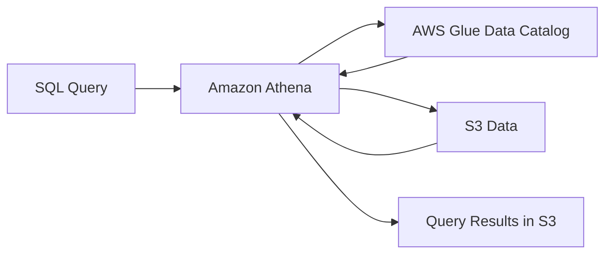

# How to Set Up Amazon Athena for Querying S3 Data

Author: [nawazdhandala](https://github.com/nawazdhandala)

Tags: AWS, Amazon Athena, S3, SQL, Analytics

Description: A complete guide to setting up Amazon Athena for querying data stored in S3, including creating databases, defining tables, and running your first queries.

---

You've got data sitting in S3. Maybe it's log files, CSV exports, JSON events, or Parquet data from your data pipeline. You need to analyze it, but you don't want to spin up a database cluster just to run some queries.

That's exactly what Amazon Athena is for. It's a serverless query service that lets you run SQL directly against data in S3. No infrastructure to manage, no data to load - you point Athena at your S3 data, define a schema, and start querying. You pay only for the data your queries scan.

## How Athena Works

Athena is built on Presto (now Trino), an open-source distributed SQL engine. Under the hood, it uses the AWS Glue Data Catalog to store table definitions and metadata.



When you run a query, Athena:
1. Looks up the table schema in the Glue Data Catalog
2. Reads the relevant data from S3
3. Processes it using distributed compute
4. Writes results to an S3 bucket you specify

## Prerequisites

Before you start, you need:

1. **An S3 bucket with data** - Your source data
2. **A query results bucket** - Where Athena stores query output
3. **IAM permissions** - Access to Athena, Glue, and the relevant S3 buckets

## Setting Up the Query Results Location

First, create a bucket for query results:

```bash
# Create an S3 bucket for Athena query results
aws s3 mb s3://my-athena-query-results-123456 --region us-east-1
```

Then configure Athena to use it:

```bash
# Set the default query results location for Athena
aws athena update-work-group \
  --work-group primary \
  --configuration "ResultConfiguration={OutputLocation=s3://my-athena-query-results-123456/}"
```

## Creating a Database

Athena databases are just namespaces in the Glue Data Catalog. Create one:

```sql
-- Create a database to organize your tables
CREATE DATABASE IF NOT EXISTS analytics;
```

You can run this in the Athena console query editor or via the CLI:

```bash
# Create a database using the AWS CLI
aws athena start-query-execution \
  --query-string "CREATE DATABASE IF NOT EXISTS analytics" \
  --result-configuration "OutputLocation=s3://my-athena-query-results-123456/"
```

## Creating Tables

Tables in Athena don't store data - they define the schema of data that already exists in S3. This is called a "schema-on-read" approach.

### CSV Data

Let's say you have CSV files in `s3://my-data-bucket/sales/` with columns: date, product, quantity, price.

```sql
-- Create a table pointing to CSV data in S3
CREATE EXTERNAL TABLE analytics.sales (
    sale_date DATE,
    product STRING,
    quantity INT,
    price DOUBLE
)
ROW FORMAT DELIMITED
FIELDS TERMINATED BY ','
LINES TERMINATED BY '\n'
LOCATION 's3://my-data-bucket/sales/'
TBLPROPERTIES ('skip.header.line.count'='1');
```

The `EXTERNAL` keyword means Athena doesn't own the data. Dropping the table won't delete your S3 files.

### JSON Data

For JSON data, use a JSON SerDe:

```sql
-- Create a table for JSON-formatted data
CREATE EXTERNAL TABLE analytics.events (
    event_id STRING,
    event_type STRING,
    user_id STRING,
    timestamp BIGINT,
    properties MAP<STRING, STRING>
)
ROW FORMAT SERDE 'org.openx.data.jsonserde.JsonSerDe'
LOCATION 's3://my-data-bucket/events/';
```

### Parquet Data

Parquet is the recommended format for Athena because it's columnar, compressed, and fast:

```sql
-- Create a table for Parquet data with automatic schema detection
CREATE EXTERNAL TABLE analytics.orders (
    order_id STRING,
    customer_id STRING,
    order_date TIMESTAMP,
    total_amount DOUBLE,
    status STRING,
    items ARRAY<STRUCT<
        product_id: STRING,
        quantity: INT,
        price: DOUBLE
    >>
)
STORED AS PARQUET
LOCATION 's3://my-data-bucket/orders/';
```

## Running Your First Query

With the table created, you can start querying:

```sql
-- Query total sales by product
SELECT
    product,
    SUM(quantity) as total_quantity,
    SUM(quantity * price) as total_revenue
FROM analytics.sales
WHERE sale_date >= DATE '2025-01-01'
GROUP BY product
ORDER BY total_revenue DESC
LIMIT 10;
```

## Using the SDK

Here's how to run queries programmatically with Python:

```python
# Run an Athena query and wait for results
import boto3
import time

athena = boto3.client('athena', region_name='us-east-1')

# Start the query execution
response = athena.start_query_execution(
    QueryString="""
        SELECT product, SUM(quantity) as total_sold
        FROM analytics.sales
        WHERE sale_date >= DATE '2025-01-01'
        GROUP BY product
        ORDER BY total_sold DESC
    """,
    QueryExecutionContext={'Database': 'analytics'},
    ResultConfiguration={
        'OutputLocation': 's3://my-athena-query-results-123456/'
    }
)

query_id = response['QueryExecutionId']

# Wait for the query to complete
while True:
    status = athena.get_query_execution(QueryExecutionId=query_id)
    state = status['QueryExecution']['Status']['State']

    if state in ['SUCCEEDED', 'FAILED', 'CANCELLED']:
        break

    time.sleep(2)

if state == 'SUCCEEDED':
    # Fetch results
    results = athena.get_query_results(QueryExecutionId=query_id)

    # Print column headers
    headers = [col['Label'] for col in results['ResultSet']['ResultSetMetadata']['ColumnInfo']]
    print('\t'.join(headers))

    # Print data rows (skip header row)
    for row in results['ResultSet']['Rows'][1:]:
        values = [field.get('VarCharValue', '') for field in row['Data']]
        print('\t'.join(values))
else:
    error = status['QueryExecution']['Status']['StateChangeReason']
    print(f"Query failed: {error}")
```

## Workgroups

Workgroups let you separate users, control costs, and manage access:

```bash
# Create a workgroup with a query cost limit
aws athena create-work-group \
  --name "data-team" \
  --configuration '{
    "ResultConfiguration": {
      "OutputLocation": "s3://my-athena-query-results-123456/data-team/"
    },
    "EnforceWorkGroupConfiguration": true,
    "BytesScannedCutoffPerQuery": 10737418240
  }' \
  --description "Workgroup for the data team"
```

The `BytesScannedCutoffPerQuery` limits how much data a single query can scan. In this example, it's 10 GB. Queries that exceed this limit are cancelled automatically, which prevents accidental full-table scans on massive datasets from blowing up your bill.

## Data Organization Best Practices

How you organize data in S3 directly impacts Athena's performance and cost.

**Use partitions.** If your data is time-series, organize it by date:

```
s3://my-data-bucket/events/year=2025/month=01/day=15/data.parquet
s3://my-data-bucket/events/year=2025/month=01/day=16/data.parquet
```

With partitions, a query filtering on `WHERE year='2025' AND month='01'` only scans that month's data, not the entire dataset. We cover this in detail in our guide on [optimizing Athena with partitioning](https://oneuptime.com/blog/post/optimize-athena-query-performance-with-partitioning/view).

**Use columnar formats.** Parquet and ORC are dramatically more efficient than CSV or JSON because Athena only reads the columns your query references. Learn more in our post on [optimizing Athena queries with column formats](https://oneuptime.com/blog/post/optimize-athena-queries-with-column-formats-parquet-orc/view).

**Compress your data.** Athena supports gzip, Snappy, LZO, and ZSTD compression. Smaller files mean less data scanned, which means faster queries and lower costs.

## Cost Management

Athena charges $5 per TB of data scanned. That's it. No compute costs, no storage costs (beyond your S3 storage).

The key to controlling costs is reducing the amount of data scanned:

1. Partition your data
2. Use columnar formats (Parquet, ORC)
3. Compress your files
4. Select only the columns you need (avoid `SELECT *`)
5. Set workgroup scan limits

For a deeper dive into keeping Athena costs down, check out our guide on [reducing Athena query costs](https://oneuptime.com/blog/post/reduce-athena-query-costs/view).

## Monitoring

Track your Athena usage with CloudWatch metrics:
- `TotalExecutionTime` - How long queries take
- `DataScannedInBytes` - How much data you're paying for
- `ProcessedBytes` - Related to cost calculations

These metrics help you identify expensive queries and optimization opportunities. For broader infrastructure monitoring, combining Athena with a platform like [OneUptime](https://oneuptime.com) gives you visibility into both your analytics pipeline and the applications that depend on it.

## Wrapping Up

Athena is one of those AWS services that does one thing and does it well. Point it at S3, define a schema, run SQL. No servers, no clusters, no maintenance. The pay-per-query model makes it cost-effective for ad-hoc analysis and lightweight reporting.

For best results, invest time in organizing your data properly - partitioning, columnar formats, and compression. These optimizations can reduce your query costs by 90% or more compared to scanning unoptimized CSV files.

Ready to write some queries? Head over to our guide on [writing SQL queries in Amazon Athena](https://oneuptime.com/blog/post/write-sql-queries-in-amazon-athena/view) for syntax tips and practical examples.
