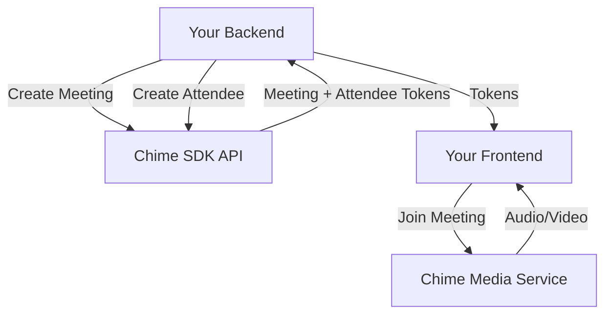

# How to Set Up Amazon Chime SDK for Video Calls

Author: [nawazdhandala](https://github.com/nawazdhandala)

Tags: AWS, Chime SDK, Video, WebRTC, Real-Time

Description: Build video calling functionality into your application using Amazon Chime SDK, covering meeting creation, participant management, and client-side integration with JavaScript.

---

Building video calling into your own application used to mean wrestling with WebRTC, STUN/TURN servers, and media pipelines. Amazon Chime SDK handles all of that infrastructure and gives you a clean API to work with. You create meetings, add attendees, and the SDK handles the audio/video media.

The Chime SDK isn't the same as the Chime app - it's a set of building blocks for embedding real-time communications into your own software.

## How It Works

The architecture has two parts.



Your backend calls the Chime SDK API to create meetings and attendees. It gets back tokens that your frontend uses to connect to the Chime media service. All the actual audio/video flows through AWS infrastructure.

## Backend Setup

First, install the SDK for your backend language.

```bash
# For Node.js backend
npm install @aws-sdk/client-chime-sdk-meetings

# For Python backend
pip install boto3
```

### Creating Meetings and Attendees (Node.js)

```javascript
// meeting-service.js
const {
  ChimeSDKMeetingsClient,
  CreateMeetingCommand,
  CreateAttendeeCommand,
  DeleteMeetingCommand
} = require('@aws-sdk/client-chime-sdk-meetings');

const chimeClient = new ChimeSDKMeetingsClient({
  region: 'us-east-1'
});

async function createMeeting(externalMeetingId) {
  // Create a new meeting
  const command = new CreateMeetingCommand({
    ClientRequestToken: externalMeetingId,
    ExternalMeetingId: externalMeetingId,
    MediaRegion: 'us-east-1'
  });

  const response = await chimeClient.send(command);
  return response.Meeting;
}

async function addAttendee(meetingId, externalUserId) {
  // Add a participant to the meeting
  const command = new CreateAttendeeCommand({
    MeetingId: meetingId,
    ExternalUserId: externalUserId
  });

  const response = await chimeClient.send(command);
  return response.Attendee;
}

async function endMeeting(meetingId) {
  const command = new DeleteMeetingCommand({
    MeetingId: meetingId
  });
  await chimeClient.send(command);
}

module.exports = { createMeeting, addAttendee, endMeeting };
```

### Creating Meetings and Attendees (Python)

```python
import boto3
import uuid

chime = boto3.client('chime-sdk-meetings', region_name='us-east-1')

def create_meeting(external_meeting_id=None):
    """Create a new Chime SDK meeting."""
    if not external_meeting_id:
        external_meeting_id = str(uuid.uuid4())

    response = chime.create_meeting(
        ClientRequestToken=external_meeting_id,
        ExternalMeetingId=external_meeting_id,
        MediaRegion='us-east-1'
    )
    return response['Meeting']

def add_attendee(meeting_id, external_user_id):
    """Add an attendee to an existing meeting."""
    response = chime.create_attendee(
        MeetingId=meeting_id,
        ExternalUserId=external_user_id
    )
    return response['Attendee']

def end_meeting(meeting_id):
    """End a meeting and disconnect all participants."""
    chime.delete_meeting(MeetingId=meeting_id)
```

## API Endpoints

Your frontend needs to call your backend to get meeting and attendee info. Here's a simple Express API.

```javascript
// api.js
const express = require('express');
const { createMeeting, addAttendee, endMeeting } = require('./meeting-service');

const app = express();
app.use(express.json());

// Store active meetings (use a database in production)
const meetings = new Map();

app.post('/api/meetings', async (req, res) => {
  try {
    const { title } = req.body;
    const meetingId = `meeting-${Date.now()}`;

    const meeting = await createMeeting(meetingId);
    meetings.set(meeting.MeetingId, { title, meeting });

    res.json({ meeting });
  } catch (error) {
    console.error('Error creating meeting:', error);
    res.status(500).json({ error: 'Failed to create meeting' });
  }
});

app.post('/api/meetings/:meetingId/attendees', async (req, res) => {
  try {
    const { meetingId } = req.params;
    const { userId, displayName } = req.body;

    const attendee = await addAttendee(meetingId, userId);

    res.json({
      meeting: meetings.get(meetingId)?.meeting,
      attendee
    });
  } catch (error) {
    console.error('Error adding attendee:', error);
    res.status(500).json({ error: 'Failed to join meeting' });
  }
});

app.delete('/api/meetings/:meetingId', async (req, res) => {
  try {
    const { meetingId } = req.params;
    await endMeeting(meetingId);
    meetings.delete(meetingId);
    res.json({ message: 'Meeting ended' });
  } catch (error) {
    res.status(500).json({ error: 'Failed to end meeting' });
  }
});
```

## Frontend Integration

The Chime SDK provides JavaScript libraries for the frontend. Install them.

```bash
npm install amazon-chime-sdk-js
```

### Basic Video Meeting Client

```javascript
// video-client.js
import {
  ConsoleLogger,
  DefaultDeviceController,
  DefaultMeetingSession,
  LogLevel,
  MeetingSessionConfiguration
} from 'amazon-chime-sdk-js';

class VideoClient {
  constructor() {
    this.meetingSession = null;
    this.logger = new ConsoleLogger('VideoClient', LogLevel.INFO);
  }

  async join(meetingInfo, attendeeInfo) {
    // Create the meeting session configuration
    const configuration = new MeetingSessionConfiguration(
      meetingInfo,
      attendeeInfo
    );

    // Create the meeting session
    const deviceController = new DefaultDeviceController(this.logger);
    this.meetingSession = new DefaultMeetingSession(
      configuration,
      this.logger,
      deviceController
    );

    // Set up audio
    const audioInputDevices = await this.meetingSession.audioVideo.listAudioInputDevices();
    if (audioInputDevices.length > 0) {
      await this.meetingSession.audioVideo.startAudioInput(audioInputDevices[0].deviceId);
    }

    const audioOutputDevices = await this.meetingSession.audioVideo.listAudioOutputDevices();
    if (audioOutputDevices.length > 0) {
      await this.meetingSession.audioVideo.chooseAudioOutput(audioOutputDevices[0].deviceId);
    }

    // Bind audio output to an HTML audio element
    const audioElement = document.getElementById('meeting-audio');
    this.meetingSession.audioVideo.bindAudioElement(audioElement);

    // Set up video
    const videoInputDevices = await this.meetingSession.audioVideo.listVideoInputDevices();
    if (videoInputDevices.length > 0) {
      await this.meetingSession.audioVideo.startVideoInput(videoInputDevices[0].deviceId);
    }

    // Start the session
    this.meetingSession.audioVideo.start();

    // Start local video
    this.meetingSession.audioVideo.startLocalVideoTile();

    return this.meetingSession;
  }

  setupVideoObserver(onTileUpdate, onTileRemove) {
    // Watch for video tiles (one per participant)
    const observer = {
      videoTileDidUpdate: (tileState) => {
        if (!tileState.boundAttendeeId) return;

        const videoElement = document.getElementById(
          `video-${tileState.tileId}`
        );

        if (videoElement) {
          this.meetingSession.audioVideo.bindVideoElement(
            tileState.tileId,
            videoElement
          );
        }

        if (onTileUpdate) onTileUpdate(tileState);
      },
      videoTileWasRemoved: (tileId) => {
        if (onTileRemove) onTileRemove(tileId);
      }
    };

    this.meetingSession.audioVideo.addObserver(observer);
  }

  toggleMute() {
    if (this.meetingSession.audioVideo.realtimeIsLocalAudioMuted()) {
      this.meetingSession.audioVideo.realtimeUnmuteLocalAudio();
      return false; // not muted
    } else {
      this.meetingSession.audioVideo.realtimeMuteLocalAudio();
      return true; // muted
    }
  }

  toggleVideo() {
    if (this.meetingSession.audioVideo.hasStartedLocalVideoTile()) {
      this.meetingSession.audioVideo.stopLocalVideoTile();
      return false; // video off
    } else {
      this.meetingSession.audioVideo.startLocalVideoTile();
      return true; // video on
    }
  }

  leave() {
    if (this.meetingSession) {
      this.meetingSession.audioVideo.stop();
      this.meetingSession = null;
    }
  }
}

export default VideoClient;
```

### HTML Structure

```html
<!-- meeting.html -->
<div id="meeting-container">
  <audio id="meeting-audio" style="display: none;"></audio>

  <div id="video-grid">
    <!-- Video tiles are added dynamically -->
  </div>

  <div id="controls">
    <button id="mute-btn" onclick="toggleMute()">Mute</button>
    <button id="video-btn" onclick="toggleVideo()">Camera Off</button>
    <button id="leave-btn" onclick="leaveMeeting()">Leave</button>
  </div>
</div>
```

## Participant Events

Track who joins and leaves the meeting.

```javascript
// Set up attendee presence observer
meetingSession.audioVideo.realtimeSubscribeToAttendeeIdPresence(
  (attendeeId, present, externalUserId) => {
    if (present) {
      console.log(`${externalUserId} joined the meeting`);
      // Update your UI to show the participant
    } else {
      console.log(`${externalUserId} left the meeting`);
      // Update your UI to remove the participant
    }
  }
);
```

## Screen Sharing

The Chime SDK supports screen sharing through content share.

```javascript
async function startScreenShare(meetingSession) {
  try {
    await meetingSession.audioVideo.startContentShareFromScreenCapture();
    console.log('Screen sharing started');
  } catch (error) {
    console.error('Screen share failed:', error);
  }
}

function stopScreenShare(meetingSession) {
  meetingSession.audioVideo.stopContentShare();
}
```

## Pricing and Limits

Chime SDK charges per attendee-minute. As of now, you pay for each minute an attendee is connected to a meeting. Audio-only meetings are cheaper than video meetings. There's no upfront cost or minimum commitment.

Meetings can have up to 250 attendees by default, with video limited to a smaller number of active video streams.

## Summary

The Chime SDK gives you production-quality video calling without building media infrastructure. Your backend creates meetings and attendees through the API, your frontend connects using the JavaScript SDK, and AWS handles everything in between - the WebRTC signaling, TURN servers, media routing, and transcoding. Start with basic audio/video, then add features like screen sharing, recording, and chat as you need them.
