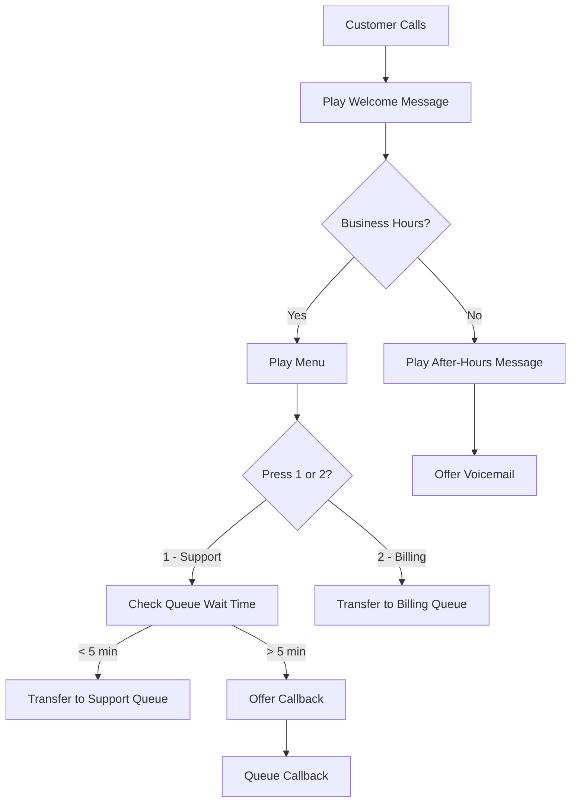

# How to Set Up Amazon Connect for Customer Service

Author: [nawazdhandala](https://github.com/nawazdhandala)

Tags: AWS, Amazon Connect, Contact Center, Customer Service, IVR, Cloud Telephony

Description: Set up Amazon Connect as a cloud-based contact center with phone numbers, contact flows, agent routing, and real-time analytics for customer service.

---

Setting up a contact center used to mean months of planning, expensive hardware, complex PBX systems, and vendor lock-in contracts. Amazon Connect flips that model entirely. It is a cloud-based contact center service that you can set up in minutes, scale on demand, and pay only for what you use. No per-seat licensing, no minimum commitments, no infrastructure to manage.

Amazon Connect powers Amazon's own customer service, and they made it available as a standalone AWS service. It handles voice calls, chat, tasks, and even outbound campaigns - all from a browser-based agent workspace.

## Getting Started with Amazon Connect

### Step 1: Create a Connect Instance

An Amazon Connect instance is your contact center environment. Each instance is isolated and has its own configuration, users, and phone numbers.

```bash
# Create an Amazon Connect instance
aws connect create-instance \
  --identity-management-type "CONNECT_MANAGED" \
  --instance-alias "my-contact-center" \
  --inbound-calls-enabled \
  --outbound-calls-enabled
```

The `identity-management-type` determines how agents authenticate:
- **CONNECT_MANAGED** - Connect manages usernames and passwords
- **SAML** - Integrate with your SSO provider
- **EXISTING_DIRECTORY** - Use AWS Directory Service

For production, SAML is recommended so agents use your organization's single sign-on.

### Step 2: Claim a Phone Number

You need at least one phone number for customers to call:

```bash
# List available phone numbers
aws connect search-available-phone-numbers \
  --target-arn "arn:aws:connect:us-east-1:123456789012:instance/abc-123" \
  --phone-number-country-code "US" \
  --phone-number-type "TOLL_FREE" \
  --max-results 5

# Claim a phone number
aws connect claim-phone-number \
  --target-arn "arn:aws:connect:us-east-1:123456789012:instance/abc-123" \
  --phone-number-description "Main customer service line" \
  --phone-number-country-code "US" \
  --phone-number-type "TOLL_FREE"
```

You can claim local numbers, toll-free numbers, or port existing numbers from your current provider.

### Step 3: Create Queues

Queues are where contacts wait to be connected to an agent. You typically create queues based on the type of inquiry:

```bash
# Create a queue for general support
aws connect create-queue \
  --instance-id "abc-123" \
  --name "General Support" \
  --description "General customer support queue" \
  --hours-of-operation-id "hours-id" \
  --max-contacts 100

# Create a queue for billing inquiries
aws connect create-queue \
  --instance-id "abc-123" \
  --name "Billing Support" \
  --description "Billing and payment inquiries" \
  --hours-of-operation-id "hours-id" \
  --max-contacts 50
```

### Step 4: Create Routing Profiles

Routing profiles define which queues an agent can receive contacts from and in what priority order:

```bash
# Create a routing profile for general agents
aws connect create-routing-profile \
  --instance-id "abc-123" \
  --name "General Agent" \
  --description "Handles general and billing support" \
  --default-outbound-queue-id "general-queue-id" \
  --media-concurrencies '[
    {
      "Channel": "VOICE",
      "Concurrency": 1
    },
    {
      "Channel": "CHAT",
      "Concurrency": 3
    }
  ]' \
  --queue-configs '[
    {
      "QueueReference": {
        "QueueId": "general-queue-id",
        "Channel": "VOICE"
      },
      "Priority": 1,
      "Delay": 0
    },
    {
      "QueueReference": {
        "QueueId": "billing-queue-id",
        "Channel": "VOICE"
      },
      "Priority": 2,
      "Delay": 30
    }
  ]'
```

This routing profile lets an agent handle one voice call at a time and up to three concurrent chats. General support contacts are prioritized, and billing contacts are offered after a 30-second delay.

### Step 5: Create Agent Users

```bash
# Create an agent user
aws connect create-user \
  --instance-id "abc-123" \
  --username "jsmith" \
  --password "TempPassword123!" \
  --identity-info '{
    "FirstName": "Jane",
    "LastName": "Smith",
    "Email": "jsmith@yourcompany.com"
  }' \
  --phone-config '{
    "PhoneType": "SOFT_PHONE",
    "AutoAccept": false
  }' \
  --security-profile-ids '["agent-security-profile-id"]' \
  --routing-profile-id "general-agent-routing-profile-id"
```

## Building Contact Flows

Contact flows are the heart of Amazon Connect. They define how contacts are handled from the moment they call in until they disconnect. Think of them as visual flowcharts for call routing.



While contact flows are typically designed in the visual editor in the Connect console, you can also manage them via the API:

```bash
# List existing contact flows
aws connect list-contact-flows \
  --instance-id "abc-123" \
  --contact-flow-types "CONTACT_FLOW"

# Get a specific contact flow's content
aws connect describe-contact-flow \
  --instance-id "abc-123" \
  --contact-flow-id "flow-id"
```

### Key Contact Flow Blocks

Here are the most useful blocks for building contact flows:

**Play prompt** - plays an audio file or text-to-speech message.

**Get customer input** - presents a menu and waits for DTMF (key press) input.

**Set queue** - sets which queue the contact should go to.

**Transfer to queue** - sends the contact to wait in the configured queue.

**Invoke Lambda** - calls a Lambda function for custom logic (database lookups, CRM integration, etc.).

**Check hours of operation** - branches based on whether you are currently in business hours.

**Check queue status** - branches based on queue metrics like wait time or number of contacts in queue.

### Lambda Integration for Dynamic Routing

Use Lambda functions to add intelligence to your contact flows:

```python
# lambda_function.py - look up customer info for personalized routing
import boto3
import json

dynamodb = boto3.resource('dynamodb')
table = dynamodb.Table('Customers')

def lambda_handler(event, context):
    """Look up caller information for personalized service."""
    phone_number = event['Details']['ContactData']['CustomerEndpoint']['Address']

    # Look up the customer by phone number
    response = table.get_item(
        Key={'phone_number': phone_number}
    )

    if 'Item' in response:
        customer = response['Item']
        return {
            'customer_name': customer.get('name', 'Valued Customer'),
            'account_tier': customer.get('tier', 'standard'),
            'account_number': customer.get('account_id', 'unknown'),
            'is_known_customer': 'true'
        }
    else:
        return {
            'customer_name': 'Valued Customer',
            'account_tier': 'standard',
            'account_number': 'unknown',
            'is_known_customer': 'false'
        }
```

The Lambda function's return values become attributes you can use in subsequent contact flow blocks. For example, you could route premium-tier customers to a priority queue.

## Setting Up Chat Support

Amazon Connect supports chat in addition to voice. You can embed the chat widget in your website:

```bash
# Create a chat contact flow (same as voice but for chat channel)
# Then create a widget for your website

# Start a chat contact programmatically
aws connect start-chat-contact \
  --instance-id "abc-123" \
  --contact-flow-id "chat-flow-id" \
  --participant-details '{
    "DisplayName": "Customer"
  }' \
  --attributes '{
    "customerName": "John Doe",
    "source": "website"
  }'
```

For an even smarter chat experience, you can integrate Amazon Lex for automated responses before handing off to a human agent. See our guide on [using Amazon Lex with Amazon Connect for IVR](https://oneuptime.com/blog/post/2026-02-12-use-amazon-lex-with-amazon-connect-for-ivr/view).

## Real-Time and Historical Analytics

Connect provides both real-time and historical metrics:

```bash
# Get current queue metrics
aws connect get-current-metric-data \
  --instance-id "abc-123" \
  --filters '{
    "Queues": ["general-queue-id"],
    "Channels": ["VOICE"]
  }' \
  --current-metrics '[
    {"Name": "AGENTS_ONLINE", "Unit": "COUNT"},
    {"Name": "AGENTS_AVAILABLE", "Unit": "COUNT"},
    {"Name": "CONTACTS_IN_QUEUE", "Unit": "COUNT"},
    {"Name": "OLDEST_CONTACT_AGE", "Unit": "SECONDS"}
  ]'

# Get historical metrics for the past 24 hours
aws connect get-metric-data-v2 \
  --resource-arn "arn:aws:connect:us-east-1:123456789012:instance/abc-123" \
  --start-time "2026-02-11T00:00:00Z" \
  --end-time "2026-02-12T00:00:00Z" \
  --interval '{
    "TimeZone": "UTC",
    "IntervalPeriod": "TOTAL"
  }' \
  --filters '[
    {
      "FilterKey": "QUEUE",
      "FilterValues": ["general-queue-id"]
    }
  ]' \
  --metrics '[
    {"Name": "AVG_HANDLE_TIME"},
    {"Name": "CONTACTS_HANDLED"},
    {"Name": "SERVICE_LEVEL", "Threshold": [{"Comparison": "LT", "ThresholdValue": 60}]}
  ]'
```

## Pricing

Amazon Connect pricing is entirely usage-based:

- Voice calls: per-minute rate for inbound and outbound
- Chat: per-message rate
- Tasks: per-task rate
- Phone numbers: monthly fee per number

There are no per-agent fees, no minimum commitments, and no upfront costs. You pay only for what you use, which makes it extremely cost-effective for variable workloads.

## Wrapping Up

Amazon Connect removes the traditional barriers to running a professional contact center. You can go from nothing to a fully functional contact center with IVR, queuing, agent routing, and analytics in a single afternoon. Start with a simple contact flow that handles your main use case, add agents, and iterate based on real call data. The pay-per-use model means you can experiment without financial risk.
