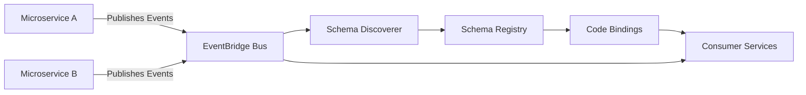

# How to Set Up Amazon EventBridge Schema Discovery

Author: [nawazdhandala](https://github.com/nawazdhandala)

Tags: AWS, EventBridge, Schema Discovery, Event-Driven Architecture, Serverless

Description: Learn how to set up Amazon EventBridge Schema Discovery to automatically detect and catalog event schemas in your event-driven applications.

---

If you have ever worked with event-driven architectures on AWS, you know the pain of keeping track of event shapes. One service publishes an event, another consumes it, and somewhere in the middle you lose track of what fields exist, what types they are, and whether the structure changed last Tuesday. Amazon EventBridge Schema Discovery solves this problem by automatically detecting event schemas from your event bus traffic and making them available in a searchable registry.

In this guide, you will learn how to enable schema discovery, explore discovered schemas, and use them to generate code bindings for your applications.

## What Is EventBridge Schema Discovery?

EventBridge Schema Discovery is a feature that watches events flowing through an EventBridge event bus and automatically infers the JSON schema for each distinct event type. Once discovered, these schemas are stored in the EventBridge Schema Registry, where you can browse them, download code bindings, and track schema versions over time.

This is particularly useful when you are building microservices that communicate via events. Instead of maintaining schema documentation manually, you let EventBridge figure out the structure from real traffic.

## Prerequisites

Before you begin, make sure you have the following:

- An AWS account with appropriate IAM permissions for EventBridge
- AWS CLI v2 installed and configured
- At least one EventBridge event bus (the default bus works fine for testing)
- Some events flowing through the bus (or a willingness to send test events)

## Step 1: Enable Schema Discovery on an Event Bus

You can enable schema discovery through the AWS Console, CLI, or CloudFormation. Let us start with the CLI approach since it is the most repeatable.

The following command enables schema discovery on the default event bus:

```bash
# Enable schema discovery on the default event bus
aws schemas put-discoverer \
  --source-arn arn:aws:events:us-east-1:123456789012:event-bus/default \
  --description "Discover schemas on the default event bus" \
  --cross-account false
```

If you are using a custom event bus, replace the ARN accordingly:

```bash
# Enable schema discovery on a custom event bus
aws schemas put-discoverer \
  --source-arn arn:aws:events:us-east-1:123456789012:event-bus/my-custom-bus \
  --description "Discover schemas on my custom bus"
```

The response will include a `DiscovererId` that you can use to manage the discoverer later.

## Step 2: Send Events to Trigger Discovery

Schema discovery needs actual events to analyze. If you already have applications publishing events, you can skip this step. Otherwise, let us send a test event.

```bash
# Send a test event to the default event bus
aws events put-events --entries '[
  {
    "Source": "com.myapp.orders",
    "DetailType": "OrderCreated",
    "Detail": "{\"orderId\": \"ord-12345\", \"customerId\": \"cust-789\", \"amount\": 99.99, \"currency\": \"USD\", \"items\": [{\"sku\": \"WIDGET-A\", \"quantity\": 2}]}",
    "EventBusName": "default"
  }
]'
```

Schema discovery does not happen instantly. It typically takes a few minutes for the discoverer to process events and generate schemas. During busy periods, it might take longer.

## Step 3: View Discovered Schemas

Once the discoverer has processed some events, you can list the discovered schemas:

```bash
# List all discovered schemas in the discovered-schemas registry
aws schemas list-schemas \
  --registry-name "discovered-schemas"
```

To get the details of a specific schema:

```bash
# Describe a specific discovered schema
aws schemas describe-schema \
  --registry-name "discovered-schemas" \
  --schema-name "com.myapp.orders@OrderCreated"
```

The schema name follows the pattern `source@detail-type`. The output includes the full JSON Schema definition that EventBridge inferred from your events.

## Step 4: Download Code Bindings

One of the most practical features of schema discovery is the ability to generate code bindings. These are typed classes or structs in your preferred language that represent the event structure.

```bash
# Generate code bindings for a discovered schema
aws schemas put-code-binding \
  --registry-name "discovered-schemas" \
  --schema-name "com.myapp.orders@OrderCreated" \
  --language "Python36"

# Download the generated code bindings
aws schemas get-code-binding-source \
  --registry-name "discovered-schemas" \
  --schema-name "com.myapp.orders@OrderCreated" \
  --language "Python36" \
  output.zip
```

Supported languages include Python36, Java8, TypeScript3, and Go1. The generated code gives you strongly-typed event handling without manually writing model classes.

## Step 5: Set Up Schema Discovery with CloudFormation

For production environments, you should manage your discoverer through infrastructure as code. Here is a CloudFormation template:

```yaml
# CloudFormation template for EventBridge Schema Discovery
AWSTemplateFormatVersion: '2010-09-09'
Description: Enable EventBridge Schema Discovery

Resources:
  CustomEventBus:
    Type: AWS::Events::EventBus
    Properties:
      Name: my-application-bus

  SchemaDiscoverer:
    Type: AWS::EventSchemas::Discoverer
    Properties:
      SourceArn: !GetAtt CustomEventBus.Arn
      Description: Schema discovery for application events
      CrossAccount: false

Outputs:
  DiscovererId:
    Value: !Ref SchemaDiscoverer
    Description: The ID of the schema discoverer
```

## Understanding Schema Versions

EventBridge Schema Discovery tracks schema evolution over time. When the discoverer sees a new field in an event, it creates a new schema version. You can list all versions of a schema:

```bash
# List all versions of a discovered schema
aws schemas list-schema-versions \
  --registry-name "discovered-schemas" \
  --schema-name "com.myapp.orders@OrderCreated"
```

This versioning is valuable because it lets you see how your event structures change over time without maintaining changelog documents manually.

## Architecture Overview

Here is how schema discovery fits into a typical event-driven setup:



The discoverer sits alongside your event bus, passively analyzing traffic without affecting event delivery. Consumer services can then use the generated code bindings to handle events with type safety.

## Cost Considerations

Schema discovery pricing is based on the number of events ingested by the discoverer. As of this writing, you pay per million events processed. For most workloads, this cost is minimal, but if you are running a high-throughput event bus with millions of events per hour, keep an eye on the charges.

You can pause discovery at any time if you only need periodic snapshots of your event schemas:

```bash
# Stop the discoverer to pause schema discovery
aws schemas stop-discoverer --discoverer-id "d-1234567890"

# Start it again when needed
aws schemas start-discoverer --discoverer-id "d-1234567890"
```

## Best Practices

1. **Enable discovery in dev/staging first.** Let it run for a few days to capture the full range of event types before enabling in production.

2. **Use custom event buses.** The default bus carries AWS service events which will create a lot of noise in your schema registry. Use a dedicated bus for your application events.

3. **Review discovered schemas regularly.** Treat discovered schemas as living documentation. When a schema version changes unexpectedly, it might indicate an unintended breaking change.

4. **Export schemas to your own registry.** Once a schema stabilizes, copy it to a custom registry where you control versioning explicitly.

5. **Combine with EventBridge rules.** Use discovered schemas to write more precise event pattern matching rules. Knowing the exact structure of your events makes rule authoring much easier.

## Troubleshooting Common Issues

If schemas are not appearing after enabling discovery, check the following:

- Verify the discoverer is in the "STARTED" state using `aws schemas describe-discoverer`
- Ensure events are actually flowing through the bus (check CloudWatch metrics for `EventsMatched`)
- Confirm your IAM role has the `schemas:*` permissions needed
- Wait at least 5-10 minutes after sending events before checking for schemas

If you are working with monitoring event-driven architectures, you might also want to check out how to [set up observability for your microservices](https://oneuptime.com/blog/post/set-up-amazon-eventbridge-schema-discovery/view) to keep track of event flow health.

## Wrapping Up

Amazon EventBridge Schema Discovery takes the guesswork out of event-driven development. By automatically detecting event structures from real traffic, it keeps your schema documentation accurate and up to date. The code binding generation feature alone saves hours of boilerplate work, and schema versioning gives you visibility into how your events evolve over time.

Start by enabling it on a dev event bus, send some events through, and see what schemas it discovers. Once you are comfortable with the workflow, roll it out to staging and production to build a complete catalog of your event-driven architecture.
