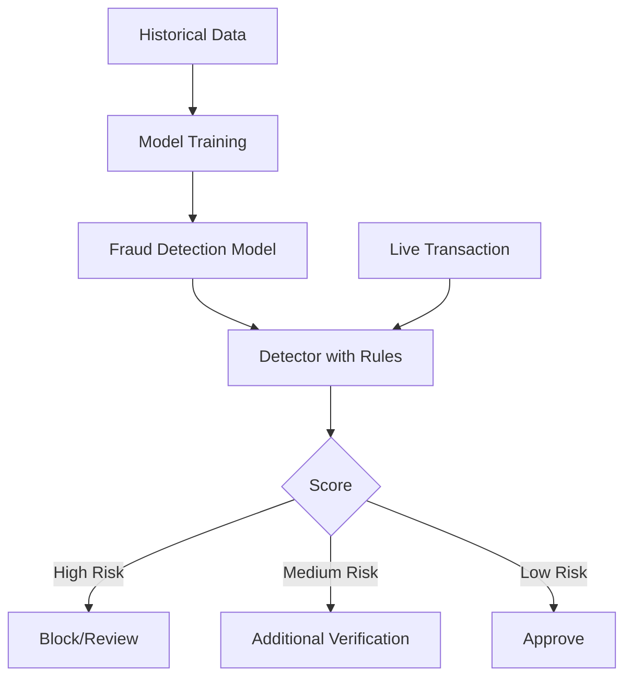

# How to Set Up Amazon Fraud Detector

Author: [nawazdhandala](https://github.com/nawazdhandala)

Tags: AWS, Fraud Detector, Machine Learning, Security

Description: Complete guide to setting up Amazon Fraud Detector for real-time fraud detection, covering event types, model training, detector rules, and integration with your application.

---

Fraud detection is one of those problems that gets harder the more successful your business becomes. More transactions mean more opportunities for fraud, and manual review doesn't scale. You need automated detection that can evaluate transactions in real time and flag suspicious ones without adding friction for legitimate customers.

Amazon Fraud Detector is a managed machine learning service designed specifically for this. You provide historical data about legitimate and fraudulent events, it trains a model, and you get real-time predictions through an API. No ML expertise required - though understanding the concepts helps you get better results.

## How Fraud Detector Works

The workflow has four phases:

1. **Define events**: Describe the events you want to evaluate (transactions, account signups, etc.)
2. **Train a model**: Feed historical data with fraud labels
3. **Create a detector**: Set up rules that use the model's predictions
4. **Get predictions**: Call the API for real-time fraud scoring



## Defining Event Types

Start by defining what an event looks like. For a payment fraud detector, the event is a transaction.

```bash
# Create event variables
aws frauddetector put-event-type \
    --name "online_transaction" \
    --event-variables '[
        {"name": "ip_address"},
        {"name": "email_address"},
        {"name": "billing_address"},
        {"name": "transaction_amount"},
        {"name": "card_bin"},
        {"name": "user_agent"},
        {"name": "transaction_currency"}
    ]' \
    --entity-types '[{"name": "customer"}]' \
    --labels '[{"name": "legitimate"}, {"name": "fraudulent"}]'
```

Before creating the event type, you need to create the variables, entity types, and labels.

```bash
# Create variables
aws frauddetector create-variable \
    --name "ip_address" \
    --data-type "STRING" \
    --data-source "EVENT" \
    --default-value "unknown" \
    --variable-type "IP_ADDRESS"

aws frauddetector create-variable \
    --name "email_address" \
    --data-type "STRING" \
    --data-source "EVENT" \
    --default-value "unknown" \
    --variable-type "EMAIL_ADDRESS"

aws frauddetector create-variable \
    --name "transaction_amount" \
    --data-type "FLOAT" \
    --data-source "EVENT" \
    --default-value "0" \
    --variable-type "NUMERIC"

aws frauddetector create-variable \
    --name "card_bin" \
    --data-type "STRING" \
    --data-source "EVENT" \
    --default-value "unknown" \
    --variable-type "CATEGORICAL"

aws frauddetector create-variable \
    --name "user_agent" \
    --data-type "STRING" \
    --data-source "EVENT" \
    --default-value "unknown" \
    --variable-type "FREE_FORM_TEXT"

# Create entity type
aws frauddetector put-entity-type \
    --name "customer" \
    --description "Customer making a transaction"

# Create labels
aws frauddetector put-label --name "legitimate"
aws frauddetector put-label --name "fraudulent"
```

## Preparing Training Data

Fraud Detector needs historical data with labels. The data should be a CSV file in S3 with at least 10,000 records and at least 500 fraud examples.

```csv
EVENT_TIMESTAMP,ip_address,email_address,transaction_amount,card_bin,user_agent,EVENT_LABEL
2025-01-15T10:30:00Z,192.168.1.1,john@example.com,99.99,411111,Mozilla/5.0 Windows,legitimate
2025-01-15T10:31:00Z,10.0.0.5,bad@fraud.com,5000.00,555555,curl/7.68.0,fraudulent
```

```python
# prepare_training_data.py - Prepare and upload training data
import pandas as pd
import boto3

# Load your historical transaction data
transactions = pd.read_csv('historical_transactions.csv')

# Ensure required columns exist
required_columns = [
    'EVENT_TIMESTAMP', 'ip_address', 'email_address',
    'transaction_amount', 'card_bin', 'user_agent', 'EVENT_LABEL'
]

# Map your existing labels to Fraud Detector format
label_mapping = {
    'approved': 'legitimate',
    'declined_fraud': 'fraudulent',
    'chargeback': 'fraudulent'
}
transactions['EVENT_LABEL'] = transactions['status'].map(label_mapping)

# Filter to only labeled rows
labeled = transactions[transactions['EVENT_LABEL'].notna()]

print(f"Total records: {len(labeled)}")
print(f"Fraudulent: {len(labeled[labeled['EVENT_LABEL'] == 'fraudulent'])}")
print(f"Legitimate: {len(labeled[labeled['EVENT_LABEL'] == 'legitimate'])}")

# Upload to S3
labeled[required_columns].to_csv('training_data.csv', index=False)

s3 = boto3.client('s3')
s3.upload_file('training_data.csv', 'fraud-detector-data', 'training/training_data.csv')
```

## Training a Model

Create a model and train it with your data.

```bash
# Create a model
aws frauddetector create-model \
    --model-id "transaction_fraud_model" \
    --model-type "ONLINE_FRAUD_INSIGHTS" \
    --event-type-name "online_transaction"

# Create a model version (starts training)
aws frauddetector create-model-version \
    --model-id "transaction_fraud_model" \
    --model-type "ONLINE_FRAUD_INSIGHTS" \
    --training-data-source "EXTERNAL_EVENTS" \
    --training-data-schema '{
        "modelVariables": ["ip_address", "email_address", "transaction_amount", "card_bin", "user_agent"],
        "labelSchema": {
            "labelMapper": {
                "FRAUD": ["fraudulent"],
                "LEGIT": ["legitimate"]
            }
        }
    }' \
    --external-events-detail '{
        "dataLocation": "s3://fraud-detector-data/training/training_data.csv",
        "dataAccessRoleArn": "arn:aws:iam::123456789:role/FraudDetectorS3Role"
    }'
```

Training takes a few hours. Check the status.

```bash
# Check model training status
aws frauddetector describe-model-versions \
    --model-id "transaction_fraud_model" \
    --model-type "ONLINE_FRAUD_INSIGHTS"
```

Once training completes, you'll see performance metrics including AUC (Area Under the Curve), precision, and recall at various thresholds.

## Activating the Model

After reviewing the model's performance, activate it.

```bash
# Activate the trained model version
aws frauddetector update-model-version-status \
    --model-id "transaction_fraud_model" \
    --model-type "ONLINE_FRAUD_INSIGHTS" \
    --model-version-number "1.0" \
    --status "ACTIVE"
```

## Creating a Detector

The detector combines the model with rules to produce outcomes.

```bash
# Create a detector
aws frauddetector put-detector \
    --detector-id "transaction_detector" \
    --event-type-name "online_transaction"

# Create outcomes
aws frauddetector put-outcome --name "approve"
aws frauddetector put-outcome --name "review"
aws frauddetector put-outcome --name "block"
```

## Defining Rules

Rules map fraud scores to outcomes. The model produces a score from 0-1000.

```bash
# Rule: Block high-risk transactions (score > 900)
aws frauddetector create-rule \
    --rule-id "block_high_risk" \
    --detector-id "transaction_detector" \
    --expression '$transaction_fraud_model_insightscore > 900' \
    --language "DETECTORPL" \
    --outcomes '["block"]'

# Rule: Review medium-risk transactions (score 500-900)
aws frauddetector create-rule \
    --rule-id "review_medium_risk" \
    --detector-id "transaction_detector" \
    --expression '$transaction_fraud_model_insightscore > 500 and $transaction_fraud_model_insightscore <= 900' \
    --language "DETECTORPL" \
    --outcomes '["review"]'

# Rule: Approve low-risk transactions (score <= 500)
aws frauddetector create-rule \
    --rule-id "approve_low_risk" \
    --detector-id "transaction_detector" \
    --expression '$transaction_fraud_model_insightscore <= 500' \
    --language "DETECTORPL" \
    --outcomes '["approve"]'
```

You can also add rules based on event variables directly.

```bash
# Rule: Block transactions over $10,000 regardless of score
aws frauddetector create-rule \
    --rule-id "block_large_transactions" \
    --detector-id "transaction_detector" \
    --expression '$transaction_amount > 10000' \
    --language "DETECTORPL" \
    --outcomes '["review"]'
```

## Publishing the Detector

Create a detector version with all rules and the model.

```bash
# Create a detector version
aws frauddetector create-detector-version \
    --detector-id "transaction_detector" \
    --rules '[
        {"detectorId": "transaction_detector", "ruleId": "block_large_transactions", "ruleVersion": "1"},
        {"detectorId": "transaction_detector", "ruleId": "block_high_risk", "ruleVersion": "1"},
        {"detectorId": "transaction_detector", "ruleId": "review_medium_risk", "ruleVersion": "1"},
        {"detectorId": "transaction_detector", "ruleId": "approve_low_risk", "ruleVersion": "1"}
    ]' \
    --model-versions '[{
        "modelId": "transaction_fraud_model",
        "modelType": "ONLINE_FRAUD_INSIGHTS",
        "modelVersionNumber": "1.0"
    }]' \
    --rule-execution-mode "FIRST_MATCHED"

# Activate the detector version
aws frauddetector update-detector-version-status \
    --detector-id "transaction_detector" \
    --detector-version-id "1" \
    --status "ACTIVE"
```

The `FIRST_MATCHED` execution mode means rules are evaluated in order, and the first matching rule determines the outcome. Put your most specific rules first.

## Getting Predictions

Now integrate with your application to get real-time fraud predictions.

```python
# fraud_check.py - Real-time fraud detection
import boto3
import uuid
from datetime import datetime

fraud_detector = boto3.client('frauddetector', region_name='us-east-1')

def check_transaction(transaction):
    """Check a transaction for fraud using Amazon Fraud Detector."""
    response = fraud_detector.get_event_prediction(
        detectorId='transaction_detector',
        detectorVersionId='1',
        eventId=str(uuid.uuid4()),
        eventTypeName='online_transaction',
        eventTimestamp=datetime.utcnow().strftime('%Y-%m-%dT%H:%M:%SZ'),
        entities=[{
            'entityType': 'customer',
            'entityId': transaction['customer_id']
        }],
        eventVariables={
            'ip_address': transaction['ip_address'],
            'email_address': transaction['email_address'],
            'transaction_amount': str(transaction['amount']),
            'card_bin': transaction['card_bin'],
            'user_agent': transaction['user_agent']
        }
    )

    # Extract the outcome
    outcomes = [r['outcomes'] for r in response['ruleResults'] if r['outcomes']]
    outcome = outcomes[0][0] if outcomes else 'review'

    # Get the model score
    model_scores = response.get('modelScores', [])
    score = model_scores[0]['scores'].get(
        'transaction_fraud_model_insightscore', 0
    ) if model_scores else 0

    return {
        'outcome': outcome,
        'score': score,
        'event_id': response['eventId']
    }

# Example usage
transaction = {
    'customer_id': 'cust-12345',
    'ip_address': '203.0.113.50',
    'email_address': 'customer@example.com',
    'amount': 149.99,
    'card_bin': '411111',
    'user_agent': 'Mozilla/5.0 (Windows NT 10.0; Win64; x64)'
}

result = check_transaction(transaction)
print(f"Outcome: {result['outcome']}, Score: {result['score']}")

if result['outcome'] == 'approve':
    process_payment(transaction)
elif result['outcome'] == 'review':
    queue_for_manual_review(transaction, result['event_id'])
elif result['outcome'] == 'block':
    decline_transaction(transaction, reason='Fraud risk too high')
```

## Sending Feedback

Improve the model over time by sending feedback about actual fraud outcomes.

```python
# feedback.py - Send fraud outcome feedback
def send_fraud_feedback(event_id, event_timestamp, label):
    """Send feedback to improve the model.

    Args:
        event_id: The event ID from the original prediction
        event_timestamp: When the event occurred
        label: 'fraudulent' or 'legitimate'
    """
    fraud_detector.send_event(
        eventId=event_id,
        eventTypeName='online_transaction',
        eventTimestamp=event_timestamp,
        eventVariables={},  # Already stored from prediction
        entities=[{'entityType': 'customer', 'entityId': 'cust-12345'}],
        assignedLabel=label,
        labelTimestamp=datetime.utcnow().strftime('%Y-%m-%dT%H:%M:%SZ')
    )

# When a chargeback comes in
send_fraud_feedback('evt-abc123', '2026-02-12T10:30:00Z', 'fraudulent')

# When manual review confirms legitimate
send_fraud_feedback('evt-def456', '2026-02-12T11:00:00Z', 'legitimate')
```

## Monitoring and Tuning

Track your detector's performance over time.

```python
# monitor.py - Monitor fraud detector performance
def get_detection_stats(detector_id, days=7):
    """Get detection statistics for the last N days."""
    # Query CloudWatch metrics
    cloudwatch = boto3.client('cloudwatch')

    for metric_name in ['GetEventPrediction', 'SendEvent']:
        response = cloudwatch.get_metric_statistics(
            Namespace='AWS/FraudDetector',
            MetricName=metric_name,
            Dimensions=[{'Name': 'DetectorId', 'Value': detector_id}],
            StartTime=datetime.utcnow() - timedelta(days=days),
            EndTime=datetime.utcnow(),
            Period=86400,
            Statistics=['Sum']
        )
        for dp in sorted(response['Datapoints'], key=lambda x: x['Timestamp']):
            print(f"{dp['Timestamp'].strftime('%Y-%m-%d')}: {metric_name} = {int(dp['Sum'])}")
```

## Wrapping Up

Amazon Fraud Detector removes the ML complexity from fraud detection. Define your events, provide historical data, train a model, and set up rules. The API returns predictions in milliseconds, making it suitable for real-time transaction screening.

The key to good results is good training data. Make sure your labels are accurate, include enough fraud examples (at least 500), and send feedback about actual outcomes to improve the model over time. Start with conservative rules (more false positives, fewer false negatives) and tune the thresholds as you gain confidence in the model's predictions.
