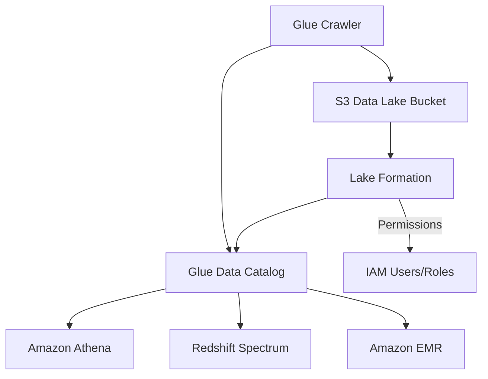

# How to Set Up Amazon Lake Formation for Data Lakes

Author: [nawazdhandala](https://github.com/nawazdhandala)

Tags: AWS, Lake Formation, Data Lake, S3, Analytics

Description: A practical guide to setting up Amazon Lake Formation to build and manage a secure data lake on AWS, from initial configuration to registering data sources and setting permissions.

---

Building a data lake on AWS used to mean stitching together S3 buckets, Glue crawlers, IAM policies, and a lot of custom scripts. Lake Formation wraps all of that into a single service that handles the heavy lifting of data ingestion, cataloging, security, and access management. It doesn't replace S3 or Glue - it sits on top of them and adds a governance layer that makes the whole thing manageable.

This guide takes you from zero to a working Lake Formation setup. We'll register data locations, create a database, set up crawlers, and configure permissions so the right people can access the right data.

## Prerequisites

You'll need an AWS account with admin access (at least initially), an S3 bucket with some data, and the AWS CLI configured. If you're starting fresh, create an S3 bucket for your data lake.

```bash
# Create the data lake bucket
aws s3 mb s3://my-company-data-lake --region us-east-1

# Create folder structure for raw and processed data
aws s3api put-object --bucket my-company-data-lake --key raw/
aws s3api put-object --bucket my-company-data-lake --key processed/
aws s3api put-object --bucket my-company-data-lake --key curated/
```

## Step 1: Configure a Lake Formation Administrator

The first thing you need is a Lake Formation administrator. This is the IAM principal that will manage the data lake - creating databases, setting permissions, and registering locations.

```bash
# Set yourself as the Lake Formation administrator
aws lakeformation put-data-lake-settings \
  --data-lake-settings '{
    "DataLakeAdmins": [
      {
        "DataLakePrincipalIdentifier": "arn:aws:iam::123456789012:user/data-admin"
      }
    ],
    "CreateDatabaseDefaultPermissions": [],
    "CreateTableDefaultPermissions": []
  }'
```

Setting `CreateDatabaseDefaultPermissions` and `CreateTableDefaultPermissions` to empty arrays is important. By default, Lake Formation grants `IAMAllowedPrincipals` access to everything, which effectively bypasses Lake Formation permissions. Clearing these defaults forces all access to go through Lake Formation's permission model.

## Step 2: Create the Service-Linked Role

Lake Formation needs a service-linked role to access your S3 data on your behalf.

```bash
# Create the service-linked role for Lake Formation
aws iam create-service-linked-role --aws-service-name lakeformation.amazonaws.com
```

You also need a role that Lake Formation will use to register and access S3 locations.

```bash
# Create the data lake access role
cat > lf-trust-policy.json << 'EOF'
{
  "Version": "2012-10-17",
  "Statement": [{
    "Effect": "Allow",
    "Principal": {
      "Service": "lakeformation.amazonaws.com"
    },
    "Action": "sts:AssumeRole"
  }]
}
EOF

aws iam create-role \
  --role-name LakeFormationDataAccessRole \
  --assume-role-policy-document file://lf-trust-policy.json

# Grant S3 access to the data lake bucket
cat > lf-s3-policy.json << 'EOF'
{
  "Version": "2012-10-17",
  "Statement": [{
    "Effect": "Allow",
    "Action": [
      "s3:GetObject",
      "s3:PutObject",
      "s3:DeleteObject",
      "s3:ListBucket"
    ],
    "Resource": [
      "arn:aws:s3:::my-company-data-lake",
      "arn:aws:s3:::my-company-data-lake/*"
    ]
  }]
}
EOF

aws iam put-role-policy \
  --role-name LakeFormationDataAccessRole \
  --policy-name S3DataLakeAccess \
  --policy-document file://lf-s3-policy.json
```

## Step 3: Register S3 Locations

Now tell Lake Formation about your S3 locations. Registered locations are managed by Lake Formation's permission model instead of raw IAM policies.

```bash
# Register the data lake S3 location
aws lakeformation register-resource \
  --resource-arn "arn:aws:s3:::my-company-data-lake" \
  --role-arn "arn:aws:iam::123456789012:role/LakeFormationDataAccessRole" \
  --use-service-linked-role

# Verify registration
aws lakeformation list-resources
```

## Step 4: Create a Database in the Data Catalog

Lake Formation uses the AWS Glue Data Catalog under the hood. You create databases in the catalog to organize your tables.

```bash
# Create a database for raw data
aws glue create-database \
  --database-input '{
    "Name": "raw_data",
    "Description": "Raw data ingested from source systems",
    "LocationUri": "s3://my-company-data-lake/raw/"
  }'

# Create a database for processed data
aws glue create-database \
  --database-input '{
    "Name": "processed_data",
    "Description": "Cleaned and transformed data ready for analytics",
    "LocationUri": "s3://my-company-data-lake/processed/"
  }'

# Create a database for curated datasets
aws glue create-database \
  --database-input '{
    "Name": "curated_data",
    "Description": "Business-ready curated datasets",
    "LocationUri": "s3://my-company-data-lake/curated/"
  }'
```

## Step 5: Set Up a Glue Crawler

To populate your catalog with table metadata, set up a Glue crawler that scans your S3 data and infers schemas.

```bash
# Create the crawler role
cat > crawler-trust.json << 'EOF'
{
  "Version": "2012-10-17",
  "Statement": [{
    "Effect": "Allow",
    "Principal": {
      "Service": "glue.amazonaws.com"
    },
    "Action": "sts:AssumeRole"
  }]
}
EOF

aws iam create-role \
  --role-name GlueCrawlerRole \
  --assume-role-policy-document file://crawler-trust.json

aws iam attach-role-policy \
  --role-name GlueCrawlerRole \
  --policy-arn arn:aws:iam::aws:policy/service-role/AWSGlueServiceRole

# Create the crawler
aws glue create-crawler \
  --name raw-data-crawler \
  --role GlueCrawlerRole \
  --database-name raw_data \
  --targets '{
    "S3Targets": [
      {
        "Path": "s3://my-company-data-lake/raw/",
        "Exclusions": ["**.tmp", "**/_temporary/**"]
      }
    ]
  }' \
  --schedule "cron(0 */6 * * ? *)" \
  --schema-change-policy '{
    "UpdateBehavior": "UPDATE_IN_DATABASE",
    "DeleteBehavior": "LOG"
  }'

# Run the crawler manually for the first time
aws glue start-crawler --name raw-data-crawler
```

## Step 6: Upload Sample Data

Let's put some actual data in the lake to work with.

```bash
# Create sample CSV data
cat > /tmp/sales_data.csv << 'EOF'
order_id,customer_id,product,quantity,price,order_date
1001,C100,Widget A,5,29.99,2025-01-15
1002,C101,Widget B,2,49.99,2025-01-16
1003,C100,Widget C,1,99.99,2025-01-16
1004,C102,Widget A,10,29.99,2025-01-17
1005,C103,Widget B,3,49.99,2025-01-18
EOF

# Upload to the raw zone
aws s3 cp /tmp/sales_data.csv s3://my-company-data-lake/raw/sales/sales_data.csv

# Run the crawler to pick up the new data
aws glue start-crawler --name raw-data-crawler
```

After the crawler finishes, you can verify the table was created.

```bash
# Check the discovered tables
aws glue get-tables --database-name raw_data \
  --query 'TableList[].{Name:Name,Columns:StorageDescriptor.Columns[].Name}'
```

## Step 7: Grant Permissions

This is where Lake Formation really shines. Instead of managing complex IAM policies for each user, you grant permissions through Lake Formation's centralized model.

```bash
# Grant an analyst read access to the raw_data database
aws lakeformation grant-permissions \
  --principal '{"DataLakePrincipalIdentifier": "arn:aws:iam::123456789012:user/analyst-jane"}' \
  --resource '{"Database": {"Name": "raw_data"}}' \
  --permissions '["DESCRIBE"]'

# Grant SELECT on all tables in raw_data
aws lakeformation grant-permissions \
  --principal '{"DataLakePrincipalIdentifier": "arn:aws:iam::123456789012:user/analyst-jane"}' \
  --resource '{"Table": {"DatabaseName": "raw_data", "TableWildcard": {}}}' \
  --permissions '["SELECT", "DESCRIBE"]'

# Grant a data engineer full access to processed_data
aws lakeformation grant-permissions \
  --principal '{"DataLakePrincipalIdentifier": "arn:aws:iam::123456789012:role/DataEngineerRole"}' \
  --resource '{"Database": {"Name": "processed_data"}}' \
  --permissions '["ALL"]' \
  --permissions-with-grant-option '["ALL"]'
```

## Step 8: Query Your Data Lake

With everything set up, you can query your data lake using Athena.

```bash
# Run a query against the data lake via Athena
aws athena start-query-execution \
  --query-string "SELECT product, SUM(quantity) as total_qty, SUM(price * quantity) as revenue FROM raw_data.sales GROUP BY product ORDER BY revenue DESC" \
  --result-configuration "OutputLocation=s3://my-company-data-lake/athena-results/" \
  --work-group primary
```

## Architecture Overview

Here's what the final architecture looks like.



## What's Next

Once your data lake is running, you'll want to set up proper monitoring. Lake Formation integrates with CloudTrail for auditing who accessed what data, and you should set up [CloudWatch alarms](https://oneuptime.com/blog/post/set-up-aws-cloudwatch-alarms/view) for crawler failures and Glue job errors. Also look into Lake Formation's tag-based access control for more scalable permission management as your data lake grows - that's covered in our guide on [Lake Formation fine-grained access control](https://oneuptime.com/blog/post/lake-formation-permissions-fine-grained-access-control/view).
