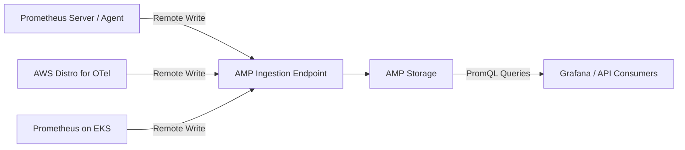

# How to Set Up Amazon Managed Prometheus (AMP)

Author: [nawazdhandala](https://github.com/nawazdhandala)

Tags: AWS, Prometheus, Monitoring, AMP, Metrics, Observability, EKS

Description: Complete guide to setting up Amazon Managed Prometheus for collecting and querying Prometheus metrics at scale without managing servers

---

Prometheus is the standard for metrics collection in the cloud-native world. But running Prometheus at scale is painful. You need to manage storage, handle high availability, deal with compaction, and scale the ingestion pipeline. For a tool that is supposed to monitor your infrastructure, spending time keeping the monitoring system itself alive is ironic.

Amazon Managed Prometheus (AMP) solves this. It is a fully managed, Prometheus-compatible service. You push metrics to it using the standard Prometheus remote write protocol, and query them using PromQL. AWS handles storage, scaling, availability, and security.

This guide walks through setting up AMP from scratch, configuring metric ingestion, and verifying your setup works.

## Architecture Overview



AMP does not scrape your metrics directly. Instead, you run a Prometheus server (or the AWS Distro for OpenTelemetry, or Grafana Agent) that scrapes your targets and then remote-writes the metrics to AMP. AMP stores them and makes them queryable via PromQL.

## Step 1: Create an AMP Workspace

A workspace is the logical container for your metrics. You can create one workspace per environment or per team.

```bash
# Create an AMP workspace
aws amp create-workspace \
  --alias "production-metrics" \
  --tags Environment=production,Team=platform

# Note the workspace ID and endpoints from the output
```

The output includes two important endpoints:

- **Ingestion endpoint**: Where you send metrics via remote write
- **Query endpoint**: Where you send PromQL queries

```bash
# Get workspace details including endpoints
aws amp describe-workspace \
  --workspace-id ws-abc123-def456

# Output includes:
# prometheusEndpoint: https://aps-workspaces.us-east-1.amazonaws.com/workspaces/ws-abc123-def456/
# The remote write URL is: {prometheusEndpoint}api/v1/remote_write
# The query URL is: {prometheusEndpoint}api/v1/query
```

## Step 2: Configure IAM for Metric Ingestion

The service or agent that writes metrics to AMP needs IAM permissions. AMP uses SigV4 (AWS Signature Version 4) for authentication.

```json
{
  "Version": "2012-10-17",
  "Statement": [
    {
      "Sid": "AMPRemoteWrite",
      "Effect": "Allow",
      "Action": [
        "aps:RemoteWrite"
      ],
      "Resource": "arn:aws:aps:us-east-1:123456789012:workspace/ws-abc123-def456"
    }
  ]
}
```

For EKS workloads, use an IAM role for service accounts (IRSA) so your Prometheus pods can authenticate.

```bash
# Create an IAM role for the Prometheus service account in EKS
eksctl create iamserviceaccount \
  --name amp-iamproxy-ingest-service-account \
  --namespace prometheus \
  --cluster my-eks-cluster \
  --attach-policy-arn arn:aws:iam::123456789012:policy/AMPRemoteWritePolicy \
  --approve
```

## Step 3: Set Up Metric Ingestion

You have several options for sending metrics to AMP. Here are the most common approaches.

### Option A: Prometheus Server with Remote Write

If you are already running a Prometheus server, add AMP as a remote write target.

```yaml
# prometheus.yml - Add remote write to AMP
global:
  scrape_interval: 15s
  evaluation_interval: 15s

# Your existing scrape configs stay the same
scrape_configs:
  - job_name: 'kubernetes-pods'
    kubernetes_sd_configs:
      - role: pod
    relabel_configs:
      - source_labels: [__meta_kubernetes_pod_annotation_prometheus_io_scrape]
        action: keep
        regex: true

# Add remote write to AMP
remote_write:
  - url: https://aps-workspaces.us-east-1.amazonaws.com/workspaces/ws-abc123-def456/api/v1/remote_write
    sigv4:
      region: us-east-1
    queue_config:
      max_samples_per_send: 1000
      max_shards: 200
      capacity: 2500
```

The `sigv4` section tells Prometheus to sign requests with AWS credentials. The queue config settings control how aggressively Prometheus sends data. Increase `max_shards` if you have high metric volume.

### Option B: AWS Distro for OpenTelemetry (ADOT)

ADOT is a lightweight collector that can scrape Prometheus metrics and forward them to AMP.

```yaml
# otel-collector-config.yaml
receivers:
  prometheus:
    config:
      scrape_configs:
        - job_name: 'kubernetes-pods'
          kubernetes_sd_configs:
            - role: pod
          relabel_configs:
            - source_labels: [__meta_kubernetes_pod_annotation_prometheus_io_scrape]
              action: keep
              regex: true

exporters:
  prometheusremotewrite:
    endpoint: https://aps-workspaces.us-east-1.amazonaws.com/workspaces/ws-abc123-def456/api/v1/remote_write
    auth:
      authenticator: sigv4auth

extensions:
  sigv4auth:
    region: us-east-1

service:
  extensions: [sigv4auth]
  pipelines:
    metrics:
      receivers: [prometheus]
      exporters: [prometheusremotewrite]
```

Deploy ADOT as a DaemonSet or sidecar in your EKS cluster.

### Option C: Grafana Agent

Grafana Agent is another lightweight option designed specifically for remote writing to Prometheus-compatible backends.

```yaml
# grafana-agent.yaml
metrics:
  global:
    scrape_interval: 15s
    remote_write:
      - url: https://aps-workspaces.us-east-1.amazonaws.com/workspaces/ws-abc123-def456/api/v1/remote_write
        sigv4:
          region: us-east-1
  configs:
    - name: default
      scrape_configs:
        - job_name: 'kubernetes-pods'
          kubernetes_sd_configs:
            - role: pod
```

## Step 4: Deploy to EKS with Helm

The quickest way to get Prometheus running on EKS with AMP remote write is using the Helm chart.

```bash
# Add the Prometheus community Helm repo
helm repo add prometheus-community https://prometheus-community.github.io/helm-charts
helm repo update

# Install Prometheus with remote write to AMP
helm install prometheus prometheus-community/prometheus \
  --namespace prometheus \
  --create-namespace \
  --set serviceAccounts.server.name=amp-iamproxy-ingest-service-account \
  --set serviceAccounts.server.create=false \
  --set server.remoteWrite[0].url=https://aps-workspaces.us-east-1.amazonaws.com/workspaces/ws-abc123-def456/api/v1/remote_write \
  --set server.remoteWrite[0].sigv4.region=us-east-1 \
  --set server.remoteWrite[0].queue_config.max_samples_per_send=1000 \
  --set server.remoteWrite[0].queue_config.max_shards=200 \
  --set server.remoteWrite[0].queue_config.capacity=2500
```

## Step 5: Verify Metrics Are Flowing

Query AMP to confirm metrics are being ingested.

```bash
# Query AMP using awscurl (AWS SigV4-signed curl)
pip install awscurl

# Check if the 'up' metric exists
awscurl --service aps \
  --region us-east-1 \
  "https://aps-workspaces.us-east-1.amazonaws.com/workspaces/ws-abc123-def456/api/v1/query?query=up"
```

If you see results, metrics are flowing into AMP.

You can also verify through Managed Grafana. Connect Grafana to AMP (see [connecting Managed Grafana to Prometheus](https://oneuptime.com/blog/post/connect-amazon-managed-grafana-to-prometheus/view)) and run the same `up` query in the Explore view.

## Step 6: Configure Workspace Settings

### Set Up Recording Rules

Recording rules pre-compute frequently used or expensive queries.

```bash
# Create a rule group namespace
aws amp create-rule-groups-namespace \
  --workspace-id ws-abc123-def456 \
  --name "aggregation-rules" \
  --data "$(cat <<'EOF'
groups:
  - name: cpu_aggregations
    interval: 60s
    rules:
      - record: instance:node_cpu_utilisation:rate5m
        expr: 100 - (avg by (instance) (rate(node_cpu_seconds_total{mode="idle"}[5m])) * 100)

      - record: namespace:container_cpu_usage:sum_rate5m
        expr: sum(rate(container_cpu_usage_seconds_total[5m])) by (namespace)
EOF
)"
```

### Set Up Alerting Rules

Define alert rules that AMP evaluates continuously. See our dedicated guide on [setting up alerting rules in Amazon Managed Prometheus](https://oneuptime.com/blog/post/set-up-alerting-rules-in-amazon-managed-prometheus/view).

## Step 7: Configure Metric Retention

AMP stores metrics for 150 days by default. This is not currently configurable per workspace - all AMP workspaces have the same retention period.

If you need longer retention, consider:
- Archiving metrics to S3 periodically
- Using CloudWatch for long-term metric storage
- Setting up a separate workspace for long-term aggregated metrics

## Cost Considerations

AMP pricing is based on:

- **Metric samples ingested**: Per 10 million samples
- **Metric samples stored**: Per 10 million samples stored per month
- **Metric samples queried**: Per 10 million samples scanned per query

To optimize costs:

1. **Drop unnecessary metrics**: Use relabel configs to drop metrics you do not need.
2. **Increase scrape intervals**: 30s instead of 15s halves your ingestion volume.
3. **Use recording rules**: Pre-compute expensive queries to reduce query costs.
4. **Be selective with labels**: High-cardinality labels (like request IDs) explode metric counts.

```yaml
# Example: Drop high-cardinality metrics before remote write
remote_write:
  - url: https://aps-workspaces.us-east-1.amazonaws.com/workspaces/ws-abc123/api/v1/remote_write
    sigv4:
      region: us-east-1
    write_relabel_configs:
      - source_labels: [__name__]
        regex: 'go_.*'
        action: drop
```

## Wrapping Up

Amazon Managed Prometheus removes the operational burden of running Prometheus while keeping full compatibility with the Prometheus ecosystem. You use the same scrape configs, the same PromQL queries, and the same Grafana dashboards. The setup comes down to three steps: create a workspace, configure remote write from your metric collector, and verify data is flowing. From there, add recording rules, alerting rules, and connect Grafana for visualization. The managed service handles storage, scaling, and availability so you can focus on what matters - understanding your metrics and keeping your applications healthy.
