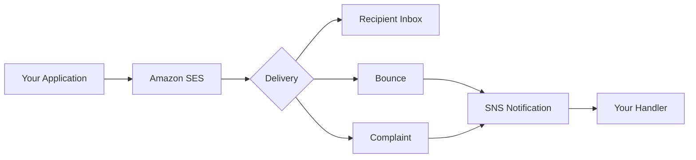

# How to Set Up Amazon SES for Sending Emails

Author: [nawazdhandala](https://github.com/nawazdhandala)

Tags: AWS, SES, Email, Messaging

Description: Get started with Amazon Simple Email Service for sending transactional and marketing emails, covering initial setup, sandbox mode, SMTP configuration, and SDK integration.

---

Sending emails from your application is one of those things that sounds simple until you actually try to do it reliably at scale. Self-hosting an email server means dealing with IP reputation, bounce handling, deliverability tuning, and compliance headaches. Amazon SES takes care of all that infrastructure while charging a fraction of what services like SendGrid or Mailgun cost.

At $0.10 per 1,000 emails (with 62,000 free emails per month if you're sending from EC2), SES is hands-down the most cost-effective way to send email from AWS.

## What SES Can Do

SES isn't just a basic email relay. It supports:
- Transactional emails (order confirmations, password resets)
- Marketing emails (newsletters, promotions)
- Bulk email sending
- Email receiving (though we'll focus on sending here)
- Template-based emails
- Configuration sets for tracking and deliverability



## Step 1: Verify Your Sending Identity

Before you can send emails, you need to verify that you own the email address or domain you're sending from. Let's verify a domain (recommended for production):

```bash
# Verify a domain
aws ses verify-domain-identity \
  --domain "example.com" \
  --region us-east-1

# This returns a verification token - add it as a TXT record
# in your DNS configuration
```

For quick testing, verify a single email address:

```bash
# Verify a single email address
aws ses verify-email-identity \
  --email-address "sender@example.com" \
  --region us-east-1

# Check verification status
aws ses get-identity-verification-attributes \
  --identities "example.com" "sender@example.com" \
  --region us-east-1
```

For detailed domain verification steps, see our guide on [verifying domains in Amazon SES](https://oneuptime.com/blog/post/2026-02-12-verify-domains-amazon-ses/view).

## Step 2: Set Up DKIM

DKIM (DomainKeys Identified Mail) adds a digital signature to your emails, improving deliverability. SES can generate DKIM keys for you:

```bash
# Enable Easy DKIM for your domain
aws ses verify-domain-dkim \
  --domain "example.com" \
  --region us-east-1
```

This returns three CNAME records you need to add to your DNS. For full DKIM setup details, check our [DKIM configuration guide](https://oneuptime.com/blog/post/2026-02-12-configure-dkim-amazon-ses/view).

## Step 3: Send a Test Email via CLI

While still in the SES sandbox, both the sender and recipient must be verified. Send a test:

```bash
# Send a simple test email
aws ses send-email \
  --from "sender@example.com" \
  --destination '{
    "ToAddresses": ["recipient@example.com"]
  }' \
  --message '{
    "Subject": {
      "Data": "Test Email from SES",
      "Charset": "UTF-8"
    },
    "Body": {
      "Text": {
        "Data": "This is a test email sent from Amazon SES.",
        "Charset": "UTF-8"
      },
      "Html": {
        "Data": "<h1>Hello!</h1><p>This is a <strong>test email</strong> from Amazon SES.</p>",
        "Charset": "UTF-8"
      }
    }
  }' \
  --region us-east-1
```

## Step 4: Set Up SMTP Credentials

Many applications and frameworks can send email via SMTP. SES provides SMTP endpoints you can use:

```bash
# Create SMTP credentials (this creates a new IAM user)
aws iam create-user --user-name ses-smtp-user

aws iam attach-user-policy \
  --user-name ses-smtp-user \
  --policy-arn arn:aws:iam::aws:policy/AmazonSESFullAccess

# Create access keys (you'll convert these to SMTP credentials)
aws iam create-access-key --user-name ses-smtp-user
```

The SMTP endpoint for your region is `email-smtp.us-east-1.amazonaws.com` on port 587 (STARTTLS) or 465 (TLS Wrapper). You'll need to convert your IAM access key to SMTP credentials using the algorithm described in the SES documentation.

Here's a quick Python script to generate SMTP password from your secret access key:

```python
# generate_smtp_password.py
import hmac
import hashlib
import base64
import sys

def calculate_smtp_password(secret_key, region="us-east-1"):
    """Convert an IAM secret access key to an SES SMTP password."""
    # SES SMTP credential derivation
    DATE = "11111111"
    SERVICE = "ses"
    MESSAGE = "SendRawEmail"
    TERMINAL = "aws4_request"
    VERSION = 0x04

    signature = hmac.new(
        ("AWS4" + secret_key).encode("utf-8"),
        DATE.encode("utf-8"),
        hashlib.sha256
    ).digest()

    signature = hmac.new(signature, region.encode("utf-8"), hashlib.sha256).digest()
    signature = hmac.new(signature, SERVICE.encode("utf-8"), hashlib.sha256).digest()
    signature = hmac.new(signature, TERMINAL.encode("utf-8"), hashlib.sha256).digest()
    signature = hmac.new(signature, MESSAGE.encode("utf-8"), hashlib.sha256).digest()

    signature_and_version = bytes([VERSION]) + signature
    return base64.b64encode(signature_and_version).decode("utf-8")

if __name__ == "__main__":
    secret_key = sys.argv[1]
    print(calculate_smtp_password(secret_key))
```

## Step 5: Send Email Using the SDK

Here's how to send email programmatically with the AWS SDK:

Using Python (boto3):

```python
# send_email.py
import boto3
from botocore.exceptions import ClientError

def send_email(sender, recipient, subject, body_html, body_text):
    """Send an email using Amazon SES."""
    ses_client = boto3.client('ses', region_name='us-east-1')

    try:
        response = ses_client.send_email(
            Source=sender,
            Destination={
                'ToAddresses': [recipient],
            },
            Message={
                'Subject': {
                    'Data': subject,
                    'Charset': 'UTF-8'
                },
                'Body': {
                    'Text': {
                        'Data': body_text,
                        'Charset': 'UTF-8'
                    },
                    'Html': {
                        'Data': body_html,
                        'Charset': 'UTF-8'
                    }
                }
            },
            # Use a configuration set for tracking
            ConfigurationSetName='my-config-set'
        )
    except ClientError as e:
        print(f"Error: {e.response['Error']['Message']}")
        return None

    print(f"Email sent! Message ID: {response['MessageId']}")
    return response['MessageId']

# Usage
send_email(
    sender='noreply@example.com',
    recipient='user@example.com',
    subject='Your Order Confirmation',
    body_html='<h1>Order Confirmed</h1><p>Your order #12345 has been confirmed.</p>',
    body_text='Order Confirmed - Your order #12345 has been confirmed.'
)
```

Using Node.js:

```javascript
// sendEmail.js
const { SESClient, SendEmailCommand } = require("@aws-sdk/client-ses");

const sesClient = new SESClient({ region: "us-east-1" });

async function sendEmail(sender, recipient, subject, htmlBody, textBody) {
  const params = {
    Source: sender,
    Destination: {
      ToAddresses: [recipient],
    },
    Message: {
      Subject: { Data: subject, Charset: "UTF-8" },
      Body: {
        Html: { Data: htmlBody, Charset: "UTF-8" },
        Text: { Data: textBody, Charset: "UTF-8" },
      },
    },
  };

  try {
    const command = new SendEmailCommand(params);
    const result = await sesClient.send(command);
    console.log(`Email sent: ${result.MessageId}`);
    return result.MessageId;
  } catch (error) {
    console.error(`Failed to send email: ${error.message}`);
    throw error;
  }
}

// Usage
sendEmail(
  "noreply@example.com",
  "user@example.com",
  "Welcome!",
  "<h1>Welcome to our service!</h1>",
  "Welcome to our service!"
);
```

## Step 6: Create a Configuration Set

Configuration sets let you track email events and apply sending rules:

```bash
# Create a configuration set
aws sesv2 create-configuration-set \
  --configuration-set-name "production-email" \
  --delivery-options '{
    "TlsPolicy": "REQUIRE"
  }' \
  --reputation-options '{
    "ReputationMetricsEnabled": true
  }' \
  --sending-options '{
    "SendingEnabled": true
  }'

# Add SNS event destination for bounces and complaints
aws sesv2 create-configuration-set-event-destination \
  --configuration-set-name "production-email" \
  --event-destination-name "bounce-complaints" \
  --event-destination '{
    "Enabled": true,
    "MatchingEventTypes": ["BOUNCE", "COMPLAINT", "REJECT"],
    "SnsDestination": {
      "TopicArn": "arn:aws:sns:us-east-1:123456789012:ses-notifications"
    }
  }'
```

## Step 7: Handle Bounces and Complaints

This is critical for maintaining your sender reputation. Set up an SNS subscription to process bounce and complaint notifications:

```bash
# Create an SNS topic for SES notifications
aws sns create-topic --name ses-notifications

# Subscribe your processing endpoint
aws sns subscribe \
  --topic-arn "arn:aws:sns:us-east-1:123456789012:ses-notifications" \
  --protocol https \
  --notification-endpoint "https://api.example.com/ses-notifications"
```

Never keep sending to addresses that have bounced. Maintaining a suppression list is essential for good deliverability. SES has a built-in account-level suppression list you can enable:

```bash
# Enable account-level suppression list
aws sesv2 put-account-suppression-attributes \
  --suppressed-reasons BOUNCE COMPLAINT
```

## Moving to Production

SES starts in sandbox mode where you can only send to verified addresses. To send to anyone, you need to request production access. See our guide on [moving SES out of the sandbox](https://oneuptime.com/blog/post/2026-02-12-move-amazon-ses-out-of-sandbox/view) for the detailed process.

SES is a reliable, scalable email sending platform that handles the hard parts of email delivery. Get your authentication set up properly (SPF, DKIM, DMARC), handle bounces and complaints promptly, and you'll have a solid email infrastructure at a fraction of the cost of dedicated email services.
