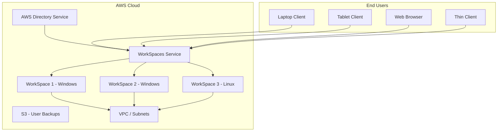

# How to Set Up Amazon WorkSpaces for Virtual Desktop Infrastructure

Author: [nawazdhandala](https://github.com/nawazdhandala)

Tags: AWS, WorkSpaces, VDI, Virtual Desktop, Remote Work, End User Computing

Description: Deploy Amazon WorkSpaces to provide secure virtual desktops for your workforce with persistent storage, Active Directory integration, and flexible billing.

---

Virtual Desktop Infrastructure (VDI) used to mean racking servers, managing hypervisors, and dealing with storage performance issues. Amazon WorkSpaces replaces all of that with fully managed cloud desktops that you can provision in minutes. Each WorkSpace is a persistent Windows or Linux desktop that users access from any device - laptops, tablets, thin clients, or even Chromebooks.

WorkSpaces is particularly valuable for organizations dealing with remote workers, contractors who need temporary access, compliance requirements that mandate data staying in the cloud, or BYOD policies where you do not want corporate data on personal devices.

## Architecture Overview



## Step 1: Set Up Directory Services

WorkSpaces requires a directory for user authentication. You can use AWS Managed Microsoft AD, Simple AD, or connect to your existing on-premises Active Directory.

### Option A: AWS Managed Microsoft AD (Recommended for Production)

```bash
# Create an AWS Managed Microsoft AD directory
aws ds create-microsoft-ad \
  --name "corp.yourcompany.com" \
  --short-name "CORP" \
  --password "DirectoryAdminPassword123!" \
  --edition "Standard" \
  --vpc-settings '{
    "VpcId": "vpc-abc123",
    "SubnetIds": ["subnet-1a", "subnet-1b"]
  }' \
  --tags '[{"Key": "Purpose", "Value": "WorkSpaces"}]'
```

### Option B: Simple AD (for Testing or Small Deployments)

```bash
# Create a Simple AD directory
aws ds create-directory \
  --name "corp.yourcompany.com" \
  --short-name "CORP" \
  --password "DirectoryPassword123!" \
  --size "Small" \
  --vpc-settings '{
    "VpcId": "vpc-abc123",
    "SubnetIds": ["subnet-1a", "subnet-1b"]
  }'
```

Wait for the directory status to become "Active" before proceeding:

```bash
# Check directory status
aws ds describe-directories --directory-ids "d-abc123"
```

## Step 2: Register the Directory with WorkSpaces

```bash
# Register the directory for use with WorkSpaces
aws workspaces register-workspace-directory \
  --directory-id "d-abc123" \
  --subnet-ids "subnet-1a" "subnet-1b" \
  --enable-work-docs \
  --enable-self-service \
  --tenancy "SHARED"
```

The `enable-self-service` flag lets users perform actions like restarting their WorkSpace, increasing volume sizes, and changing compute types without contacting IT.

## Step 3: Create Users in the Directory

If you are using AWS Managed Microsoft AD, create users that will get WorkSpaces:

```bash
# Create a user in the directory
aws ds create-user \
  --directory-id "d-abc123" \
  --user-name "jsmith" \
  --given-name "Jane" \
  --surname "Smith" \
  --email-address "jsmith@yourcompany.com" \
  --password "UserPassword123!"
```

If you are connecting to an existing Active Directory, your existing users are already available.

## Step 4: Launch WorkSpaces

Now provision WorkSpaces for your users:

```bash
# Launch WorkSpaces for users
aws workspaces create-workspaces \
  --workspaces '[
    {
      "DirectoryId": "d-abc123",
      "UserName": "jsmith",
      "BundleId": "wsb-clj85qzj1",
      "WorkspaceProperties": {
        "RunningMode": "AUTO_STOP",
        "RunningModeAutoStopTimeoutInMinutes": 60,
        "RootVolumeSizeGib": 80,
        "UserVolumeSizeGib": 50,
        "ComputeTypeName": "STANDARD"
      },
      "Tags": [
        {"Key": "Department", "Value": "Engineering"},
        {"Key": "CostCenter", "Value": "ENG-001"}
      ]
    },
    {
      "DirectoryId": "d-abc123",
      "UserName": "mjones",
      "BundleId": "wsb-clj85qzj1",
      "WorkspaceProperties": {
        "RunningMode": "AUTO_STOP",
        "RunningModeAutoStopTimeoutInMinutes": 60,
        "RootVolumeSizeGib": 80,
        "UserVolumeSizeGib": 100,
        "ComputeTypeName": "PERFORMANCE"
      },
      "Tags": [
        {"Key": "Department", "Value": "Design"},
        {"Key": "CostCenter", "Value": "DES-001"}
      ]
    }
  ]'
```

Key configuration options:

**BundleId** - determines the OS and pre-installed software. AWS provides standard bundles with Windows 10/11 or Amazon Linux. You can also create custom bundles.

**RunningMode** - either `AUTO_STOP` (stops after idle timeout, pay hourly when running) or `ALWAYS_ON` (always running, flat monthly rate). AUTO_STOP is cheaper for users who do not use their desktop 24/7.

**ComputeTypeName** - ranges from VALUE (1 vCPU, 2 GB RAM) to GRAPHICSPRO (16 vCPU, 122 GB RAM, GPU). Pick based on workload requirements.

## Step 5: Create Custom Bundles

Standard bundles work for basic use cases, but most organizations need custom bundles with their software pre-installed:

```bash
# First, launch a WorkSpace with a standard bundle
# Install your software, configure settings
# Then create a custom bundle from it

# Create a WorkSpace image from an existing WorkSpace
aws workspaces create-workspace-image \
  --name "Engineering-Desktop-v1" \
  --description "Standard engineering desktop with IDE, tools, and VPN client" \
  --workspace-id "ws-abc123" \
  --tags '[{"Key": "Version", "Value": "1.0"}]'

# Create a custom bundle from the image
aws workspaces create-workspace-bundle \
  --bundle-name "Engineering Desktop" \
  --bundle-description "Custom bundle for engineering team" \
  --image-id "wsi-abc123" \
  --compute-type '{"Name": "STANDARD"}' \
  --user-storage '{"Capacity": "50"}' \
  --root-storage '{"Capacity": "80"}'
```

## Step 6: Configure Access Control

Control who can access WorkSpaces and from where:

```bash
# Set IP access control groups (IP allowlisting)
aws workspaces create-ip-group \
  --group-name "OfficeNetwork" \
  --group-desc "Allow access from office IP ranges" \
  --user-rules '[
    {"ipRule": "203.0.113.0/24", "ruleDesc": "Main office"},
    {"ipRule": "198.51.100.0/24", "ruleDesc": "Branch office"}
  ]'

# Associate the IP group with your directory
aws workspaces associate-ip-groups \
  --directory-id "d-abc123" \
  --group-ids '["wsipg-abc123"]'
```

For more granular control, configure the directory access settings:

```bash
# Update workspace access properties
aws workspaces modify-workspace-access-properties \
  --resource-id "d-abc123" \
  --workspace-access-properties '{
    "DeviceTypeWindows": "ALLOW",
    "DeviceTypeOsx": "ALLOW",
    "DeviceTypeWeb": "ALLOW",
    "DeviceTypeIos": "ALLOW",
    "DeviceTypeAndroid": "DENY",
    "DeviceTypeChromeOs": "ALLOW",
    "DeviceTypeZeroClient": "ALLOW",
    "DeviceTypeLinux": "ALLOW"
  }'
```

## Step 7: Set Up Monitoring

Monitor your WorkSpaces fleet with CloudWatch:

```bash
# Key WorkSpaces CloudWatch metrics to monitor:
# - ConnectionAttempt - tracks login attempts
# - ConnectionSuccess - successful connections
# - ConnectionFailure - failed connections
# - SessionLaunchTime - how long it takes to start a session
# - InSessionLatency - network latency during sessions
# - SessionDisconnect - disconnection events

# Create an alarm for high connection failures
aws cloudwatch put-metric-alarm \
  --alarm-name "WorkSpaces-ConnectionFailures" \
  --alarm-description "High rate of WorkSpaces connection failures" \
  --namespace "AWS/WorkSpaces" \
  --metric-name "ConnectionFailure" \
  --statistic "Sum" \
  --period 300 \
  --threshold 10 \
  --comparison-operator "GreaterThanThreshold" \
  --evaluation-periods 2 \
  --alarm-actions "arn:aws:sns:us-east-1:123456789012:ITAlerts"
```

## Managing WorkSpaces at Scale

For large deployments, automate lifecycle management:

```bash
# List all WorkSpaces with their status
aws workspaces describe-workspaces \
  --directory-id "d-abc123"

# Modify a running WorkSpace (change compute type)
aws workspaces modify-workspace-properties \
  --workspace-id "ws-abc123" \
  --workspace-properties '{
    "ComputeTypeName": "PERFORMANCE",
    "RunningMode": "AUTO_STOP",
    "RunningModeAutoStopTimeoutInMinutes": 120
  }'

# Rebuild a WorkSpace (resets to bundle state, preserves user data)
aws workspaces rebuild-workspaces \
  --rebuild-workspace-requests '[{"WorkspaceId": "ws-abc123"}]'

# Terminate WorkSpaces for departed employees
aws workspaces terminate-workspaces \
  --terminate-workspace-requests '[{"WorkspaceId": "ws-abc123"}]'
```

## Cost Optimization

WorkSpaces pricing varies significantly based on your choices:

**AUTO_STOP vs ALWAYS_ON** - For users who work standard hours (8-10 hours/day), AUTO_STOP is significantly cheaper. ALWAYS_ON only makes sense for 24/7 usage or shift workers who use the desktop around the clock.

**Right-size compute types** - Start users on VALUE or STANDARD and upgrade only when performance data shows they need more. The self-service option lets users request upgrades themselves.

**Terminate unused WorkSpaces** - Set up automation to identify WorkSpaces that have not been used in 30+ days and alert the admin or automatically terminate them.

```bash
# Find WorkSpaces that have not connected recently
aws workspaces describe-workspaces-connection-status \
  --workspace-ids "ws-abc123" "ws-def456"
```

## Wrapping Up

Amazon WorkSpaces gives you enterprise VDI without the infrastructure headaches. The managed service handles patching, scaling, and availability. Your users get persistent desktops they can access from anywhere, and IT retains control over data, software, and access policies. Start with a small pilot for one team, validate the user experience and costs, then expand across the organization.
