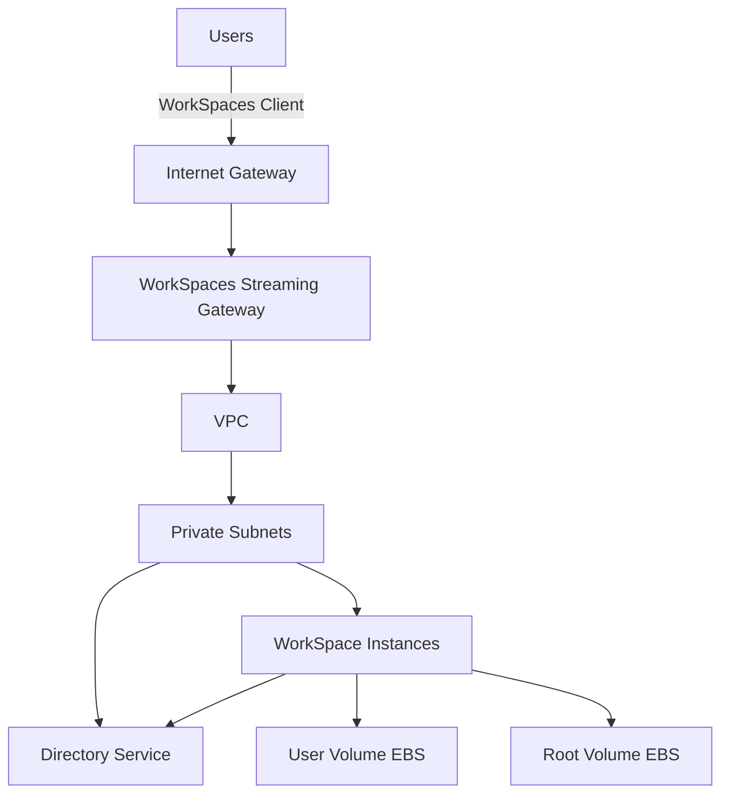

# How to Set Up Amazon WorkSpaces for Virtual Desktops

Author: [nawazdhandala](https://github.com/nawazdhandala)

Tags: AWS, WorkSpaces, Virtual Desktop, Remote Work

Description: Complete guide to setting up Amazon WorkSpaces for virtual desktop infrastructure, covering directory setup, workspace bundles, networking, and user management.

---

Virtual desktops aren't new, but managing them used to mean running Citrix or VMware farms on-premises - racks of servers, licensing nightmares, and a full-time team to keep it all running. Amazon WorkSpaces replaces all of that with a managed service. You provision desktops, assign them to users, and AWS handles the infrastructure.

Whether you're setting up remote access for a team of 10 or a fleet of 10,000, the process is the same. This guide walks through everything from initial directory setup to a fully operational WorkSpaces deployment.

## Architecture Overview

WorkSpaces requires a few foundational components:

- **Directory**: AWS Directory Service (Simple AD or Microsoft AD) for user management
- **VPC**: Network infrastructure for the WorkSpaces
- **Bundles**: Pre-configured hardware and software combinations
- **WorkSpaces**: The actual virtual desktops assigned to users



## Setting Up the Directory

WorkSpaces needs a directory service for user authentication. If you have an existing Active Directory, you can use AD Connector. Otherwise, create a new directory.

### Simple AD (for smaller deployments)

```bash
# Create a Simple AD directory
aws ds create-directory \
    --name "corp.example.com" \
    --short-name "CORP" \
    --password "DirectoryAdminPassword123!" \
    --size "Small" \
    --vpc-settings '{
        "VpcId": "vpc-abc123",
        "SubnetIds": ["subnet-111", "subnet-222"]
    }'
```

### Microsoft AD (for production)

```bash
# Create a Managed Microsoft AD
aws ds create-microsoft-ad \
    --name "corp.example.com" \
    --short-name "CORP" \
    --password "DirectoryAdminPassword123!" \
    --edition "Standard" \
    --vpc-settings '{
        "VpcId": "vpc-abc123",
        "SubnetIds": ["subnet-111", "subnet-222"]
    }'
```

Wait for the directory to become Active (usually 20-30 minutes).

```bash
# Check directory status
aws ds describe-directories --directory-ids d-abc123
```

## Registering the Directory with WorkSpaces

Before creating WorkSpaces, register the directory.

```bash
# Register directory for use with WorkSpaces
aws workspaces register-workspace-directory \
    --directory-id d-abc123 \
    --subnet-ids subnet-111 subnet-222 \
    --enable-work-docs \
    --enable-self-service \
    --tenancy SHARED
```

The `--enable-self-service` flag lets users perform tasks like restarting their WorkSpace and changing volume sizes without admin help. It's a good idea for most deployments.

## Choosing a Bundle

Bundles define the hardware specs and operating system for the WorkSpace. AWS provides several standard bundles.

```bash
# List available bundles
aws workspaces describe-workspace-bundles --owner AMAZON

# Common bundles:
# Value     - 1 vCPU, 2 GB RAM   - Light office work
# Standard  - 2 vCPU, 4 GB RAM   - General purpose
# Performance - 2 vCPU, 8 GB RAM - Power users
# Power     - 4 vCPU, 16 GB RAM  - Developers, data analysis
# PowerPro  - 8 vCPU, 32 GB RAM  - Graphics, engineering
```

You can also create custom bundles from an existing WorkSpace.

```bash
# Create a custom image from an existing WorkSpace
aws workspaces create-workspace-image \
    --name "CustomDevImage" \
    --description "Development environment with pre-installed tools" \
    --workspace-id ws-abc123

# Create a bundle from the custom image
aws workspaces create-workspace-bundle \
    --bundle-name "DevBundle" \
    --bundle-description "Developer WorkSpace with standard tools" \
    --image-id wsi-abc123 \
    --compute-type '{"Name": "POWER"}' \
    --user-storage '{"Capacity": "100"}' \
    --root-storage '{"Capacity": "80"}'
```

## Creating WorkSpaces

Now create WorkSpaces for your users.

```bash
# Create a single WorkSpace
aws workspaces create-workspaces \
    --workspaces '[{
        "DirectoryId": "d-abc123",
        "UserName": "john.doe",
        "BundleId": "wsb-abc123",
        "WorkspaceProperties": {
            "RunningMode": "AUTO_STOP",
            "RunningModeAutoStopTimeoutInMinutes": 60,
            "RootVolumeSizeGib": 80,
            "UserVolumeSizeGib": 50,
            "ComputeTypeName": "STANDARD"
        },
        "Tags": [
            {"Key": "Department", "Value": "Engineering"},
            {"Key": "CostCenter", "Value": "ENG-001"}
        ]
    }]'
```

For bulk provisioning, create multiple WorkSpaces at once.

```python
# bulk_provision.py - Provision WorkSpaces for a list of users
import boto3
import json

workspaces = boto3.client('workspaces', region_name='us-east-1')

users = [
    {"username": "john.doe", "department": "Engineering"},
    {"username": "jane.smith", "department": "Design"},
    {"username": "bob.jones", "department": "Engineering"},
    # Add more users...
]

DIRECTORY_ID = "d-abc123"
BUNDLE_ID = "wsb-abc123"

# WorkSpaces API accepts up to 25 workspaces per call
batch_size = 25
for i in range(0, len(users), batch_size):
    batch = users[i:i + batch_size]

    workspace_requests = []
    for user in batch:
        workspace_requests.append({
            "DirectoryId": DIRECTORY_ID,
            "UserName": user["username"],
            "BundleId": BUNDLE_ID,
            "WorkspaceProperties": {
                "RunningMode": "AUTO_STOP",
                "RunningModeAutoStopTimeoutInMinutes": 60,
                "RootVolumeSizeGib": 80,
                "UserVolumeSizeGib": 50,
                "ComputeTypeName": "STANDARD"
            },
            "Tags": [
                {"Key": "Department", "Value": user["department"]}
            ]
        })

    response = workspaces.create_workspaces(Workspaces=workspace_requests)

    # Check for failures
    for failed in response.get("FailedRequests", []):
        print(f"Failed: {failed['WorkspaceRequest']['UserName']} - {failed['ErrorMessage']}")

    successful = len(workspace_requests) - len(response.get("FailedRequests", []))
    print(f"Created {successful} WorkSpaces in batch {i // batch_size + 1}")
```

## Running Modes

WorkSpaces offers two running modes that significantly affect cost:

**AlwaysOn**: The WorkSpace runs 24/7. You pay a fixed monthly rate. Best for users who work 8+ hours per day.

**AutoStop**: The WorkSpace automatically stops after a period of inactivity and restarts when the user reconnects. You pay an hourly rate. Best for part-time or occasional users.

```bash
# Switch a WorkSpace to AlwaysOn
aws workspaces modify-workspace-properties \
    --workspace-id ws-abc123 \
    --workspace-properties '{"RunningMode": "ALWAYS_ON"}'

# Switch to AutoStop with 60-minute timeout
aws workspaces modify-workspace-properties \
    --workspace-id ws-abc123 \
    --workspace-properties '{
        "RunningMode": "AUTO_STOP",
        "RunningModeAutoStopTimeoutInMinutes": 60
    }'
```

The break-even point is roughly 80 hours per month. If a user exceeds that, AlwaysOn is cheaper.

## Network Configuration

WorkSpaces need outbound internet access for updates and the streaming protocol. Configure your VPC accordingly.

```bash
# Create a NAT Gateway for internet access (if WorkSpaces are in private subnets)
aws ec2 create-nat-gateway \
    --subnet-id subnet-public-111 \
    --allocation-id eipalloc-abc123

# Update route table for private subnets
aws ec2 create-route \
    --route-table-id rtb-abc123 \
    --destination-cidr-block 0.0.0.0/0 \
    --nat-gateway-id nat-abc123
```

WorkSpaces also need access to specific AWS endpoints. If you're using security groups, allow outbound traffic on these ports:

- TCP 443 (HTTPS) - Management and registration
- TCP/UDP 4172 (PCoIP) - Desktop streaming protocol
- TCP/UDP 4195 (WSP) - WorkSpaces Streaming Protocol
- UDP 4172 - PCoIP streaming gateway

## IP Access Control Groups

Restrict which IP addresses can connect to WorkSpaces.

```bash
# Create an IP access control group
aws workspaces create-ip-group \
    --group-name "OfficeNetworks" \
    --group-desc "Allow connections from office IPs only" \
    --user-rules '[
        {"ipRule": "203.0.113.0/24", "ruleDesc": "Main office"},
        {"ipRule": "198.51.100.0/24", "ruleDesc": "Branch office"}
    ]'

# Associate the group with your directory
aws workspaces associate-ip-groups \
    --directory-id d-abc123 \
    --group-ids wsipg-abc123
```

## Managing WorkSpaces

Day-to-day management tasks.

```bash
# Reboot a WorkSpace
aws workspaces reboot-workspaces --reboot-workspace-requests WorkspaceId=ws-abc123

# Rebuild a WorkSpace (resets to bundle image, preserves user volume)
aws workspaces rebuild-workspaces --rebuild-workspace-requests WorkspaceId=ws-abc123

# Terminate a WorkSpace
aws workspaces terminate-workspaces --terminate-workspace-requests WorkspaceId=ws-abc123

# List all WorkSpaces
aws workspaces describe-workspaces --directory-id d-abc123
```

## Monitoring

Monitor your WorkSpaces fleet with CloudWatch.

```bash
# Get connection metrics
aws cloudwatch get-metric-statistics \
    --namespace "AWS/WorkSpaces" \
    --metric-name "Available" \
    --dimensions Name=DirectoryId,Value=d-abc123 \
    --start-time 2026-02-11T00:00:00Z \
    --end-time 2026-02-12T00:00:00Z \
    --period 3600 \
    --statistics Average
```

Key metrics to watch:

- **Available**: Number of WorkSpaces in a healthy state
- **Unhealthy**: WorkSpaces that have failed health checks
- **ConnectionAttempt**: Login attempts
- **ConnectionSuccess**: Successful connections
- **UserConnected**: Currently connected users

For comprehensive monitoring beyond CloudWatch, consider setting up [application monitoring with OneUptime](https://oneuptime.com/blog/post/2026-02-12-set-up-aws-resilience-hub-for-application-resilience/view) to track availability and performance across your entire virtual desktop fleet.

## Wrapping Up

Amazon WorkSpaces eliminates the operational burden of virtual desktop infrastructure. The initial setup - directory, networking, bundles - takes a few hours. After that, provisioning new desktops is a single API call. The key decisions are choosing the right bundle size for your users, picking the right running mode for cost optimization, and locking down network access with IP control groups.

For more on configuring WorkSpaces for distributed teams, see our guide on [configuring WorkSpaces for remote teams](https://oneuptime.com/blog/post/2026-02-12-configure-workspaces-for-remote-teams/view).
