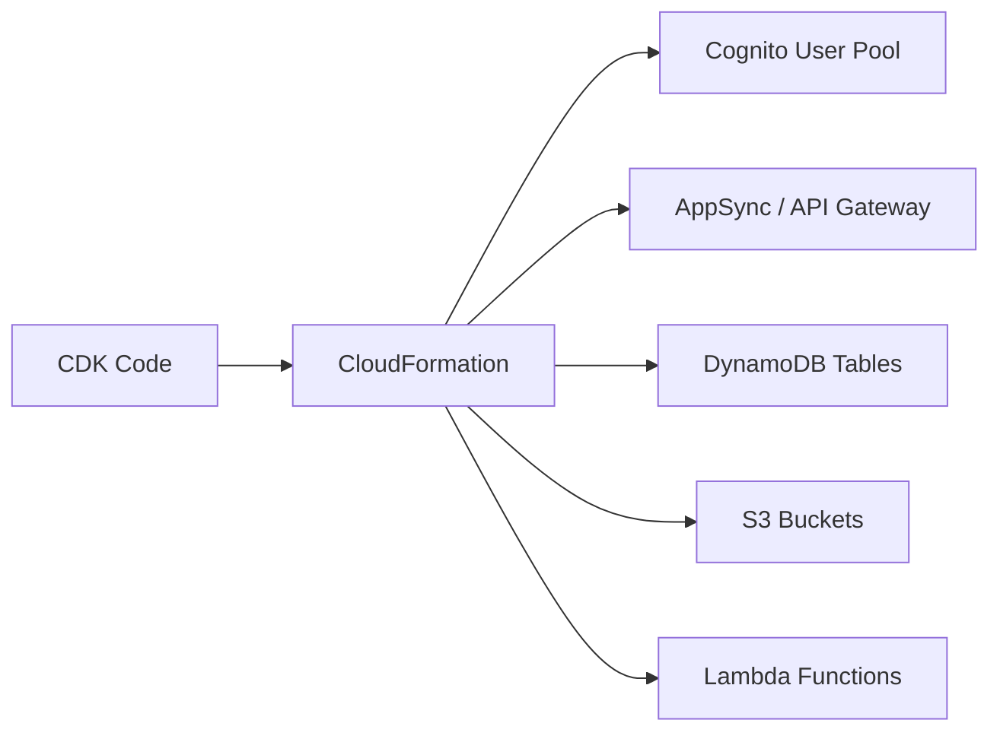

# How to Set Up Amplify Backend with CDK

Author: [nawazdhandala](https://github.com/nawazdhandala)

Tags: AWS, Amplify, CDK, Backend, Infrastructure as Code, Serverless

Description: Configure an AWS Amplify backend using CDK for full infrastructure-as-code control over your serverless application resources.

---

AWS Amplify is great for quickly spinning up backends with authentication, APIs, and storage. But the Amplify CLI abstracts away a lot of infrastructure details, and when you need fine-grained control or want to integrate with your existing CDK infrastructure, you hit limitations. The solution is to use CDK to define your Amplify backend resources directly.

With Amplify Gen 2 and CDK, you get the best of both worlds: the developer experience of Amplify's libraries on the frontend and the full power of CDK on the backend. This guide walks through setting up an Amplify backend with CDK from scratch.

## Why CDK Instead of the Amplify CLI

The Amplify CLI uses a configuration-driven approach that works well for standard use cases. But CDK gives you:

- Full control over every resource property
- Integration with existing CDK stacks and constructs
- Better support for custom pipelines and deployment workflows
- Easier code review since infrastructure changes are in TypeScript, not JSON config files
- Access to the entire AWS service catalog, not just what Amplify supports



## Prerequisites

- Node.js 18 or later
- AWS CDK v2 installed (`npm install -g aws-cdk`)
- An AWS account with admin access
- Basic familiarity with CDK constructs

## Step 1: Initialize the CDK Project

```bash
# Create a new CDK project
mkdir my-amplify-backend && cd my-amplify-backend
cdk init app --language typescript

# Install Amplify-related CDK packages
npm install @aws-cdk/aws-cognito @aws-cdk/aws-appsync @aws-cdk/aws-dynamodb @aws-cdk/aws-lambda @aws-cdk/aws-s3 aws-cdk-lib constructs
```

## Step 2: Define the Authentication Stack

Most Amplify apps start with authentication. Create a Cognito User Pool with the same features Amplify provides.

```typescript
// lib/auth-stack.ts
import * as cdk from 'aws-cdk-lib';
import * as cognito from 'aws-cdk-lib/aws-cognito';
import { Construct } from 'constructs';

export class AuthStack extends cdk.Stack {
  public readonly userPool: cognito.UserPool;
  public readonly userPoolClient: cognito.UserPoolClient;

  constructor(scope: Construct, id: string, props?: cdk.StackProps) {
    super(scope, id, props);

    // Create the User Pool with email sign-in
    this.userPool = new cognito.UserPool(this, 'AppUserPool', {
      userPoolName: 'my-app-user-pool',
      selfSignUpEnabled: true,
      signInAliases: {
        email: true,
      },
      autoVerify: {
        email: true,
      },
      standardAttributes: {
        email: {
          required: true,
          mutable: true,
        },
        fullname: {
          required: false,
          mutable: true,
        },
      },
      passwordPolicy: {
        minLength: 8,
        requireLowercase: true,
        requireUppercase: true,
        requireDigits: true,
        requireSymbols: false,
      },
      accountRecovery: cognito.AccountRecovery.EMAIL_ONLY,
      removalPolicy: cdk.RemovalPolicy.RETAIN,
    });

    // Create the app client
    this.userPoolClient = this.userPool.addClient('AppClient', {
      authFlows: {
        userSrp: true,
        userPassword: true,
      },
      oAuth: {
        flows: {
          authorizationCodeGrant: true,
        },
        scopes: [cognito.OAuthScope.EMAIL, cognito.OAuthScope.OPENID],
        callbackUrls: ['http://localhost:3000/'],
        logoutUrls: ['http://localhost:3000/'],
      },
    });

    // Create an Identity Pool for AWS credentials
    const identityPool = new cognito.CfnIdentityPool(this, 'AppIdentityPool', {
      identityPoolName: 'my-app-identity-pool',
      allowUnauthenticatedIdentities: false,
      cognitoIdentityProviders: [
        {
          clientId: this.userPoolClient.userPoolClientId,
          providerName: this.userPool.userPoolProviderName,
        },
      ],
    });

    // Output the IDs for frontend configuration
    new cdk.CfnOutput(this, 'UserPoolId', {
      value: this.userPool.userPoolId,
    });
    new cdk.CfnOutput(this, 'UserPoolClientId', {
      value: this.userPoolClient.userPoolClientId,
    });
    new cdk.CfnOutput(this, 'IdentityPoolId', {
      value: identityPool.ref,
    });
  }
}
```

## Step 3: Define the API Stack

Create a GraphQL API with AppSync, similar to what Amplify's `@model` directive gives you.

```typescript
// lib/api-stack.ts
import * as cdk from 'aws-cdk-lib';
import * as appsync from 'aws-cdk-lib/aws-appsync';
import * as dynamodb from 'aws-cdk-lib/aws-dynamodb';
import * as cognito from 'aws-cdk-lib/aws-cognito';
import { Construct } from 'constructs';

interface ApiStackProps extends cdk.StackProps {
  userPool: cognito.UserPool;
}

export class ApiStack extends cdk.Stack {
  constructor(scope: Construct, id: string, props: ApiStackProps) {
    super(scope, id, props);

    // Create the AppSync API
    const api = new appsync.GraphqlApi(this, 'AppApi', {
      name: 'my-app-api',
      schema: appsync.SchemaFile.fromAsset('graphql/schema.graphql'),
      authorizationConfig: {
        defaultAuthorization: {
          authorizationType: appsync.AuthorizationType.USER_POOL,
          userPoolConfig: {
            userPool: props.userPool,
          },
        },
        additionalAuthorizationModes: [
          {
            authorizationType: appsync.AuthorizationType.IAM,
          },
        ],
      },
    });

    // Create a DynamoDB table for the Todo model
    const todoTable = new dynamodb.Table(this, 'TodoTable', {
      tableName: 'Todo',
      partitionKey: { name: 'id', type: dynamodb.AttributeType.STRING },
      sortKey: { name: 'createdAt', type: dynamodb.AttributeType.STRING },
      billingMode: dynamodb.BillingMode.PAY_PER_REQUEST,
      removalPolicy: cdk.RemovalPolicy.DESTROY,
    });

    // Add a GSI for listing todos by owner
    todoTable.addGlobalSecondaryIndex({
      indexName: 'byOwner',
      partitionKey: { name: 'owner', type: dynamodb.AttributeType.STRING },
      sortKey: { name: 'createdAt', type: dynamodb.AttributeType.STRING },
    });

    // Connect AppSync to DynamoDB
    const todoDataSource = api.addDynamoDbDataSource('TodoDataSource', todoTable);

    // Create resolver for getTodo query
    todoDataSource.createResolver('GetTodoResolver', {
      typeName: 'Query',
      fieldName: 'getTodo',
      requestMappingTemplate: appsync.MappingTemplate.dynamoDbGetItem('id', 'id'),
      responseMappingTemplate: appsync.MappingTemplate.dynamoDbResultItem(),
    });

    // Output the API URL and key
    new cdk.CfnOutput(this, 'GraphQLEndpoint', {
      value: api.graphqlUrl,
    });
  }
}
```

## Step 4: Define the Storage Stack

Add S3 storage for file uploads, with proper access controls.

```typescript
// lib/storage-stack.ts
import * as cdk from 'aws-cdk-lib';
import * as s3 from 'aws-cdk-lib/aws-s3';
import * as iam from 'aws-cdk-lib/aws-iam';
import { Construct } from 'constructs';

export class StorageStack extends cdk.Stack {
  public readonly bucket: s3.Bucket;

  constructor(scope: Construct, id: string, props?: cdk.StackProps) {
    super(scope, id, props);

    // Create the S3 bucket for user uploads
    this.bucket = new s3.Bucket(this, 'UserUploadsBucket', {
      bucketName: `my-app-uploads-${cdk.Aws.ACCOUNT_ID}`,
      cors: [
        {
          allowedHeaders: ['*'],
          allowedMethods: [
            s3.HttpMethods.GET,
            s3.HttpMethods.PUT,
            s3.HttpMethods.POST,
            s3.HttpMethods.DELETE,
          ],
          allowedOrigins: ['http://localhost:3000'],
          exposedHeaders: ['ETag'],
        },
      ],
      blockPublicAccess: s3.BlockPublicAccess.BLOCK_ALL,
      encryption: s3.BucketEncryption.S3_MANAGED,
      removalPolicy: cdk.RemovalPolicy.DESTROY,
      autoDeleteObjects: true,
    });

    new cdk.CfnOutput(this, 'BucketName', {
      value: this.bucket.bucketName,
    });
  }
}
```

## Step 5: Wire Everything Together

Connect all the stacks in your CDK app entry point.

```typescript
// bin/my-amplify-backend.ts
import * as cdk from 'aws-cdk-lib';
import { AuthStack } from '../lib/auth-stack';
import { ApiStack } from '../lib/api-stack';
import { StorageStack } from '../lib/storage-stack';

const app = new cdk.App();

const env = {
  account: process.env.CDK_DEFAULT_ACCOUNT,
  region: process.env.CDK_DEFAULT_REGION || 'us-east-1',
};

// Deploy authentication first
const authStack = new AuthStack(app, 'AuthStack', { env });

// API depends on auth for user pool authorization
const apiStack = new ApiStack(app, 'ApiStack', {
  env,
  userPool: authStack.userPool,
});

// Storage is independent
const storageStack = new StorageStack(app, 'StorageStack', { env });
```

## Step 6: Create the GraphQL Schema

```graphql
# graphql/schema.graphql
type Todo {
  id: ID!
  title: String!
  description: String
  completed: Boolean!
  owner: String!
  createdAt: AWSDateTime!
  updatedAt: AWSDateTime
}

type Query {
  getTodo(id: ID!): Todo
  listTodos(owner: String!, limit: Int, nextToken: String): TodoConnection
}

type Mutation {
  createTodo(input: CreateTodoInput!): Todo
  updateTodo(input: UpdateTodoInput!): Todo
  deleteTodo(id: ID!): Todo
}

input CreateTodoInput {
  title: String!
  description: String
}

input UpdateTodoInput {
  id: ID!
  title: String
  description: String
  completed: Boolean
}

type TodoConnection {
  items: [Todo]
  nextToken: String
}
```

## Step 7: Deploy and Configure the Frontend

```bash
# Deploy all stacks
cdk deploy --all

# The outputs will show your resource IDs
# Use these to configure the Amplify frontend library
```

Configure the Amplify JavaScript library in your frontend:

```typescript
// src/amplify-config.ts
import { Amplify } from 'aws-amplify';

// Use the CDK stack outputs to configure Amplify
Amplify.configure({
  Auth: {
    Cognito: {
      userPoolId: 'us-east-1_XXXXX',      // From AuthStack output
      userPoolClientId: 'xxxxx',            // From AuthStack output
      identityPoolId: 'us-east-1:xxx-xxx',  // From AuthStack output
    },
  },
  API: {
    GraphQL: {
      endpoint: 'https://xxx.appsync-api.us-east-1.amazonaws.com/graphql',
      defaultAuthMode: 'userPool',
    },
  },
  Storage: {
    S3: {
      bucket: 'my-app-uploads-123456789012',
      region: 'us-east-1',
    },
  },
});
```

## Adding Lambda Functions

When you need server-side logic beyond what AppSync resolvers provide, add Lambda functions:

```typescript
// lib/functions-stack.ts
import * as cdk from 'aws-cdk-lib';
import * as lambda from 'aws-cdk-lib/aws-lambda';
import * as nodejs from 'aws-cdk-lib/aws-lambda-nodejs';
import { Construct } from 'constructs';

export class FunctionsStack extends cdk.Stack {
  constructor(scope: Construct, id: string, props?: cdk.StackProps) {
    super(scope, id, props);

    // Create a Lambda function with bundled TypeScript
    const processOrderFn = new nodejs.NodejsFunction(this, 'ProcessOrder', {
      runtime: lambda.Runtime.NODEJS_20_X,
      entry: 'functions/process-order/index.ts',
      handler: 'handler',
      timeout: cdk.Duration.seconds(30),
      memorySize: 256,
      environment: {
        TABLE_NAME: 'Orders',
      },
    });
  }
}
```

## Best Practices

**Use outputs for frontend configuration**: Every resource ID your frontend needs should be a CDK output. This makes it easy to automate the configuration.

**Separate stacks by domain**: Auth, API, storage, and functions should be separate stacks. This lets you deploy them independently and keeps the blast radius small.

**Use environment variables for configuration**: Do not hardcode values. Use CDK context or environment variables for things like allowed origins and feature flags.

**Pin CDK versions**: CDK moves fast. Pin your CDK library version in package.json to avoid surprise breaking changes.

## Wrapping Up

Using CDK for your Amplify backend gives you infrastructure-as-code without sacrificing the developer experience of Amplify's client libraries. You get full control over every resource, easy integration with existing infrastructure, and a familiar TypeScript development experience. For setting up CI/CD for this kind of project, check out our guide on [Amplify custom pipelines](https://oneuptime.com/blog/post/2026-02-12-set-up-amplify-custom-pipelines/view).
