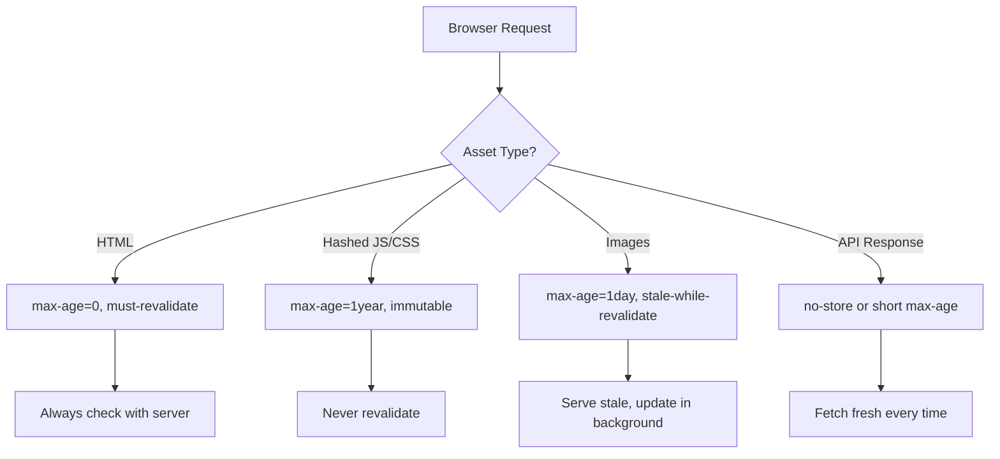

# How to Set Up Amplify Custom Headers and Cache Control

Author: [nawazdhandala](https://github.com/nawazdhandala)

Tags: AWS, Amplify, HTTP Headers, Cache Control, Security, Performance, CDN

Description: Configure custom HTTP headers and cache control policies in AWS Amplify for better security, performance, and SEO

---

HTTP headers control how browsers cache your content, how search engines index your pages, and how secure your site is against common attacks. AWS Amplify lets you configure custom headers for your hosted applications, but the configuration is not always intuitive. This guide covers everything from basic cache control to security headers and CORS configuration.

## Why Custom Headers Matter

Every HTTP response from your Amplify app includes headers. The defaults are fine for getting started, but for production applications you need to control:

- **Cache-Control**: How long browsers and CDNs cache your content
- **Security headers**: Protection against XSS, clickjacking, and other attacks
- **CORS headers**: Which domains can make API calls to your app
- **SEO headers**: Canonical URLs and indexing directives

Getting these wrong can mean slow page loads, security vulnerabilities, or duplicate content penalties from search engines.

## Where to Configure Headers

Amplify supports custom headers through a `customHttp.yml` file in your project root. You can also configure them in the Amplify console under "Hosting" then "Custom headers."

The file-based approach is strongly recommended because:
- Changes are version-controlled
- Headers are consistent across environments
- You can review header changes in pull requests

## Basic customHttp.yml Structure

```yaml
# customHttp.yml - Custom HTTP headers configuration
customHeaders:
  - pattern: '**/*'
    headers:
      - key: 'X-Frame-Options'
        value: 'DENY'
      - key: 'X-Content-Type-Options'
        value: 'nosniff'
```

The `pattern` field uses glob syntax to match URL paths. The `headers` array contains key-value pairs that get added to responses matching the pattern.

## Cache Control Configuration

Cache control is where you get the biggest performance wins. The strategy differs by file type.

**Static assets with content hashes** (JS, CSS bundles):

These files have unique names like `main.a1b2c3d4.js`. Since the filename changes whenever the content changes, you can cache them aggressively:

```yaml
customHeaders:
  - pattern: '**/*.js'
    headers:
      - key: 'Cache-Control'
        value: 'public, max-age=31536000, immutable'
  - pattern: '**/*.css'
    headers:
      - key: 'Cache-Control'
        value: 'public, max-age=31536000, immutable'
  - pattern: '**/*.woff2'
    headers:
      - key: 'Cache-Control'
        value: 'public, max-age=31536000, immutable'
```

The `immutable` directive tells the browser not to revalidate the file even when the user hits refresh. `max-age=31536000` is one year in seconds.

**HTML files**:

HTML files should never be cached aggressively because you need users to get the latest version that references the correct asset bundles:

```yaml
  - pattern: '**/*.html'
    headers:
      - key: 'Cache-Control'
        value: 'public, max-age=0, must-revalidate'
  - pattern: '/'
    headers:
      - key: 'Cache-Control'
        value: 'public, max-age=0, must-revalidate'
```

**Images**:

Images change less frequently than code but more often than hashed bundles. A middle-ground cache duration works well:

```yaml
  - pattern: '**/*.png'
    headers:
      - key: 'Cache-Control'
        value: 'public, max-age=86400, stale-while-revalidate=3600'
  - pattern: '**/*.jpg'
    headers:
      - key: 'Cache-Control'
        value: 'public, max-age=86400, stale-while-revalidate=3600'
  - pattern: '**/*.webp'
    headers:
      - key: 'Cache-Control'
        value: 'public, max-age=86400, stale-while-revalidate=3600'
```

The `stale-while-revalidate` directive serves the cached version while fetching an updated version in the background.

## Cache Strategy Diagram



## Security Headers

Every production site should include security headers. Here is a comprehensive set:

```yaml
customHeaders:
  - pattern: '**/*'
    headers:
      # Prevent the page from being loaded in an iframe
      - key: 'X-Frame-Options'
        value: 'DENY'

      # Prevent MIME type sniffing
      - key: 'X-Content-Type-Options'
        value: 'nosniff'

      # Enable XSS protection in older browsers
      - key: 'X-XSS-Protection'
        value: '1; mode=block'

      # Control what information is sent in the Referer header
      - key: 'Referrer-Policy'
        value: 'strict-origin-when-cross-origin'

      # Content Security Policy - customize based on your app's needs
      - key: 'Content-Security-Policy'
        value: "default-src 'self'; script-src 'self' 'unsafe-inline' 'unsafe-eval'; style-src 'self' 'unsafe-inline'; img-src 'self' data: https:; font-src 'self' https://fonts.gstatic.com; connect-src 'self' https://api.example.com"

      # Strict Transport Security - force HTTPS
      - key: 'Strict-Transport-Security'
        value: 'max-age=31536000; includeSubDomains; preload'

      # Permissions Policy - restrict browser features
      - key: 'Permissions-Policy'
        value: 'camera=(), microphone=(), geolocation=(self), payment=(self)'
```

Be careful with Content-Security-Policy. An overly restrictive CSP will break third-party scripts, analytics, and embedded content. Start permissive and tighten gradually.

## CORS Headers

If your Amplify app serves an API that other domains need to call, you need CORS headers:

```yaml
customHeaders:
  - pattern: '/api/*'
    headers:
      - key: 'Access-Control-Allow-Origin'
        value: 'https://frontend.example.com'
      - key: 'Access-Control-Allow-Methods'
        value: 'GET, POST, PUT, DELETE, OPTIONS'
      - key: 'Access-Control-Allow-Headers'
        value: 'Content-Type, Authorization'
      - key: 'Access-Control-Max-Age'
        value: '86400'
```

If you need to allow multiple origins, you cannot use a comma-separated list in Amplify's static header configuration. Instead, handle CORS in your application code or use a Lambda@Edge function.

## SEO Headers

Control how search engines interact with your site:

```yaml
customHeaders:
  # Prevent indexing of staging environments
  - pattern: '**/*'
    headers:
      - key: 'X-Robots-Tag'
        value: 'noindex, nofollow'
```

Only apply `noindex` to non-production environments. For production, let search engines index your content normally.

## Complete Example Configuration

Here is a production-ready `customHttp.yml` that combines all the above:

```yaml
# customHttp.yml - Production configuration
customHeaders:
  # Security headers for all pages
  - pattern: '**/*'
    headers:
      - key: 'X-Frame-Options'
        value: 'DENY'
      - key: 'X-Content-Type-Options'
        value: 'nosniff'
      - key: 'Referrer-Policy'
        value: 'strict-origin-when-cross-origin'
      - key: 'Strict-Transport-Security'
        value: 'max-age=31536000; includeSubDomains'
      - key: 'Permissions-Policy'
        value: 'camera=(), microphone=()'

  # HTML - do not cache
  - pattern: '*.html'
    headers:
      - key: 'Cache-Control'
        value: 'public, max-age=0, must-revalidate'

  # Hashed assets - cache forever
  - pattern: 'static/**'
    headers:
      - key: 'Cache-Control'
        value: 'public, max-age=31536000, immutable'

  # Images - cache for a day
  - pattern: '*.{png,jpg,jpeg,gif,webp,svg,ico}'
    headers:
      - key: 'Cache-Control'
        value: 'public, max-age=86400'

  # Fonts - cache for a year
  - pattern: '*.{woff,woff2,ttf,eot}'
    headers:
      - key: 'Cache-Control'
        value: 'public, max-age=31536000, immutable'
```

## Testing Your Headers

After deploying, verify headers are applied correctly:

```bash
# Check headers for your HTML page
curl -I https://your-app.amplifyapp.com/

# Check headers for a static asset
curl -I https://your-app.amplifyapp.com/static/js/main.abc123.js

# Check security headers using a security scanner
npx is-website-vulnerable https://your-app.amplifyapp.com
```

You can also use browser DevTools. Open the Network tab, select a request, and inspect the response headers.

## Common Gotchas

**Pattern matching is case-sensitive**: `*.PNG` and `*.png` are different patterns. If your build process outputs uppercase extensions, account for that.

**CloudFront may override headers**: Since Amplify uses CloudFront, some headers might be overridden by CloudFront behaviors. If your custom headers are not appearing, check the CloudFront distribution settings.

**Headers apply to all branches**: The `customHttp.yml` file in your repository applies to whichever branch it is deployed on. If you need different headers for staging vs production, use branch-specific overrides in the Amplify console.

For related configuration, see our guide on [configuring Amplify redirects and rewrites](https://oneuptime.com/blog/post/configure-amplify-redirects-and-rewrites/view).

## Wrapping Up

Custom headers and cache control might seem like minor details, but they have an outsized impact on performance and security. A well-configured cache policy can cut your page load times in half, and security headers protect your users from common web attacks. Spend thirty minutes setting up your `customHttp.yml` now, and your app will be faster and more secure from day one.
