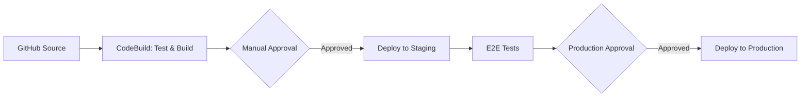

# How to Set Up Amplify Custom Pipelines

Author: [nawazdhandala](https://github.com/nawazdhandala)

Tags: AWS, Amplify, CI/CD, Pipelines, DevOps, Deployment

Description: Configure custom CI/CD pipelines for AWS Amplify applications using CodePipeline, GitHub Actions, or custom build specifications.

---

The default Amplify Hosting build pipeline works well for straightforward deployments. Push to a branch, Amplify builds, and your site goes live. But as your project grows, you need more control. Maybe you need to run integration tests before deploying, deploy to multiple environments with approval gates, or integrate with your existing CI/CD tooling. Custom pipelines give you that control.

This guide covers three approaches: customizing the built-in Amplify build specification, using AWS CodePipeline with Amplify, and integrating with GitHub Actions.

## Approach 1: Custom Build Specification

The simplest customization is modifying Amplify's `amplify.yml` build specification file. This file controls what happens during each build phase.

```yaml
# amplify.yml - Custom build specification
version: 1
backend:
  phases:
    build:
      commands:
        - '# Execute Amplify CLI with the helper script'
        - amplifyPush --simple
frontend:
  phases:
    preBuild:
      commands:
        # Install dependencies
        - npm ci
        # Run linting
        - npm run lint
        # Run unit tests
        - npm run test -- --coverage --watchAll=false
    build:
      commands:
        # Build the frontend
        - npm run build
    postBuild:
      commands:
        # Run integration tests against the built output
        - npm run test:integration
  artifacts:
    baseDirectory: build
    files:
      - '**/*'
  cache:
    paths:
      - node_modules/**/*
      - .next/cache/**/*
test:
  phases:
    preTest:
      commands:
        # Install Cypress for E2E testing
        - npm install cypress
        - npx cypress install
    test:
      commands:
        # Run E2E tests
        - npx cypress run --config baseUrl=http://localhost:3000
  artifacts:
    baseDirectory: cypress
    configFilePath: '**/mochawesome.json'
    files:
      - '**/*.png'
      - '**/*.mp4'
```

Key customizations in this build spec:

- **Linting in preBuild**: Catches code quality issues before building
- **Unit tests with coverage**: Fails the build if tests fail
- **Integration tests in postBuild**: Tests the actual build output
- **E2E tests with Cypress**: Runs in a separate test phase with artifact collection
- **Caching**: Speeds up subsequent builds by caching node_modules and build caches

## Approach 2: Environment-Specific Build Commands

Use environment variables to run different commands per branch/environment:

```yaml
# amplify.yml with environment-specific logic
version: 1
frontend:
  phases:
    preBuild:
      commands:
        - npm ci
        - |
          # Run full test suite only on production branch
          if [ "$AWS_BRANCH" = "main" ]; then
            echo "Running full test suite for production"
            npm run test -- --coverage --watchAll=false
            npm run test:integration
          else
            echo "Running quick tests for non-production"
            npm run test -- --watchAll=false
          fi
    build:
      commands:
        - |
          # Use different build commands per environment
          if [ "$AWS_BRANCH" = "main" ]; then
            REACT_APP_ENV=production npm run build
          elif [ "$AWS_BRANCH" = "staging" ]; then
            REACT_APP_ENV=staging npm run build
          else
            REACT_APP_ENV=development npm run build
          fi
  artifacts:
    baseDirectory: build
    files:
      - '**/*'
```

## Approach 3: AWS CodePipeline Integration

For enterprise workflows with approval gates, parallel stages, and multi-account deployments, use CodePipeline with Amplify as a deploy action.



### Set Up CodeBuild for Testing

```yaml
# buildspec.yml for CodeBuild
version: 0.2
phases:
  install:
    runtime-versions:
      nodejs: 20
    commands:
      - npm ci
  pre_build:
    commands:
      # Run linting and static analysis
      - npm run lint
      - npm run type-check
  build:
    commands:
      # Run tests
      - npm run test -- --coverage --watchAll=false
      # Build the application
      - npm run build
  post_build:
    commands:
      # Upload test coverage
      - aws s3 cp coverage/ s3://my-coverage-bucket/$CODEBUILD_BUILD_NUMBER/ --recursive
artifacts:
  base-directory: build
  files:
    - '**/*'
reports:
  jest-reports:
    files:
      - 'junit.xml'
    base-directory: coverage
    file-format: JUNITXML
```

### Create the CodePipeline

```bash
# Create the pipeline with source, build, approval, and deploy stages
aws codepipeline create-pipeline \
  --pipeline '{
    "name": "amplify-app-pipeline",
    "roleArn": "arn:aws:iam::123456789012:role/CodePipelineRole",
    "stages": [
      {
        "name": "Source",
        "actions": [{
          "name": "GitHubSource",
          "actionTypeId": {
            "category": "Source",
            "owner": "ThirdParty",
            "provider": "GitHub",
            "version": "1"
          },
          "configuration": {
            "Owner": "my-org",
            "Repo": "my-app",
            "Branch": "main",
            "OAuthToken": "{{resolve:secretsmanager:github-token}}"
          },
          "outputArtifacts": [{"name": "SourceOutput"}]
        }]
      },
      {
        "name": "Build",
        "actions": [{
          "name": "BuildAndTest",
          "actionTypeId": {
            "category": "Build",
            "owner": "AWS",
            "provider": "CodeBuild",
            "version": "1"
          },
          "configuration": {
            "ProjectName": "my-app-build"
          },
          "inputArtifacts": [{"name": "SourceOutput"}],
          "outputArtifacts": [{"name": "BuildOutput"}]
        }]
      },
      {
        "name": "Approval",
        "actions": [{
          "name": "ManualApproval",
          "actionTypeId": {
            "category": "Approval",
            "owner": "AWS",
            "provider": "Manual",
            "version": "1"
          },
          "configuration": {
            "NotificationArn": "arn:aws:sns:us-east-1:123456789012:deploy-approvals",
            "CustomData": "Please review the staging deployment before approving production."
          }
        }]
      },
      {
        "name": "Deploy",
        "actions": [{
          "name": "AmplifyDeploy",
          "actionTypeId": {
            "category": "Deploy",
            "owner": "AWS",
            "provider": "AmplifyConsole",
            "version": "1"
          },
          "configuration": {
            "AppId": "your-amplify-app-id",
            "BranchName": "main"
          },
          "inputArtifacts": [{"name": "BuildOutput"}]
        }]
      }
    ]
  }'
```

## Approach 4: GitHub Actions Integration

Many teams already use GitHub Actions. You can trigger Amplify deployments from GitHub Actions using the AWS CLI or Amplify's webhook.

```yaml
# .github/workflows/deploy.yml
name: Deploy to Amplify

on:
  push:
    branches: [main]
  pull_request:
    branches: [main]

jobs:
  test:
    runs-on: ubuntu-latest
    steps:
      - uses: actions/checkout@v4

      - name: Setup Node.js
        uses: actions/setup-node@v4
        with:
          node-version: '20'
          cache: 'npm'

      - name: Install dependencies
        run: npm ci

      - name: Run linter
        run: npm run lint

      - name: Run tests
        run: npm run test -- --coverage --watchAll=false

      - name: Build
        run: npm run build

      - name: Upload coverage
        uses: actions/upload-artifact@v4
        with:
          name: coverage
          path: coverage/

  deploy-staging:
    needs: test
    if: github.ref == 'refs/heads/main'
    runs-on: ubuntu-latest
    environment: staging
    steps:
      - uses: actions/checkout@v4

      - name: Configure AWS credentials
        uses: aws-actions/configure-aws-credentials@v4
        with:
          aws-access-key-id: ${{ secrets.AWS_ACCESS_KEY_ID }}
          aws-secret-access-key: ${{ secrets.AWS_SECRET_ACCESS_KEY }}
          aws-region: us-east-1

      - name: Start Amplify deployment
        run: |
          # Trigger a deployment for the staging branch
          aws amplify start-deployment \
            --app-id ${{ secrets.AMPLIFY_APP_ID }} \
            --branch-name staging

      - name: Wait for deployment
        run: |
          # Poll until deployment completes
          while true; do
            STATUS=$(aws amplify get-branch \
              --app-id ${{ secrets.AMPLIFY_APP_ID }} \
              --branch-name staging \
              --query 'branch.activeJobSummary.status' \
              --output text)

            echo "Deployment status: $STATUS"

            if [ "$STATUS" = "SUCCEED" ]; then
              echo "Deployment successful"
              break
            elif [ "$STATUS" = "FAILED" ]; then
              echo "Deployment failed"
              exit 1
            fi

            sleep 30
          done

  deploy-production:
    needs: deploy-staging
    runs-on: ubuntu-latest
    environment:
      name: production
      url: https://myapp.amplifyapp.com
    steps:
      - uses: actions/checkout@v4

      - name: Configure AWS credentials
        uses: aws-actions/configure-aws-credentials@v4
        with:
          aws-access-key-id: ${{ secrets.AWS_ACCESS_KEY_ID }}
          aws-secret-access-key: ${{ secrets.AWS_SECRET_ACCESS_KEY }}
          aws-region: us-east-1

      - name: Deploy to production
        run: |
          aws amplify start-deployment \
            --app-id ${{ secrets.AMPLIFY_APP_ID }} \
            --branch-name main
```

The `environment` key in GitHub Actions provides built-in approval gates. Configure required reviewers in your repository settings.

## Webhook-Based Deployments

For simpler setups, use Amplify's webhook to trigger deployments from any CI system:

```bash
# Get the webhook URL for a branch
aws amplify create-webhook \
  --app-id your-amplify-app-id \
  --branch-name main

# Trigger a deployment from any CI system
curl -X POST \
  -H "Content-Type: application/json" \
  "https://webhooks.amplify.us-east-1.amazonaws.com/prod/webhooks?id=YOUR_WEBHOOK_ID&token=YOUR_TOKEN"
```

## Best Practices

**Keep build times short**: Cache aggressively. Use `npm ci` instead of `npm install`. Skip unnecessary steps in non-production branches.

**Use environment-specific variables**: Store API URLs, feature flags, and configuration in Amplify environment variables rather than hardcoding them.

**Monitor build metrics**: Track build duration, success rate, and deployment frequency. These are key DevOps metrics (DORA metrics).

**Roll back quickly**: Keep previous build artifacts so you can roll back by redeploying a previous version rather than reverting code.

**Test in preview environments**: Use Amplify's pull request previews to test changes before merging.

## Wrapping Up

Custom pipelines give you the flexibility to enforce quality gates, manage multi-environment deployments, and integrate with your existing toolchain. Start with customizing the `amplify.yml` build spec, and graduate to CodePipeline or GitHub Actions as your needs grow. For setting up the backend infrastructure these pipelines deploy, check out [Amplify backend with CDK](https://oneuptime.com/blog/post/set-up-amplify-backend-with-cdk/view).
