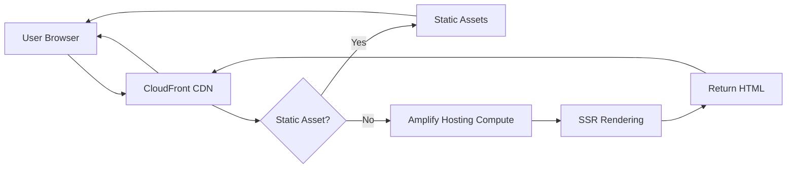

# How to Set Up Amplify for Server-Side Rendering Apps

Author: [nawazdhandala](https://github.com/nawazdhandala)

Tags: AWS, Amplify, SSR, Next.js, Server-Side Rendering, Frontend, Deployment

Description: Learn how to deploy server-side rendering applications on AWS Amplify with full SSR support, including Next.js and Nuxt.js frameworks

---

AWS Amplify has come a long way from its origins as a static site hosting service. Today it offers first-class support for server-side rendering (SSR) applications, meaning you can deploy frameworks like Next.js and Nuxt.js without needing to manage your own servers or containers. If you have been holding off on Amplify because you thought it was only for SPAs, it is time to take another look.

In this guide, we will walk through the full process of setting up an SSR application on AWS Amplify, covering configuration, build settings, environment variables, and common pitfalls.

## Why Amplify for SSR?

Before Amplify supported SSR, developers who wanted to deploy a Next.js app on AWS had to cobble together Lambda@Edge, CloudFront, S3, and API Gateway manually. Amplify now handles all of that behind the scenes. When you deploy an SSR app, Amplify automatically provisions:

- An Amazon CloudFront distribution for edge caching
- Amplify Hosting compute resources to handle server-side rendering
- Static asset hosting
- Automatic SSL certificate management

This means you get a fully managed, globally distributed SSR deployment without touching CloudFormation or CDK directly.

## Prerequisites

You need a few things before getting started:

- An AWS account with admin permissions
- Node.js 20 or later installed locally
- A Next.js (or Nuxt.js) project in a Git repository
- The Amplify CLI installed, if you also manage an Amplify backend

To install the Amplify CLI if you need it for backend resources:

```bash
# Install the Amplify CLI globally

npm install -g @aws-amplify/cli

# Configure it with your AWS credentials
amplify configure
```

## Step 1: Prepare Your Next.js App

Amplify Hosting compute supports Next.js versions 12 through 15. Make sure your app is set up correctly for SSR by checking your `next.config.js`:

```javascript
// next.config.js - Ensure output is NOT set to 'export'
// Amplify needs the default output mode for SSR to work
/** @type {import('next').NextConfig} */
const nextConfig = {
  // Do NOT set output: 'export' - that disables SSR
  reactStrictMode: true,
  images: {
    // Amplify supports Next.js image optimization
    unoptimized: false,
  },
};

module.exports = nextConfig;
```

If your `next.config.js` has `output: 'export'`, Amplify will treat it as a static site and SSR pages will not work.

## Step 2: Connect Your Repository to Amplify

Head to the AWS Amplify console and click "New app" then "Host web app." Select your Git provider (GitHub, GitLab, Bitbucket, or AWS CodeCommit) and authorize access.

Once connected, select the repository and the branch you want to deploy. Amplify will automatically detect that you are using Next.js and suggest appropriate build settings.

## Step 3: Configure the Build Specification

Amplify generates a default `amplify.yml` file, but you should customize it for SSR. Create an `amplify.yml` file in your project root:

```yaml
# amplify.yml - Build specification for Next.js SSR on Amplify
version: 1
frontend:
  phases:
    preBuild:
      commands:
        # Install dependencies using the lockfile for reproducibility
        - npm ci
    build:
      commands:
        # Make selected Amplify environment variables available to Next.js
        - env | grep -e API_BASE_URL -e APP_ENV >> .env.production
        - env | grep -e NEXT_PUBLIC_ >> .env.production
        # Build the Next.js application
        - npm run build
  artifacts:
    # Amplify automatically detects Next.js output
    baseDirectory: .next
    files:
      - '**/*'
  cache:
    paths:
      # Cache node_modules to speed up subsequent builds
      - node_modules/**/*
      - .next/cache/**/*
```

The key difference from a static site configuration is the `baseDirectory` pointing to `.next` instead of an `out` directory.

## Step 4: Set Environment Variables

SSR apps often need server-side environment variables that differ from client-side ones. In the Amplify console, navigate to your app, then "Hosting" and "Environment variables."

```text
# Example environment variables for an SSR app
API_BASE_URL=https://api.example.com
NEXT_PUBLIC_API_URL=https://api.example.com
APP_ENV=production
```

Variables prefixed with `NEXT_PUBLIC_` are bundled for browser code at build time. All other variables are intended for server-side code, but Next.js server components do not automatically receive Amplify console variables at runtime. Add the variables your app needs to `.env.production` during the build, as shown in the `amplify.yml` example above.

Avoid putting credentials, database passwords, or long-lived secrets in Amplify environment variables that are written into build artifacts. For AWS resources, use an SSR Compute IAM role. For other runtime secrets, fetch them from a managed secret store such as AWS Systems Manager Parameter Store or AWS Secrets Manager in server-side code.

## Step 5: Confirm Compute Settings

Amplify automatically detects a new Next.js SSR app in the console and deploys it using the Amplify Hosting compute service. If you create or update the app through an API or CLI workflow, make sure the platform is `WEB_COMPUTE`:

```json
{
  "framework": "Next.js - SSR",
  "platform": "WEB_COMPUTE",
  "buildSpec": "amplify.yml"
}
```

The `WEB_COMPUTE` platform is what tells Amplify Hosting to deploy the app as a compute-backed SSR app rather than treating it as a purely static app.

## Architecture Overview

Here is how Amplify handles an SSR request flow:



Static assets like CSS, JS bundles, and images are served through CloudFront. Dynamic SSR pages are routed to Amplify Hosting compute resources that render the HTML on-demand.

## Step 6: Handle API Routes

If your Next.js app includes API routes (files in `pages/api/` or the `app/api/` directory), Amplify supports them as part of the SSR deployment. No special configuration is needed.

```typescript
// app/api/users/route.ts - This runs on the server
import { NextResponse } from 'next/server';

export async function GET() {
  // This runs server-side in Amplify Hosting compute
  const users = await fetchUsersFromDatabase();
  return NextResponse.json(users);
}
```

## Step 7: Test Locally Before Deploying

Always test your SSR behavior locally before pushing to Amplify:

```bash
# Build the app locally
npm run build

# Start the production server to verify SSR works
npm run start
```

Check that pages using `getServerSideProps` or Server Components render correctly, and that API routes respond as expected.

## Common Issues and Fixes

**Build times out**: Amplify has a default build timeout of 30 minutes. If your app is large, increase this in the Amplify console under "Build settings." You can set it up to 120 minutes.

**Build output size limits**: SSR apps on Amplify Hosting compute have a 220MB maximum build output size. If your app exceeds this, check for unnecessary runtime dependencies and remove large binaries that are not required by the server runtime after the build.

**Environment variables not available**: Remember that Next.js server components do not automatically receive Amplify console variables at runtime. Write the variables you need to `.env.production` during the build, and use a managed secret store for runtime-only secrets.

**Image optimization not working**: Make sure `images.unoptimized` is not set to `true` in your Next.js config. Amplify provides built-in image optimization for SSR apps, and Next.js 13 or later apps do not need additional configuration for the default image optimizer.

## Monitoring Your SSR App

Once deployed, you will want to monitor your SSR performance. Amplify can send SSR runtime logs to Amazon CloudWatch Logs when the app has the required IAM service role permissions. For a more thorough setup, check out our guide on [monitoring Amplify hosting with CloudWatch](https://oneuptime.com/blog/post/2026-02-12-monitor-amplify-hosting-with-cloudwatch/view).

You can also monitor compute startup latency and SSR response times, which are common sources of latency in SSR deployments after idle periods or large server bundles.

## Performance Tips

A few things that will make your Amplify SSR deployment faster:

1. **Use ISR (Incremental Static Regeneration)** for pages that do not change on every request. This lets Amplify cache rendered pages at the edge and revalidate them in the background.

2. **Minimize server-side data fetching** by moving non-critical data to client-side fetching with SWR or React Query.

3. **Enable Amplify's built-in caching** by setting appropriate cache headers in your middleware or API routes.

4. **Use the Next.js App Router** with React Server Components to reduce the JavaScript sent to the client.

## Wrapping Up

Amplify has matured into a solid platform for SSR applications. The managed infrastructure removes the headache of configuring CloudFront, static hosting, and SSR compute yourself, while still giving you the flexibility to customize build settings, environment variables, and compute roles. If you are building with Next.js or Nuxt.js and want to stay in the AWS ecosystem, Amplify is one of the simplest paths to production.
