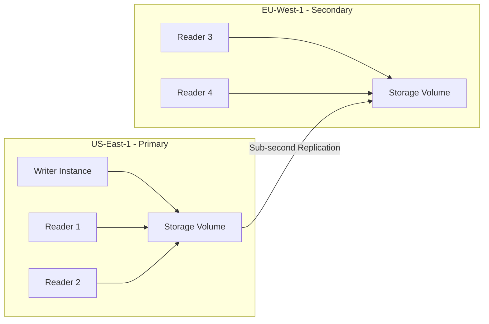

# How to Set Up Aurora Global Databases for Multi-Region

Author: [nawazdhandala](https://github.com/nawazdhandala)

Tags: AWS, Aurora, Global Database, Multi-Region, Disaster Recovery

Description: Step-by-step guide to setting up Aurora Global Databases for multi-region deployments with low-latency reads and fast cross-region disaster recovery.

---

Running your database in a single AWS region works fine until it doesn't. Whether you need low-latency reads for users scattered across the globe or a solid disaster recovery plan that can get you back online in under a minute, Aurora Global Databases are the answer. They let you replicate an Aurora cluster across multiple AWS regions with sub-second replication lag.

Let's walk through setting one up from scratch.

## What Makes Global Databases Different

A regular Aurora cluster with read replicas keeps everything in one region. Aurora Global Databases take it further by replicating data to entirely separate AWS regions. The primary region handles all writes, and secondary regions get read-only copies of the data through dedicated replication infrastructure built into the Aurora storage layer.

The key stats that matter:
- Replication lag is typically under 1 second
- Cross-region failover can happen in under 1 minute
- You can have up to 5 secondary regions
- Each secondary region can have up to 16 read replicas

This is fundamentally different from traditional cross-region replication approaches that use logical replication or binlog shipping. Aurora Global Databases replicate at the storage level, which is why the lag is so low.

## Prerequisites

You'll need:
- An Aurora cluster running MySQL 5.6.10a (or higher) or PostgreSQL 10.11 (or higher)
- The cluster must use the `aurora` or `aurora-mysql` engine, or `aurora-postgresql`
- The instance class should be `db.r4.large` or bigger (smaller instances aren't supported for global databases)
- VPCs configured in each region you plan to use

## Creating a Global Database via the Console

The console workflow is straightforward:

1. Go to the RDS console in your primary region
2. Select your existing Aurora cluster
3. Click **Actions** then **Add AWS Region**
4. Choose the secondary region
5. Configure the instance class and other settings for the secondary cluster
6. Click **Add Region**

AWS will create the secondary cluster and begin replicating data. Depending on your database size, the initial sync can take anywhere from minutes to hours.

## Creating a Global Database via the CLI

The CLI approach gives you more precision. Here's the step-by-step process.

First, create the global database resource:

```bash
# Create the global database cluster
aws rds create-global-cluster \
  --global-cluster-identifier my-global-db \
  --source-db-cluster-identifier arn:aws:rds:us-east-1:123456789012:cluster:my-primary-cluster \
  --region us-east-1
```

Then create the secondary cluster in your target region:

```bash
# Create the secondary cluster in eu-west-1
aws rds create-db-cluster \
  --db-cluster-identifier my-secondary-cluster \
  --engine aurora-mysql \
  --engine-version 5.7.mysql_aurora.2.11.2 \
  --global-cluster-identifier my-global-db \
  --region eu-west-1 \
  --db-subnet-group-name my-eu-subnet-group \
  --vpc-security-group-ids sg-0abc1234def56789
```

Finally, add a reader instance to the secondary cluster so it can actually serve traffic:

```bash
# Add a reader instance to the secondary cluster
aws rds create-db-instance \
  --db-instance-identifier my-secondary-reader-1 \
  --db-cluster-identifier my-secondary-cluster \
  --db-instance-class db.r5.large \
  --engine aurora-mysql \
  --region eu-west-1
```

## Terraform Setup

Here's a complete Terraform configuration for a global database spanning two regions.

This sets up the global database, primary cluster, and secondary cluster:

```hcl
# Provider configurations for both regions
provider "aws" {
  alias  = "primary"
  region = "us-east-1"
}

provider "aws" {
  alias  = "secondary"
  region = "eu-west-1"
}

# Global database resource
resource "aws_rds_global_cluster" "main" {
  provider                  = aws.primary
  global_cluster_identifier = "my-global-database"
  engine                    = "aurora-mysql"
  engine_version            = "5.7.mysql_aurora.2.11.2"
  database_name             = "myapp"
}

# Primary cluster
resource "aws_rds_cluster" "primary" {
  provider                  = aws.primary
  cluster_identifier        = "my-primary-cluster"
  engine                    = aws_rds_global_cluster.main.engine
  engine_version            = aws_rds_global_cluster.main.engine_version
  global_cluster_identifier = aws_rds_global_cluster.main.id
  master_username           = "admin"
  master_password           = var.db_password
  database_name             = "myapp"
  db_subnet_group_name      = aws_db_subnet_group.primary.name
}

# Primary writer instance
resource "aws_rds_cluster_instance" "primary_writer" {
  provider             = aws.primary
  identifier           = "my-primary-writer"
  cluster_identifier   = aws_rds_cluster.primary.id
  instance_class       = "db.r5.large"
  engine               = aws_rds_cluster.primary.engine
  engine_version       = aws_rds_cluster.primary.engine_version
}

# Secondary cluster in eu-west-1
resource "aws_rds_cluster" "secondary" {
  provider                  = aws.secondary
  cluster_identifier        = "my-secondary-cluster"
  engine                    = aws_rds_global_cluster.main.engine
  engine_version            = aws_rds_global_cluster.main.engine_version
  global_cluster_identifier = aws_rds_global_cluster.main.id
  db_subnet_group_name      = aws_db_subnet_group.secondary.name

  # Secondary clusters don't need master credentials
  # They inherit from the global database
  depends_on = [aws_rds_cluster.primary]
}

# Secondary reader instance
resource "aws_rds_cluster_instance" "secondary_reader" {
  provider             = aws.secondary
  identifier           = "my-secondary-reader-1"
  cluster_identifier   = aws_rds_cluster.secondary.id
  instance_class       = "db.r5.large"
  engine               = aws_rds_cluster.secondary.engine
  engine_version       = aws_rds_cluster.secondary.engine_version
}
```

## Architecture Overview

Here's what the architecture looks like at a high level:



## Monitoring Replication Lag

Replication lag is the most important metric to watch. You can check it in CloudWatch under the `AuroraGlobalDBReplicationLag` metric.

Here's a quick way to check it from the CLI:

```bash
# Check global database replication lag in CloudWatch
aws cloudwatch get-metric-statistics \
  --namespace AWS/RDS \
  --metric-name AuroraGlobalDBReplicationLag \
  --dimensions Name=DBClusterIdentifier,Value=my-secondary-cluster \
  --start-time $(date -u -d '1 hour ago' +%Y-%m-%dT%H:%M:%S) \
  --end-time $(date -u +%Y-%m-%dT%H:%M:%S) \
  --period 60 \
  --statistics Average \
  --region eu-west-1
```

If you see lag consistently above 1 second, it usually means your write throughput on the primary is extremely high or there's a network issue between regions. Setting up proper monitoring with tools like [CloudWatch alarms](https://oneuptime.com/blog/post/monitor-elasticache-with-cloudwatch/view) helps you catch these issues early.

## Configuring Your Application

Your application needs to know about the endpoints in both regions. The primary cluster endpoint handles writes, while the secondary cluster's reader endpoint handles local reads.

Here's a simple Python example showing region-aware connection logic:

```python
import boto3
import pymysql

# Configuration for multi-region Aurora connections
PRIMARY_ENDPOINT = "my-primary-cluster.cluster-abc123.us-east-1.rds.amazonaws.com"
SECONDARY_ENDPOINT = "my-secondary-cluster.cluster-ro-xyz789.eu-west-1.rds.amazonaws.com"

def get_read_connection(user_region="us-east-1"):
    """Return a read connection based on user's region."""
    # Route reads to the nearest region
    if user_region.startswith("eu"):
        endpoint = SECONDARY_ENDPOINT
    else:
        endpoint = PRIMARY_ENDPOINT

    return pymysql.connect(
        host=endpoint,
        user="app_reader",
        password="secret",
        database="myapp",
        read_timeout=5,
        connect_timeout=3
    )

def get_write_connection():
    """Writes always go to the primary region."""
    return pymysql.connect(
        host=PRIMARY_ENDPOINT,
        user="app_writer",
        password="secret",
        database="myapp",
        read_timeout=10,
        connect_timeout=5
    )
```

## Cost Considerations

Global databases add cost in two areas. First, you're paying for instances in every secondary region. Second, there's cross-region data transfer charges for the replication traffic. For write-heavy workloads, that data transfer cost can add up.

A rough rule of thumb: budget for about 1.5-2x the cost of your primary cluster for each secondary region you add.

## Common Pitfalls

**Forgetting to update security groups.** Each region has its own VPC and security groups. Make sure the secondary cluster's security groups allow traffic from your application.

**Not testing failover.** Setting up a global database without testing failover is like having a fire extinguisher you've never checked. Practice the failover process regularly. Check out the guide on [performing Aurora Global Database failover](https://oneuptime.com/blog/post/perform-aurora-global-database-failover/view) for detailed steps.

**Using too-small instance classes.** Secondary readers need to handle the replication workload plus serve reads. Don't skimp on instance sizes in secondary regions.

## Wrapping Up

Aurora Global Databases give you a production-ready multi-region database setup with remarkably low replication lag. The setup process is straightforward whether you use the console, CLI, or infrastructure-as-code tools. Just remember to monitor that replication lag, test your failover process, and size your secondary instances appropriately.

For more on managing your Aurora deployment, take a look at how to [configure Aurora endpoints](https://oneuptime.com/blog/post/configure-aurora-endpoints-writer-reader-custom/view) to optimize your read/write traffic routing.
