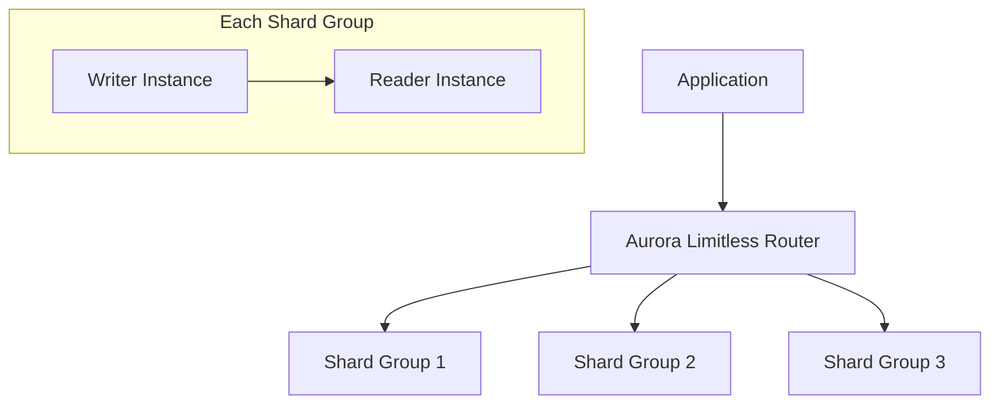

# How to Set Up Aurora Limitless Database for Horizontal Scaling

Author: [nawazdhandala](https://github.com/nawazdhandala)

Tags: AWS, Aurora, Database, Horizontal Scaling, Sharding, PostgreSQL

Description: Learn how to set up Aurora Limitless Database to horizontally scale your PostgreSQL workloads beyond the limits of a single Aurora cluster.

---

Aurora has always been good at vertical scaling. You can go from a db.t3.medium to a db.r6g.16xlarge and handle enormous workloads on a single writer instance. But eventually you hit the ceiling. A single Aurora cluster can store up to 128 TB and handle only so many write transactions per second before the writer becomes a bottleneck.

Aurora Limitless Database breaks through these limits by distributing your data across multiple Aurora instances using sharding - but without requiring you to build or manage the sharding logic yourself. Your application connects to a single endpoint and writes SQL just like it would against a regular PostgreSQL database. Aurora handles the data distribution, cross-shard queries, and distributed transactions behind the scenes.

## How Aurora Limitless Works

Aurora Limitless introduces two new concepts: shard groups and table types.



**Shard groups** are sets of Aurora instances that each hold a portion of your data. The router layer distributes queries to the right shard group based on the shard key.

**Table types** determine how data is distributed:

- **Sharded tables** - data is horizontally partitioned across shard groups based on a shard key column
- **Reference tables** - data is replicated to all shard groups (good for lookup tables)
- **Standard tables** - remain on the router (not distributed)

## Prerequisites

Aurora Limitless is available for Aurora PostgreSQL-Compatible Edition. You need:

- Aurora PostgreSQL 16.4-limitless or later
- A supported AWS Region
- Appropriate IAM permissions

## Step 1: Create a Limitless-Enabled DB Cluster

```bash
# Create an Aurora Limitless Database cluster
aws rds create-db-cluster \
  --db-cluster-identifier my-limitless-cluster \
  --engine aurora-postgresql \
  --engine-version 16.4-limitless \
  --master-username admin \
  --master-user-password 'YourStr0ngP@ss!' \
  --storage-type aurora-iopt1 \
  --serverless-v2-scaling-configuration MinCapacity=2,MaxCapacity=64 \
  --cluster-scalability-type limitless
```

The `--cluster-scalability-type limitless` flag is what enables Limitless mode.

## Step 2: Create DB Shard Groups

Shard groups define how many shards your data is split across.

```bash
# Create a shard group with initial capacity
aws rds create-db-shard-group \
  --db-shard-group-identifier my-shard-group \
  --db-cluster-identifier my-limitless-cluster \
  --max-acu 128 \
  --compute-redundancy 1
```

The `compute-redundancy` parameter controls how many standby instances each shard has. Set it to 1 for high availability.

## Step 3: Create the Router Instance

The router is the entry point for your application.

```bash
# Create a Serverless v2 instance as the router
aws rds create-db-instance \
  --db-instance-identifier my-limitless-router \
  --db-cluster-identifier my-limitless-cluster \
  --db-instance-class db.serverless \
  --engine aurora-postgresql
```

## Step 4: Define Your Table Distribution

Once the cluster is running, connect to it and set up your tables.

### Create a Sharded Table

Sharded tables have their rows distributed across shard groups based on a shard key.

```sql
-- Create a sharded table with customer_id as the shard key
CREATE TABLE orders (
    order_id BIGINT GENERATED ALWAYS AS IDENTITY,
    customer_id BIGINT NOT NULL,
    order_date TIMESTAMP NOT NULL DEFAULT NOW(),
    total_amount DECIMAL(10,2) NOT NULL,
    status VARCHAR(20) NOT NULL DEFAULT 'pending',
    items JSONB,
    PRIMARY KEY (order_id, customer_id)
) USING aurora_limitless;

-- Set the shard key
ALTER TABLE orders SET SHARD KEY (customer_id);
```

The shard key determines which shard group stores each row. Choose a column with high cardinality and that your queries frequently filter on.

### Create Collocated Tables

Tables that share the same shard key are stored together on the same shard, making joins between them fast.

```sql
-- Order items collocated with orders by customer_id
CREATE TABLE order_items (
    item_id BIGINT GENERATED ALWAYS AS IDENTITY,
    order_id BIGINT NOT NULL,
    customer_id BIGINT NOT NULL,
    product_id BIGINT NOT NULL,
    quantity INT NOT NULL,
    unit_price DECIMAL(10,2) NOT NULL,
    PRIMARY KEY (item_id, customer_id)
) USING aurora_limitless;

ALTER TABLE order_items SET SHARD KEY (customer_id);

-- Joins between orders and order_items are efficient because
-- rows with the same customer_id are on the same shard
```

### Create Reference Tables

Small, frequently-joined tables should be reference tables. They are replicated to every shard.

```sql
-- Product catalog replicated to all shards for fast local joins
CREATE TABLE products (
    product_id BIGINT PRIMARY KEY,
    name VARCHAR(255) NOT NULL,
    category VARCHAR(100),
    price DECIMAL(10,2) NOT NULL,
    description TEXT
) USING aurora_limitless;

ALTER TABLE products SET TABLE TYPE TO reference;
```

### Standard Tables

Tables that do not need to be distributed stay on the router.

```sql
-- Configuration table stays on the router - small and rarely joined
CREATE TABLE app_config (
    config_key VARCHAR(100) PRIMARY KEY,
    config_value TEXT,
    updated_at TIMESTAMP DEFAULT NOW()
);
```

## Step 5: Write Queries Normally

One of the best things about Aurora Limitless is that your application code barely changes. Write standard SQL.

```sql
-- This query automatically routes to the right shard based on customer_id
SELECT o.order_id, o.order_date, o.total_amount, oi.product_id, p.name
FROM orders o
JOIN order_items oi ON o.order_id = oi.order_id AND o.customer_id = oi.customer_id
JOIN products p ON oi.product_id = p.product_id
WHERE o.customer_id = 12345
ORDER BY o.order_date DESC;
```

Because `orders` and `order_items` are collocated on the same shard key, and `products` is a reference table available on every shard, this entire query runs on a single shard with no cross-shard coordination.

Cross-shard queries work too, but they are slower because they require coordination between shard groups.

```sql
-- This runs across all shards because there is no customer_id filter
SELECT status, COUNT(*), SUM(total_amount)
FROM orders
WHERE order_date >= '2026-01-01'
GROUP BY status;
```

## Step 6: Monitor Your Limitless Cluster

### Check Shard Group Status

```bash
# Describe shard groups and their current status
aws rds describe-db-shard-groups \
  --db-shard-group-identifier my-shard-group
```

### Monitor with CloudWatch

Key metrics to watch:

```bash
# Monitor distributed query performance
aws cloudwatch get-metric-statistics \
  --namespace AWS/RDS \
  --metric-name LimitlessQueryLatency \
  --dimensions Name=DBClusterIdentifier,Value=my-limitless-cluster \
  --start-time $(date -u -d '1 hour ago' +%Y-%m-%dT%H:%M:%S) \
  --end-time $(date -u +%Y-%m-%dT%H:%M:%S) \
  --period 300 \
  --statistics Average,p99
```

### Query Distribution Insights

Check how queries are being distributed across shards.

```sql
-- View query routing statistics
SELECT * FROM rds_aurora.limitless_stat_activity;

-- Check shard distribution
SELECT * FROM rds_aurora.limitless_shard_map;
```

## Choosing the Right Shard Key

The shard key is the most important decision you will make. Get it right and your queries will fly. Get it wrong and every query will be a cross-shard operation.

Good shard key characteristics:
- **High cardinality** - many distinct values to ensure even distribution
- **Frequently used in WHERE clauses** - so queries can be routed to a single shard
- **Stable** - values should not change frequently
- **Used in joins** - so related tables can be collocated

Common shard key choices:
- `tenant_id` for multi-tenant SaaS applications
- `customer_id` for e-commerce platforms
- `account_id` for financial applications
- `region_id` for geographically partitioned data

Avoid using:
- Timestamps (causes hot spots on the newest shard)
- Sequential IDs (same problem)
- Low-cardinality columns (uneven distribution)

## Scaling Up

To add more capacity, modify the shard group.

```bash
# Increase the maximum ACU capacity of the shard group
aws rds modify-db-shard-group \
  --db-shard-group-identifier my-shard-group \
  --max-acu 256
```

Aurora Limitless automatically rebalances data as shards are added or removed.

## Summary

Aurora Limitless Database brings horizontal scaling to Aurora PostgreSQL without requiring you to build sharding into your application. By choosing the right shard keys, collocating related tables, and using reference tables for lookup data, you can scale write throughput and storage far beyond the limits of a single Aurora cluster. The key is careful data modeling upfront - get the shard key right, and everything else falls into place.

For more on Aurora, see our guides on [Aurora I/O-Optimized for predictable pricing](https://oneuptime.com/blog/post/use-aurora-io-optimized-for-predictable-pricing/view) and [Aurora Zero-ETL integration with Redshift](https://oneuptime.com/blog/post/use-aurora-zero-etl-integration-with-redshift/view).
