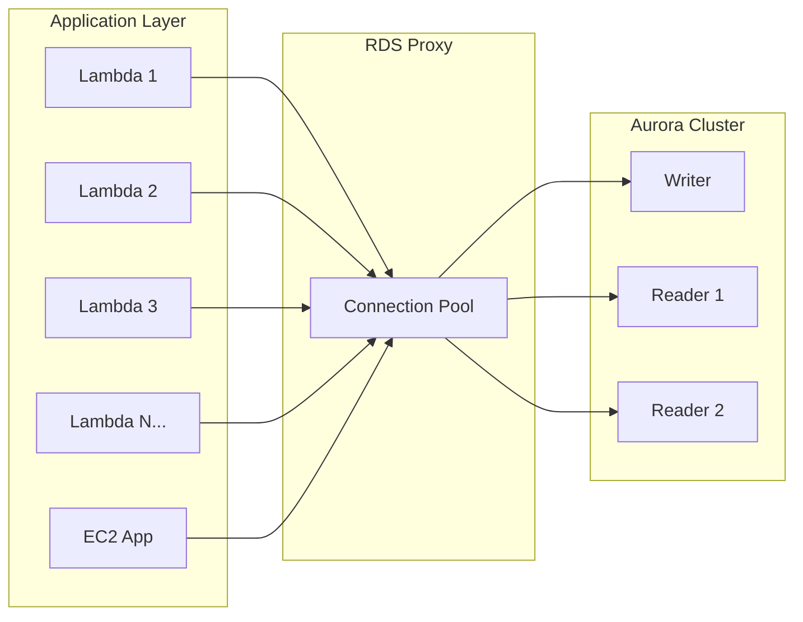

# How to Set Up Aurora with RDS Proxy

Author: [nawazdhandala](https://github.com/nawazdhandala)

Tags: AWS, Aurora, RDS Proxy, Database, Connection Pooling

Description: Learn how to set up and configure RDS Proxy with Aurora to improve connection management, reduce failover times, and handle connection surges from serverless applications.

---

Database connections are expensive. Each one consumes memory, CPU cycles, and a slot from a finite pool. When you've got hundreds of Lambda functions or microservices all trying to connect to Aurora, you hit connection limits fast. RDS Proxy sits between your application and Aurora, managing a pool of persistent connections so your application doesn't have to.

It's especially valuable for serverless architectures, applications with bursty connection patterns, and environments where you need faster failover times.

## What RDS Proxy Does

RDS Proxy maintains a pool of established connections to your Aurora database. When your application connects, it gets assigned a connection from the pool instead of opening a new one directly to Aurora. This means:

- Hundreds of application connections can share a handful of database connections
- Connections survive Lambda cold starts and function recycling
- Failover is faster because the proxy handles reconnection
- You're protected against connection storms



## Prerequisites

Before setting up RDS Proxy, you need:

- An Aurora MySQL or PostgreSQL cluster
- Database credentials stored in AWS Secrets Manager
- A VPC with private subnets (RDS Proxy only works within a VPC)
- IAM permissions for the proxy to access Secrets Manager

## Step 1: Store Database Credentials in Secrets Manager

RDS Proxy authenticates to your database using credentials stored in Secrets Manager:

```bash
# Create a secret with your database credentials
aws secretsmanager create-secret \
  --name my-aurora-proxy-credentials \
  --description "Credentials for RDS Proxy to Aurora" \
  --secret-string '{
    "username": "proxy_user",
    "password": "YourSecurePassword123",
    "engine": "mysql",
    "host": "my-aurora-cluster.cluster-abc123.us-east-1.rds.amazonaws.com",
    "port": 3306,
    "dbClusterIdentifier": "my-aurora-cluster"
  }'
```

Make sure the database user exists and has appropriate permissions:

```sql
-- Create the database user that RDS Proxy will use
CREATE USER 'proxy_user'@'%' IDENTIFIED BY 'YourSecurePassword123';
GRANT SELECT, INSERT, UPDATE, DELETE ON mydb.* TO 'proxy_user'@'%';
FLUSH PRIVILEGES;
```

## Step 2: Create the IAM Role

RDS Proxy needs an IAM role to read the secret and decrypt it:

```bash
# Create the trust policy for RDS Proxy
cat > proxy-trust-policy.json << 'JSONEOF'
{
  "Version": "2012-10-17",
  "Statement": [
    {
      "Effect": "Allow",
      "Principal": {
        "Service": "rds.amazonaws.com"
      },
      "Action": "sts:AssumeRole"
    }
  ]
}
JSONEOF

# Create the role
aws iam create-role \
  --role-name RDSProxyRole \
  --assume-role-policy-document file://proxy-trust-policy.json

# Create the permissions policy
cat > proxy-permissions.json << 'JSONEOF'
{
  "Version": "2012-10-17",
  "Statement": [
    {
      "Effect": "Allow",
      "Action": "secretsmanager:GetSecretValue",
      "Resource": "arn:aws:secretsmanager:us-east-1:123456789012:secret:my-aurora-proxy-credentials-*"
    },
    {
      "Effect": "Allow",
      "Action": "kms:Decrypt",
      "Resource": "arn:aws:kms:us-east-1:123456789012:key/your-kms-key-id"
    }
  ]
}
JSONEOF

# Attach the policy
aws iam put-role-policy \
  --role-name RDSProxyRole \
  --policy-name RDSProxyPermissions \
  --policy-document file://proxy-permissions.json
```

## Step 3: Create the RDS Proxy

Now create the proxy itself:

```bash
# Create the RDS Proxy
aws rds create-db-proxy \
  --db-proxy-name my-aurora-proxy \
  --engine-family MYSQL \
  --auth '[{
    "AuthScheme": "SECRETS",
    "SecretArn": "arn:aws:secretsmanager:us-east-1:123456789012:secret:my-aurora-proxy-credentials-AbCdEf",
    "IAMAuth": "DISABLED"
  }]' \
  --role-arn arn:aws:iam::123456789012:role/RDSProxyRole \
  --vpc-subnet-ids subnet-abc123 subnet-def456 subnet-ghi789 \
  --vpc-security-group-ids sg-proxy123 \
  --require-tls
```

The `--require-tls` flag enforces encrypted connections between your application and the proxy. I'd recommend always enabling this.

## Step 4: Register the Target (Aurora Cluster)

Associate the proxy with your Aurora cluster:

```bash
# Register the Aurora cluster as a proxy target
aws rds register-db-proxy-targets \
  --db-proxy-name my-aurora-proxy \
  --db-cluster-identifiers my-aurora-cluster
```

Wait for the proxy to become available:

```bash
# Check proxy status
aws rds describe-db-proxies \
  --db-proxy-name my-aurora-proxy \
  --query 'DBProxies[0].{Status:Status,Endpoint:Endpoint,EngineFamily:EngineFamily}'
```

## Step 5: Connect Through the Proxy

Once the proxy is available, connect using the proxy endpoint instead of the cluster endpoint:

```python
import pymysql

# Connect through RDS Proxy instead of directly to Aurora
connection = pymysql.connect(
    host='my-aurora-proxy.proxy-abc123.us-east-1.rds.amazonaws.com',
    user='proxy_user',
    password='YourSecurePassword123',
    database='mydb',
    port=3306,
    ssl={'ssl': True}  # Required when TLS is enforced
)

cursor = connection.cursor()
cursor.execute("SELECT * FROM users LIMIT 10")
results = cursor.fetchall()
```

For Lambda functions, the connection pattern is especially clean:

```python
import pymysql
import json

# Connection is reused across Lambda invocations within the same container
connection = None

def get_connection():
    global connection
    if connection is None or not connection.open:
        connection = pymysql.connect(
            host='my-aurora-proxy.proxy-abc123.us-east-1.rds.amazonaws.com',
            user='proxy_user',
            password='YourSecurePassword123',
            database='mydb',
            port=3306,
            ssl={'ssl': True},
            connect_timeout=5,
            read_timeout=10
        )
    return connection

def lambda_handler(event, context):
    conn = get_connection()
    cursor = conn.cursor()

    try:
        cursor.execute("SELECT COUNT(*) FROM orders WHERE status = 'pending'")
        count = cursor.fetchone()[0]
        return {
            'statusCode': 200,
            'body': json.dumps({'pending_orders': count})
        }
    except Exception as e:
        # Reset connection on error
        global connection
        connection = None
        raise
```

## Configuring Connection Pooling Behavior

You can tune how the proxy manages its connection pool:

```bash
# Update proxy target group settings
aws rds modify-db-proxy-target-group \
  --db-proxy-name my-aurora-proxy \
  --target-group-name default \
  --connection-pool-config '{
    "MaxConnectionsPercent": 75,
    "MaxIdleConnectionsPercent": 50,
    "ConnectionBorrowTimeout": 120,
    "SessionPinningFilters": ["EXCLUDE_VARIABLE_SETS"]
  }'
```

Key parameters explained:

- **MaxConnectionsPercent**: Maximum percentage of `max_connections` the proxy can use (default: 100)
- **MaxIdleConnectionsPercent**: How many idle connections to keep warm
- **ConnectionBorrowTimeout**: How long a client waits for a free connection (seconds)
- **SessionPinningFilters**: Controls when a connection gets "pinned" to a specific session

## Terraform Configuration

Here's a complete Terraform setup:

```hcl
# RDS Proxy resource
resource "aws_db_proxy" "aurora_proxy" {
  name                   = "my-aurora-proxy"
  debug_logging          = false
  engine_family          = "MYSQL"
  idle_client_timeout    = 1800
  require_tls            = true
  role_arn               = aws_iam_role.rds_proxy.arn
  vpc_security_group_ids = [aws_security_group.proxy.id]
  vpc_subnet_ids         = var.private_subnet_ids

  auth {
    auth_scheme = "SECRETS"
    iam_auth    = "DISABLED"
    secret_arn  = aws_secretsmanager_secret.db_credentials.arn
  }
}

# Register the Aurora cluster as a target
resource "aws_db_proxy_default_target_group" "aurora" {
  db_proxy_name = aws_db_proxy.aurora_proxy.name

  connection_pool_config {
    max_connections_percent      = 75
    max_idle_connections_percent = 50
    connection_borrow_timeout    = 120
  }
}

resource "aws_db_proxy_target" "aurora" {
  db_proxy_name          = aws_db_proxy.aurora_proxy.name
  target_group_name      = aws_db_proxy_default_target_group.aurora.name
  db_cluster_identifier  = aws_rds_cluster.main.id
}
```

## Monitoring the Proxy

RDS Proxy publishes several CloudWatch metrics you should monitor:

```bash
# Check the number of client connections to the proxy
aws cloudwatch get-metric-statistics \
  --namespace AWS/RDS \
  --metric-name ClientConnections \
  --dimensions Name=ProxyName,Value=my-aurora-proxy \
  --start-time $(date -u -d '1 hour ago' +%Y-%m-%dT%H:%M:%S) \
  --end-time $(date -u +%Y-%m-%dT%H:%M:%S) \
  --period 60 \
  --statistics Average Sum
```

Key metrics to watch:
- **ClientConnections** - Active client connections to the proxy
- **DatabaseConnections** - Active connections from proxy to Aurora
- **ClientConnectionsSetupSucceeded** - Successful new connections
- **QueryDatabaseResponseLatency** - Latency added by the proxy

## Session Pinning Gotchas

One thing that trips people up is session pinning. When a client does something that ties it to a specific backend connection (like setting a session variable or using a temporary table), the proxy "pins" that connection and stops multiplexing. This defeats the purpose of connection pooling.

Common causes of pinning:
- `SET` statements for session variables
- Using temporary tables
- Using prepared statements (in some configurations)
- Using `LOCK TABLES`

You can reduce unnecessary pinning with the session pinning filter:

```sql
-- This causes pinning (sets a session variable)
SET SESSION wait_timeout = 300;

-- If you must set variables, use the EXCLUDE_VARIABLE_SETS pinning filter
-- (configured in the proxy target group settings)
```

## Wrapping Up

RDS Proxy is essential for serverless applications connecting to Aurora and highly valuable for any workload with bursty connection patterns. The setup involves a few steps - Secrets Manager, IAM roles, proxy creation, target registration - but once it's running, your applications get better connection management, faster failover, and protection against connection exhaustion.

For more on optimizing your Aurora setup, check out how to [configure Aurora endpoints](https://oneuptime.com/blog/post/2026-02-12-configure-aurora-endpoints-writer-reader-custom/view) for read/write splitting, and how to [troubleshoot Aurora failover events](https://oneuptime.com/blog/post/2026-02-12-troubleshoot-aurora-failover-events/view) when things go wrong.
