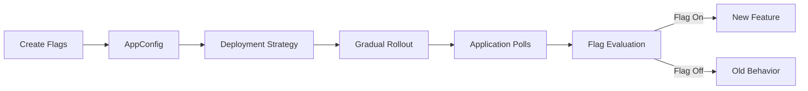

# How to Set Up AWS AppConfig for Feature Flags

Author: [nawazdhandala](https://github.com/nawazdhandala)

Tags: AWS, AppConfig, Feature Flags, Configuration

Description: Learn how to set up AWS AppConfig for feature flag management, including gradual rollouts, percentage-based targeting, validation, and rollback strategies.

---

Feature flags let you decouple deployment from release. You deploy code to production but keep new features hidden behind flags. Then you turn them on for specific users, a percentage of traffic, or everyone at once - all without redeploying. If something goes wrong, flip the flag off. No rollback, no hotfix, no stress.

AWS AppConfig provides managed feature flag infrastructure that integrates with your existing AWS setup. It handles storage, deployment, validation, and gradual rollout. This guide covers setting it up from scratch.

## How AppConfig Feature Flags Work

AppConfig stores feature flag configurations as JSON documents. Your application polls AppConfig for the latest flags, caches them locally, and evaluates them at runtime. When you update a flag, AppConfig deploys the change gradually according to your deployment strategy.



## Setting Up the Foundation

AppConfig uses a three-level hierarchy: Application, Environment, and Configuration Profile. Think of it as Project > Stage > Config.

```bash
# Create an AppConfig application
aws appconfig create-application \
    --name "my-web-app" \
    --description "Feature flags for the web application"

# Create environments
aws appconfig create-environment \
    --application-id abc123 \
    --name "production" \
    --description "Production environment"

aws appconfig create-environment \
    --application-id abc123 \
    --name "staging" \
    --description "Staging environment"
```

## Creating Feature Flags

Feature flags in AppConfig use the `AWS.AppConfig.FeatureFlags` type. Create a configuration profile for your flags.

```bash
# Create a feature flag configuration profile
aws appconfig create-configuration-profile \
    --application-id abc123 \
    --name "feature-flags" \
    --location-uri "hosted" \
    --type "AWS.AppConfig.FeatureFlags"
```

Now create the actual flag configuration.

```json
{
    "version": "1",
    "flags": {
        "new-checkout-flow": {
            "name": "New Checkout Flow",
            "description": "Redesigned checkout process with one-page layout",
            "attributes": {
                "rollout_percentage": {
                    "constraints": {
                        "type": "number",
                        "minimum": 0,
                        "maximum": 100
                    }
                }
            }
        },
        "dark-mode": {
            "name": "Dark Mode",
            "description": "Enable dark mode theme option"
        },
        "ai-recommendations": {
            "name": "AI Product Recommendations",
            "description": "ML-based product recommendations on the homepage"
        },
        "bulk-export": {
            "name": "Bulk Data Export",
            "description": "Allow users to export data in bulk"
        }
    },
    "values": {
        "new-checkout-flow": {
            "enabled": false,
            "rollout_percentage": 0
        },
        "dark-mode": {
            "enabled": true
        },
        "ai-recommendations": {
            "enabled": false
        },
        "bulk-export": {
            "enabled": true
        }
    }
}
```

```bash
# Upload the feature flag configuration
aws appconfig create-hosted-configuration-version \
    --application-id abc123 \
    --configuration-profile-id def456 \
    --content-type "application/json" \
    --content file://feature-flags.json
```

## Creating a Deployment Strategy

Deployment strategies control how quickly flag changes take effect. For feature flags, you usually want instant or near-instant deployment.

```bash
# Instant deployment strategy (for feature flags)
aws appconfig create-deployment-strategy \
    --name "FeatureFlagInstant" \
    --deployment-duration-in-minutes 0 \
    --growth-factor 100 \
    --final-bake-time-in-minutes 0 \
    --replicate-to "NONE"

# Gradual deployment strategy (for risky changes)
aws appconfig create-deployment-strategy \
    --name "FeatureFlagGradual" \
    --deployment-duration-in-minutes 10 \
    --growth-factor 20 \
    --final-bake-time-in-minutes 5 \
    --replicate-to "NONE"
```

The gradual strategy deploys to 20% of clients every 2 minutes (10 minutes / 5 steps), then bakes for 5 minutes to watch for errors.

## Deploying Feature Flags

```bash
# Deploy feature flags to production
aws appconfig start-deployment \
    --application-id abc123 \
    --environment-id ghi789 \
    --deployment-strategy-id jkl012 \
    --configuration-profile-id def456 \
    --configuration-version 1
```

## Integrating with Your Application

Your application needs to fetch flags from AppConfig and cache them locally. AWS provides the AppConfig Agent as a Lambda extension or a local HTTP server that handles caching and polling.

### Python Integration

```python
# feature_flags.py - AppConfig feature flag client
import requests
import json
from functools import lru_cache
import time

class FeatureFlagClient:
    def __init__(self, app_id, env_id, profile_id, region="us-east-1"):
        """Initialize the feature flag client using the AppConfig Agent."""
        # The AppConfig Agent runs as a sidecar on localhost:2772
        self.base_url = "http://localhost:2772"
        self.app_id = app_id
        self.env_id = env_id
        self.profile_id = profile_id
        self._cache = {}
        self._cache_timestamp = 0
        self._cache_ttl = 30  # Refresh every 30 seconds

    def _fetch_flags(self):
        """Fetch current flags from AppConfig Agent."""
        now = time.time()
        if now - self._cache_timestamp < self._cache_ttl and self._cache:
            return self._cache

        url = f"{self.base_url}/applications/{self.app_id}/environments/{self.env_id}/configurations/{self.profile_id}"
        response = requests.get(url, headers={"Accept": "application/json"})
        response.raise_for_status()

        self._cache = response.json()
        self._cache_timestamp = now
        return self._cache

    def is_enabled(self, flag_name, default=False):
        """Check if a feature flag is enabled."""
        try:
            flags = self._fetch_flags()
            flag = flags.get(flag_name, {})
            return flag.get("enabled", default)
        except Exception:
            return default

    def get_attribute(self, flag_name, attribute_name, default=None):
        """Get a specific attribute value from a flag."""
        try:
            flags = self._fetch_flags()
            flag = flags.get(flag_name, {})
            return flag.get(attribute_name, default)
        except Exception:
            return default

# Usage
flags = FeatureFlagClient(
    app_id="abc123",
    env_id="ghi789",
    profile_id="def456"
)

# Check if a feature is enabled
if flags.is_enabled("new-checkout-flow"):
    render_new_checkout()
else:
    render_classic_checkout()

# Get a flag attribute
rollout_pct = flags.get_attribute("new-checkout-flow", "rollout_percentage", 0)
```

### Node.js Integration

```javascript
// featureFlags.js - AppConfig feature flag client for Node.js
const axios = require('axios');

class FeatureFlagClient {
    constructor(appId, envId, profileId) {
        this.baseUrl = 'http://localhost:2772';
        this.appId = appId;
        this.envId = envId;
        this.profileId = profileId;
        this.cache = null;
        this.cacheTimestamp = 0;
        this.cacheTTL = 30000; // 30 seconds in ms
    }

    async fetchFlags() {
        const now = Date.now();
        if (this.cache && (now - this.cacheTimestamp) < this.cacheTTL) {
            return this.cache;
        }

        const url = `${this.baseUrl}/applications/${this.appId}/environments/${this.envId}/configurations/${this.profileId}`;
        const response = await axios.get(url);
        this.cache = response.data;
        this.cacheTimestamp = now;
        return this.cache;
    }

    async isEnabled(flagName, defaultValue = false) {
        try {
            const flags = await this.fetchFlags();
            return flags[flagName]?.enabled ?? defaultValue;
        } catch (error) {
            console.error(`Failed to check flag ${flagName}:`, error.message);
            return defaultValue;
        }
    }
}

// Usage in an Express route
const flags = new FeatureFlagClient('abc123', 'ghi789', 'def456');

app.get('/api/products', async (req, res) => {
    const useAIRecommendations = await flags.isEnabled('ai-recommendations');

    if (useAIRecommendations) {
        const recommendations = await getAIRecommendations(req.user);
        res.json({ products: recommendations });
    } else {
        const products = await getPopularProducts();
        res.json({ products });
    }
});
```

## Percentage-Based Rollouts

For gradual rollouts, implement percentage-based evaluation in your application.

```python
# rollout.py - Percentage-based feature flag evaluation
import hashlib

def is_user_in_rollout(user_id, flag_name, percentage):
    """Deterministic percentage-based rollout.

    The same user always gets the same result for the same flag,
    ensuring a consistent experience.
    """
    # Create a deterministic hash from user ID and flag name
    hash_input = f"{user_id}:{flag_name}".encode()
    hash_value = int(hashlib.sha256(hash_input).hexdigest(), 16)

    # Map to 0-99 range
    bucket = hash_value % 100

    return bucket < percentage

# Usage with AppConfig flags
user_id = "user-12345"
rollout_pct = flags.get_attribute("new-checkout-flow", "rollout_percentage", 0)

if flags.is_enabled("new-checkout-flow") and is_user_in_rollout(user_id, "new-checkout-flow", rollout_pct):
    show_new_checkout(user_id)
else:
    show_classic_checkout(user_id)
```

## Adding Validators

Validators catch configuration errors before they reach production. AppConfig supports JSON Schema validators and Lambda validators.

```bash
# Create a JSON Schema validator
aws appconfig create-configuration-profile \
    --application-id abc123 \
    --name "feature-flags-validated" \
    --location-uri "hosted" \
    --type "AWS.AppConfig.FeatureFlags" \
    --validators '[{
        "Type": "JSON_SCHEMA",
        "Content": "{\"$schema\":\"http://json-schema.org/draft-07/schema#\",\"type\":\"object\",\"required\":[\"version\",\"flags\",\"values\"]}"
    }]'
```

For more complex validation, use a Lambda function.

```python
# validator_lambda.py - Validate feature flag configuration
import json

def handler(event, context):
    """Validate feature flag configuration before deployment."""
    config = json.loads(event['content'])

    # Ensure all flags have corresponding values
    flag_names = set(config.get('flags', {}).keys())
    value_names = set(config.get('values', {}).keys())

    missing_values = flag_names - value_names
    if missing_values:
        raise ValueError(f"Flags without values: {missing_values}")

    # Ensure rollout percentages are valid
    for flag_name, value in config.get('values', {}).items():
        pct = value.get('rollout_percentage')
        if pct is not None and (pct < 0 or pct > 100):
            raise ValueError(f"Invalid rollout percentage for {flag_name}: {pct}")

    return {'valid': True}
```

## Rolling Back Flag Changes

If a flag change causes issues, stop the deployment.

```bash
# Stop a deployment in progress
aws appconfig stop-deployment \
    --application-id abc123 \
    --environment-id ghi789 \
    --deployment-number 5
```

For flags that have already fully deployed, update the flag to its previous state and deploy again.

## Wrapping Up

AppConfig gives you managed feature flag infrastructure without a third-party service. The combination of hosted configurations, deployment strategies, and validators makes it production-ready out of the box. Start with simple boolean flags, add percentage-based rollouts when you need gradual releases, and use validators to prevent bad configurations from reaching production.

For using AppConfig beyond feature flags - like dynamic application configuration - check out our guide on [using AppConfig for dynamic configuration](https://oneuptime.com/blog/post/2026-02-12-use-appconfig-for-dynamic-configuration/view).
