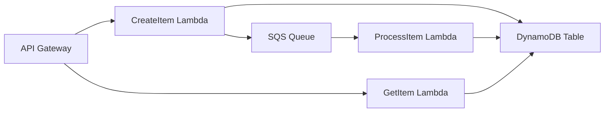

# How to Set Up AWS Application Composer for Visual Design

Author: [nawazdhandala](https://github.com/nawazdhandala)

Tags: AWS, Application Composer, Serverless, Visual Design, CloudFormation, SAM

Description: Use AWS Application Composer to visually design and build serverless applications by dragging and dropping AWS resources on an interactive canvas.

---

Writing CloudFormation or SAM templates by hand is tedious. You need to remember resource type names, property schemas, cross-resource references, and IAM permission patterns. Miss one property and your deployment fails with a cryptic error. AWS Application Composer takes a different approach - it gives you a visual canvas where you drag and drop AWS resources, connect them together, and it generates the correct infrastructure-as-code template behind the scenes.

Application Composer is not just a diagram tool. It is a bidirectional editor. You can design on the canvas and see the template update in real time, or edit the template directly and watch the canvas reflect your changes. This makes it genuinely useful for both visual thinkers and YAML warriors.

## Accessing Application Composer

Application Composer is available in two places:

1. **AWS Console** - navigate to Application Composer in the AWS Console
2. **VS Code** - install the AWS Toolkit extension, which includes Application Composer

The VS Code integration is particularly powerful because it works with your local files and integrates with your existing development workflow.

### VS Code Setup

```bash
# Install the AWS Toolkit extension
code --install-extension amazonwebservices.aws-toolkit-vscode

# Open a SAM template file and use the
# "Open with Application Composer" command
```

## Building Your First Application

Let us build a serverless API with Application Composer. The goal is a REST API that creates and retrieves items from a DynamoDB table, with an SQS queue for async processing.

### Step 1: Start a New Project

In the Application Composer canvas:

1. Start with a blank canvas or a starter template
2. The canvas shows a grid where you can place resources
3. The left panel shows available resource types

### Step 2: Add Resources

Drag these resources onto the canvas:

**API Gateway** - the entry point for your API

**Lambda Function (CreateItem)** - handles POST requests

**Lambda Function (GetItem)** - handles GET requests

**Lambda Function (ProcessItem)** - async processing worker

**DynamoDB Table** - stores items

**SQS Queue** - buffers async work

The canvas should look something like this:



### Step 3: Connect Resources

Click and drag connections between resources. When you connect:

- API Gateway to Lambda: creates an API route with Lambda integration
- Lambda to DynamoDB: grants the Lambda function read/write permissions
- Lambda to SQS: grants send message permissions
- SQS to Lambda: creates an event source mapping

Application Composer automatically generates the IAM policies needed for each connection. This is one of its biggest time-savers.

### Step 4: Configure Properties

Click on each resource to configure its properties:

**API Gateway:**
- Stage name: prod
- CORS: enabled
- Auth: none (for now)

**CreateItem Lambda:**
- Runtime: python3.12
- Memory: 256 MB
- Timeout: 10 seconds
- Handler: create_item.handler
- Route: POST /items

**GetItem Lambda:**
- Runtime: python3.12
- Memory: 128 MB
- Timeout: 5 seconds
- Handler: get_item.handler
- Route: GET /items/{id}

**DynamoDB Table:**
- Partition key: id (String)
- Billing mode: PAY_PER_REQUEST

**SQS Queue:**
- Visibility timeout: 60 seconds
- Message retention: 86400 seconds

## The Generated Template

As you design on the canvas, Application Composer generates a SAM template in real time. Here is what the template looks like for our design:

```yaml
# template.yaml - generated by Application Composer
AWSTemplateFormatVersion: '2010-09-09'
Transform: AWS::Serverless-2016-10-31
Description: Item management API with async processing

Globals:
  Function:
    Runtime: python3.12
    Architectures:
      - x86_64
    Environment:
      Variables:
        TABLE_NAME: !Ref ItemsTable
        QUEUE_URL: !GetAtt ProcessingQueue.QueueUrl

Resources:
  ItemsApi:
    Type: AWS::Serverless::Api
    Properties:
      StageName: prod
      Cors:
        AllowOrigin: "'*'"
        AllowMethods: "'GET,POST,OPTIONS'"
        AllowHeaders: "'Content-Type'"

  CreateItemFunction:
    Type: AWS::Serverless::Function
    Properties:
      CodeUri: src/create_item/
      Handler: create_item.handler
      MemorySize: 256
      Timeout: 10
      Events:
        CreateItem:
          Type: Api
          Properties:
            RestApiId: !Ref ItemsApi
            Path: /items
            Method: POST
      Policies:
        - DynamoDBCrudPolicy:
            TableName: !Ref ItemsTable
        - SQSSendMessagePolicy:
            QueueName: !GetAtt ProcessingQueue.QueueName

  GetItemFunction:
    Type: AWS::Serverless::Function
    Properties:
      CodeUri: src/get_item/
      Handler: get_item.handler
      MemorySize: 128
      Timeout: 5
      Events:
        GetItem:
          Type: Api
          Properties:
            RestApiId: !Ref ItemsApi
            Path: /items/{id}
            Method: GET
      Policies:
        - DynamoDBReadPolicy:
            TableName: !Ref ItemsTable

  ProcessItemFunction:
    Type: AWS::Serverless::Function
    Properties:
      CodeUri: src/process_item/
      Handler: process_item.handler
      MemorySize: 256
      Timeout: 60
      Events:
        SQSEvent:
          Type: SQS
          Properties:
            Queue: !GetAtt ProcessingQueue.Arn
            BatchSize: 10
      Policies:
        - DynamoDBCrudPolicy:
            TableName: !Ref ItemsTable

  ItemsTable:
    Type: AWS::DynamoDB::Table
    Properties:
      TableName: !Sub '${AWS::StackName}-items'
      AttributeDefinitions:
        - AttributeName: id
          AttributeType: S
      KeySchema:
        - AttributeName: id
          KeyType: HASH
      BillingMode: PAY_PER_REQUEST

  ProcessingQueue:
    Type: AWS::SQS::Queue
    Properties:
      VisibilityTimeout: 60
      MessageRetentionPeriod: 86400

Outputs:
  ApiEndpoint:
    Description: API Gateway endpoint URL
    Value: !Sub 'https://${ItemsApi}.execute-api.${AWS::Region}.amazonaws.com/prod'
```

Notice how Application Composer automatically chose the right SAM policy templates (DynamoDBCrudPolicy, SQSSendMessagePolicy, DynamoDBReadPolicy) based on the connections you drew. This is much less error-prone than writing IAM policies by hand.

## Writing the Function Code

Application Composer creates placeholder function code. Fill in the actual logic:

```python
# src/create_item/create_item.py
import json
import uuid
import os
import boto3

dynamodb = boto3.resource('dynamodb')
sqs = boto3.client('sqs')
table = dynamodb.Table(os.environ['TABLE_NAME'])
queue_url = os.environ['QUEUE_URL']

def handler(event, context):
    """Create a new item and queue it for processing."""
    body = json.loads(event['body'])

    item = {
        'id': str(uuid.uuid4()),
        'name': body['name'],
        'status': 'pending',
        'data': body.get('data', {})
    }

    # Save to DynamoDB
    table.put_item(Item=item)

    # Queue for async processing
    sqs.send_message(
        QueueUrl=queue_url,
        MessageBody=json.dumps({'item_id': item['id']})
    )

    return {
        'statusCode': 201,
        'headers': {'Content-Type': 'application/json'},
        'body': json.dumps(item)
    }
```

```python
# src/get_item/get_item.py
import json
import os
import boto3

dynamodb = boto3.resource('dynamodb')
table = dynamodb.Table(os.environ['TABLE_NAME'])

def handler(event, context):
    """Retrieve an item by ID."""
    item_id = event['pathParameters']['id']

    response = table.get_item(Key={'id': item_id})

    if 'Item' not in response:
        return {
            'statusCode': 404,
            'body': json.dumps({'error': 'Item not found'})
        }

    return {
        'statusCode': 200,
        'headers': {'Content-Type': 'application/json'},
        'body': json.dumps(response['Item'])
    }
```

## Deploying the Application

Since Application Composer generates standard SAM templates, deploy with the SAM CLI:

```bash
# Build the application
sam build

# Deploy (first time - guided mode)
sam deploy --guided

# Subsequent deployments
sam deploy
```

## Editing the Template Directly

The bidirectional editing is a killer feature. If you prefer YAML, edit the template directly and watch the canvas update:

```yaml
# Add a new resource directly in the template
# The canvas immediately shows it

  NotificationTopic:
    Type: AWS::SNS::Topic
    Properties:
      TopicName: !Sub '${AWS::StackName}-notifications'
```

Save the file, and the SNS Topic appears on the canvas. You can then drag a connection from a Lambda function to it, and Application Composer adds the publish permissions.

## Importing Existing Templates

If you have an existing SAM or CloudFormation template, open it with Application Composer and it will render the visual representation:

```bash
# In VS Code, right-click your template.yaml
# Select "Open with Application Composer"

# Or from the command palette:
# "Application Composer: Open Template"
```

This is excellent for understanding complex existing templates. Seeing the architecture visually makes it much easier to understand resource relationships and data flow.

## Team Collaboration

Since Application Composer works with standard SAM/CloudFormation template files, collaboration works through your normal version control workflow:

```bash
# The template.yaml is just a regular file in your repo
git add template.yaml
git commit -m "Add SQS queue for async processing"
git push
```

Team members can open the same template in their own Application Composer instances to visualize and modify the architecture.

## Tips for Effective Use

**Start visual, refine in code.** Use the canvas to lay out your architecture and connections. Then switch to the template editor for fine-tuning specific properties.

**Use groups to organize.** Application Composer lets you create visual groups on the canvas. Use them to separate concerns (API layer, processing layer, storage layer).

**Check the generated IAM policies.** Application Composer generates least-privilege policies based on connections, but review them to make sure they match your security requirements.

**Combine with SAM Accelerate** for fast iteration. Use `sam sync --watch` to deploy changes automatically as you design in Application Composer.

## Wrapping Up

AWS Application Composer brings visual infrastructure design to the serverless development workflow without sacrificing the precision of infrastructure-as-code. The bidirectional editing means you are never locked into one mode of working. It is particularly valuable for designing new applications where you want to think architecturally first, and for understanding existing templates that have grown complex over time. Since it generates standard SAM templates, there is zero vendor lock-in to the tool itself.
