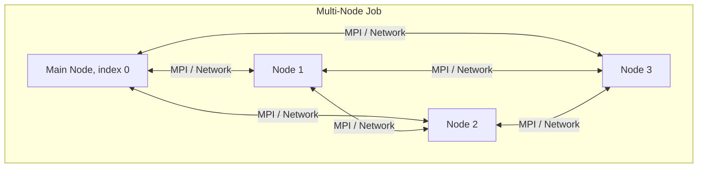

# How to Set Up AWS Batch Multi-Node Parallel Jobs

Author: [nawazdhandala](https://github.com/nawazdhandala)

Tags: AWS, Batch, Multi-Node, MPI, Parallel Computing, HPC, Distributed Computing

Description: Learn how to configure and run AWS Batch multi-node parallel jobs for tightly coupled workloads like MPI-based simulations and distributed training.

---

Not all batch workloads are embarrassingly parallel. Some need multiple nodes to work together - sharing data, synchronizing state, and communicating during execution. Think MPI-based simulations, distributed deep learning training, or large-scale numerical solvers. AWS Batch multi-node parallel jobs give you this capability without managing your own cluster.

This guide walks through the setup, from the job definition to the MPI configuration to actually running a distributed job.

## What Are Multi-Node Parallel Jobs?

A multi-node parallel job in AWS Batch launches multiple EC2 instances (nodes) that work together as a group. One node is designated the "main" node, and the rest are "child" nodes. All nodes can communicate with each other over the network. Each node knows:

- Its own index in the group
- Whether it is the main node
- The IP addresses of all other nodes

This is different from array jobs, where each child runs independently. Multi-node jobs are for tightly coupled workloads where nodes need to talk to each other.



## Prerequisites

- An AWS Batch compute environment with EFA-enabled or placement-group-enabled instances (for high-performance networking)
- A Docker image with MPI libraries (OpenMPI, Intel MPI, or similar) if you are running MPI workloads
- Sufficient instance capacity in your compute environment for all nodes

## Step 1: Create the Compute Environment

For multi-node jobs, you want instances in a placement group for low-latency networking.

```bash
# Create a compute environment suitable for multi-node jobs
aws batch create-compute-environment \
  --compute-environment-name mpi-compute-env \
  --type MANAGED \
  --compute-resources '{
    "type": "EC2",
    "allocationStrategy": "BEST_FIT_PROGRESSIVE",
    "minvCpus": 0,
    "maxvCpus": 512,
    "instanceTypes": ["c5n.18xlarge", "c5n.9xlarge", "m5n.12xlarge"],
    "subnets": ["subnet-0abc123"],
    "securityGroupIds": ["sg-0abc123"],
    "instanceRole": "arn:aws:iam::123456789012:instance-profile/ecsInstanceRole",
    "placementGroup": "mpi-cluster-pg"
  }' \
  --service-role arn:aws:iam::123456789012:role/AWSBatchServiceRole \
  --state ENABLED
```

The `c5n` instances have enhanced networking with up to 100 Gbps bandwidth, which matters for MPI communication. You can also use EFA-enabled instances for even lower latency. See our guide on [configuring EFA for HPC](https://oneuptime.com/blog/post/2026-02-12-configure-efa-elastic-fabric-adapter-for-hpc/view).

Create the placement group first:

```bash
# Create a cluster placement group
aws ec2 create-placement-group \
  --group-name mpi-cluster-pg \
  --strategy cluster
```

## Step 2: Create a Multi-Node Job Definition

```bash
# Register a multi-node parallel job definition
aws batch register-job-definition \
  --job-definition-name mpi-simulation \
  --type multinode \
  --node-properties '{
    "numNodes": 4,
    "mainNode": 0,
    "nodeRangeProperties": [
      {
        "targetNodes": "0:3",
        "container": {
          "image": "123456789012.dkr.ecr.us-east-1.amazonaws.com/mpi-app:latest",
          "resourceRequirements": [
            {"type": "VCPU", "value": "16"},
            {"type": "MEMORY", "value": "32768"}
          ],
          "linuxParameters": {
            "devices": [],
            "sharedMemorySize": 4096
          }
        }
      }
    ]
  }'
```

Key points:

- **numNodes: 4** - This job uses 4 nodes
- **mainNode: 0** - Node at index 0 is the main node
- **targetNodes: "0:3"** - All nodes (0 through 3) use the same container config. You can specify different configurations for different node ranges if needed.

## Step 3: Build the MPI Container Image

Your Docker image needs MPI installed and configured to work with AWS Batch's node discovery.

```dockerfile
FROM ubuntu:22.04

# Install OpenMPI and essential tools
RUN apt-get update && apt-get install -y \
    openmpi-bin \
    libopenmpi-dev \
    openssh-server \
    openssh-client \
    python3 \
    python3-pip \
    iproute2 \
    && rm -rf /var/lib/apt/lists/*

# Configure SSH for passwordless communication between nodes
RUN mkdir -p /root/.ssh && \
    ssh-keygen -t rsa -N "" -f /root/.ssh/id_rsa && \
    cp /root/.ssh/id_rsa.pub /root/.ssh/authorized_keys && \
    chmod 600 /root/.ssh/authorized_keys

# SSH config to skip host key checking between nodes
RUN echo "Host *\n  StrictHostKeyChecking no\n  UserKnownHostsFile /dev/null" > /root/.ssh/config

# Copy your MPI application
COPY simulation /app/simulation
COPY entrypoint.sh /app/entrypoint.sh
RUN chmod +x /app/entrypoint.sh

ENTRYPOINT ["/app/entrypoint.sh"]
```

## Step 4: Write the Entrypoint Script

The entrypoint script handles node discovery and launches MPI.

```bash
#!/bin/bash
# entrypoint.sh - Handles MPI setup and execution for AWS Batch multi-node jobs

# AWS Batch sets these environment variables
echo "Node index: $AWS_BATCH_JOB_NODE_INDEX"
echo "Main node: $AWS_BATCH_JOB_MAIN_NODE_INDEX"
echo "Number of nodes: $AWS_BATCH_JOB_NUM_NODES"

# Start SSH daemon for MPI communication
/usr/sbin/sshd -D &

# Get the IP of this node
MY_IP=$(hostname -I | awk '{print $1}')
echo "My IP: $MY_IP"

if [ "$AWS_BATCH_JOB_NODE_INDEX" == "$AWS_BATCH_JOB_MAIN_NODE_INDEX" ]; then
    echo "I am the main node. Waiting for all nodes to be ready..."

    # The main node needs to discover all child node IPs
    # AWS Batch provides them via the AWS_BATCH_JOB_NODE_INDEX env var on each node
    # Main node waits for child nodes to register their IPs in a shared location

    # Wait for all nodes to write their IPs to S3
    EXPECTED_NODES=$AWS_BATCH_JOB_NUM_NODES
    HOSTFILE="/tmp/hostfile"
    echo "$MY_IP slots=16" > $HOSTFILE

    # Poll S3 for child node registrations
    while true; do
        NODE_COUNT=$(aws s3 ls s3://my-batch-bucket/nodes/$AWS_BATCH_JOB_ID/ | wc -l)
        TOTAL=$((NODE_COUNT + 1))  # +1 for main node
        echo "Discovered $TOTAL of $EXPECTED_NODES nodes"
        if [ "$TOTAL" -ge "$EXPECTED_NODES" ]; then
            break
        fi
        sleep 5
    done

    # Download all child node IPs and build the hostfile
    for i in $(seq 1 $((EXPECTED_NODES - 1))); do
        CHILD_IP=$(aws s3 cp s3://my-batch-bucket/nodes/$AWS_BATCH_JOB_ID/node_$i - 2>/dev/null)
        echo "$CHILD_IP slots=16" >> $HOSTFILE
    done

    echo "Hostfile contents:"
    cat $HOSTFILE

    # Run the MPI application
    mpirun --hostfile $HOSTFILE \
           --mca btl_tcp_if_include eth0 \
           -np $((EXPECTED_NODES * 16)) \
           /app/simulation --input /data/input.dat --output /data/output.dat

    echo "MPI job completed with exit code $?"

else
    echo "I am child node $AWS_BATCH_JOB_NODE_INDEX. Registering with main node..."

    # Register this node's IP in S3
    echo "$MY_IP" | aws s3 cp - s3://my-batch-bucket/nodes/$AWS_BATCH_JOB_ID/node_$AWS_BATCH_JOB_NODE_INDEX

    # Keep the container running until the MPI job completes
    # The main node will connect via SSH to run MPI processes here
    echo "Waiting for MPI job to complete..."
    wait
fi
```

## Step 5: Submit the Multi-Node Job

```bash
# Submit the multi-node parallel job
aws batch submit-job \
  --job-name mpi-simulation-run \
  --job-queue mpi-job-queue \
  --job-definition mpi-simulation \
  --container-overrides '{
    "environment": [
      {"name": "INPUT_DATA", "value": "s3://my-bucket/simulation-input/"},
      {"name": "OUTPUT_DATA", "value": "s3://my-bucket/simulation-output/run-001/"}
    ]
  }'
```

## Different Configurations for Different Nodes

You can give the main node and child nodes different container configurations:

```bash
# Main node gets more resources for coordination
aws batch register-job-definition \
  --job-definition-name heterogeneous-mpi \
  --type multinode \
  --node-properties '{
    "numNodes": 8,
    "mainNode": 0,
    "nodeRangeProperties": [
      {
        "targetNodes": "0:0",
        "container": {
          "image": "123456789012.dkr.ecr.us-east-1.amazonaws.com/mpi-app:latest",
          "resourceRequirements": [
            {"type": "VCPU", "value": "32"},
            {"type": "MEMORY", "value": "65536"}
          ],
          "command": ["--role", "coordinator"]
        }
      },
      {
        "targetNodes": "1:7",
        "container": {
          "image": "123456789012.dkr.ecr.us-east-1.amazonaws.com/mpi-app:latest",
          "resourceRequirements": [
            {"type": "VCPU", "value": "16"},
            {"type": "MEMORY", "value": "32768"}
          ],
          "command": ["--role", "worker"]
        }
      }
    ]
  }'
```

## Scaling Considerations

Multi-node jobs have some important constraints:

- All nodes must be available before the job starts. Batch will not run a 4-node job with only 3 nodes.
- Multi-node jobs do not support Spot Instances (because losing one node kills the entire job)
- The nodes must be in the same AZ for placement group support
- There is no automatic retry at the node level - if one node fails, the whole job fails

For fault-tolerant parallel processing where nodes do not need to communicate, use [array jobs](https://oneuptime.com/blog/post/2026-02-12-use-aws-batch-array-jobs-for-parallel-processing/view) instead.

## Monitoring Multi-Node Jobs

```bash
# Check the status of all nodes in a multi-node job
aws batch describe-jobs --jobs <job-id> \
  --query 'jobs[0].nodeProperties.{NumNodes:numNodes,MainNode:mainNode}'

# List child node attempts
aws batch list-jobs --multi-node-job-id <job-id>
```

## Wrapping Up

Multi-node parallel jobs in AWS Batch bring cluster computing capabilities to a managed batch service. They are the right choice when your workload genuinely needs inter-node communication, like MPI simulations, distributed model training, or large-scale numerical computations. For everything else, array jobs are simpler and more flexible. The key to success is getting the networking right: use placement groups, choose network-optimized instances, and consider EFA for the most demanding workloads.
