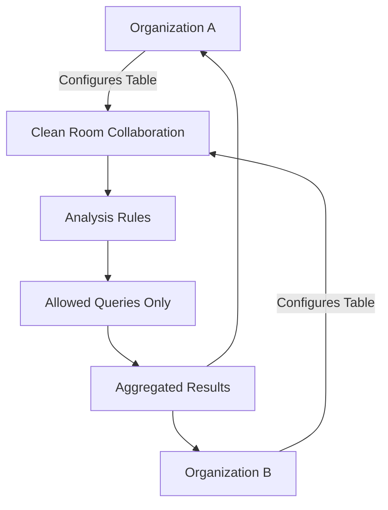

# How to Set Up AWS Clean Rooms for Collaborative Analytics

Author: [nawazdhandala](https://github.com/nawazdhandala)

Tags: AWS, Clean Rooms, Analytics, Privacy, Data Collaboration

Description: A practical guide to setting up AWS Clean Rooms for secure data collaboration between organizations, covering membership configuration, analysis rules, and running collaborative queries.

---

AWS Clean Rooms lets multiple organizations run joint analytics on their combined data without either party actually sharing raw data with the other. It's designed for scenarios like a retailer and a brand wanting to understand how ad campaigns drive in-store purchases, or two healthcare organizations comparing patient outcomes without exposing individual records.

The key idea is that both parties bring their data to a "clean room," define rules about what analysis is allowed, and only aggregated, privacy-safe results come out. Nobody sees the other party's raw data.

## How Clean Rooms Work



Each participant configures their data, defines what analysis is allowed on it, and the clean room enforces those rules during query execution.

## Step 1: Create a Collaboration

One party creates the collaboration and invites the other. Let's say you're the retailer (the creator) and you're collaborating with an advertising partner.

```bash
# Create a collaboration
aws cleanrooms create-collaboration \
  --name "retail-ad-campaign-analysis" \
  --description "Joint analysis of ad campaigns and purchase data" \
  --creator-member-abilities '["CAN_QUERY", "CAN_RECEIVE_RESULTS"]' \
  --creator-display-name "Acme Retail" \
  --members '[
    {
      "accountId": "987654321098",
      "memberAbilities": ["CAN_QUERY", "CAN_RECEIVE_RESULTS"],
      "displayName": "AdTech Partner"
    }
  ]' \
  --query-log-status ENABLED \
  --data-encryption-metadata '{
    "allowCleartext": true,
    "allowDuplicates": true,
    "preserveNulls": true
  }'
```

The `memberAbilities` field is important. You can restrict who can run queries and who can see results. For example, you might allow only one party to query while both receive results.

## Step 2: Create a Membership

Each party needs to accept the collaboration and create their membership. The creator's membership is automatic; the invited party needs to join explicitly.

```bash
# The invited party creates their membership
aws cleanrooms create-membership \
  --collaboration-identifier col-abc123 \
  --query-log-status ENABLED \
  --default-result-configuration '{
    "outputConfiguration": {
      "s3": {
        "bucket": "my-cleanroom-results",
        "keyPrefix": "campaign-analysis/",
        "resultFormat": "CSV"
      }
    },
    "roleArn": "arn:aws:iam::987654321098:role/CleanRoomsResultRole"
  }'
```

## Step 3: Configure Your Data Tables

Each party creates a "configured table" that maps their Glue Data Catalog table to the clean room. This is where you define the schema the clean room sees.

First, make sure your data is cataloged in Glue.

```bash
# Retailer configures their purchase data
aws cleanrooms create-configured-table \
  --name "purchase-data" \
  --description "Customer purchase transactions" \
  --table-reference '{
    "glue": {
      "tableName": "purchases",
      "databaseName": "retail_analytics"
    }
  }' \
  --allowed-columns '["hashed_email", "purchase_date", "product_category", "purchase_amount", "store_region"]' \
  --analysis-method DIRECT_QUERY
```

Notice `allowed-columns` - you choose exactly which columns are visible in the clean room. Sensitive columns like raw email addresses or customer IDs stay out. Instead, use a hashed identifier for matching.

## Step 4: Define Analysis Rules

Analysis rules are the heart of Clean Rooms. They control what queries can be run against your data. There are two types: aggregation rules and list rules.

**Aggregation rules** ensure queries only return aggregate results (sums, counts, averages) and enforce minimum aggregation thresholds so individual records can't be inferred.

```bash
# Create an aggregation analysis rule
aws cleanrooms create-configured-table-analysis-rule \
  --configured-table-identifier ct-purchases123 \
  --analysis-rule-type AGGREGATION \
  --analysis-rule-policy '{
    "v1": {
      "aggregation": {
        "aggregateColumns": [
          {
            "columnNames": ["purchase_amount"],
            "function": "SUM"
          },
          {
            "columnNames": ["purchase_amount"],
            "function": "AVG"
          },
          {
            "columnNames": ["hashed_email"],
            "function": "COUNT_DISTINCT"
          }
        ],
        "joinColumns": ["hashed_email"],
        "joinRequired": "QUERY_RUNNER",
        "dimensionColumns": ["product_category", "store_region", "purchase_date"],
        "scalarFunctions": ["TRUNC", "YEAR", "MONTH"],
        "outputConstraints": [
          {
            "columnName": "hashed_email",
            "minimum": 25,
            "type": "COUNT_DISTINCT"
          }
        ]
      }
    }
  }'
```

The `outputConstraints` section is critical for privacy. The `minimum: 25` setting means that any result row must represent at least 25 distinct users. This prevents someone from writing a query so specific that it identifies individual people.

**List rules** allow returning row-level data but with strict controls on which columns and overlap criteria.

```bash
# Create a list analysis rule for the ad partner's data
aws cleanrooms create-configured-table-analysis-rule \
  --configured-table-identifier ct-adimpressions456 \
  --analysis-rule-type LIST \
  --analysis-rule-policy '{
    "v1": {
      "list": {
        "joinColumns": ["hashed_email"],
        "listColumns": ["campaign_name", "impression_date", "channel"],
        "allowedJoinOperators": ["OR"]
      }
    }
  }'
```

## Step 5: Associate Tables with the Collaboration

Link your configured tables to the collaboration so they're available for queries.

```bash
# Associate the purchase data table
aws cleanrooms create-configured-table-association \
  --configured-table-identifier ct-purchases123 \
  --membership-identifier mem-retailer789 \
  --name "purchases" \
  --role-arn "arn:aws:iam::123456789012:role/CleanRoomsTableRole"

# The ad partner associates their table similarly
aws cleanrooms create-configured-table-association \
  --configured-table-identifier ct-adimpressions456 \
  --membership-identifier mem-adpartner789 \
  --name "ad_impressions" \
  --role-arn "arn:aws:iam::987654321098:role/CleanRoomsTableRole"
```

## Step 6: Run a Collaborative Query

With everything set up, run an analysis query. The query joins data from both parties but only returns aggregated results that satisfy all analysis rules.

```bash
# Run a query to analyze campaign effectiveness
aws cleanrooms start-protected-query \
  --type SQL \
  --membership-identifier mem-retailer789 \
  --sql-parameters '{
    "queryString": "SELECT ai.campaign_name, p.product_category, p.store_region, COUNT(DISTINCT p.hashed_email) as matched_customers, SUM(p.purchase_amount) as total_purchases, AVG(p.purchase_amount) as avg_purchase FROM purchases p INNER JOIN ad_impressions ai ON p.hashed_email = ai.hashed_email WHERE YEAR(p.purchase_date) = 2025 AND MONTH(p.purchase_date) = 12 GROUP BY ai.campaign_name, p.product_category, p.store_region HAVING COUNT(DISTINCT p.hashed_email) >= 25"
  }' \
  --result-configuration '{
    "outputConfiguration": {
      "s3": {
        "bucket": "my-cleanroom-results",
        "keyPrefix": "dec-2025-analysis/",
        "resultFormat": "CSV"
      }
    }
  }'
```

The `HAVING COUNT(DISTINCT p.hashed_email) >= 25` matches our output constraint. If a query tries to return more granular results, Clean Rooms blocks it.

```bash
# Check query status
aws cleanrooms get-protected-query \
  --membership-identifier mem-retailer789 \
  --protected-query-identifier pq-query123
```

## Monitoring and Auditing

Clean Rooms logs all queries to CloudTrail, which is essential for compliance.

```bash
# List recent protected queries
aws cleanrooms list-protected-queries \
  --membership-identifier mem-retailer789 \
  --status COMPLETED

# Get query details including what was queried
aws cleanrooms get-protected-query \
  --membership-identifier mem-retailer789 \
  --protected-query-identifier pq-query123 \
  --query 'ProtectedQuery.{Status:Status,SQL:SqlParameters.QueryString,Statistics:Statistics}'
```

## Best Practices

- **Hash identifiers before loading.** Never put raw email addresses or phone numbers in clean room tables. Pre-hash them with SHA-256 and make sure both parties use the same hashing method.
- **Set output constraints generously.** A minimum of 25-100 distinct identifiers per result row is common. Lower thresholds increase re-identification risk.
- **Review query logs regularly.** Even with analysis rules, review what queries partners are running to ensure they align with the collaboration's purpose.
- **Test with synthetic data first.** Set up the clean room with fake data and run your planned analyses before loading production data.
- **Use encryption at rest and in transit.** Clean Rooms supports AWS KMS for encrypting results at rest.

AWS Clean Rooms fills a real gap in collaborative analytics. Before it existed, organizations had to either share raw data (risky), build custom secure computation infrastructure (expensive), or just skip the analysis entirely (wasteful). If you need to analyze data across organizational boundaries while maintaining privacy, this is the managed solution that makes it practical.
