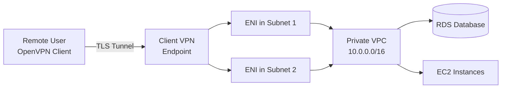

# How to Set Up AWS Client VPN for Remote Access

Author: [nawazdhandala](https://github.com/nawazdhandala)

Tags: AWS, VPN, Networking, Security

Description: Configure AWS Client VPN to give remote users secure access to AWS resources and on-premises networks using OpenVPN-based client connections.

---

Site-to-site VPN connects networks. Client VPN connects individual users. When your developers, admins, or support engineers need to access resources in a private VPC from their laptops, AWS Client VPN is the answer. It's a managed OpenVPN-compatible service that scales automatically and integrates with your existing identity providers.

No need to run your own OpenVPN server on EC2. AWS manages the infrastructure, handles scaling, and provides high availability. You just configure the endpoint, set up authentication, and distribute the client configuration.

## How Client VPN Works



Client VPN creates an elastic network interface in each associated subnet. Client traffic enters through the ENI and can access anything in the VPC (subject to security groups and authorization rules).

## Step 1: Generate Certificates

Client VPN supports three authentication methods:
- Mutual TLS (certificates)
- Active Directory
- SAML-based federated authentication

For this guide, we'll use mutual TLS since it's the most straightforward. You need a server certificate and client certificates.

Generate certificates using easy-rsa:

```bash
# Clone easy-rsa
git clone https://github.com/OpenVPN/easy-rsa.git
cd easy-rsa/easyrsa3

# Initialize PKI
./easyrsa init-pki

# Build the CA (Certificate Authority)
./easyrsa build-ca nopass
# Enter a common name like "VPN CA"

# Generate server certificate
./easyrsa build-server-full server nopass

# Generate client certificate
./easyrsa build-client-full client1 nopass
```

Upload the certificates to AWS Certificate Manager:

```bash
# Upload the server certificate
SERVER_CERT_ARN=$(aws acm import-certificate \
  --certificate fileb://pki/issued/server.crt \
  --private-key fileb://pki/private/server.key \
  --certificate-chain fileb://pki/ca.crt \
  --query 'CertificateArn' \
  --output text)

# Upload the client certificate (only if using mutual auth)
CLIENT_CERT_ARN=$(aws acm import-certificate \
  --certificate fileb://pki/issued/client1.crt \
  --private-key fileb://pki/private/client1.key \
  --certificate-chain fileb://pki/ca.crt \
  --query 'CertificateArn' \
  --output text)

echo "Server cert: $SERVER_CERT_ARN"
echo "Client cert: $CLIENT_CERT_ARN"
```

## Step 2: Create the Client VPN Endpoint

```bash
# Create the Client VPN endpoint
ENDPOINT_ID=$(aws ec2 create-client-vpn-endpoint \
  --client-cidr-block 10.100.0.0/16 \
  --server-certificate-arn $SERVER_CERT_ARN \
  --authentication-options '[{
    "Type": "certificate-authentication",
    "MutualAuthentication": {
      "ClientRootCertificateChainArn": "'$CLIENT_CERT_ARN'"
    }
  }]' \
  --connection-log-options '{
    "Enabled": true,
    "CloudwatchLogGroup": "/aws/clientvpn",
    "CloudwatchLogStream": "connections"
  }' \
  --transport-protocol udp \
  --vpn-port 443 \
  --split-tunnel true \
  --tag-specifications 'ResourceType=client-vpn-endpoint,Tags=[{Key=Name,Value=dev-vpn}]' \
  --query 'ClientVpnEndpointId' \
  --output text)

echo "Client VPN Endpoint: $ENDPOINT_ID"
```

Key parameters explained:

- `client-cidr-block`: The IP range assigned to connected VPN clients. Must not overlap with your VPC CIDR.
- `split-tunnel`: When true, only traffic destined for your VPC goes through the VPN. Internet traffic uses the client's regular connection. This is usually what you want.
- `transport-protocol`: UDP is faster, TCP is more firewall-friendly.

## Step 3: Associate with Target Subnets

Associate the endpoint with at least one subnet in your VPC:

```bash
# Associate with a subnet in AZ-a
aws ec2 associate-client-vpn-target-network \
  --client-vpn-endpoint-id $ENDPOINT_ID \
  --subnet-id $PRIVATE_SUBNET_1

# Associate with a subnet in AZ-b for high availability
aws ec2 associate-client-vpn-target-network \
  --client-vpn-endpoint-id $ENDPOINT_ID \
  --subnet-id $PRIVATE_SUBNET_2
```

Each association creates an ENI in the subnet. Associating with multiple subnets provides high availability - if one AZ goes down, clients can still connect through the other.

## Step 4: Add Authorization Rules

By default, no one can access anything. You need explicit authorization rules:

```bash
# Allow all connected clients to access the entire VPC
aws ec2 authorize-client-vpn-ingress \
  --client-vpn-endpoint-id $ENDPOINT_ID \
  --target-network-cidr 10.0.0.0/16 \
  --authorize-all-groups

# Or restrict to specific Active Directory groups
aws ec2 authorize-client-vpn-ingress \
  --client-vpn-endpoint-id $ENDPOINT_ID \
  --target-network-cidr 10.0.10.0/24 \
  --access-group-id "S-1-5-21-xxxx-xxxx-xxxx-1001"
```

You can create fine-grained rules:

```bash
# Developers can access the app subnet
aws ec2 authorize-client-vpn-ingress \
  --client-vpn-endpoint-id $ENDPOINT_ID \
  --target-network-cidr 10.0.10.0/24 \
  --authorize-all-groups

# Only DBAs can access the database subnet
aws ec2 authorize-client-vpn-ingress \
  --client-vpn-endpoint-id $ENDPOINT_ID \
  --target-network-cidr 10.0.20.0/24 \
  --access-group-id "dba-group-id"
```

## Step 5: Add Routes (If Using Split Tunnel)

If split tunnel is enabled, you need to add routes for the networks you want clients to reach:

```bash
# Route to the VPC
aws ec2 create-client-vpn-route \
  --client-vpn-endpoint-id $ENDPOINT_ID \
  --destination-cidr-block 10.0.0.0/16 \
  --target-vpc-subnet-id $PRIVATE_SUBNET_1

# Route to on-premises network (if you have site-to-site VPN)
aws ec2 create-client-vpn-route \
  --client-vpn-endpoint-id $ENDPOINT_ID \
  --destination-cidr-block 192.168.0.0/16 \
  --target-vpc-subnet-id $PRIVATE_SUBNET_1
```

## Step 6: Download and Distribute the Client Configuration

```bash
# Download the OpenVPN configuration file
aws ec2 export-client-vpn-client-configuration \
  --client-vpn-endpoint-id $ENDPOINT_ID \
  --output text > client-vpn-config.ovpn
```

The downloaded file needs client certificate and key appended:

```bash
# Append client certificate and key to the config file
echo "<cert>" >> client-vpn-config.ovpn
cat pki/issued/client1.crt >> client-vpn-config.ovpn
echo "</cert>" >> client-vpn-config.ovpn

echo "<key>" >> client-vpn-config.ovpn
cat pki/private/client1.key >> client-vpn-config.ovpn
echo "</key>" >> client-vpn-config.ovpn
```

Distribute this file to users. They import it into any OpenVPN-compatible client (AWS provides their own client, or users can use Tunnelblick on macOS, OpenVPN Connect on Windows).

## Security Best Practices

**Use SAML authentication for production.** Certificate-based auth works but doesn't integrate with your identity provider. SAML lets you use Okta, Azure AD, or any SAML 2.0 provider, giving you MFA and centralized user management.

```bash
# Create endpoint with SAML authentication
aws ec2 create-client-vpn-endpoint \
  --client-cidr-block 10.100.0.0/16 \
  --server-certificate-arn $SERVER_CERT_ARN \
  --authentication-options '[{
    "Type": "federated-authentication",
    "FederatedAuthentication": {
      "SAMLProviderArn": "arn:aws:iam::123456789012:saml-provider/OktaVPN"
    }
  }]' \
  --split-tunnel true
```

**Enable connection logging.** Always know who's connecting:

```bash
# Connection logs go to CloudWatch
aws logs create-log-group --log-group-name /aws/clientvpn
aws logs create-log-stream \
  --log-group-name /aws/clientvpn \
  --log-stream-name connections
```

**Rotate certificates regularly.** Set up a process to regenerate and redistribute client certificates on a schedule.

## Monitoring Connected Clients

```bash
# List currently connected clients
aws ec2 describe-client-vpn-connections \
  --client-vpn-endpoint-id $ENDPOINT_ID \
  --query 'Connections[?Status.Code==`active`].{User:CommonName,IP:ClientIp,Connected:ConnectionEstablishedTime}' \
  --output table

# Terminate a specific connection
aws ec2 terminate-client-vpn-connections \
  --client-vpn-endpoint-id $ENDPOINT_ID \
  --connection-id cvpn-connection-xxx
```

## Cost

Client VPN charges:
- **Endpoint association**: $0.10/hour per subnet association (~$72/month per subnet)
- **Connection fee**: $0.05/hour per active client connection

With two subnet associations, the baseline is $144/month before any client connections. Each connected user adds about $36/month (assuming 8 hours/day, 22 days/month).

For smaller teams, this might be overkill. Consider AWS Systems Manager Session Manager as a free alternative for SSH-style access without a VPN.

## Wrapping Up

AWS Client VPN gives your remote team secure access to VPC resources without managing VPN infrastructure. Set up the endpoint, configure authentication, add authorization rules, and distribute the client config. For production, use SAML authentication and always enable connection logging. The cost adds up with many users, so evaluate whether simpler solutions like Session Manager might work for your specific access patterns.
