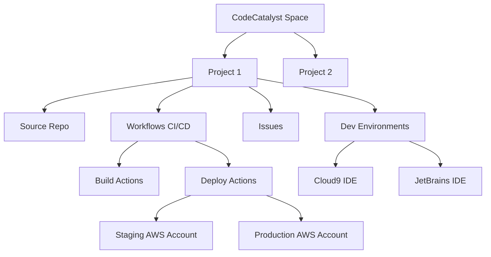

# How to Set Up AWS CodeCatalyst for DevOps

Author: [nawazdhandala](https://github.com/nawazdhandala)

Tags: AWS, CodeCatalyst, DevOps, CI/CD, Development, Collaboration

Description: Learn how to set up AWS CodeCatalyst as a unified DevOps platform for your team with project management, CI/CD pipelines, and development environments.

---

AWS has a lot of individual developer tools - CodeCommit, CodeBuild, CodeDeploy, CodePipeline - but they have always felt like separate pieces that you had to wire together yourself. CodeCatalyst changes that. It is a unified DevOps service that brings source control, CI/CD, issue tracking, and development environments into a single platform. Think of it as AWS's answer to GitHub or GitLab, but with deeper integration into the AWS ecosystem.

This guide walks through setting up a CodeCatalyst space, creating your first project, connecting it to your AWS accounts, and getting your team productive.

## What Is CodeCatalyst?

CodeCatalyst is a cloud-based development platform that provides:

- **Source repositories** - Git-based repos hosted by AWS
- **Workflows** - CI/CD pipelines defined as YAML
- **Issues** - Lightweight issue tracking and project management
- **Dev Environments** - Cloud-based IDEs (powered by AWS Cloud9 or JetBrains)
- **Blueprints** - Project templates for common application types
- **Team management** - Spaces and projects for organizing teams

It runs outside your AWS account (it has its own identity system) but connects to your AWS accounts for deployment.

## Prerequisites

- An AWS account (for deployment targets)
- An AWS Builder ID (free, separate from your AWS account)
- A modern web browser

## Step 1: Create a CodeCatalyst Space

A space is the top-level organizational unit in CodeCatalyst. It contains projects, members, and billing settings.

1. Go to [codecatalyst.aws](https://codecatalyst.aws)
2. Sign in with your AWS Builder ID (create one if you do not have it)
3. Click "Create space"
4. Enter a space name (e.g., "my-company")
5. Connect your AWS account for billing and deployments

To connect your AWS account programmatically:

```bash
# Verify the connection from your AWS account side
aws codecatalyst list-spaces
```

## Step 2: Connect Your AWS Account

CodeCatalyst needs an AWS account connection to deploy resources. This involves creating an IAM role that CodeCatalyst can assume.

In the CodeCatalyst console:

1. Go to your space settings
2. Click "AWS accounts"
3. Click "Add AWS account"
4. Follow the prompts to create the connection

This creates a CloudFormation stack in your AWS account with the necessary IAM roles:

```yaml
# The connection creates roles similar to this
Resources:
  CodeCatalystRole:
    Type: AWS::IAM::Role
    Properties:
      RoleName: CodeCatalystWorkflowDevelopmentRole-my-space
      AssumeRolePolicyDocument:
        Version: '2012-10-17'
        Statement:
          - Effect: Allow
            Principal:
              Service: codecatalyst.amazonaws.com
            Action: sts:AssumeRole
            Condition:
              StringEquals:
                aws:SourceAccount: !Ref AWS::AccountId
      ManagedPolicyArns:
        - arn:aws:iam::aws:policy/AdministratorAccess
```

For production, you should scope down the permissions from `AdministratorAccess` to only what your workflows need.

## Step 3: Create a Project

Projects contain your source code, workflows, issues, and environments.

```bash
# Create a project using the CodeCatalyst API
aws codecatalyst create-project \
  --space-name "my-company" \
  --display-name "Payment Service" \
  --description "Payment processing microservice"
```

Or use the web console, which gives you the option to start from a blueprint (more on that later).

## Step 4: Set Up a Source Repository

Every project gets a source repository. You can create one from scratch or import from GitHub:

```bash
# Create a new source repository
aws codecatalyst create-source-repository \
  --space-name "my-company" \
  --project-name "PaymentService" \
  --name "payment-service"
```

Clone and start working:

```bash
# Clone the repository
git clone https://git.codecatalyst.aws/v1/my-company/PaymentService/payment-service

cd payment-service

# Add your application code
mkdir src
cat > src/index.js << 'EOF'
const express = require('express');
const app = express();

app.get('/health', (req, res) => {
    res.json({ status: 'healthy' });
});

app.post('/payments', (req, res) => {
    // Payment processing logic
    res.json({ paymentId: 'pay-12345', status: 'processed' });
});

app.listen(3000, () => {
    console.log('Payment service running on port 3000');
});
EOF

git add .
git commit -m "Initial application code"
git push
```

## Step 5: Create a CI/CD Workflow

Workflows are defined in `.codecatalyst/workflows/` as YAML files. Here is a complete workflow for building, testing, and deploying:

```yaml
# .codecatalyst/workflows/build-deploy.yaml
Name: BuildAndDeploy
SchemaVersion: "1.0"

Triggers:
  - Type: Push
    Branches:
      - main

Actions:
  Build:
    Identifier: aws/build@v1
    Inputs:
      Sources:
        - WorkflowSource
    Configuration:
      Steps:
        - Run: npm install
        - Run: npm run build
        - Run: npm test
    Outputs:
      Artifacts:
        - Name: BuildOutput
          Files:
            - "**/*"

  DeployToStaging:
    Identifier: aws/cdk-deploy@v1
    DependsOn:
      - Build
    Inputs:
      Sources:
        - WorkflowSource
      Artifacts:
        - BuildOutput
    Environment:
      Name: staging
      Connections:
        - Name: "123456789012"
          Role: CodeCatalystWorkflowDevelopmentRole-my-space
    Configuration:
      StackName: payment-service-staging
      Region: us-east-1
      CdkRootPath: ./infrastructure

  IntegrationTests:
    Identifier: aws/build@v1
    DependsOn:
      - DeployToStaging
    Inputs:
      Sources:
        - WorkflowSource
    Configuration:
      Steps:
        - Run: npm run test:integration

  DeployToProduction:
    Identifier: aws/cdk-deploy@v1
    DependsOn:
      - IntegrationTests
    Environment:
      Name: production
      Connections:
        - Name: "987654321098"
          Role: CodeCatalystWorkflowDevelopmentRole-my-space
    Configuration:
      StackName: payment-service-prod
      Region: us-east-1
      CdkRootPath: ./infrastructure
```

For a deeper dive into workflows, check out our guide on [using CodeCatalyst Workflows for CI/CD](https://oneuptime.com/blog/post/2026-02-12-use-codecatalyst-workflows-for-cicd/view).

## Step 6: Configure Environments

Environments in CodeCatalyst represent deployment targets. Create them through the console or API:

```bash
# Environments are configured in the CodeCatalyst console
# They map to AWS accounts and regions

# You can also define environment variables
aws codecatalyst create-environment \
  --space-name "my-company" \
  --project-name "PaymentService" \
  --name "staging" \
  --environment-type NON_PRODUCTION \
  --description "Staging environment for pre-production testing"
```

## Step 7: Invite Team Members

Add your team to the space and project:

1. Go to space settings > Members
2. Click "Invite members"
3. Enter their AWS Builder ID email addresses
4. Assign roles (Space Administrator, Space Member)

For project-level access:

1. Go to the project settings > Members
2. Add members from your space
3. Assign project roles (Project Administrator, Contributor, Reviewer)

## CodeCatalyst Architecture



## Step 8: Set Up Dev Environments

CodeCatalyst Dev Environments give your team cloud-based IDEs:

```bash
# Create a dev environment
aws codecatalyst create-dev-environment \
  --space-name "my-company" \
  --project-name "PaymentService" \
  --instance-type dev.standard1.small \
  --persistent-storage-size-in-gib 16 \
  --inactivity-timeout-minutes 30
```

For more on this topic, see our guide on [setting up CodeCatalyst Dev Environments](https://oneuptime.com/blog/post/2026-02-12-set-up-codecatalyst-dev-environments/view).

## Best Practices

1. **Start with a blueprint.** CodeCatalyst blueprints give you a working project with CI/CD already configured. Customize from there rather than starting from scratch.

2. **Scope down IAM roles.** The default development role has admin access. Create production roles with only the permissions your workflows actually need.

3. **Use environments for deployment gates.** Configure staging as NON_PRODUCTION and production as PRODUCTION. This adds appropriate guardrails.

4. **Integrate existing GitHub repos.** If your code is on GitHub, you can connect GitHub repositories to CodeCatalyst projects rather than migrating everything.

5. **Use branch-based workflows.** Set up workflows that trigger on pull requests for testing and on main branch merges for deployment.

## Wrapping Up

CodeCatalyst brings together the tools that DevOps teams need into a single, integrated platform. Instead of configuring CodeCommit, CodeBuild, CodeDeploy, and CodePipeline individually, you get a cohesive experience with source control, CI/CD, issue tracking, and development environments all in one place. Start with a small project, use a blueprint to get going quickly, and expand as your team gets comfortable with the platform. The tight integration with AWS accounts makes deployment straightforward, and the collaboration features make team development smoother.
