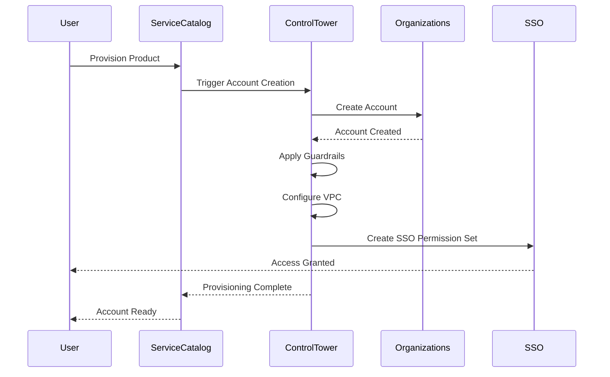

# How to Set Up AWS Control Tower Account Factory for New Accounts

Author: [nawazdhandala](https://github.com/nawazdhandala)

Tags: AWS, Control Tower, Account Factory, Multi-Account, Organizations

Description: Step-by-step guide to setting up AWS Control Tower Account Factory to automate the creation and configuration of new AWS accounts in your organization.

---

Managing AWS accounts at scale is one of those problems that seems simple until you are twenty accounts deep and each one was set up slightly differently. AWS Control Tower Account Factory solves this by giving you a repeatable, governed way to create new accounts that come pre-configured with your organization's guardrails, networking, and security baseline.

This guide covers setting up Account Factory, customizing the account creation process, and automating it for teams that need self-service account provisioning.

## What Is Account Factory?

Account Factory is a component of AWS Control Tower that lets you create new AWS accounts through a standardized workflow. Every account created through Account Factory automatically gets:

- Enrollment in AWS Control Tower governance
- Guardrails (preventive and detective) from your landing zone
- A baseline set of IAM roles and configurations
- VPC networking if configured
- SSO access for designated users

Think of it as a factory assembly line for AWS accounts. Every account that rolls off the line meets your organization's standards.

## Prerequisites

Before using Account Factory, you need:

- AWS Control Tower set up in your management account
- AWS Organizations configured (Control Tower handles this)
- AWS IAM Identity Center (SSO) configured
- Administrative access to the Control Tower dashboard
- An email address for each new account (must be unique across all AWS accounts)

## Step 1: Access Account Factory Settings

First, review and configure the Account Factory defaults. In the AWS Console, navigate to AWS Control Tower and click on "Account Factory" in the left sidebar.

The Account Factory settings page lets you configure:

- **Network configuration** - Default VPC settings for new accounts
- **Account email template** - Naming convention for account emails
- **Organizational Unit** - Where new accounts land in your OU structure

## Step 2: Configure Network Defaults

Account Factory can automatically provision VPC networking in new accounts. This is optional but recommended for consistency.

Here is a Terraform configuration that sets up Account Factory network defaults:

```hcl
# Configure Account Factory network settings
resource "aws_controltower_landing_zone" "network_config" {
  manifest_json = jsonencode({
    governedRegions = ["us-east-1", "us-west-2"]
    organizationStructure = {
      security = {
        name = "Security"
      }
      sandbox = {
        name = "Sandbox"
      }
    }
    centralizedLogging = {
      accountId = "111111111111"
      configurations = {
        loggingBucket = {
          retentionDays = 365
        }
        accessLoggingBucket = {
          retentionDays = 365
        }
      }
      enabled = true
    }
    securityRoles = {
      accountId = "222222222222"
    }
    accessManagement = {
      enabled = true
    }
  })

  version = "3.3"
}
```

For the VPC configuration specifically, you can set defaults through the Account Factory settings page or through Service Catalog:

```bash
# List the Account Factory provisioned product portfolios
aws servicecatalog search-products \
  --filters '{"FullTextSearch": ["AWS Control Tower Account Factory"]}'
```

## Step 3: Create a New Account via the Console

The simplest way to create an account is through the Control Tower console:

1. Go to AWS Control Tower > Account Factory
2. Click "Create account"
3. Fill in the required fields:
   - Account email (unique, never used with AWS before)
   - Display name
   - SSO user email
   - SSO first and last name
   - Organizational Unit (where to place the account)
4. Click "Create account"

Account provisioning typically takes 20-30 minutes. Control Tower provisions the account through AWS Service Catalog behind the scenes.

## Step 4: Create Accounts Programmatically

For automation, you can create accounts using the Service Catalog API. This is how most teams implement self-service account creation.

```python
# Python script to create a new account via Service Catalog
import boto3
import json

sc_client = boto3.client('servicecatalog')

# Find the Account Factory product
products = sc_client.search_products(
    Filters={'FullTextSearch': ['AWS Control Tower Account Factory']}
)
product_id = products['ProductViewSummaries'][0]['ProductId']

# Get the latest provisioning artifact (version)
artifacts = sc_client.list_provisioning_artifacts(
    ProductId=product_id
)
artifact_id = artifacts['ProvisioningArtifactDetails'][-1]['Id']

# Provision a new account
response = sc_client.provision_product(
    ProductId=product_id,
    ProvisioningArtifactId=artifact_id,
    ProvisionedProductName='team-alpha-dev',
    ProvisioningParameters=[
        {
            'Key': 'AccountEmail',
            'Value': 'aws+team-alpha-dev@yourcompany.com'
        },
        {
            'Key': 'AccountName',
            'Value': 'Team Alpha Dev'
        },
        {
            'Key': 'ManagedOrganizationalUnit',
            'Value': 'Sandbox'
        },
        {
            'Key': 'SSOUserEmail',
            'Value': 'team-alpha-lead@yourcompany.com'
        },
        {
            'Key': 'SSOUserFirstName',
            'Value': 'Alpha'
        },
        {
            'Key': 'SSOUserLastName',
            'Value': 'Lead'
        }
    ]
)

print(f"Account provisioning started: {response['RecordDetail']['RecordId']}")
```

## Step 5: Monitor Account Provisioning

Track the status of account creation:

```python
# Check the status of account provisioning
import boto3

sc_client = boto3.client('servicecatalog')

# Use the record ID from the provision call
record = sc_client.describe_record(
    Id='rec-xxxxxxxxxxxx'
)

status = record['RecordDetail']['Status']
print(f"Provisioning status: {status}")

# List any errors if provisioning failed
if status == 'FAILED':
    for error in record['RecordErrors']:
        print(f"Error: {error['Description']}")
```

## Account Factory Workflow

Here is how the Account Factory process works end to end:



## Step 6: Customize Account Baselines

Out of the box, Account Factory applies Control Tower's baseline. But most organizations need additional customizations. You can use AWS Control Tower Customizations (CfCT) or Account Factory for Terraform (AFT) for this.

For a deeper dive into customizations, check out our guide on [using AWS Control Tower Customizations](https://oneuptime.com/blog/post/use-aws-control-tower-customizations-cfct/view).

A common baseline includes:

- CloudTrail logging to a centralized bucket
- AWS Config rules beyond the defaults
- Security Hub enablement
- GuardDuty enrollment
- Default IAM password policy
- Budget alerts

## Step 7: Set Up Account Factory for Terraform (AFT)

For teams that prefer Terraform, AFT provides a Terraform-native way to create and customize accounts:

```hcl
# AFT account request - place in your aft-account-request repo
module "team_alpha_dev" {
  source = "./modules/aft-account-request"

  control_tower_parameters = {
    AccountEmail              = "aws+team-alpha-dev@yourcompany.com"
    AccountName               = "Team Alpha Dev"
    ManagedOrganizationalUnit = "Sandbox"
    SSOUserEmail              = "team-alpha-lead@yourcompany.com"
    SSOUserFirstName          = "Alpha"
    SSOUserLastName           = "Lead"
  }

  account_tags = {
    Team        = "alpha"
    Environment = "dev"
    CostCenter  = "CC-1234"
  }

  account_customizations_name = "sandbox-baseline"
}
```

AFT uses a GitOps approach. You commit account requests to a repository, and a pipeline handles provisioning and customization automatically.

## Best Practices

1. **Use a naming convention for account emails.** Something like `aws+{team}-{env}@company.com` using Gmail-style plus addressing. This makes account management predictable.

2. **Organize OUs by workload type.** Create separate OUs for sandbox, development, staging, and production accounts. Apply different guardrails to each.

3. **Set up budget alerts on every account.** Include a budget alert in your account baseline so new accounts never run up unexpected charges.

4. **Use tags consistently.** Tag every account with team, environment, cost center, and project. This is critical for cost allocation and compliance reporting.

5. **Automate account decommissioning.** Have a process for closing accounts when they are no longer needed. Orphaned accounts are a security and cost risk.

## Troubleshooting

If account provisioning fails:

- Check the Service Catalog provisioned product for error messages
- Verify the email address has never been used with any AWS account
- Ensure your Control Tower landing zone is in a healthy state
- Check that the target OU exists and is registered with Control Tower
- Review CloudTrail logs in the management account for detailed errors

## Wrapping Up

AWS Control Tower Account Factory turns account creation from a manual, error-prone process into a standardized, automated workflow. Whether you use the console for occasional account creation or the API for self-service automation, every account comes out configured to your organization's standards. Start with the console to understand the workflow, then move to programmatic creation as your organization grows. The time you invest in setting this up properly pays dividends every time a new team needs an account.
