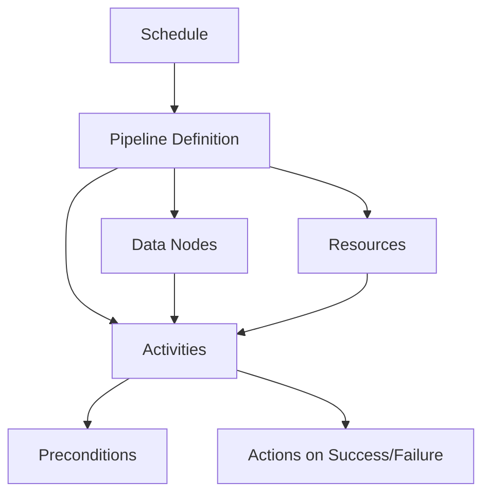

# How to Set Up AWS Data Pipeline

Author: [nawazdhandala](https://github.com/nawazdhandala)

Tags: AWS, Data Pipeline, ETL, Data Engineering

Description: A practical guide to setting up AWS Data Pipeline for orchestrating data movement and transformation across AWS services including S3, RDS, DynamoDB, and EMR.

---

AWS Data Pipeline is a web service for orchestrating data movement and transformation across AWS services and on-premises data sources. It lets you define data-driven workflows where activities run on a schedule or in response to events. While newer services like Step Functions and Glue have taken over many use cases, Data Pipeline still shines for straightforward data movement tasks like copying data between S3, RDS, DynamoDB, and Redshift.

If you need to move data from RDS to S3 on a daily schedule, replicate DynamoDB tables across regions, or run EMR jobs on a cron, Data Pipeline handles it with minimal configuration.

## How Data Pipeline Works

A pipeline consists of a few key components:



- **Data Nodes** define where your data lives (S3, RDS, DynamoDB)
- **Activities** define what to do (copy, SQL transform, EMR job)
- **Resources** define where activities run (EC2 instances or EMR clusters)
- **Schedules** define when things happen
- **Preconditions** define conditions that must be true before an activity runs

## Step 1: Create an IAM Role for Data Pipeline

Data Pipeline needs two roles: one for the pipeline itself and one for the EC2 instances it launches.

```bash
# Create the pipeline role
cat > pipeline-trust.json << 'EOF'
{
  "Version": "2012-10-17",
  "Statement": [{
    "Effect": "Allow",
    "Principal": {
      "Service": ["datapipeline.amazonaws.com", "elasticmapreduce.amazonaws.com"]
    },
    "Action": "sts:AssumeRole"
  }]
}
EOF

aws iam create-role \
  --role-name DataPipelineRole \
  --assume-role-policy-document file://pipeline-trust.json

aws iam attach-role-policy \
  --role-name DataPipelineRole \
  --policy-arn arn:aws:iam::aws:policy/service-role/AWSDataPipelineRole

# Create the resource (EC2) role
cat > ec2-trust.json << 'EOF'
{
  "Version": "2012-10-17",
  "Statement": [{
    "Effect": "Allow",
    "Principal": {
      "Service": "ec2.amazonaws.com"
    },
    "Action": "sts:AssumeRole"
  }]
}
EOF

aws iam create-role \
  --role-name DataPipelineResourceRole \
  --assume-role-policy-document file://ec2-trust.json

aws iam attach-role-policy \
  --role-name DataPipelineResourceRole \
  --policy-arn arn:aws:iam::aws:policy/service-role/AmazonEC2RoleforDataPipelineRole

# Create instance profile
aws iam create-instance-profile \
  --instance-profile-name DataPipelineResourceProfile

aws iam add-role-to-instance-profile \
  --instance-profile-name DataPipelineResourceProfile \
  --role-name DataPipelineResourceRole
```

## Step 2: Create a Pipeline to Copy RDS to S3

This is the most common Data Pipeline use case: exporting data from an RDS database to S3 on a daily schedule.

```bash
# Create the pipeline
aws datapipeline create-pipeline \
  --name rds-to-s3-export \
  --unique-id rds-to-s3-daily

# Get the pipeline ID from the output - you'll need it
# Let's say it returns: df-1234567890
```

Now define the pipeline configuration.

```json
{
  "objects": [
    {
      "id": "Default",
      "name": "Default",
      "schedule": {"ref": "DailySchedule"},
      "failureAndRerunMode": "CASCADE",
      "pipelineLogUri": "s3://my-pipeline-logs/rds-export/",
      "role": "DataPipelineRole",
      "resourceRole": "DataPipelineResourceRole"
    },
    {
      "id": "DailySchedule",
      "type": "Schedule",
      "name": "Run Daily at 2 AM",
      "period": "1 day",
      "startAt": "FIRST_ACTIVATION_DATE_TIME",
      "startDateTime": "2026-02-13T02:00:00"
    },
    {
      "id": "RdsDatabase",
      "type": "RdsDatabase",
      "name": "Production RDS",
      "rdsInstanceId": "myapp-prod-db",
      "username": "pipeline_reader",
      "*password": "SecurePassword123!",
      "databaseName": "myapp"
    },
    {
      "id": "SourceData",
      "type": "SqlDataNode",
      "name": "Orders Table",
      "database": {"ref": "RdsDatabase"},
      "table": "orders",
      "selectQuery": "SELECT * FROM orders WHERE updated_at >= '#{@scheduledStartTime}' AND updated_at < '#{@scheduledEndTime}'"
    },
    {
      "id": "S3Output",
      "type": "S3DataNode",
      "name": "S3 Export Location",
      "directoryPath": "s3://my-data-lake/rds-exports/orders/#{format(@scheduledStartTime, 'yyyy-MM-dd')}/"
    },
    {
      "id": "CopyActivity",
      "type": "CopyActivity",
      "name": "Export Orders to S3",
      "input": {"ref": "SourceData"},
      "output": {"ref": "S3Output"},
      "runsOn": {"ref": "Ec2Resource"},
      "onSuccess": {"ref": "SuccessNotification"},
      "onFail": {"ref": "FailureNotification"}
    },
    {
      "id": "Ec2Resource",
      "type": "Ec2Resource",
      "name": "Pipeline Worker",
      "instanceType": "m5.large",
      "securityGroups": "sg-pipeline123",
      "subnetId": "subnet-private1",
      "terminateAfter": "2 hours"
    },
    {
      "id": "SuccessNotification",
      "type": "SnsAlarm",
      "name": "Success Alert",
      "topicArn": "arn:aws:sns:us-east-1:123456789012:pipeline-alerts",
      "subject": "RDS Export Completed",
      "message": "Orders export to S3 completed successfully for #{@scheduledStartTime}"
    },
    {
      "id": "FailureNotification",
      "type": "SnsAlarm",
      "name": "Failure Alert",
      "topicArn": "arn:aws:sns:us-east-1:123456789012:pipeline-alerts",
      "subject": "RDS Export FAILED",
      "message": "Orders export to S3 FAILED for #{@scheduledStartTime}. Check logs."
    }
  ]
}
```

Upload the definition and activate.

```bash
# Put the pipeline definition
aws datapipeline put-pipeline-definition \
  --pipeline-id df-1234567890 \
  --pipeline-definition file://rds-export-pipeline.json

# Validate the pipeline
aws datapipeline validate-pipeline-definition \
  --pipeline-id df-1234567890 \
  --pipeline-definition file://rds-export-pipeline.json

# Activate the pipeline
aws datapipeline activate-pipeline --pipeline-id df-1234567890
```

## Step 3: DynamoDB to S3 Export Pipeline

Another common pattern is backing up DynamoDB tables to S3.

```json
{
  "objects": [
    {
      "id": "Default",
      "name": "Default",
      "schedule": {"ref": "WeeklySchedule"},
      "pipelineLogUri": "s3://my-pipeline-logs/dynamo-backup/",
      "role": "DataPipelineRole",
      "resourceRole": "DataPipelineResourceRole"
    },
    {
      "id": "WeeklySchedule",
      "type": "Schedule",
      "name": "Weekly Sunday Backup",
      "period": "1 week",
      "startAt": "FIRST_ACTIVATION_DATE_TIME",
      "startDateTime": "2026-02-16T03:00:00"
    },
    {
      "id": "DynamoSource",
      "type": "DynamoDBDataNode",
      "name": "Users Table",
      "tableName": "users",
      "readThroughputPercent": "0.25"
    },
    {
      "id": "S3Backup",
      "type": "S3DataNode",
      "name": "S3 Backup Location",
      "directoryPath": "s3://my-backups/dynamodb/users/#{format(@scheduledStartTime, 'yyyy-MM-dd')}/"
    },
    {
      "id": "EmrCluster",
      "type": "EmrCluster",
      "name": "Backup EMR Cluster",
      "coreInstanceCount": "2",
      "coreInstanceType": "m5.xlarge",
      "masterInstanceType": "m5.xlarge",
      "releaseLabel": "emr-6.15.0",
      "terminateAfter": "4 hours"
    },
    {
      "id": "BackupActivity",
      "type": "EmrActivity",
      "name": "DynamoDB Backup",
      "input": {"ref": "DynamoSource"},
      "output": {"ref": "S3Backup"},
      "runsOn": {"ref": "EmrCluster"},
      "step": "s3://dynamodb-dpl-us-east-1/emr-ddb-storage-handler/4.14.0/emr-dynamodb-tools-4.14.0-jar-with-dependencies.jar,org.apache.hive.dynamodb.tools.DynamoDBExport,#{output.directoryPath},#{input.tableName},#{input.readThroughputPercent}"
    }
  ]
}
```

## Monitoring Your Pipelines

Keep tabs on pipeline health through the CLI.

```bash
# List all pipelines
aws datapipeline list-pipelines

# Get pipeline status
aws datapipeline describe-pipelines --pipeline-ids df-1234567890

# List pipeline runs
aws datapipeline list-runs --pipeline-id df-1234567890 --status RUNNING

# Query specific objects in the pipeline
aws datapipeline query-objects \
  --pipeline-id df-1234567890 \
  --sphere INSTANCE \
  --query '{"selectors": [{"fieldName": "@status", "operator": {"type": "EQ", "values": ["FAILED"]}}]}'
```

## Setting Up Alerts

Always configure notifications. Pipeline failures need immediate attention, especially for business-critical data flows.

```bash
# Create an SNS topic for pipeline alerts
aws sns create-topic --name pipeline-alerts

# Subscribe your team
aws sns subscribe \
  --topic-arn arn:aws:sns:us-east-1:123456789012:pipeline-alerts \
  --protocol email \
  --notification-endpoint team@mycompany.com
```

For more comprehensive monitoring beyond SNS alerts, check out how to set up [proper infrastructure monitoring](https://oneuptime.com/blog/post/2026-02-12-set-up-cloudwatch-alarms-for-ec2-cpu-and-memory/view) that covers all your data pipeline components.

## When to Use Data Pipeline vs Alternatives

Data Pipeline is solid for its original use case, but know your alternatives:

- **AWS Glue** - Better for complex ETL with schema transformations
- **Step Functions** - Better for complex workflow orchestration with branching logic
- **EventBridge + Lambda** - Better for event-driven, lightweight data movement
- **MWAA (Managed Airflow)** - Better when you need full DAG capabilities

Use Data Pipeline when you need simple, scheduled data movement between AWS services with built-in retry logic and notifications. It's been around since 2012, it's battle-tested, and it just works for the patterns it was designed for.
