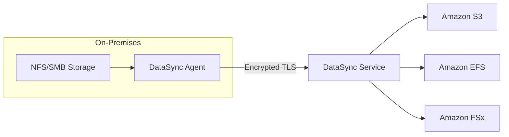

# How to Set Up AWS DataSync for Data Transfer

Author: [nawazdhandala](https://github.com/nawazdhandala)

Tags: AWS, DataSync, Data Transfer, Storage, Migration

Description: Complete guide to setting up AWS DataSync for automated data transfer between on-premises storage and AWS services, including agent deployment and task configuration.

---

Moving data between on-premises storage and AWS can be surprisingly complicated when you start dealing with large datasets, incremental transfers, and data integrity verification. AWS DataSync is purpose-built for this exact problem. It's a managed data transfer service that can move data up to 10x faster than standard tools like rsync or cp, while handling all the heavy lifting around scheduling, monitoring, and verification.

Whether you're migrating to the cloud, setting up continuous replication, or moving data between AWS storage services, DataSync is the tool you want.

## What Makes DataSync Different

You might be wondering why not just use `aws s3 sync` or rsync. Here's the thing - DataSync uses a purpose-built network protocol and parallelization to saturate your network connection. It automatically handles retries, data integrity verification (checksums at both source and destination), and can transfer millions of files without breaking a sweat. It also preserves metadata like permissions, timestamps, and symlinks.



## Step 1: Deploy the DataSync Agent

For on-premises to AWS transfers, you need a DataSync agent running in your data center. The agent is a VM that connects your source storage to the DataSync service.

Download and deploy the agent VM image for your hypervisor (VMware ESXi, Hyper-V, or KVM), then activate it:

```bash
# Get the activation key from the agent VM
# The agent must be reachable on port 80 for activation
curl -s "http://AGENT_IP_ADDRESS/?activationRegion=us-east-1&redirect_type=TEXT"

# Activate the agent using the key
aws datasync create-agent \
  --activation-key "ABCDE-12345-FGHIJ-67890-KLMNO" \
  --agent-name "datacenter-agent-01" \
  --tags '[{"Key": "Environment", "Value": "Production"}]'
```

If you're transferring between AWS services (say, S3 to EFS), you don't need an agent at all - DataSync runs entirely within AWS.

For EC2-based agents (useful for testing or when your source is in AWS):

```bash
# Launch a DataSync agent as an EC2 instance
aws ec2 run-instances \
  --image-id ami-0123456789abcdef0 \
  --instance-type m5.2xlarge \
  --key-name my-key-pair \
  --security-group-ids sg-0123456789abcdef0 \
  --subnet-id subnet-0abc1234 \
  --tag-specifications 'ResourceType=instance,Tags=[{Key=Name,Value=DataSync-Agent}]'
```

## Step 2: Create Source Location

Locations define where DataSync reads from and writes to. Let's create a source location for an on-premises NFS share:

```bash
# Create an NFS source location
aws datasync create-location-nfs \
  --server-hostname "nfs-server.corp.example.com" \
  --subdirectory "/exports/data" \
  --on-prem-config '{
    "AgentArns": ["arn:aws:datasync:us-east-1:123456789012:agent/agent-0123456789abcdef0"]
  }' \
  --mount-options '{
    "Version": "NFS4_0"
  }'
```

For SMB sources (common with Windows file servers):

```bash
# Create an SMB source location
aws datasync create-location-smb \
  --server-hostname "fileserver.corp.example.com" \
  --subdirectory "/SharedDrive" \
  --user "CORP\\datasync-user" \
  --password "SecurePassword123!" \
  --agent-arns '["arn:aws:datasync:us-east-1:123456789012:agent/agent-0123456789abcdef0"]'
```

## Step 3: Create Destination Location

Now set up where the data should go. Here are examples for the most common destinations:

For S3:

```bash
# Create an S3 destination location
aws datasync create-location-s3 \
  --s3-bucket-arn "arn:aws:s3:::my-datasync-bucket" \
  --s3-storage-class "STANDARD" \
  --subdirectory "/migrated-data" \
  --s3-config '{
    "BucketAccessRoleArn": "arn:aws:iam::123456789012:role/DataSyncS3Role"
  }'
```

For EFS:

```bash
# Create an EFS destination location
aws datasync create-location-efs \
  --efs-filesystem-arn "arn:aws:elasticfilesystem:us-east-1:123456789012:file-system/fs-0123456789abcdef0" \
  --subdirectory "/incoming" \
  --ec2-config '{
    "SubnetArn": "arn:aws:ec2:us-east-1:123456789012:subnet/subnet-0abc1234",
    "SecurityGroupArns": ["arn:aws:ec2:us-east-1:123456789012:security-group/sg-0123456789abcdef0"]
  }'
```

For FSx for Windows:

```bash
# Create an FSx destination location
aws datasync create-location-fsx-windows \
  --fsx-filesystem-arn "arn:aws:fsx:us-east-1:123456789012:file-system/fs-0123456789abcdef0" \
  --subdirectory "/DataSync" \
  --security-group-arns '["arn:aws:ec2:us-east-1:123456789012:security-group/sg-0123456789abcdef0"]' \
  --user "Admin" \
  --password "WindowsPassword123!"
```

## Step 4: Create a Transfer Task

A task defines what to transfer, where, and how:

```bash
# Create a DataSync task
aws datasync create-task \
  --source-location-arn "arn:aws:datasync:us-east-1:123456789012:location/loc-src12345" \
  --destination-location-arn "arn:aws:datasync:us-east-1:123456789012:location/loc-dst67890" \
  --name "nfs-to-s3-migration" \
  --options '{
    "VerifyMode": "ONLY_FILES_TRANSFERRED",
    "OverwriteMode": "ALWAYS",
    "Atime": "BEST_EFFORT",
    "Mtime": "PRESERVE",
    "PreserveDeletedFiles": "PRESERVE",
    "PreserveDevices": "NONE",
    "PosixPermissions": "PRESERVE",
    "BytesPerSecond": -1,
    "TaskQueueing": "ENABLED",
    "LogLevel": "TRANSFER",
    "TransferMode": "CHANGED"
  }' \
  --cloud-watch-log-group-arn "arn:aws:logs:us-east-1:123456789012:log-group:/aws/datasync:*"
```

Key options explained:
- `VerifyMode`: ONLY_FILES_TRANSFERRED checks integrity of transferred files. POINT_IN_TIME_CONSISTENT verifies everything but takes longer.
- `TransferMode`: CHANGED only transfers files that are new or modified since the last run. ALL transfers everything.
- `BytesPerSecond`: Set to -1 for unlimited bandwidth, or specify a limit in bytes per second.
- `PreserveDeletedFiles`: PRESERVE keeps files at the destination even if deleted from the source.

## Step 5: Run the Task

Execute the transfer:

```bash
# Start the task execution
aws datasync start-task-execution \
  --task-arn "arn:aws:datasync:us-east-1:123456789012:task/task-0123456789abcdef0"

# Check execution status
aws datasync describe-task-execution \
  --task-execution-arn "arn:aws:datasync:us-east-1:123456789012:task/task-0123456789abcdef0/execution/exec-0123456789abcdef0"
```

You can also override task options for a specific execution:

```bash
# Run with bandwidth limit for this execution only
aws datasync start-task-execution \
  --task-arn "arn:aws:datasync:us-east-1:123456789012:task/task-0123456789abcdef0" \
  --override-options '{
    "BytesPerSecond": 125000000
  }'
```

That limits the transfer to about 1 Gbps - useful during business hours when you don't want to saturate the link.

## Step 6: Schedule Recurring Transfers

For ongoing synchronization, schedule your task to run automatically:

```bash
# Create a CloudWatch Events rule to run the task daily
aws events put-rule \
  --name "DailyDataSync" \
  --schedule-expression "cron(0 2 * * ? *)" \
  --state ENABLED

# Add the DataSync task as the target
aws events put-targets \
  --rule "DailyDataSync" \
  --targets '[{
    "Id": "datasync-target",
    "Arn": "arn:aws:datasync:us-east-1:123456789012:task/task-0123456789abcdef0",
    "RoleArn": "arn:aws:iam::123456789012:role/EventBridgeDataSyncRole"
  }]'
```

## Monitoring and Troubleshooting

DataSync integrates with CloudWatch for monitoring:

```bash
# List recent task executions
aws datasync list-task-executions \
  --task-arn "arn:aws:datasync:us-east-1:123456789012:task/task-0123456789abcdef0"

# Get detailed execution results
aws datasync describe-task-execution \
  --task-execution-arn "arn:aws:datasync:us-east-1:123456789012:task/task-0123456789abcdef0/execution/exec-001" \
  --query '{Status:Status,BytesTransferred:BytesTransferred,FilesTransferred:FilesTransferred}'
```

Common issues to watch for:
- **Agent connectivity**: The agent needs outbound HTTPS (443) to the DataSync service endpoints. Also ports 1024-1064 for data transfer.
- **Permissions**: The DataSync agent needs read access to the source. The IAM role needs write access to the destination.
- **File count limits**: DataSync can handle hundreds of millions of files, but very deep directory structures can slow down scanning.

For keeping tabs on your DataSync transfer health alongside the rest of your infrastructure, you might want to look at [centralized monitoring solutions](https://oneuptime.com/blog/post/2026-02-12-use-aws-backup-centralized-backup-management/view) that can aggregate alerts from multiple services.

DataSync is one of those services that, once configured, tends to just work. Set it up, schedule it, and let it handle the tedious parts of data transfer while you focus on more interesting problems.
