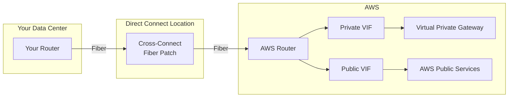

# How to Set Up AWS Direct Connect for Dedicated Connectivity

Author: [nawazdhandala](https://github.com/nawazdhandala)

Tags: AWS, Direct Connect, Networking, Hybrid Cloud

Description: Learn how to establish AWS Direct Connect for dedicated, high-bandwidth, low-latency connectivity between your data center and AWS, bypassing the public internet.

---

VPN connections encrypt traffic and send it over the public internet. For most workloads, that's fine. But when you're moving terabytes of data daily, need consistent sub-10ms latency, or have compliance requirements that mandate private connectivity, you need something better. That's AWS Direct Connect.

Direct Connect establishes a dedicated physical connection between your data center (or colocation facility) and AWS. Traffic flows over a private fiber link instead of the internet. You get predictable performance, lower latency, reduced data transfer costs, and a connection that doesn't compete with your internet traffic.

## How Direct Connect Works



The connection has three parts:
1. **Physical connection**: A fiber cross-connect at a Direct Connect location
2. **Virtual interfaces (VIFs)**: Logical connections over the physical link - private VIFs for VPC access, public VIFs for AWS public services
3. **BGP peering**: Dynamic routing between your router and AWS

## Connection Types

AWS offers two types of connections:

**Dedicated Connection**: A physical port (1 Gbps, 10 Gbps, or 100 Gbps) exclusively for your use. You request it from AWS, and they provision a port at the Direct Connect location.

**Hosted Connection**: A sub-rate connection (50 Mbps to 10 Gbps) provisioned by an AWS Partner. The partner already has a dedicated connection and carves out capacity for you. Faster to provision and cheaper for lower bandwidth needs.

## Step 1: Request a Connection

For a dedicated connection:

```bash
# Request a 1 Gbps dedicated connection
DX_CONN_ID=$(aws directconnect create-connection \
  --location EqDC2 \
  --bandwidth 1Gbps \
  --connection-name "prod-direct-connect" \
  --query 'connectionId' \
  --output text)

echo "Direct Connect connection: $DX_CONN_ID"
```

Common Direct Connect locations include:
- `EqDC2` - Equinix DC2 (Ashburn, VA)
- `EqLD5` - Equinix LD5 (London)
- `EqTY2` - Equinix TY2 (Tokyo)

After requesting, AWS provisions the port. This takes time - usually a few days to a few weeks depending on the location. You or your colocation provider then establishes a cross-connect (physical fiber patch) between your router and the AWS port.

Check the connection status:

```bash
# Check connection state
aws directconnect describe-connections \
  --connection-id $DX_CONN_ID \
  --query 'connections[0].{State:connectionState,Bandwidth:bandwidth,Location:location}'
```

States progress from `ordering` to `pending` to `available`.

## Step 2: Create a Virtual Interface

Once the physical connection is up, create virtual interfaces. A private VIF connects to your VPC. A public VIF accesses AWS public services (S3, DynamoDB, etc.) without going through the internet.

Create a private VIF:

```bash
# Create a private virtual interface for VPC access
PVIF_ID=$(aws directconnect create-private-virtual-interface \
  --connection-id $DX_CONN_ID \
  --new-private-virtual-interface '{
    "virtualInterfaceName": "prod-private-vif",
    "vlan": 100,
    "asn": 65000,
    "authKey": "your-bgp-auth-key",
    "amazonAddress": "169.254.100.1/30",
    "customerAddress": "169.254.100.2/30",
    "virtualGatewayId": "'$VGW_ID'"
  }' \
  --query 'virtualInterfaceId' \
  --output text)

echo "Private VIF: $PVIF_ID"
```

For transit gateway connectivity (recommended for multi-VPC setups):

```bash
# Create a transit virtual interface
TVIF_ID=$(aws directconnect create-transit-virtual-interface \
  --connection-id $DX_CONN_ID \
  --new-transit-virtual-interface '{
    "virtualInterfaceName": "prod-transit-vif",
    "vlan": 200,
    "asn": 65000,
    "directConnectGatewayId": "'$DX_GW_ID'"
  }' \
  --query 'virtualInterface.virtualInterfaceId' \
  --output text)
```

## Step 3: Configure BGP on Your Router

Configure your router's BGP to peer with AWS. Here's a sample configuration for a Cisco router:

```
! Cisco IOS configuration for Direct Connect
interface GigabitEthernet0/0.100
  description Direct Connect Private VIF
  encapsulation dot1Q 100
  ip address 169.254.100.2 255.255.255.252

router bgp 65000
  neighbor 169.254.100.1 remote-as 64512
  neighbor 169.254.100.1 password your-bgp-auth-key

  address-family ipv4 unicast
    neighbor 169.254.100.1 activate
    network 192.168.0.0 mask 255.255.0.0
```

For FRRouting on Linux:

```bash
# /etc/frr/frr.conf
interface eth0.100
  ip address 169.254.100.2/30

router bgp 65000
  bgp router-id 192.168.1.1
  neighbor 169.254.100.1 remote-as 64512
  neighbor 169.254.100.1 password your-bgp-auth-key

  address-family ipv4 unicast
    neighbor 169.254.100.1 activate
    network 192.168.0.0/16
```

## Step 4: Verify the Connection

Check the VIF status and BGP peering:

```bash
# Check virtual interface state
aws directconnect describe-virtual-interfaces \
  --virtual-interface-id $PVIF_ID \
  --query 'virtualInterfaces[0].{State:virtualInterfaceState,BGPPeers:bgpPeers[].{Status:bgpStatus,PeerAddress:customerAddress}}'
```

The VIF state should be `available` and BGP status should be `up`. If BGP is `down`, verify:
1. VLAN tagging matches on both sides
2. IP addresses are correct
3. BGP ASNs match
4. Authentication keys match
5. Your firewall allows TCP port 179 (BGP)

## Using a Direct Connect Gateway

For accessing VPCs in multiple regions from a single Direct Connect connection, use a Direct Connect Gateway:

```bash
# Create a Direct Connect Gateway
DX_GW_ID=$(aws directconnect create-direct-connect-gateway \
  --direct-connect-gateway-name "global-dx-gateway" \
  --amazon-side-asn 64512 \
  --query 'directConnectGateway.directConnectGatewayId' \
  --output text)

# Associate it with a virtual private gateway in any region
aws directconnect create-direct-connect-gateway-association \
  --direct-connect-gateway-id $DX_GW_ID \
  --gateway-id $VGW_ID \
  --add-allowed-prefixes-to-direct-connect-gateway '[{"cidr":"10.0.0.0/16"}]'
```

A single Direct Connect connection in Ashburn can now reach VPCs in us-west-2, eu-west-1, or any other region through the Direct Connect Gateway. For transit gateway integration, see [configuring Direct Connect with Transit Gateway](https://oneuptime.com/blog/post/2026-02-12-configure-direct-connect-with-transit-gateway/view).

## Redundancy

A single Direct Connect connection is a single point of failure. For production, build redundancy:

**Minimum**: Two connections at the same location
**Better**: Two connections at different Direct Connect locations
**Best**: Two connections at different locations plus a VPN backup

```bash
# Create a second connection at a different location
DX_CONN_2=$(aws directconnect create-connection \
  --location EqDC6 \
  --bandwidth 1Gbps \
  --connection-name "prod-dx-backup" \
  --query 'connectionId' \
  --output text)
```

Use BGP to handle failover between connections. Prefer one connection using LOCAL_PREF on your router, and let the other serve as a backup.

## Cost Breakdown

Direct Connect pricing has several components:

- **Port hours**: $0.30/hour for 1 Gbps (~$219/month)
- **Data transfer out**: $0.02/GB (significantly cheaper than internet-based transfer at $0.09/GB)
- **Cross-connect fee**: Varies by colocation provider ($200-$500/month typical)

The data transfer savings alone can justify Direct Connect. If you transfer 10 TB/month outbound:
- Over internet: 10,000 GB x $0.09 = $900/month
- Over Direct Connect: 10,000 GB x $0.02 = $200/month + $219 port = $419/month

That's a savings of $481/month, and you get better performance too.

## Wrapping Up

Direct Connect is the gold standard for hybrid connectivity. The setup takes longer than a VPN (weeks vs. minutes), but the performance, reliability, and cost benefits are substantial for high-bandwidth workloads. Plan for redundancy from day one, and always maintain a VPN backup for failover. Your finance team will appreciate the data transfer savings, and your operations team will appreciate the consistent latency.
