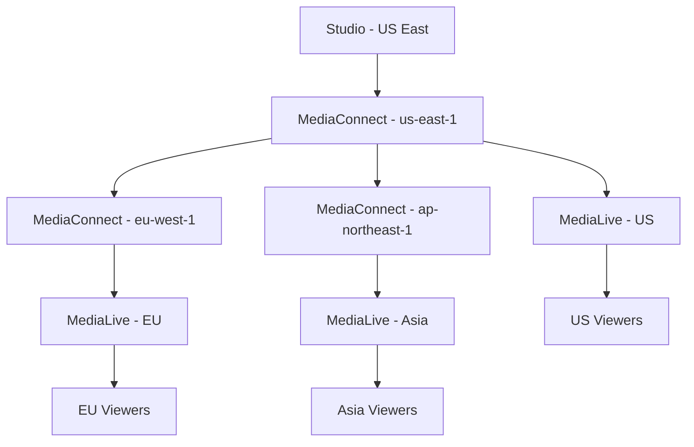

# How to Set Up AWS Elemental MediaConnect for Video Transport

Author: [nawazdhandala](https://github.com/nawazdhandala)

Tags: AWS, MediaConnect, Video Transport, Media Services, Live Video, Streaming

Description: Learn how to set up AWS Elemental MediaConnect for reliable, high-quality video transport between sources, encoders, and broadcast infrastructure.

---

Getting a live video signal from point A to point B reliably is harder than it sounds. Traditional satellite links are expensive, public internet is unreliable, and dedicated fiber circuits are inflexible. AWS Elemental MediaConnect bridges this gap by providing broadcast-quality video transport over the AWS network. It takes live video from cameras, studios, or remote locations and delivers it to encoders, packagers, or other destinations with the reliability that broadcast workflows demand.

This guide covers setting up MediaConnect flows, configuring sources and outputs, enabling encryption, and building multi-region transport architectures.

## What Is AWS Elemental MediaConnect?

MediaConnect is a video transport service that operates at the contribution layer of the video pipeline. It sits between your video sources (cameras, production switchers, remote feeds) and your processing infrastructure (encoders like MediaLive, packagers like MediaPackage).

Key capabilities:

- **Reliable transport** - Built-in error correction and redundancy
- **Protocol support** - SRT, Zixi, RIST, RTP, and RTP-FEC
- **Encryption** - AES-128 and AES-256 static key encryption
- **Entitlements** - Share video feeds with other AWS accounts securely
- **Flow monitoring** - Real-time health metrics and alerting
- **Multi-output** - One input can feed multiple outputs simultaneously

## When to Use MediaConnect


MediaConnect is ideal when you need to:

- Transport live video from remote locations to AWS for processing
- Share live video feeds between AWS accounts or organizations
- Build redundant video transport with automatic failover
- Replace expensive satellite or fiber circuits with cloud-based transport
- Connect on-premises broadcast infrastructure to cloud-based workflows

## Prerequisites

- An AWS account with MediaConnect permissions
- A video source that outputs SRT, Zixi, RIST, or RTP
- Network connectivity between your source and AWS (internet or Direct Connect)
- Understanding of your video format (codec, bitrate, resolution)

## Step 1: Create a MediaConnect Flow

A flow is the core resource in MediaConnect. It has one source input and can have multiple outputs.

```bash
# Create a basic MediaConnect flow with SRT source
aws mediaconnect create-flow \
  --name "studio-feed" \
  --source '{
    "Name": "studio-camera-1",
    "Protocol": "srt-listener",
    "Description": "Main studio camera feed",
    "IngestPort": 5000,
    "WhitelistCidr": "203.0.113.0/24"
  }' \
  --availability-zone "us-east-1a"
```

The response includes the flow ARN and the ingest endpoint URL that your source will push video to.

For a caller-mode SRT source (where MediaConnect pulls from your source):

```bash
# Create a flow where MediaConnect pulls from the source
aws mediaconnect create-flow \
  --name "remote-venue-feed" \
  --source '{
    "Name": "venue-encoder",
    "Protocol": "srt-caller",
    "Description": "Remote venue live feed",
    "StreamId": "venue-main",
    "SenderIpAddress": "203.0.113.50",
    "SenderControlPort": 5000
  }'
```

## Step 2: Start the Flow

Flows are created in a STANDBY state. Start it to begin accepting video:

```bash
# Start the flow
aws mediaconnect start-flow \
  --flow-arn "arn:aws:mediaconnect:us-east-1:123456789012:flow:abc123:studio-feed"
```

## Step 3: Add Outputs

Outputs define where MediaConnect sends the video. You can add multiple outputs to a single flow.

### Output to MediaLive

```bash
# Add an output that feeds into MediaLive
aws mediaconnect add-flow-outputs \
  --flow-arn "arn:aws:mediaconnect:us-east-1:123456789012:flow:abc123:studio-feed" \
  --outputs '[
    {
      "Name": "to-medialive",
      "Protocol": "srt-listener",
      "Description": "Feed to MediaLive encoder",
      "Port": 5001,
      "CidrAllowList": ["10.0.0.0/8"]
    }
  ]'
```

### Output to Another AWS Account (Entitlement)

Share your video feed with a partner or another part of your organization:

```bash
# Create an entitlement to share the feed
aws mediaconnect grant-flow-entitlements \
  --flow-arn "arn:aws:mediaconnect:us-east-1:123456789012:flow:abc123:studio-feed" \
  --entitlements '[
    {
      "Name": "partner-feed",
      "Description": "Shared feed for broadcast partner",
      "Subscribers": ["987654321098"],
      "DataTransferSubscriberFeePercent": 0,
      "Encryption": {
        "Algorithm": "aes256",
        "RoleArn": "arn:aws:iam::123456789012:role/MediaConnectEncryptionRole",
        "SecretArn": "arn:aws:secretsmanager:us-east-1:123456789012:secret:mediaconnect-key"
      }
    }
  ]'
```

The subscriber account can then create a flow using this entitlement as its source.

### Output to an External Destination

```bash
# Add an output to an external SRT destination
aws mediaconnect add-flow-outputs \
  --flow-arn "arn:aws:mediaconnect:us-east-1:123456789012:flow:abc123:studio-feed" \
  --outputs '[
    {
      "Name": "external-broadcaster",
      "Protocol": "srt-caller",
      "Description": "Feed to external broadcast partner",
      "Destination": "203.0.113.100",
      "Port": 5000,
      "SmoothingLatency": 2000
    }
  ]'
```

## Step 4: Configure Source Failover

For broadcast-quality reliability, configure redundant sources with automatic failover:

```bash
# Create a flow with failover between two sources
aws mediaconnect create-flow \
  --name "redundant-studio-feed" \
  --source '{
    "Name": "primary-source",
    "Protocol": "srt-listener",
    "IngestPort": 5000,
    "WhitelistCidr": "203.0.113.0/24"
  }' \
  --source-failover-config '{
    "State": "ENABLED",
    "FailoverMode": "FAILOVER",
    "SourcePriority": {
      "PrimarySource": "primary-source"
    },
    "RecoveryWindow": 200
  }'

# Add the backup source
aws mediaconnect add-flow-sources \
  --flow-arn "arn:aws:mediaconnect:us-east-1:123456789012:flow:def456:redundant-studio-feed" \
  --sources '[
    {
      "Name": "backup-source",
      "Protocol": "srt-listener",
      "IngestPort": 5001,
      "WhitelistCidr": "203.0.113.0/24"
    }
  ]'
```

When the primary source fails, MediaConnect automatically switches to the backup source. When the primary recovers, it switches back.

## Step 5: Enable Encryption

For sensitive content, encrypt the video in transit:

```bash
# Create a Secrets Manager secret for the encryption key
aws secretsmanager create-secret \
  --name "mediaconnect-encryption-key" \
  --secret-string '{"key": "your-32-character-encryption-key!"}'

# Create a flow with encrypted source
aws mediaconnect create-flow \
  --name "encrypted-feed" \
  --source '{
    "Name": "encrypted-source",
    "Protocol": "srt-listener",
    "IngestPort": 5000,
    "WhitelistCidr": "0.0.0.0/0",
    "Decryption": {
      "Algorithm": "aes256",
      "RoleArn": "arn:aws:iam::123456789012:role/MediaConnectEncryptionRole",
      "SecretArn": "arn:aws:secretsmanager:us-east-1:123456789012:secret:mediaconnect-encryption-key"
    }
  }'
```

## Step 6: Build a Multi-Region Transport Architecture

For global broadcasts, use MediaConnect to transport video between AWS regions:



Create the primary flow in us-east-1:

```bash
# Primary flow in us-east-1
aws mediaconnect create-flow \
  --region us-east-1 \
  --name "global-feed-primary" \
  --source '{
    "Name": "studio-source",
    "Protocol": "srt-listener",
    "IngestPort": 5000,
    "WhitelistCidr": "203.0.113.0/24"
  }'
```

Create an entitlement for cross-region distribution:

```bash
# Grant entitlement to the same account (for cross-region)
aws mediaconnect grant-flow-entitlements \
  --region us-east-1 \
  --flow-arn "arn:aws:mediaconnect:us-east-1:123456789012:flow:abc123:global-feed-primary" \
  --entitlements '[
    {
      "Name": "eu-region-feed",
      "Description": "Feed for EU region processing",
      "Subscribers": ["123456789012"]
    },
    {
      "Name": "asia-region-feed",
      "Description": "Feed for Asia region processing",
      "Subscribers": ["123456789012"]
    }
  ]'
```

Create receiving flows in other regions:

```bash
# Create a flow in eu-west-1 using the entitlement as source
aws mediaconnect create-flow \
  --region eu-west-1 \
  --name "global-feed-eu" \
  --source '{
    "Name": "from-us-east",
    "EntitlementArn": "arn:aws:mediaconnect:us-east-1:123456789012:entitlement:xyz789:eu-region-feed"
  }'

# Create a flow in ap-northeast-1
aws mediaconnect create-flow \
  --region ap-northeast-1 \
  --name "global-feed-asia" \
  --source '{
    "Name": "from-us-east",
    "EntitlementArn": "arn:aws:mediaconnect:us-east-1:123456789012:entitlement:xyz789:asia-region-feed"
  }'
```

## Step 7: Monitor Flow Health

MediaConnect provides detailed metrics for monitoring video transport quality:

```bash
# Get flow metrics
aws cloudwatch get-metric-data \
  --metric-data-queries '[
    {
      "Id": "source_bitrate",
      "MetricStat": {
        "Metric": {
          "Namespace": "AWS/MediaConnect",
          "MetricName": "SourceBitRate",
          "Dimensions": [
            {"Name": "FlowARN", "Value": "arn:aws:mediaconnect:us-east-1:123456789012:flow:abc123:studio-feed"}
          ]
        },
        "Period": 60,
        "Stat": "Average"
      }
    },
    {
      "Id": "packet_loss",
      "MetricStat": {
        "Metric": {
          "Namespace": "AWS/MediaConnect",
          "MetricName": "SourcePacketLossPercent",
          "Dimensions": [
            {"Name": "FlowARN", "Value": "arn:aws:mediaconnect:us-east-1:123456789012:flow:abc123:studio-feed"}
          ]
        },
        "Period": 60,
        "Stat": "Maximum"
      }
    }
  ]' \
  --start-time 2026-02-12T00:00:00Z \
  --end-time 2026-02-12T23:59:59Z
```

Set up alarms for critical metrics:

```bash
# Alert on high packet loss
aws cloudwatch put-metric-alarm \
  --alarm-name "mediaconnect-packet-loss" \
  --metric-name "SourcePacketLossPercent" \
  --namespace "AWS/MediaConnect" \
  --dimensions Name=FlowARN,Value="arn:aws:mediaconnect:us-east-1:123456789012:flow:abc123:studio-feed" \
  --statistic Maximum \
  --period 60 \
  --evaluation-periods 3 \
  --threshold 1 \
  --comparison-operator GreaterThanThreshold \
  --alarm-actions "arn:aws:sns:us-east-1:123456789012:media-alerts"

# Alert on source disconnection
aws cloudwatch put-metric-alarm \
  --alarm-name "mediaconnect-source-disconnected" \
  --metric-name "SourceConnected" \
  --namespace "AWS/MediaConnect" \
  --dimensions Name=FlowARN,Value="arn:aws:mediaconnect:us-east-1:123456789012:flow:abc123:studio-feed" \
  --statistic Minimum \
  --period 60 \
  --evaluation-periods 1 \
  --threshold 1 \
  --comparison-operator LessThanThreshold \
  --alarm-actions "arn:aws:sns:us-east-1:123456789012:media-alerts"
```

## CloudFormation Template

```yaml
# CloudFormation template for a MediaConnect flow
AWSTemplateFormatVersion: '2010-09-09'
Description: MediaConnect flow with redundant sources and multiple outputs

Parameters:
  SourceCidr:
    Type: String
    Default: 203.0.113.0/24
    Description: CIDR block allowed to push video

Resources:
  StudioFeed:
    Type: AWS::MediaConnect::Flow
    Properties:
      Name: studio-feed
      Source:
        Name: primary-source
        Protocol: srt-listener
        IngestPort: 5000
        WhitelistCidr: !Ref SourceCidr
      SourceFailoverConfig:
        State: ENABLED
        FailoverMode: FAILOVER
        RecoveryWindow: 200

  MediaLiveOutput:
    Type: AWS::MediaConnect::FlowOutput
    Properties:
      FlowArn: !Ref StudioFeed
      Name: to-medialive
      Protocol: srt-listener
      Port: 5001
      CidrAllowList:
        - 10.0.0.0/8

Outputs:
  FlowArn:
    Value: !Ref StudioFeed
    Description: ARN of the MediaConnect flow
  IngestEndpoint:
    Value: !GetAtt StudioFeed.Source.IngestIp
    Description: IP address for source ingest
```

## Best Practices

1. **Always configure source failover.** Live broadcast has zero tolerance for interruptions. Redundant sources with automatic failover protect against single points of failure.

2. **Use SRT protocol when possible.** SRT (Secure Reliable Transport) provides the best balance of low latency and error resilience for most use cases.

3. **Whitelist source IPs.** Restrict which IP addresses can push video to your flows. This prevents unauthorized sources from injecting content.

4. **Monitor packet loss.** Even small amounts of packet loss can cause visible artifacts in the video. Set alerts at 0.5-1% packet loss.

5. **Use entitlements for sharing.** Instead of exposing outputs to the public internet, use entitlements to share feeds between AWS accounts securely.

6. **Size your bandwidth appropriately.** Ensure your network connection to AWS can handle your video bitrate plus overhead. A 20 Mbps video stream needs at least 25 Mbps of available bandwidth.

For downstream processing of your MediaConnect feeds, check out our guide on [setting up AWS MediaPackage for video packaging](https://oneuptime.com/blog/post/set-up-aws-mediapackage-for-video-packaging/view).

## Wrapping Up

AWS Elemental MediaConnect provides broadcast-grade video transport that replaces expensive satellite and fiber circuits with cloud-based delivery. The combination of protocol support (SRT, Zixi, RIST), automatic failover, encryption, and cross-region distribution makes it a flexible foundation for any live video workflow. Start with a single flow to transport your primary feed to AWS, add redundancy with a backup source, and expand to multi-region distribution as your broadcast needs grow.
