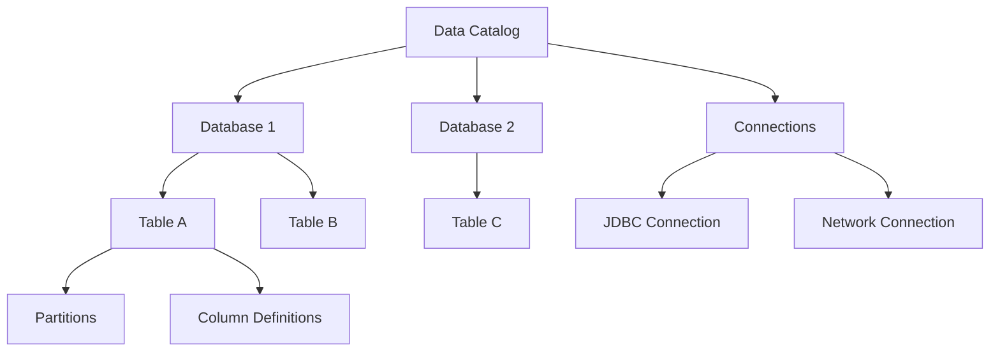

# How to Set Up the AWS Glue Data Catalog

Author: [nawazdhandala](https://github.com/nawazdhandala)

Tags: AWS, Glue, Data Catalog, Metadata, Analytics

Description: A comprehensive guide to setting up and managing the AWS Glue Data Catalog as a centralized metadata repository for all your data assets across AWS services.

---

The AWS Glue Data Catalog is the metadata backbone of AWS analytics. It's where table definitions, schemas, partitions, and connection information live. When you run a query in Athena, it checks the Data Catalog. When Glue ETL reads a table, it checks the Data Catalog. Redshift Spectrum, EMR, Lake Formation - they all use it.

Think of it as a phone book for your data. It doesn't store the actual data, just the information about where data lives and what it looks like.

## What the Data Catalog Contains

The Data Catalog has a hierarchy:



- **Databases** - Logical groupings of tables (like namespaces)
- **Tables** - Schema definitions including column names, types, SerDe info, and S3 locations
- **Partitions** - Subdivision metadata for partitioned tables
- **Connections** - Configuration for external data sources (RDS, Redshift, etc.)

## Creating Databases

Databases are just organizational containers. Create them to group related tables:

```python
# Create databases for different data domains
import boto3

glue = boto3.client('glue', region_name='us-east-1')

# Create a database for raw ingestion data
glue.create_database(
    DatabaseInput={
        'Name': 'raw_data',
        'Description': 'Raw ingested data before any transformation',
        'LocationUri': 's3://my-data-lake/raw/'
    }
)

# Create a database for processed/transformed data
glue.create_database(
    DatabaseInput={
        'Name': 'processed_data',
        'Description': 'Cleaned and transformed data ready for analysis',
        'LocationUri': 's3://my-data-lake/processed/'
    }
)

# Create a database for aggregated reporting tables
glue.create_database(
    DatabaseInput={
        'Name': 'reporting',
        'Description': 'Pre-aggregated tables for dashboards and reports',
        'LocationUri': 's3://my-data-lake/reporting/'
    }
)
```

A common pattern is organizing databases by layer: `raw`, `processed`, `curated`, and `reporting`.

## Creating Tables Manually

While crawlers can create tables automatically, sometimes you want precise control:

```python
# Create a table definition in the Glue Data Catalog
glue.create_table(
    DatabaseName='raw_data',
    TableInput={
        'Name': 'web_events',
        'Description': 'Raw web event data from the analytics pipeline',
        'StorageDescriptor': {
            'Columns': [
                {'Name': 'event_id', 'Type': 'string', 'Comment': 'Unique event identifier'},
                {'Name': 'event_type', 'Type': 'string', 'Comment': 'Type of event (click, view, purchase)'},
                {'Name': 'user_id', 'Type': 'string', 'Comment': 'User who triggered the event'},
                {'Name': 'page_url', 'Type': 'string', 'Comment': 'URL where the event occurred'},
                {'Name': 'referrer', 'Type': 'string', 'Comment': 'Referring URL'},
                {'Name': 'user_agent', 'Type': 'string', 'Comment': 'Browser user agent string'},
                {'Name': 'event_properties', 'Type': 'map<string,string>', 'Comment': 'Additional event properties'},
                {'Name': 'timestamp', 'Type': 'bigint', 'Comment': 'Unix timestamp of the event'}
            ],
            'Location': 's3://my-data-lake/raw/web_events/',
            'InputFormat': 'org.apache.hadoop.hive.ql.io.parquet.MapredParquetInputFormat',
            'OutputFormat': 'org.apache.hadoop.hive.ql.io.parquet.MapredParquetOutputFormat',
            'SerdeInfo': {
                'SerializationLibrary': 'org.apache.hadoop.hive.ql.io.parquet.serde.ParquetHiveSerDe',
                'Parameters': {
                    'serialization.format': '1'
                }
            },
            'Compressed': True
        },
        'PartitionKeys': [
            {'Name': 'year', 'Type': 'string'},
            {'Name': 'month', 'Type': 'string'},
            {'Name': 'day', 'Type': 'string'}
        ],
        'TableType': 'EXTERNAL_TABLE',
        'Parameters': {
            'classification': 'parquet',
            'compressionType': 'snappy',
            'typeOfData': 'file'
        }
    }
)
```

## Managing Partitions

For partitioned tables, you need to register each partition:

```python
# Add a batch of partitions
partitions = []
for month in range(1, 13):
    for day in range(1, 32):
        m = str(month).zfill(2)
        d = str(day).zfill(2)
        partitions.append({
            'Values': ['2025', m, d],
            'StorageDescriptor': {
                'Columns': [
                    {'Name': 'event_id', 'Type': 'string'},
                    {'Name': 'event_type', 'Type': 'string'},
                    {'Name': 'user_id', 'Type': 'string'},
                    {'Name': 'page_url', 'Type': 'string'},
                    {'Name': 'referrer', 'Type': 'string'},
                    {'Name': 'user_agent', 'Type': 'string'},
                    {'Name': 'event_properties', 'Type': 'map<string,string>'},
                    {'Name': 'timestamp', 'Type': 'bigint'}
                ],
                'Location': f's3://my-data-lake/raw/web_events/year=2025/month={m}/day={d}/',
                'InputFormat': 'org.apache.hadoop.hive.ql.io.parquet.MapredParquetInputFormat',
                'OutputFormat': 'org.apache.hadoop.hive.ql.io.parquet.MapredParquetOutputFormat',
                'SerdeInfo': {
                    'SerializationLibrary': 'org.apache.hadoop.hive.ql.io.parquet.serde.ParquetHiveSerDe'
                }
            }
        })

# Batch create partitions (max 100 per call)
for i in range(0, len(partitions), 100):
    batch = partitions[i:i+100]
    glue.batch_create_partition(
        DatabaseName='raw_data',
        TableName='web_events',
        PartitionInputList=batch
    )
```

For automated partition management, use [Glue Crawlers](https://oneuptime.com/blog/post/2026-02-12-create-aws-glue-crawlers-for-data-cataloging/view) or Athena's partition projection.

## Creating Connections

Connections store the configuration needed to access external data sources:

```python
# Create a JDBC connection for an RDS PostgreSQL database
glue.create_connection(
    ConnectionInput={
        'Name': 'production-rds',
        'Description': 'Connection to production PostgreSQL RDS',
        'ConnectionType': 'JDBC',
        'ConnectionProperties': {
            'JDBC_CONNECTION_URL': 'jdbc:postgresql://my-db.cluster-abc123.us-east-1.rds.amazonaws.com:5432/production',
            'USERNAME': 'glue_user',
            'PASSWORD': 'your-password-here'
        },
        'PhysicalConnectionRequirements': {
            'SubnetId': 'subnet-abc12345',
            'SecurityGroupIdList': ['sg-abc12345'],
            'AvailabilityZone': 'us-east-1a'
        }
    }
)
```

Connections are used by crawlers and ETL jobs to access databases. For better security, store credentials in AWS Secrets Manager and reference them in the connection.

## Updating Tables

Schemas evolve. When you need to add columns or change types:

```python
# Update a table to add new columns
table = glue.get_table(DatabaseName='raw_data', TableName='web_events')
table_input = table['Table']

# Remove catalog-managed fields before updating
for key in ['DatabaseName', 'CreateTime', 'UpdateTime', 'CreatedBy',
            'IsRegisteredWithLakeFormation', 'CatalogId', 'VersionId']:
    table_input.pop(key, None)

# Add new columns
table_input['StorageDescriptor']['Columns'].append(
    {'Name': 'session_id', 'Type': 'string', 'Comment': 'Browser session identifier'}
)
table_input['StorageDescriptor']['Columns'].append(
    {'Name': 'device_type', 'Type': 'string', 'Comment': 'Device type (mobile, desktop, tablet)'}
)

glue.update_table(
    DatabaseName='raw_data',
    TableInput=table_input
)
```

## Searching the Catalog

As your catalog grows, search helps you find things:

```python
# Search for tables across all databases
response = glue.search_tables(
    SearchText='events',
    MaxResults=20
)

for table in response['TableList']:
    print(f"{table['DatabaseName']}.{table['Name']}")
    print(f"  Location: {table['StorageDescriptor']['Location']}")
    print(f"  Columns: {len(table['StorageDescriptor']['Columns'])}")
    print(f"  Format: {table['Parameters'].get('classification', 'unknown')}")
    print()
```

## Data Catalog Security

Control who can see and modify catalog resources with IAM policies:

```json
{
    "Version": "2012-10-17",
    "Statement": [
        {
            "Effect": "Allow",
            "Action": [
                "glue:GetDatabase",
                "glue:GetDatabases",
                "glue:GetTable",
                "glue:GetTables",
                "glue:GetPartition",
                "glue:GetPartitions",
                "glue:SearchTables"
            ],
            "Resource": "*"
        },
        {
            "Effect": "Deny",
            "Action": [
                "glue:DeleteTable",
                "glue:DeleteDatabase"
            ],
            "Resource": [
                "arn:aws:glue:us-east-1:123456789012:catalog",
                "arn:aws:glue:us-east-1:123456789012:database/production_*",
                "arn:aws:glue:us-east-1:123456789012:table/production_*/*"
            ]
        }
    ]
}
```

For more granular access control, AWS Lake Formation provides column-level and row-level security on top of the Data Catalog.

## Resource Policies

You can share the Data Catalog across AWS accounts:

```python
# Set a resource policy to allow cross-account access
glue.put_resource_policy(
    PolicyInJson='''{
        "Version": "2012-10-17",
        "Statement": [
            {
                "Effect": "Allow",
                "Principal": {
                    "AWS": "arn:aws:iam::987654321098:root"
                },
                "Action": [
                    "glue:GetDatabase",
                    "glue:GetTable",
                    "glue:GetPartitions"
                ],
                "Resource": [
                    "arn:aws:glue:us-east-1:123456789012:catalog",
                    "arn:aws:glue:us-east-1:123456789012:database/shared_data",
                    "arn:aws:glue:us-east-1:123456789012:table/shared_data/*"
                ]
            }
        ]
    }'''
)
```

This lets another AWS account query your Data Catalog tables using Athena or Glue.

## Cost Considerations

The Data Catalog itself has generous free tier limits:
- First million objects stored per month: free
- First million API requests per month: free

Beyond that, it's $1 per 100,000 objects stored and $1 per million API requests. For most organizations, the Data Catalog cost is negligible.

## Wrapping Up

The Glue Data Catalog is the foundation for analytics on AWS. Set up a clean database structure, define your tables carefully (or let crawlers do it), and maintain partitions as your data grows. Every other analytics service - Athena, Glue ETL, EMR, Redshift Spectrum - builds on top of it.

Once your catalog is set up, you're ready to [query data with Athena](https://oneuptime.com/blog/post/2026-02-12-set-up-amazon-athena-for-querying-s3-data/view) or [build ETL pipelines with Glue](https://oneuptime.com/blog/post/2026-02-12-create-aws-glue-etl-jobs/view).
