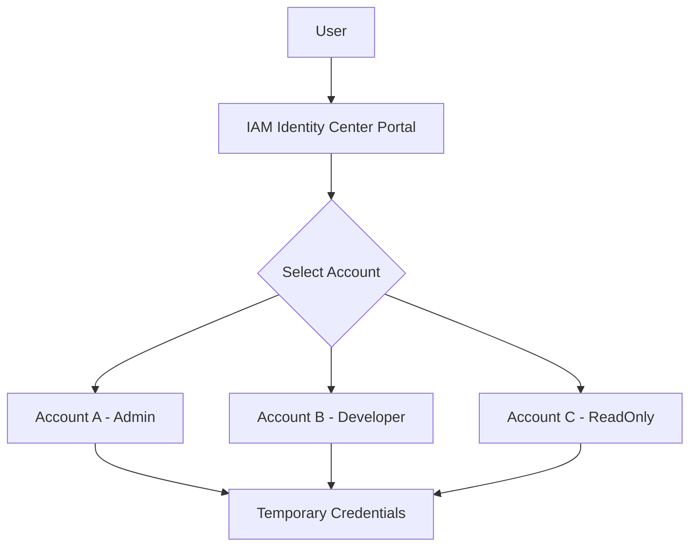

# How to Set Up AWS IAM Identity Center (SSO)

Author: [nawazdhandala](https://github.com/nawazdhandala)

Tags: AWS, IAM, SSO, Security

Description: Complete guide to setting up AWS IAM Identity Center for centralized single sign-on access to multiple AWS accounts and applications.

---

Managing individual IAM users across multiple AWS accounts is a nightmare. Every new hire means creating users in 5, 10, maybe 50 accounts. Every departure means deleting them from all those same accounts and hoping you didn't miss one. IAM Identity Center (formerly AWS SSO) solves this by giving you a single place to manage access across all your AWS accounts.

This guide walks through setting up IAM Identity Center from scratch, creating users and groups, configuring permission sets, and connecting it to your AWS accounts.

## What IAM Identity Center Does

IAM Identity Center provides:

- A single login portal for all your AWS accounts
- Centralized user and group management
- Permission sets that map to IAM roles in each account
- Integration with external identity providers (Okta, Azure AD, Google Workspace)
- Temporary credentials that auto-rotate (no more access keys)
- Built-in MFA support



## Prerequisites

- An AWS Organization (Identity Center requires AWS Organizations)
- Management account access
- A region to host Identity Center (this can't be changed later, so choose wisely)

## Step 1: Enable IAM Identity Center

In the management account:

```bash
# Enable IAM Identity Center (must be done in the management account)
# Note: This is typically done through the console on first setup
# The CLI equivalent creates the instance
aws sso-admin create-instance-metadata
```

In practice, the first-time setup is easiest through the console:

1. Go to IAM Identity Center in the AWS Console
2. Click "Enable"
3. Choose your region (us-east-1 is common, but pick one close to your users)
4. Select "Enable with AWS Organizations"

## Step 2: Choose Your Identity Source

IAM Identity Center can use three identity sources:

1. **Built-in directory** - Identity Center manages users directly
2. **Active Directory** - Connect to AWS Managed Microsoft AD or AD Connector
3. **External identity provider** - SAML 2.0 federation (Okta, Azure AD, etc.)

For small teams, the built-in directory is fine. For organizations with an existing IdP, federation is the way to go. We'll cover external IdP integration in separate guides for [Azure AD](https://oneuptime.com/blog/post/2026-02-12-integrate-iam-identity-center-azure-ad/view), [Okta](https://oneuptime.com/blog/post/2026-02-12-integrate-iam-identity-center-okta/view), and [Google Workspace](https://oneuptime.com/blog/post/2026-02-12-integrate-iam-identity-center-google-workspace/view).

For now, let's use the built-in directory.

## Step 3: Create Users

Using the CLI:

```bash
# Create a user in the Identity Center directory
aws identitystore create-user \
  --identity-store-id d-1234567890 \
  --user-name jane.doe \
  --name '{
    "GivenName": "Jane",
    "FamilyName": "Doe"
  }' \
  --emails '[{
    "Value": "jane.doe@company.com",
    "Type": "work",
    "Primary": true
  }]' \
  --display-name "Jane Doe"
```

The identity store ID comes from your Identity Center settings. Find it with:

```bash
# Get the Identity Store ID
aws sso-admin list-instances \
  --query 'Instances[0].IdentityStoreId' \
  --output text
```

## Step 4: Create Groups

Groups are how you manage permissions at scale. Create groups that match your team structure:

```bash
# Get the identity store ID
IDENTITY_STORE_ID=$(aws sso-admin list-instances \
  --query 'Instances[0].IdentityStoreId' --output text)

# Create groups for different access levels
aws identitystore create-group \
  --identity-store-id "$IDENTITY_STORE_ID" \
  --display-name "Platform-Admins" \
  --description "Full admin access to all accounts"

aws identitystore create-group \
  --identity-store-id "$IDENTITY_STORE_ID" \
  --display-name "Developers" \
  --description "Developer access to dev and staging accounts"

aws identitystore create-group \
  --identity-store-id "$IDENTITY_STORE_ID" \
  --display-name "ReadOnly" \
  --description "Read-only access for auditors and observers"
```

Add users to groups:

```bash
# Add a user to a group
aws identitystore create-group-membership \
  --identity-store-id "$IDENTITY_STORE_ID" \
  --group-id "group-id-here" \
  --member-id '{
    "UserId": "user-id-here"
  }'
```

## Step 5: Create Permission Sets

Permission sets define what a user can do when they access an account. They're essentially IAM role templates.

```bash
# Get the SSO instance ARN
SSO_INSTANCE_ARN=$(aws sso-admin list-instances \
  --query 'Instances[0].InstanceArn' --output text)

# Create an admin permission set
aws sso-admin create-permission-set \
  --instance-arn "$SSO_INSTANCE_ARN" \
  --name "AdministratorAccess" \
  --description "Full admin access" \
  --session-duration "PT4H"

# Attach the AWS managed AdministratorAccess policy
aws sso-admin attach-managed-policy-to-permission-set \
  --instance-arn "$SSO_INSTANCE_ARN" \
  --permission-set-arn "arn:aws:sso:::permissionSet/ssoins-1234567890/ps-admin123" \
  --managed-policy-arn "arn:aws:iam::aws:policy/AdministratorAccess"
```

Create a developer permission set with custom permissions:

```bash
# Create a developer permission set
aws sso-admin create-permission-set \
  --instance-arn "$SSO_INSTANCE_ARN" \
  --name "DeveloperAccess" \
  --description "Developer access - no IAM or billing" \
  --session-duration "PT8H"

# Attach a custom inline policy to the developer permission set
aws sso-admin put-inline-policy-to-permission-set \
  --instance-arn "$SSO_INSTANCE_ARN" \
  --permission-set-arn "arn:aws:sso:::permissionSet/ssoins-1234567890/ps-dev123" \
  --inline-policy '{
    "Version": "2012-10-17",
    "Statement": [
      {
        "Effect": "Allow",
        "Action": [
          "ec2:*",
          "s3:*",
          "lambda:*",
          "dynamodb:*",
          "rds:*",
          "ecs:*",
          "logs:*",
          "cloudwatch:*",
          "sqs:*",
          "sns:*"
        ],
        "Resource": "*"
      },
      {
        "Effect": "Deny",
        "Action": [
          "iam:*",
          "organizations:*",
          "account:*"
        ],
        "Resource": "*"
      }
    ]
  }'
```

Create a read-only permission set:

```bash
# Create a read-only permission set
aws sso-admin create-permission-set \
  --instance-arn "$SSO_INSTANCE_ARN" \
  --name "ReadOnlyAccess" \
  --description "Read-only access for auditing" \
  --session-duration "PT8H"

aws sso-admin attach-managed-policy-to-permission-set \
  --instance-arn "$SSO_INSTANCE_ARN" \
  --permission-set-arn "arn:aws:sso:::permissionSet/ssoins-1234567890/ps-readonly123" \
  --managed-policy-arn "arn:aws:iam::aws:policy/ReadOnlyAccess"
```

## Step 6: Assign Groups to Accounts

This is where it all comes together. You assign a group + permission set combination to specific accounts:

```bash
# Assign Platform-Admins group with AdministratorAccess to the production account
aws sso-admin create-account-assignment \
  --instance-arn "$SSO_INSTANCE_ARN" \
  --target-id "111111111111" \
  --target-type AWS_ACCOUNT \
  --permission-set-arn "arn:aws:sso:::permissionSet/ssoins-1234567890/ps-admin123" \
  --principal-type GROUP \
  --principal-id "group-id-for-platform-admins"

# Assign Developers group with DeveloperAccess to dev account
aws sso-admin create-account-assignment \
  --instance-arn "$SSO_INSTANCE_ARN" \
  --target-id "222222222222" \
  --target-type AWS_ACCOUNT \
  --permission-set-arn "arn:aws:sso:::permissionSet/ssoins-1234567890/ps-dev123" \
  --principal-type GROUP \
  --principal-id "group-id-for-developers"
```

## Step 7: Configure the CLI

Users can get temporary CLI credentials through the SSO portal:

```bash
# Configure AWS CLI for SSO
aws configure sso
# Follow the prompts:
# SSO session name: my-company
# SSO start URL: https://my-company.awsapps.com/start
# SSO Region: us-east-1
# Then select the account and role from the browser

# Login to SSO (opens browser)
aws sso login --profile my-sso-profile

# Use the profile for commands
aws s3 ls --profile my-sso-profile
```

Or configure it manually in `~/.aws/config`:

```ini
[profile dev-admin]
sso_session = my-company
sso_account_id = 222222222222
sso_role_name = DeveloperAccess
region = us-east-1

[sso-session my-company]
sso_start_url = https://my-company.awsapps.com/start
sso_region = us-east-1
sso_registration_scopes = sso:account:access
```

## Step 8: Enable MFA

Enforce MFA in Identity Center settings:

1. Go to IAM Identity Center > Settings
2. Click "Configure" under Authentication
3. Set MFA to "Every time they sign in" or "Context-aware"
4. Choose which MFA types to allow (authenticator apps, security keys)
5. Set whether users can self-register MFA devices

## Managing at Scale with Terraform

For infrastructure-as-code management:

```hcl
# Create permission set
resource "aws_ssoadmin_permission_set" "developer" {
  name             = "DeveloperAccess"
  instance_arn     = data.aws_ssoadmin_instances.main.arns[0]
  session_duration = "PT8H"
}

# Attach managed policy
resource "aws_ssoadmin_managed_policy_attachment" "developer_power" {
  instance_arn       = data.aws_ssoadmin_instances.main.arns[0]
  managed_policy_arn = "arn:aws:iam::aws:policy/PowerUserAccess"
  permission_set_arn = aws_ssoadmin_permission_set.developer.arn
}

# Assign to account
resource "aws_ssoadmin_account_assignment" "dev_account" {
  instance_arn       = data.aws_ssoadmin_instances.main.arns[0]
  permission_set_arn = aws_ssoadmin_permission_set.developer.arn
  principal_id       = aws_identitystore_group.developers.group_id
  principal_type     = "GROUP"
  target_id          = "222222222222"
  target_type        = "AWS_ACCOUNT"
}
```

IAM Identity Center is the foundation for secure, scalable AWS access management. Once it's in place, you can stop creating individual IAM users, stop managing long-lived access keys, and start sleeping better at night.
