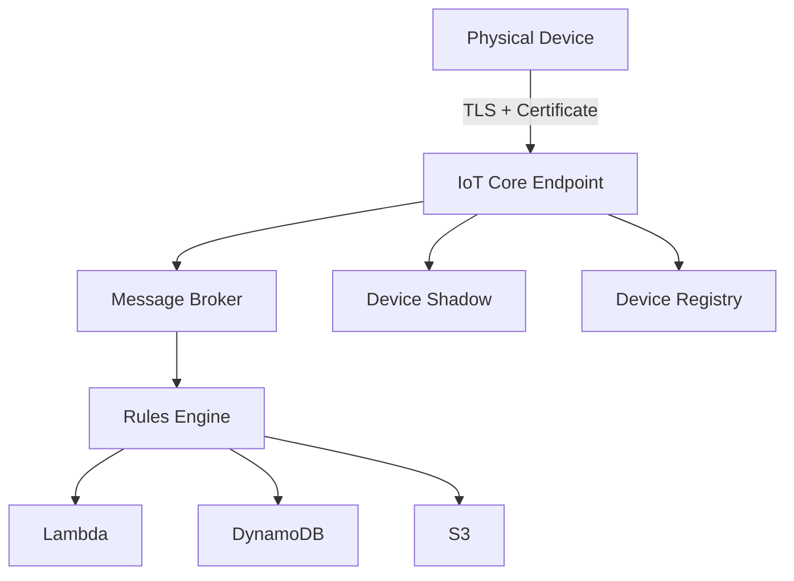

# How to Set Up AWS IoT Core for Device Connectivity

Author: [nawazdhandala](https://github.com/nawazdhandala)

Tags: AWS, IoT Core, MQTT, Device Management

Description: Complete guide to setting up AWS IoT Core for connecting physical devices to the cloud, covering thing creation, certificates, policies, and MQTT communication.

---

Connecting physical devices to the cloud is one of those problems that sounds simple until you start thinking about security, scale, and reliability. You've got thousands (or millions) of devices that need to send data to the cloud, receive commands, and maintain a secure connection - all while running on limited hardware with spotty network connectivity.

AWS IoT Core handles the heavy lifting. It provides a managed MQTT broker, device authentication with X.509 certificates, and integration with the rest of the AWS ecosystem. This guide walks through setting everything up from scratch.

## Core Concepts

Before diving in, let's clarify the key concepts:

- **Thing**: A representation of a physical device in IoT Core
- **Certificate**: X.509 certificate used to authenticate the device
- **Policy**: IAM-like document that controls what a device can do
- **Topic**: MQTT topic that devices publish and subscribe to
- **Shadow**: A JSON document that stores the device's current state



## Creating a Thing

A Thing is IoT Core's representation of your physical device. Start by creating one.

```bash
# Create a thing in IoT Core
aws iot create-thing \
    --thing-name "temperature-sensor-001" \
    --thing-type-name "TemperatureSensor" \
    --attribute-payload '{"attributes": {"location": "warehouse-a", "firmware": "1.2.0"}}'
```

Before creating things, you might want to define a thing type for categorization.

```bash
# Create a thing type
aws iot create-thing-type \
    --thing-type-name "TemperatureSensor" \
    --thing-type-properties '{
        "thingTypeDescription": "Temperature and humidity sensor",
        "searchableAttributes": ["location", "firmware"]
    }'
```

## Creating and Attaching Certificates

Each device needs a unique X.509 certificate for authentication. IoT Core can generate these for you.

```bash
# Create keys and certificate
aws iot create-keys-and-certificate \
    --set-as-active \
    --certificate-pem-outfile "device-cert.pem" \
    --public-key-outfile "public-key.pem" \
    --private-key-outfile "private-key.pem"
```

This command outputs a certificate ARN - save it. You'll need it to attach the certificate to your thing.

```bash
# Attach the certificate to the thing
aws iot attach-thing-principal \
    --thing-name "temperature-sensor-001" \
    --principal "arn:aws:iot:us-east-1:123456789:cert/abc123..."
```

You also need to download Amazon's root CA certificate for TLS verification.

```bash
# Download the Amazon Root CA certificate
curl -o AmazonRootCA1.pem https://www.amazontrust.com/repository/AmazonRootCA1.pem
```

## Creating an IoT Policy

Policies control what actions a device can perform - which topics it can publish to, subscribe to, and what it can connect as.

```json
{
    "Version": "2012-10-17",
    "Statement": [
        {
            "Effect": "Allow",
            "Action": "iot:Connect",
            "Resource": "arn:aws:iot:us-east-1:123456789:client/${iot:Connection.Thing.ThingName}"
        },
        {
            "Effect": "Allow",
            "Action": "iot:Publish",
            "Resource": [
                "arn:aws:iot:us-east-1:123456789:topic/sensors/${iot:Connection.Thing.ThingName}/data",
                "arn:aws:iot:us-east-1:123456789:topic/sensors/${iot:Connection.Thing.ThingName}/status"
            ]
        },
        {
            "Effect": "Allow",
            "Action": "iot:Subscribe",
            "Resource": "arn:aws:iot:us-east-1:123456789:topicfilter/commands/${iot:Connection.Thing.ThingName}/*"
        },
        {
            "Effect": "Allow",
            "Action": "iot:Receive",
            "Resource": "arn:aws:iot:us-east-1:123456789:topic/commands/${iot:Connection.Thing.ThingName}/*"
        }
    ]
}
```

Notice the policy variables like `${iot:Connection.Thing.ThingName}`. These automatically scope permissions to the specific device, so each device can only publish to its own topics.

```bash
# Create the policy
aws iot create-policy \
    --policy-name "SensorDevicePolicy" \
    --policy-document file://iot-policy.json

# Attach the policy to the certificate
aws iot attach-policy \
    --policy-name "SensorDevicePolicy" \
    --target "arn:aws:iot:us-east-1:123456789:cert/abc123..."
```

## Connecting a Device

With the thing, certificate, and policy in place, your device can connect. Here's a Python example using the AWS IoT Device SDK.

```python
# device.py - Connect a device to AWS IoT Core
from awscrt import mqtt
from awsiot import mqtt_connection_builder
import json
import time

# Connection configuration
ENDPOINT = "abc123-ats.iot.us-east-1.amazonaws.com"
CLIENT_ID = "temperature-sensor-001"
CERT_PATH = "device-cert.pem"
KEY_PATH = "private-key.pem"
CA_PATH = "AmazonRootCA1.pem"

# Build the MQTT connection
mqtt_connection = mqtt_connection_builder.mtls_from_path(
    endpoint=ENDPOINT,
    cert_filepath=CERT_PATH,
    pri_key_filepath=KEY_PATH,
    ca_filepath=CA_PATH,
    client_id=CLIENT_ID,
    clean_session=False,
    keep_alive_secs=30
)

# Connect to IoT Core
connect_future = mqtt_connection.connect()
connect_future.result()
print(f"Connected as {CLIENT_ID}")

# Publish sensor data
def publish_reading(temperature, humidity):
    topic = f"sensors/{CLIENT_ID}/data"
    payload = json.dumps({
        "device_id": CLIENT_ID,
        "temperature": temperature,
        "humidity": humidity,
        "timestamp": int(time.time())
    })

    mqtt_connection.publish(
        topic=topic,
        payload=payload,
        qos=mqtt.QoS.AT_LEAST_ONCE
    )
    print(f"Published: {payload}")

# Subscribe to commands
def on_command_received(topic, payload, **kwargs):
    message = json.loads(payload)
    print(f"Command received: {message}")
    # Handle the command
    if message.get('action') == 'reboot':
        print("Rebooting device...")
    elif message.get('action') == 'update_interval':
        print(f"Updating interval to {message['interval']}s")

subscribe_future, _ = mqtt_connection.subscribe(
    topic=f"commands/{CLIENT_ID}/#",
    qos=mqtt.QoS.AT_LEAST_ONCE,
    callback=on_command_received
)
subscribe_future.result()

# Main loop - publish readings every 30 seconds
try:
    while True:
        # In a real device, read from actual sensors
        temperature = 22.5
        humidity = 45.0
        publish_reading(temperature, humidity)
        time.sleep(30)
except KeyboardInterrupt:
    print("Disconnecting...")
    mqtt_connection.disconnect().result()
```

## Finding Your IoT Endpoint

Each AWS account has a unique IoT endpoint. Find it with:

```bash
# Get your IoT endpoint
aws iot describe-endpoint --endpoint-type iot:Data-ATS
```

Use the ATS endpoint (Amazon Trust Services) - the legacy VeriSign endpoints are being phased out.

## Testing with the MQTT Test Client

Before deploying to physical devices, test with the AWS Console's MQTT test client.

```bash
# Or use mosquitto from the command line
mosquitto_pub \
    --cafile AmazonRootCA1.pem \
    --cert device-cert.pem \
    --key private-key.pem \
    -h abc123-ats.iot.us-east-1.amazonaws.com \
    -p 8883 \
    -t "sensors/temperature-sensor-001/data" \
    -m '{"temperature": 22.5, "humidity": 45.0}'
```

## Thing Groups and Bulk Registration

For large deployments, create thing groups to manage devices at scale.

```bash
# Create a thing group
aws iot create-thing-group \
    --thing-group-name "warehouse-sensors" \
    --thing-group-properties '{
        "thingGroupDescription": "All sensors in the warehouse",
        "attributePayload": {
            "attributes": {
                "environment": "production"
            }
        }
    }'

# Add a thing to the group
aws iot add-thing-to-thing-group \
    --thing-group-name "warehouse-sensors" \
    --thing-name "temperature-sensor-001"
```

For bulk registration, prepare a JSON file and use the bulk registration API.

```json
{"thingName": "sensor-001", "attributes": {"location": "floor-1"}}
{"thingName": "sensor-002", "attributes": {"location": "floor-1"}}
{"thingName": "sensor-003", "attributes": {"location": "floor-2"}}
```

```bash
# Register things in bulk
aws iot register-thing --template-body file://bulk-template.json
```

## Security Best Practices

A few things to keep in mind for production IoT deployments:

**Use one certificate per device.** Sharing certificates makes revocation impossible without disrupting all devices that share the cert.

**Scope policies narrowly.** Use policy variables to ensure each device can only access its own topics and shadow.

**Rotate certificates.** Set up a certificate rotation process so compromised credentials can be revoked without losing the device.

**Enable logging.** Turn on IoT Core logging to CloudWatch for debugging.

```bash
# Enable IoT Core logging
aws iot set-v2-logging-options \
    --role-arn "arn:aws:iam::123456789:role/IoTLoggingRole" \
    --default-log-level INFO
```

For more on IoT Core MQTT connections and best practices, see our guide on [setting up IoT Core MQTT connections](https://oneuptime.com/blog/post/2026-02-12-set-up-iot-core-mqtt-connections/view).

## Wrapping Up

AWS IoT Core gives you a solid foundation for device connectivity. The combination of X.509 certificates, fine-grained policies, and a managed MQTT broker means you can focus on your device logic rather than building infrastructure. Start with a single device, get the certificate and policy setup right, then scale to thousands using thing groups and bulk registration.
