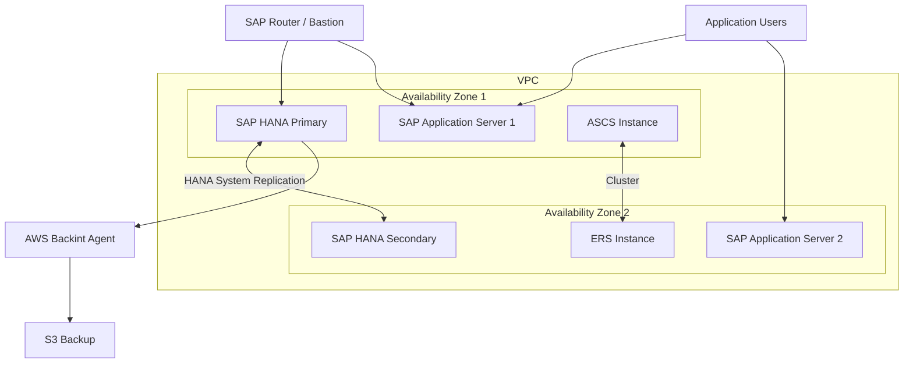

# How to Set Up AWS Launch Wizard for SAP

Author: [nawazdhandala](https://github.com/nawazdhandala)

Tags: AWS, Launch Wizard, SAP, SAP HANA, Enterprise, High Availability

Description: Deploy SAP workloads on AWS using Launch Wizard to automate the provisioning of SAP HANA, SAP NetWeaver, and supporting infrastructure with best practices.

---

Deploying SAP on AWS is one of the most complex workloads you can tackle. SAP HANA alone requires specific instance types with precise memory configurations, dedicated network interfaces, and carefully tuned storage. Add SAP NetWeaver application servers, high availability clustering, and backup infrastructure, and you are looking at weeks of manual work just for the infrastructure layer.

AWS Launch Wizard for SAP automates this entire process. It analyzes your SAP workload requirements, recommends the right EC2 instances and storage configurations, deploys everything following SAP and AWS best practices, and configures high availability clustering. What used to take weeks now takes hours.

## What Launch Wizard for SAP Deploys



Depending on your deployment choice, Launch Wizard creates:

- **SAP HANA database** instances (single node or HA with System Replication)
- **SAP NetWeaver** application servers (ABAP or Java stack)
- **ASCS/ERS** high availability clustering with Pacemaker
- **VPC networking** with proper subnet layout
- **EBS storage** optimized for HANA data and log volumes
- **EFS** for shared filesystems (sapmnt, transport)
- **AWS Backint Agent** for HANA backups to S3
- **CloudWatch monitoring** with SAP-specific metrics

## Prerequisites

### SAP Software

You need SAP installation media uploaded to S3:

```bash
# Create a bucket for SAP media
aws s3 mb s3://my-sap-media --region us-east-1

# Upload SAP HANA installation media
aws s3 cp IMDB_SERVER20_*.SAR s3://my-sap-media/hana/
aws s3 cp SAPCAR_*.EXE s3://my-sap-media/tools/

# Upload SAP NetWeaver installation media (if deploying app servers)
aws s3 cp SWPM*.SAR s3://my-sap-media/swpm/
aws s3 cp SAP_KERNEL*.SAR s3://my-sap-media/kernel/
```

### Operating System

SAP HANA on AWS typically runs on:
- SUSE Linux Enterprise Server for SAP Applications (SLES for SAP)
- Red Hat Enterprise Linux for SAP (RHEL for SAP)

You need a subscription for these OS images, available through AWS Marketplace.

### Sizing Information

Gather your SAP sizing requirements:
- HANA memory footprint (from SAP Quick Sizer or existing system)
- Number of application server dialog work processes
- Expected number of concurrent users
- Storage requirements for data and logs

## Step 1: Configure the Deployment

Launch Wizard walks through several configuration screens. Here are the key decisions:

### Deployment Type

- **SAP HANA database only** - just the database, no application layer
- **SAP HANA + SAP NetWeaver** - complete SAP system
- **SAP NetWeaver only** - application servers connecting to existing HANA

### Instance Selection

Launch Wizard recommends instances based on your HANA memory requirement:

```
HANA Memory Requirement    Recommended Instance
128 GB                     r6i.4xlarge
256 GB                     r6i.8xlarge
512 GB                     x2idn.16xlarge
1 TB                       x2idn.24xlarge
2 TB                       u-6tb1.56xlarge (High Memory)
4 TB                       u-6tb1.112xlarge
6 TB                       u-6tb1.metal
```

For production HANA workloads, the x2idn and High Memory (u-) instance families are certified by SAP.

### Storage Configuration

Launch Wizard configures EBS volumes following SAP guidelines:

```bash
# Example storage layout for a 512 GB HANA instance:
# /hana/data    - 512 GB io2, 10000 IOPS
# /hana/log     - 128 GB io2, 10000 IOPS
# /hana/shared  - 512 GB gp3
# /usr/sap      - 50 GB gp3
# /sapmnt       - EFS filesystem (shared across nodes)
# /backup       - 1 TB gp3 (or S3 via Backint)
```

### High Availability Configuration

For production deployments, enable HA:

```
HANA HA:
- HANA System Replication (synchronous or asynchronous)
- Pacemaker cluster for automatic failover
- AWS overlay IP for cluster virtual IP

NetWeaver HA:
- ASCS/ERS enqueue replication
- Pacemaker cluster
- EFS for shared filesystem
```

## Step 2: Run the Deployment

```bash
# List available deployment types
aws launchwizard list-workload-deployment-patterns \
  --workload-name "SAP"

# Create the deployment
aws launchwizard create-deployment \
  --workload-name "SAP" \
  --deployment-pattern-name "SAPHanaHA" \
  --name "production-sap-hana" \
  --specifications '{
    "HANAMemory": "512",
    "SID": "HDB",
    "InstanceNumber": "00",
    "MasterPassword": "SecurePassword123!",
    "OperatingSystem": "SuSELinuxEnterpriseServer15SP4ForSAPApplications",
    "KeyPairName": "sap-key",
    "VPCCIDR": "10.0.0.0/16",
    "HAEnabled": "true",
    "BackupEnabled": "true"
  }'
```

The deployment takes 2-4 hours depending on the configuration. Monitor progress:

```bash
# Check deployment status
aws launchwizard get-deployment \
  --deployment-id "dep-sap-abc123"

# Watch deployment events
aws launchwizard list-deployment-events \
  --deployment-id "dep-sap-abc123"
```

## Step 3: Post-Deployment Tasks

### Verify HANA System Replication

```bash
# SSH to the primary HANA node and check replication status
# As the <sid>adm user:
python /usr/sap/HDB/HDB00/exe/python_support/systemReplicationStatus.py

# Expected output should show:
# overall system replication status: ACTIVE
# mode: sync
```

### Configure Backups

Launch Wizard can set up the AWS Backint Agent for HANA backups to S3:

```bash
# Verify Backint agent configuration
# On the HANA server:
cat /usr/sap/HDB/SYS/global/hdb/opt/hdbconfig/aws-backint-agent/aws-backint-agent-config.yaml

# Test a backup
hdbsql -u SYSTEM -p <password> \
  "BACKUP DATA USING BACKINT ('COMPLETE_DATA_BACKUP')"
```

### Set Up Monitoring

```bash
# Launch Wizard installs CloudWatch agent with SAP metrics
# Key metrics to monitor:

# HANA-specific metrics
# - hana_cpu_usage
# - hana_memory_usage
# - hana_disk_usage
# - hana_replication_status

# Create alarms for HANA memory usage
aws cloudwatch put-metric-alarm \
  --alarm-name "HANA-MemoryUsage-High" \
  --namespace "SAP/HANA" \
  --metric-name "MemoryUsedPercent" \
  --dimensions '[{"Name": "SID", "Value": "HDB"}]' \
  --statistic "Average" \
  --period 300 \
  --threshold 90 \
  --comparison-operator "GreaterThanThreshold" \
  --evaluation-periods 3 \
  --alarm-actions "arn:aws:sns:us-east-1:123456789012:SAPAlerts"
```

### Install SAP Application

If you deployed HANA only, you still need to install the SAP application:

```bash
# Connect to the application server
# Run SAP SWPM (Software Provisioning Manager) for installation
# SWPM uses the HANA database deployed by Launch Wizard

# Verify the installation
sapcontrol -nr 00 -function GetProcessList
```

## Step 4: Operations and Maintenance

### Patching

```bash
# Stop SAP system before OS patching
sapcontrol -nr 00 -function StopSystem ALL

# Apply OS patches
sudo zypper update  # SLES
# or
sudo yum update     # RHEL

# Restart SAP
sapcontrol -nr 00 -function StartSystem ALL
```

### Scaling

If your HANA memory needs grow, Launch Wizard supports modifying the deployment:

```bash
# To scale up the HANA instance:
# 1. Stop the secondary HANA node
# 2. Change the instance type to a larger one
# 3. Start the secondary and let replication catch up
# 4. Failover to the secondary (now larger)
# 5. Repeat for the former primary

# This requires careful coordination with SAP Basis team
```

### Disaster Recovery

For DR across regions, set up HANA System Replication to a DR region:

```bash
# Deploy a minimal HANA instance in the DR region
# Configure asynchronous System Replication

# On the DR node:
hdbnsutil -sr_register \
  --remoteHost=hana-primary \
  --remoteInstance=00 \
  --replicationMode=async \
  --operationMode=logreplay \
  --name=DR
```

## Cost Optimization

SAP workloads on AWS can be expensive. Here are ways to optimize:

**Use Savings Plans** for HANA instances. SAP systems run 24/7, so 1-year or 3-year Savings Plans provide significant discounts (up to 72%).

**Right-size development and QA systems.** Dev and QA typically need much less memory than production. Use smaller instance types and consider stopping non-production systems outside business hours.

**Use gp3 instead of io2 for non-production.** The performance difference is negligible for dev/QA workloads, and gp3 is significantly cheaper.

**Leverage S3 for backups** instead of local EBS. The AWS Backint Agent makes this seamless and S3 is far cheaper than EBS for backup storage.

## Wrapping Up

AWS Launch Wizard for SAP takes the most complex AWS workload deployment and makes it manageable. The automation covers everything from instance selection to HANA System Replication configuration to Pacemaker clustering. It follows both AWS and SAP best practices, which means your deployment is production-ready from day one. For SAP Basis teams new to AWS, Launch Wizard is the fastest path to a well-architected SAP landscape.
