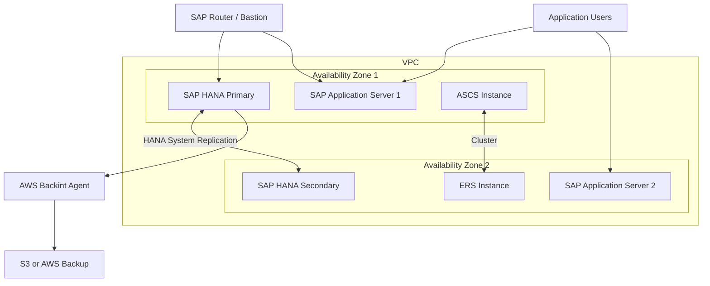

# How to Set Up AWS Launch Wizard for SAP

Author: [nawazdhandala](https://github.com/nawazdhandala)

Tags: AWS, Launch Wizard, SAP, SAP HANA, Enterprise, High Availability

Description: Deploy SAP workloads on AWS using Launch Wizard to automate the provisioning of SAP HANA, SAP NetWeaver, and supporting infrastructure with best practices.

---

Deploying SAP on AWS is one of the most complex workloads you can tackle. SAP HANA alone requires specific instance types with precise memory configurations, dedicated network interfaces, and carefully tuned storage. Add SAP NetWeaver application servers, high availability clustering, and backup infrastructure, and you are looking at weeks of manual work just for the infrastructure layer.

AWS Launch Wizard for SAP automates this entire process. It analyzes your SAP workload requirements, recommends the right EC2 instances and storage configurations, deploys everything following SAP and AWS best practices, and configures high availability clustering. What used to take weeks now takes hours.

## What Launch Wizard for SAP Deploys


```mermaid
graph TD
    subgraph VPC
        subgraph AZ1[Availability Zone 1]
            A[SAP HANA Primary]
            B[SAP Application Server 1]
            C[ASCS Instance]
        end
        subgraph AZ2[Availability Zone 2]
            D[SAP HANA Secondary]
            E[SAP Application Server 2]
            F[ERS Instance]
        end
    end
    A <-->|HANA System Replication| D
    C <-->|Cluster| F
    G[SAP Router / Bastion] --> A
    G --> B
    H[Application Users] --> B
    H --> E
    I[AWS Backint Agent] --> J[S3 or AWS Backup]
    A --> I
```

Depending on your deployment choice, Launch Wizard provisions and configures:

- **SAP HANA database** instances (single node or HA with System Replication)
- **SAP NetWeaver** application servers (ABAP or Java stack)
- **ASCS/ERS** high availability clustering with Pacemaker
- **VPC networking** in the VPC and subnets you provide
- **EBS storage** optimized for HANA data and log volumes
- **EFS** for shared file systems such as transport directories and central services HA, where applicable
- **AWS Backint Agent** for HANA backups to Amazon S3 or AWS Backup
- **CloudWatch Logs** and integration points for SAP-specific monitoring

## Prerequisites

### SAP Software

You need SAP installation media uploaded to S3:

```bash
# Create a bucket for SAP media

aws s3 mb s3://my-sap-media --region us-east-1

# Upload SAP HANA installation media
aws s3 cp IMDB_SERVER20_*.SAR s3://my-sap-media/hana/
aws s3 cp SAPCAR_*.EXE s3://my-sap-media/tools/

# Upload SAP NetWeaver installation media (if deploying app servers)
aws s3 cp SWPM*.SAR s3://my-sap-media/swpm/
aws s3 cp SAP_KERNEL*.SAR s3://my-sap-media/kernel/
```

### Operating System

SAP HANA on AWS typically runs on:
- SUSE Linux Enterprise Server for SAP Applications (SLES for SAP)
- Red Hat Enterprise Linux for SAP (RHEL for SAP)

You need a subscription for these OS images, available through AWS Marketplace.

### Sizing Information

Gather your SAP sizing requirements:
- HANA memory footprint (from SAP Quick Sizer or existing system)
- Number of application server dialog work processes
- Expected number of concurrent users
- Storage requirements for data and logs

## Step 1: Configure the Deployment

Launch Wizard walks through several configuration screens. Here are the key decisions:

### Deployment Type

- **SAP HANA database only** - just the database, no application layer
- **SAP HANA + SAP NetWeaver** - complete SAP system
- **SAP NetWeaver only** - application servers connecting to existing HANA

### Instance Selection

Launch Wizard recommends instances based on your HANA memory requirement. The exact recommendation changes as AWS and SAP certify new instances, but typical certified scale-up mappings look like this:

```text
HANA Memory Requirement    Example Certified Instance
256 GiB                    r6i.8xlarge
512 GiB                    r6i.16xlarge
1 TiB                      x2idn.16xlarge
1.5 TiB                    x2idn.24xlarge
2 TiB                      x2idn.32xlarge
4 TiB                      x2iedn.32xlarge
6 TiB                      u-6tb1.56xlarge, u-6tb1.112xlarge, or u-6tb1.metal
```

For production HANA workloads, use EC2 instance types certified by SAP for the target HANA size and confirm that they are available in your chosen Region and Availability Zone.

### Storage Configuration

Launch Wizard configures EBS volumes following SAP guidelines:

```bash
# Example storage layout for a 512 GiB HANA instance:
# /hana/data    - 600 GiB gp3 or io2, about 7400 IOPS
# /hana/log     - 300 GiB gp3 or io2, about 3000 IOPS
# /hana/shared  - 512 GB gp3
# /usr/sap      - 50 GB gp3
# /sapmnt       - EFS file system where applicable for shared SAP file systems
# /backup       - Optional and workload-dependent, often S3 or AWS Backup via Backint
```

### High Availability Configuration

For production deployments, enable HA:

```text
HANA HA:
- HANA System Replication (synchronous or asynchronous)
- Pacemaker cluster for automatic failover
- AWS overlay IP for cluster virtual IP

NetWeaver HA:
- ASCS/ERS enqueue replication
- Pacemaker cluster
- EFS for shared filesystem
```

## Step 2: Run the Deployment

```bash
# List available deployment types
aws launch-wizard list-workload-deployment-patterns \
  --workload-name SAP \
  --region us-east-1

# Create the deployment using the SapHanaHA pattern
aws launch-wizard create-deployment \
  --workload-name SAP \
  --deployment-pattern-name SapHanaHA \
  --name production-sap-hana \
  --region us-east-1 \
  --specifications file://hana-ha-specifications.json
```

The `hana-ha-specifications.json` file must use the Launch Wizard specification names for the selected pattern:

```json
{
  "KeyPairName": "sap-key",
  "VpcId": "vpc-0123456789abcdef0",
  "AvailabilityZone1PrivateSubnet1Id": "subnet-11111111111111111",
  "AvailabilityZone2PrivateSubnet1Id": "subnet-22222222222222222",
  "Timezone": "UTC",
  "EnableEbsVolumeEncryption": "Yes",
  "EbsKmsKeyArn": "arn:aws:kms:us-east-1:111122223333:alias/aws/ebs",
  "CreateSecurityGroup": "No",
  "DatabaseSecurityGroupId": "sg-0123456789abcdef0",
  "ApplicationSecurityGroupId": "sg-0123456789abcdef0",
  "SapSysGroupId": "1001",
  "DatabaseSystemId": "HDB",
  "DatabaseInstanceNumber": "00",
  "DatabasePassword": "SecurePwd123",
  "InstallDatabaseSoftware": "Yes",
  "DatabaseInstallationMediaS3Uri": "s3://my-sap-media/hana/",
  "DatabaseOperatingSystem": "SuSE-Linux-15-SP4-For-SAP-HVM",
  "DatabaseAmiId": "ami-0123456789abcdef0",
  "DatabasePrimaryHostname": "hana-pri",
  "DatabaseSecondaryHostname": "hana-sec",
  "DatabaseInstanceType": "r6i.16xlarge",
  "DatabaseLogVolumeType": "gp3",
  "InstallAwsBackintAgent": "Yes",
  "BackintSpecifications": "{\"backintBucketName\":\"my-hana-backups\",\"backintBucketFolder\":\"HDB\",\"backintBucketRegion\":\"us-east-1\",\"backintKmsKeyArn\":\"arn:aws:kms:us-east-1:111122223333:alias/aws/s3\",\"backintAgentVersion\":\"2.1.5\",\"backintContinueOnFailure\":\"No\",\"backintCreateEbsVolume\":\"No\"}",
  "DatabaseVirtualIpAddress": "10.255.0.10",
  "DatabasePrimarySiteName": "HAP",
  "DatabaseSecondarySiteName": "HAS",
  "DatabasePacemakerTag": "HDBPacemaker",
  "DisableDeploymentRollback": "No",
  "SaveDeploymentArtifacts": "No"
}
```

The deployment takes 2-4 hours depending on the configuration. Monitor progress:

```bash
# Check deployment status
aws launch-wizard get-deployment \
  --deployment-id "a1b2c3d4-5678-90ab-cdef-EXAMPLE11111" \
  --region us-east-1

# Watch deployment events
aws launch-wizard list-deployment-events \
  --deployment-id "a1b2c3d4-5678-90ab-cdef-EXAMPLE11111" \
  --region us-east-1
```

## Step 3: Post-Deployment Tasks

### Verify HANA System Replication

```bash
# SSH to the primary HANA node and check replication status
# As the <sid>adm user:
python /usr/sap/HDB/HDB00/exe/python_support/systemReplicationStatus.py

# Expected output should show:
# overall system replication status: ACTIVE
# mode: sync
```

### Configure Backups

Launch Wizard can set up the AWS Backint Agent for HANA backups to Amazon S3 or AWS Backup:

```bash
# Verify Backint agent configuration
# On the HANA server:
cat /usr/sap/HDB/SYS/global/hdb/opt/hdbconfig/aws-backint-agent-config.yaml

# Test a backup
hdbsql -u SYSTEM -p <password> \
  "BACKUP DATA USING BACKINT ('COMPLETE_DATA_BACKUP')"
```

### Set Up Monitoring

```bash
# Launch Wizard can send deployment and application logs to CloudWatch.
# For SAP HANA metrics, configure CloudWatch Application Insights for SAP HANA.
# Key metrics to monitor include:

# HANA-specific metrics
# - hanadb_cpu_usage_percent
# - hanadb_current_allocation_limit_used_percent
# - hanadb_disk_usage_highlevel_percent
# - hanadb_hsr_replication_status

# Discover the exact namespace and dimensions before creating alarms
aws cloudwatch list-metrics \
  --metric-name hanadb_current_allocation_limit_used_percent \
  --region us-east-1
```

### Install SAP Application

If you deployed HANA only, you still need to install the SAP application:

```bash
# Connect to the application server
# Run SAP SWPM (Software Provisioning Manager) for installation
# SWPM uses the HANA database deployed by Launch Wizard

# Verify the installation
sapcontrol -nr 00 -function GetProcessList
```

## Step 4: Operations and Maintenance

### Patching

```bash
# Stop SAP system before OS patching
sapcontrol -nr 00 -function StopSystem ALL

# Apply OS patches
sudo zypper update  # SLES
# or
sudo yum update     # RHEL

# Restart SAP
sapcontrol -nr 00 -function StartSystem ALL
```

### Scaling

If your HANA memory needs grow, plan an SAP HANA scale-up by resizing the EC2 instances and coordinating the change with your SAP Basis team:

```bash
# To scale up the HANA instance:
# 1. Stop the secondary HANA node
# 2. Change the instance type to a larger one
# 3. Start the secondary and let replication catch up
# 4. Failover to the secondary (now larger)
# 5. Repeat for the former primary

# This requires careful coordination with SAP Basis team
```

### Disaster Recovery

For DR across regions, set up HANA System Replication to a DR region:

```bash
# Deploy a minimal HANA instance in the DR region
# Configure asynchronous System Replication

# On the DR node:
hdbnsutil -sr_register \
  --remoteHost=hana-primary \
  --remoteInstance=00 \
  --replicationMode=async \
  --operationMode=logreplay \
  --name=DR
```

## Cost Optimization

SAP workloads on AWS can be expensive. Here are ways to optimize:

**Use Savings Plans** for HANA instances. SAP systems run 24/7, so 1-year or 3-year Savings Plans provide significant discounts (up to 72%).

**Right-size development and QA systems.** Dev and QA typically need much less memory than production. Use smaller instance types and consider stopping non-production systems outside business hours.

**Use gp3 instead of io2 for non-production.** The performance difference is negligible for dev/QA workloads, and gp3 is significantly cheaper.

**Leverage S3 for backups** instead of local EBS. The AWS Backint Agent makes this seamless and S3 is far cheaper than EBS for backup storage.

## Wrapping Up

AWS Launch Wizard for SAP takes the most complex AWS workload deployment and makes it manageable. The automation covers everything from instance selection to HANA System Replication configuration to Pacemaker clustering. It follows both AWS and SAP best practices, which gives you a strong foundation for a production-ready deployment. For SAP Basis teams new to AWS, Launch Wizard is the fastest path to a well-architected SAP landscape.
