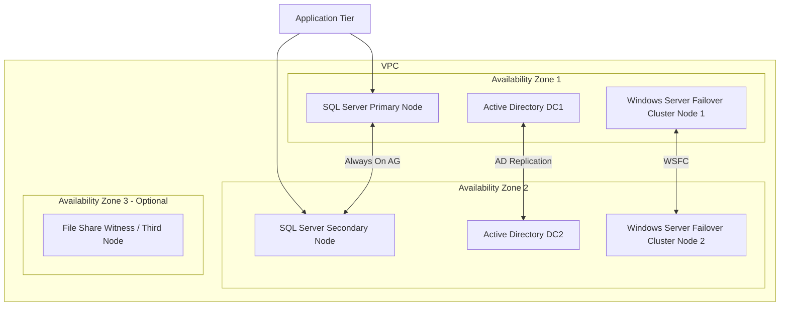

# How to Set Up AWS Launch Wizard for SQL Server

Author: [nawazdhandala](https://github.com/nawazdhandala)

Tags: AWS, Launch Wizard, SQL Server, Database, Windows, High Availability

Description: Use AWS Launch Wizard to deploy production-ready SQL Server environments on EC2 with high availability, best practices, and automated configuration.

---

Deploying SQL Server on AWS with proper high availability, networking, and security is a multi-day project if you do it manually. You need to set up VPCs, subnets across availability zones, Windows Server instances, Active Directory, SQL Server Always On Availability Groups, and all the networking and security configuration to tie it together. AWS Launch Wizard automates this entire process through a guided deployment experience.

Launch Wizard is not just a CloudFormation template generator. It analyzes your workload requirements, recommends EC2 instance types based on your performance needs, and deploys a complete, production-ready SQL Server environment following AWS best practices.

## What Launch Wizard Deploys

Here is the architecture that Launch Wizard creates for a highly available SQL Server deployment:



The deployment includes:

- **VPC** with public and private subnets across multiple AZs
- **Active Directory** domain controllers for Windows authentication
- **SQL Server instances** with Always On Availability Groups
- **Windows Server Failover Clustering** for automatic failover
- **Security groups** with least-privilege rules
- **EBS volumes** optimized for database workloads

## Step 1: Prepare Prerequisites

Before running Launch Wizard, you need a few things in place:

### SQL Server License

Decide on your licensing model:

```bash
# Option 1: License Included (AWS provides the license)
# No prep needed - select this during wizard

# Option 2: Bring Your Own License (BYOL)
# You need SQL Server media and a valid license key
# Upload the media to S3
aws s3 cp SQLServer2022-x64-ENU.iso \
  s3://my-sql-media/SQLServer2022-x64-ENU.iso
```

For BYOL, you will need to use Dedicated Hosts or Dedicated Instances to comply with Microsoft licensing. For managing these licenses, see our guide on [using AWS License Manager with EC2 and RDS](https://oneuptime.com/blog/post/use-aws-license-manager-with-ec2-and-rds/view).

### Key Pair

```bash
# Create a key pair for accessing the instances
aws ec2 create-key-pair \
  --key-name "sql-server-key" \
  --query "KeyMaterial" \
  --output text > sql-server-key.pem
chmod 400 sql-server-key.pem
```

### IAM Role

Launch Wizard needs permissions to create resources on your behalf:

```bash
# The Launch Wizard service-linked role is created automatically
# But you need an EC2 instance profile for the SQL Server instances
aws iam create-role \
  --role-name "LaunchWizard-SQLServer-Role" \
  --assume-role-policy-document '{
    "Version": "2012-10-17",
    "Statement": [
      {
        "Effect": "Allow",
        "Principal": {
          "Service": "ec2.amazonaws.com"
        },
        "Action": "sts:AssumeRole"
      }
    ]
  }'

aws iam attach-role-policy \
  --role-name "LaunchWizard-SQLServer-Role" \
  --policy-arn "arn:aws:iam::aws:policy/AmazonSSMManagedInstanceCore"
```

## Step 2: Run the Launch Wizard

Launch Wizard is primarily a console-based experience, but you can also configure it programmatically. The wizard walks you through several configuration pages.

### Configuration Choices

**Deployment model:**
- Single node (dev/test)
- High availability with Always On (production)

**SQL Server version and edition:**
- SQL Server 2019 or 2022
- Standard, Enterprise, or Developer edition

**Instance sizing** - Launch Wizard recommends instance types based on your inputs:

```
Workload characteristics you provide:
- Number of users: 500
- Database size: 200 GB
- Transaction rate: 1000 TPS
- Memory requirements: 64 GB

Launch Wizard recommends:
- Primary: r6i.2xlarge (8 vCPU, 64 GB RAM)
- Secondary: r6i.2xlarge (matching primary)
- AD Controllers: t3.large
```

**Storage configuration:**
- Data volumes: gp3 or io2 EBS, sized for your database
- Log volumes: separate EBS volumes for transaction logs
- TempDB: dedicated volumes or instance store (if available)

```bash
# Example of what Launch Wizard configures for storage:
# Data drive (D:) - 500 GB gp3, 3000 IOPS, 125 MB/s
# Log drive (E:) - 100 GB gp3, 3000 IOPS, 125 MB/s
# TempDB drive (T:) - 100 GB gp3, 3000 IOPS, 125 MB/s
# Backup drive (Z:) - 500 GB gp3
```

**Network configuration:**
- New VPC or existing VPC
- CIDR ranges for subnets
- Availability Zones
- Whether to create public access (not recommended for production)

**Active Directory:**
- New AWS Managed Microsoft AD
- Existing directory

## Step 3: Monitor the Deployment

Launch Wizard deployments can take 2-3 hours for a full HA setup. Monitor progress:

```bash
# List Launch Wizard deployments
aws launchwizard list-deployments

# Get deployment details
aws launchwizard get-deployment \
  --deployment-id "dep-abc123"

# Check deployment events
aws launchwizard list-deployment-events \
  --deployment-id "dep-abc123"
```

The deployment proceeds in stages:
1. VPC and networking setup
2. Active Directory deployment
3. Primary SQL Server node
4. Secondary SQL Server node
5. Always On Availability Group configuration
6. Failover cluster validation

## Step 4: Post-Deployment Configuration

Once the deployment is complete, there are a few things to configure:

### Connect to the Instances

```bash
# Get the instance details
aws ec2 describe-instances \
  --filters "Name=tag:aws:launchwizard:deployment-id,Values=dep-abc123" \
  --query "Reservations[*].Instances[*].[InstanceId,PrivateIpAddress,Tags[?Key=='Name'].Value|[0]]" \
  --output table
```

### Create Databases

Connect to the primary SQL Server node via RDP and create your databases:

```sql
-- Create a database and add it to the Availability Group
CREATE DATABASE MyAppDB
ON PRIMARY (
    NAME = 'MyAppDB_Data',
    FILENAME = 'D:\SQLData\MyAppDB.mdf',
    SIZE = 10GB,
    FILEGROWTH = 1GB
)
LOG ON (
    NAME = 'MyAppDB_Log',
    FILENAME = 'E:\SQLLogs\MyAppDB_log.ldf',
    SIZE = 5GB,
    FILEGROWTH = 512MB
);
GO

-- Set the recovery model to FULL (required for AG)
ALTER DATABASE MyAppDB SET RECOVERY FULL;
GO

-- Take a full backup (required before adding to AG)
BACKUP DATABASE MyAppDB
TO DISK = 'Z:\SQLBackup\MyAppDB_full.bak';
GO

-- Add database to the Always On Availability Group
ALTER AVAILABILITY GROUP [MyAG]
ADD DATABASE MyAppDB;
GO
```

### Configure Backups

```bash
# Set up automated backups to S3 using SQL Server maintenance plans
# or use a Lambda function with SSM to run backup scripts

# Create an S3 bucket for backups
aws s3api create-bucket \
  --bucket my-sql-backups \
  --region us-east-1

# The SQL Server instances can use their IAM role to write to S3
# Configure SQL Server backup to S3 using the S3 backup extension
```

## Step 5: Set Up Monitoring

Monitor your SQL Server deployment:

```bash
# CloudWatch agent is pre-installed by Launch Wizard
# Key metrics to watch:
# - CPU Utilization
# - Memory Available MBytes
# - Disk Queue Length
# - Network throughput

# Set up an alarm for high CPU
aws cloudwatch put-metric-alarm \
  --alarm-name "SQL-Primary-HighCPU" \
  --namespace "AWS/EC2" \
  --metric-name "CPUUtilization" \
  --dimensions '[{"Name": "InstanceId", "Value": "i-primary-instance-id"}]' \
  --statistic "Average" \
  --period 300 \
  --threshold 80 \
  --comparison-operator "GreaterThanThreshold" \
  --evaluation-periods 3 \
  --alarm-actions "arn:aws:sns:us-east-1:123456789012:DBAlerts"
```

## Managing the Deployment

```bash
# List all Launch Wizard deployments
aws launchwizard list-deployments

# Delete a deployment (this terminates all resources)
aws launchwizard delete-deployment \
  --deployment-id "dep-abc123"
```

## When to Use Launch Wizard vs RDS

**Use Launch Wizard for SQL Server when:**
- You need full OS-level access for custom configurations
- You have BYOL SQL Server Enterprise licenses
- You need features not supported by RDS (linked servers, CLR assemblies, FILESTREAM)
- Compliance requires specific OS hardening
- You need SQL Server Agent jobs with complex scheduling

**Use RDS for SQL Server when:**
- You want a fully managed experience with automated patching and backups
- Standard SQL Server features are sufficient
- You prefer operational simplicity over control

## Wrapping Up

AWS Launch Wizard turns a multi-day SQL Server deployment project into a guided, automated process. It encodes AWS best practices for SQL Server high availability, storage optimization, and networking. The result is a production-ready environment that would take days to build manually. Start with the wizard for your initial deployment, then customize the configuration for your specific workload as needed.
