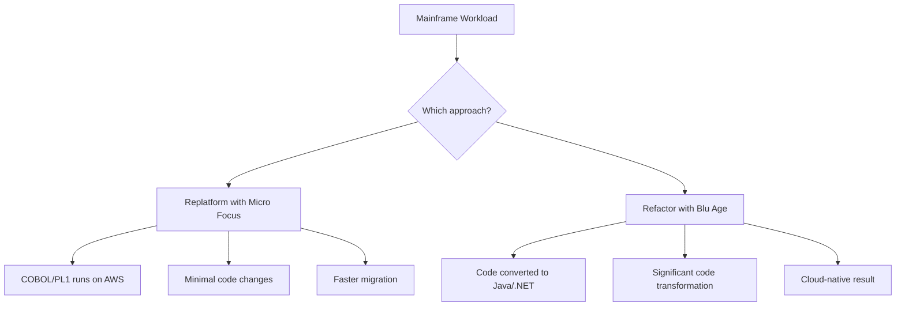

# How to Set Up AWS Mainframe Modernization

Author: [nawazdhandala](https://github.com/nawazdhandala)

Tags: AWS, Mainframe Modernization, COBOL, Migration, Replatform, Refactor

Description: Learn how to set up AWS Mainframe Modernization to migrate and modernize mainframe workloads using automated refactoring or replatforming approaches.

---

Mainframes are not going away anytime soon, but maintaining them is getting harder and more expensive. The hardware is aging, the workforce that understands COBOL and JCL is shrinking, and licensing costs keep climbing. AWS Mainframe Modernization is a managed service designed specifically to help organizations migrate mainframe workloads to AWS using two distinct approaches: replatforming (running existing mainframe code on AWS) and automated refactoring (converting mainframe code to modern languages).

This guide covers how to set up both approaches and choose the right one for your situation.

## Two Paths to Modernization



**Replatforming (Micro Focus)**: Your COBOL, PL/I, and JCL code runs on AWS using the Micro Focus runtime environment. The code stays largely the same, but runs on modern infrastructure. This is faster and lower risk.

**Automated Refactoring (Blu Age)**: Your mainframe code is automatically converted to modern Java or .NET code. The result is a cloud-native application, but the transformation process is more complex.

## Choosing Your Approach

| Factor | Replatform (Micro Focus) | Refactor (Blu Age) |
|---|---|---|
| Speed | Weeks to months | Months to years |
| Risk | Lower | Higher |
| Code changes | Minimal | Complete rewrite |
| Long-term maintenance | Still COBOL | Modern language |
| Developer availability | Shrinking COBOL pool | Broad Java/.NET pool |
| Cloud-native features | Limited | Full |
| Cost to migrate | Lower | Higher |
| Cost to operate | Medium | Lower long-term |

For most organizations, the practical approach is to replatform first to get off the mainframe quickly, then selectively refactor the most critical applications over time.

## Setting Up Replatforming with Micro Focus

### Step 1: Create a Managed Runtime Environment

```python
# Create a Micro Focus managed runtime environment
import boto3

m2 = boto3.client('m2')

response = m2.create_environment(
    name='mainframe-replatform',
    engineType='microfocus',
    instanceType='M2.m5.large',
    engineVersion='8.0.11',
    subnetIds=['subnet-private-1', 'subnet-private-2'],
    securityGroupIds=['sg-mainframe-runtime'],
    storageConfigurations=[
        {
            'efs': {
                'fileSystemId': 'fs-abc123',
                'mountPoint': '/m2/data'
            }
        }
    ],
    highAvailabilityConfig={
        'desiredCapacity': 2
    },
    tags={
        'Project': 'MainframeModernization',
        'Environment': 'Production'
    }
)

environment_id = response['environmentId']
print(f"Environment creating: {environment_id}")
```

### Step 2: Prepare Your Application

Before deploying to the managed environment, you need to:

1. **Export source code** from the mainframe (COBOL, PL/I, JCL, copybooks)
2. **Export data** (VSAM files, DB2 databases, IMS databases)
3. **Compile the code** for the Micro Focus runtime

Create an application definition:

```json
{
  "definition": {
    "content": {
      "s3Location": "s3://mainframe-migration/app-definition.json"
    }
  },
  "name": "core-banking-app",
  "description": "Core banking batch and CICS transactions",
  "engineType": "microfocus",
  "tags": {
    "BusinessUnit": "Banking",
    "Criticality": "High"
  }
}
```

The application definition file describes your application components:

```json
{
  "template-version": "2.0",
  "source-locations": [
    {
      "source-id": "s3-source",
      "source-type": "s3",
      "properties": {
        "s3-bucket": "mainframe-migration",
        "s3-key-prefix": "source-code/"
      }
    }
  ],
  "definition": {
    "listeners": [
      {
        "port": 6000,
        "type": "CICS"
      }
    ],
    "batch-settings": {
      "initiators": [
        {
          "classes": ["A", "B"],
          "description": "Batch job initiators"
        }
      ]
    },
    "dataset-locations": {
      "db-locations": [
        {
          "name": "Database",
          "type": "rds",
          "properties": {
            "endpoint": "mainframe-db.abc123.us-east-1.rds.amazonaws.com",
            "port": 5432,
            "databaseName": "banking"
          }
        }
      ]
    }
  }
}
```

### Step 3: Deploy the Application

```python
# Create and deploy the application
import boto3

m2 = boto3.client('m2')

# Create the application
app_response = m2.create_application(
    name='core-banking-app',
    description='Core banking COBOL application',
    engineType='microfocus',
    definition={
        'content': '{"template-version": "2.0", ...}'  # Your definition JSON
    }
)

app_id = app_response['applicationId']

# Create a version with the compiled artifacts
version_response = m2.create_application_version(
    applicationId=app_id,
    applicationVersion='1.0.0',
    sourceContent={
        's3Location': 's3://mainframe-migration/compiled-artifacts/'
    }
)

# Deploy to the runtime environment
m2.create_deployment(
    applicationId=app_id,
    applicationVersion=1,
    environmentId=environment_id
)
```

### Step 4: Migrate Data

Mainframe data lives in various formats: VSAM, sequential files, DB2, and IMS. Each requires a different approach.

**VSAM and Sequential Files**: Convert to relational tables or S3 objects.

```python
# Use the File Transfer utility to convert VSAM to relational format
# The Micro Focus runtime includes data migration utilities

# For DB2 databases, use DMS
dms = boto3.client('dms')

dms.create_endpoint(
    EndpointIdentifier='source-mainframe-db2',
    EndpointType='source',
    EngineName='db2-zos',
    ServerName='mainframe-host',
    Port=446,
    DatabaseName='BANKDB',
    Username='dms_user',
    Password='password'
)

dms.create_endpoint(
    EndpointIdentifier='target-rds-postgres',
    EndpointType='target',
    EngineName='postgres',
    ServerName='mainframe-db.abc123.us-east-1.rds.amazonaws.com',
    Port=5432,
    DatabaseName='banking',
    Username='admin',
    Password='password'
)
```

## Setting Up Automated Refactoring with Blu Age

### Step 1: Analyze Your Code

Before refactoring, Blu Age analyzes your mainframe code to understand complexity and identify potential issues:

```python
# Start code analysis
m2 = boto3.client('m2')

# Upload source code to S3
# s3://mainframe-migration/source-code/
# - COBOL programs
# - Copybooks
# - JCL procedures
# - BMS maps (screen definitions)

# Create analysis job (done through the console or API)
```

The analysis produces a report covering:
- Lines of code by language
- Complexity metrics per program
- Data flow analysis
- Screen/UI inventory
- Dead code identification
- Dependency graph

### Step 2: Configure the Refactoring Project

Create a Blu Age refactoring project:

```python
# Create a Blu Age managed environment
response = m2.create_environment(
    name='mainframe-refactor',
    engineType='bluage',
    instanceType='M2.m5.xlarge',
    engineVersion='3.6.0',
    subnetIds=['subnet-private-1', 'subnet-private-2'],
    securityGroupIds=['sg-bluage-runtime']
)
```

### Step 3: Execute the Refactoring

Blu Age converts your COBOL/PL1 code to Java:

```
COBOL Source                    -->  Java Output
IDENTIFICATION DIVISION.             @Service
PROGRAM-ID. CALC-INTEREST.           public class CalcInterest {
WORKING-STORAGE SECTION.
01 WS-PRINCIPAL   PIC 9(9)V99.       private BigDecimal principal;
01 WS-RATE        PIC 9(3)V99.       private BigDecimal rate;
01 WS-INTEREST    PIC 9(9)V99.       private BigDecimal interest;

PROCEDURE DIVISION.                   public void execute() {
    COMPUTE WS-INTEREST =                interest = principal
        WS-PRINCIPAL *                       .multiply(rate)
        WS-RATE / 100.                       .divide(BigDecimal.valueOf(100));
    DISPLAY WS-INTEREST.                 log.info("Interest: {}", interest);
    STOP RUN.                          }
                                     }
```

The automated conversion handles:
- COBOL/PL1 to Java class conversion
- CICS transaction to REST API mapping
- BMS screen to web UI conversion
- JCL to Spring Batch job conversion
- VSAM file access to database access
- DB2 SQL to standard SQL

### Step 4: Review and Test the Generated Code

The generated code needs review and testing:

```bash
# Build the generated Java project
cd /generated/core-banking-java
mvn clean package

# Run unit tests (generated from mainframe test cases)
mvn test

# Run integration tests
mvn verify -Pintegration-tests
```

Key things to validate:
- Business logic produces the same results as the mainframe
- Data calculations match (especially decimal precision)
- Transaction boundaries are preserved
- Error handling works correctly
- Performance meets requirements

## Monitoring the Modernized Application

```python
# Set up CloudWatch monitoring for the managed environment
import boto3

cloudwatch = boto3.client('cloudwatch')

# Monitor the M2 environment
cloudwatch.put_metric_alarm(
    AlarmName='M2-Environment-CPU',
    Namespace='AWS/M2',
    MetricName='CPUUtilization',
    Dimensions=[
        {'Name': 'EnvironmentId', 'Value': environment_id}
    ],
    Statistic='Average',
    Period=300,
    EvaluationPeriods=3,
    Threshold=80,
    ComparisonOperator='GreaterThanThreshold',
    AlarmActions=['arn:aws:sns:us-east-1:123456789:ops-alerts']
)
```

For comprehensive monitoring of your modernized mainframe workloads, [OneUptime](https://oneuptime.com/blog/post/migrate-from-on-premises-to-aws-step-by-step/view) provides application monitoring that covers both the runtime environment and the business transactions that depend on it.

## Testing Strategies

Mainframe modernization requires rigorous testing:

1. **Unit testing**: Compare output of individual programs/functions
2. **Integration testing**: End-to-end transaction testing
3. **Regression testing**: Run production workloads in parallel
4. **Performance testing**: Ensure batch jobs complete within windows
5. **Data validation**: Compare database states after parallel runs

```python
# Parallel run comparison
def compare_outputs(mainframe_output, aws_output):
    differences = []

    for key in mainframe_output:
        if key not in aws_output:
            differences.append(f"Missing in AWS: {key}")
        elif mainframe_output[key] != aws_output[key]:
            differences.append(
                f"Mismatch for {key}: mainframe={mainframe_output[key]}, aws={aws_output[key]}"
            )

    return differences
```

## Planning the Cutover

Mainframe cutovers typically happen over a weekend:

```mermaid
gantt
    title Mainframe Cutover Plan
    dateFormat HH:mm
    section Friday Night
    Stop batch jobs         :f1, 22:00, 1h
    Final data sync         :f2, after f1, 2h
    section Saturday
    Data validation         :s1, 01:00, 3h
    Application testing     :s2, after s1, 4h
    Performance testing     :s3, after s2, 4h
    section Sunday
    Go/No-Go decision      :u1, 08:00, 1h
    DNS/routing switch      :u2, after u1, 1h
    Monitor                 :u3, after u2, 8h
    section Monday
    Full production         :m1, 06:00, 12h
```



Always keep the mainframe available for rollback during the stabilization period.

## Wrapping Up

AWS Mainframe Modernization provides two clear paths off the mainframe: replatforming to get off quickly with minimal risk, and automated refactoring for a cloud-native end state. Most organizations benefit from starting with replatforming to reduce mainframe costs immediately, then selectively refactoring the most valuable applications. The key to success is thorough testing, especially parallel running of production workloads to validate that the modernized system produces identical results to the mainframe. Take it application by application, validate rigorously, and maintain a rollback path until you are confident in the new platform.
