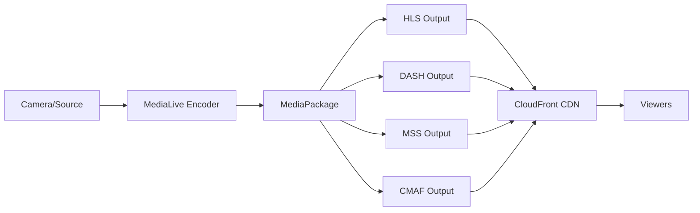

# How to Set Up AWS MediaPackage for Video Packaging

Author: [nawazdhandala](https://github.com/nawazdhandala)

Tags: AWS, MediaPackage, Video, Streaming, Media Services, CDN

Description: Learn how to set up AWS Elemental MediaPackage to prepare and package live and on-demand video streams for delivery across multiple devices and platforms.

---

Delivering video to end users involves more than just streaming bytes. Different devices need different formats - Apple devices want HLS, Android prefers DASH, and smart TVs might need Microsoft Smooth Streaming. On top of that, you need DRM encryption, ad insertion points, and time-shifted viewing capabilities. AWS Elemental MediaPackage handles all of this by taking a single input stream and packaging it into multiple output formats, ready for delivery through CloudFront or any CDN.

This guide covers setting up MediaPackage for both live and video-on-demand (VOD) workflows, configuring output formats, and integrating with other AWS media services.

## What Is AWS Elemental MediaPackage?

MediaPackage is a video packaging and origination service. It sits between your video encoder (like AWS Elemental MediaLive) and your CDN (like CloudFront). Its job is to:

- Receive a single encoded video stream
- Package it into multiple streaming formats (HLS, DASH, MSS, CMAF)
- Apply DRM encryption (Widevine, FairPlay, PlayReady)
- Insert SCTE-35 ad markers for server-side ad insertion
- Enable time-shifted viewing (DVR, catch-up TV, start-over)
- Handle failover between redundant inputs

## Architecture Overview



## Prerequisites

- An AWS account with MediaPackage permissions
- A video source (live camera, file, or test stream)
- AWS Elemental MediaLive configured (for live workflows)
- CloudFront distribution (recommended for delivery)

## Step 1: Create a MediaPackage Channel (Live)

A channel is the entry point for your live video. Each channel has two input endpoints for redundancy.

```bash
# Create a MediaPackage channel for live streaming
aws mediapackage create-channel \
  --id "my-live-channel" \
  --description "Live streaming channel for sports events" \
  --tags Environment=production,Team=media
```

The response includes two HLS ingest endpoints with URLs and credentials:

```json
{
  "Id": "my-live-channel",
  "HlsIngest": {
    "IngestEndpoints": [
      {
        "Id": "ingest-1",
        "IngestEndpoint": "https://abc123.mediapackage.us-east-1.amazonaws.com/in/v2/my-live-channel/my-live-channel/channel",
        "Password": "secretpass1",
        "Username": "user1",
        "Url": "https://abc123.mediapackage.us-east-1.amazonaws.com/in/v2/my-live-channel/my-live-channel/channel"
      },
      {
        "Id": "ingest-2",
        "IngestEndpoint": "https://def456.mediapackage.us-east-1.amazonaws.com/in/v2/my-live-channel/my-live-channel/channel",
        "Password": "secretpass2",
        "Username": "user2",
        "Url": "https://def456.mediapackage.us-east-1.amazonaws.com/in/v2/my-live-channel/my-live-channel/channel"
      }
    ]
  }
}
```

Use these endpoints in your MediaLive output configuration.

## Step 2: Create Origin Endpoints

Origin endpoints define how MediaPackage packages and serves your video. Create one for each output format you need.

### HLS Endpoint

```bash
# Create an HLS origin endpoint
aws mediapackage create-origin-endpoint \
  --channel-id "my-live-channel" \
  --id "my-live-channel-hls" \
  --description "HLS output for Apple devices" \
  --manifest-name "index" \
  --startover-window-seconds 86400 \
  --time-delay-seconds 0 \
  --hls-package '{
    "SegmentDurationSeconds": 6,
    "PlaylistWindowSeconds": 60,
    "PlaylistType": "EVENT",
    "AdMarkers": "SCTE35_ENHANCED",
    "IncludeIframeOnlyStream": true,
    "UseAudioRenditionGroup": true,
    "StreamSelection": {
      "MaxVideoBitsPerSecond": 2147483647,
      "MinVideoBitsPerSecond": 0,
      "StreamOrder": "VIDEO_BITRATE_DESCENDING"
    }
  }'
```

### DASH Endpoint

```bash
# Create a DASH origin endpoint
aws mediapackage create-origin-endpoint \
  --channel-id "my-live-channel" \
  --id "my-live-channel-dash" \
  --description "DASH output for Android and web" \
  --manifest-name "index" \
  --startover-window-seconds 86400 \
  --dash-package '{
    "SegmentDurationSeconds": 6,
    "ManifestWindowSeconds": 60,
    "Profile": "NONE",
    "MinBufferTimeSeconds": 30,
    "MinUpdatePeriodSeconds": 5,
    "SuggestedPresentationDelaySeconds": 25,
    "AdTriggers": ["SPLICE_INSERT", "PROVIDER_ADVERTISEMENT"],
    "StreamSelection": {
      "MaxVideoBitsPerSecond": 2147483647,
      "MinVideoBitsPerSecond": 0,
      "StreamOrder": "VIDEO_BITRATE_DESCENDING"
    }
  }'
```

### CMAF Endpoint (Common Media Application Format)

```bash
# Create a CMAF origin endpoint (works with both HLS and DASH players)
aws mediapackage create-origin-endpoint \
  --channel-id "my-live-channel" \
  --id "my-live-channel-cmaf" \
  --description "CMAF output for universal compatibility" \
  --manifest-name "index" \
  --cmaf-package '{
    "SegmentDurationSeconds": 6,
    "SegmentPrefix": "my-live-channel",
    "HlsManifests": [
      {
        "Id": "cmaf-hls",
        "ManifestName": "hls",
        "PlaylistWindowSeconds": 60,
        "AdMarkers": "SCTE35_ENHANCED"
      }
    ],
    "StreamSelection": {
      "MaxVideoBitsPerSecond": 2147483647,
      "MinVideoBitsPerSecond": 0,
      "StreamOrder": "VIDEO_BITRATE_DESCENDING"
    }
  }'
```

## Step 3: Add DRM Encryption

Protect your content with DRM by adding encryption to your origin endpoints:

```bash
# Update the HLS endpoint with FairPlay DRM
aws mediapackage update-origin-endpoint \
  --id "my-live-channel-hls" \
  --hls-package '{
    "SegmentDurationSeconds": 6,
    "PlaylistWindowSeconds": 60,
    "Encryption": {
      "SpekeKeyProvider": {
        "ResourceId": "my-content-id",
        "RoleArn": "arn:aws:iam::123456789012:role/MediaPackageDRMRole",
        "SystemIds": [
          "94ce86fb-07ff-4f43-adb8-93d2fa968ca2"
        ],
        "Url": "https://your-drm-provider.example.com/speke/v1"
      },
      "EncryptionMethod": "SAMPLE_AES",
      "RepeatExtXKey": true
    }
  }'

# Update the DASH endpoint with Widevine DRM
aws mediapackage update-origin-endpoint \
  --id "my-live-channel-dash" \
  --dash-package '{
    "SegmentDurationSeconds": 6,
    "ManifestWindowSeconds": 60,
    "Encryption": {
      "SpekeKeyProvider": {
        "ResourceId": "my-content-id",
        "RoleArn": "arn:aws:iam::123456789012:role/MediaPackageDRMRole",
        "SystemIds": [
          "edef8ba9-79d6-4ace-a3c8-27dcd51d21ed"
        ],
        "Url": "https://your-drm-provider.example.com/speke/v1"
      }
    }
  }'
```

## Step 4: Set Up Video-on-Demand (VOD) Packaging

For pre-recorded content, MediaPackage uses a different resource model:

```bash
# Create a VOD packaging group
aws mediapackage-vod create-packaging-group \
  --id "my-vod-group" \
  --tags Environment=production

# Create an HLS packaging configuration
aws mediapackage-vod create-packaging-configuration \
  --id "vod-hls-config" \
  --packaging-group-id "my-vod-group" \
  --hls-package '{
    "SegmentDurationSeconds": 6,
    "UseAudioRenditionGroup": true,
    "HlsManifests": [
      {
        "ManifestName": "index",
        "IncludeIframeOnlyStream": true,
        "RepeatExtXKey": true,
        "StreamSelection": {
          "MaxVideoBitsPerSecond": 2147483647,
          "MinVideoBitsPerSecond": 0,
          "StreamOrder": "VIDEO_BITRATE_DESCENDING"
        }
      }
    ]
  }'

# Create a DASH packaging configuration
aws mediapackage-vod create-packaging-configuration \
  --id "vod-dash-config" \
  --packaging-group-id "my-vod-group" \
  --dash-package '{
    "SegmentDurationSeconds": 6,
    "DashManifests": [
      {
        "ManifestName": "index",
        "MinBufferTimeSeconds": 30,
        "Profile": "NONE",
        "StreamSelection": {
          "MaxVideoBitsPerSecond": 2147483647,
          "MinVideoBitsPerSecond": 0,
          "StreamOrder": "VIDEO_BITRATE_DESCENDING"
        }
      }
    ]
  }'
```

Ingest VOD content from S3:

```bash
# Create a VOD asset from an S3 file
aws mediapackage-vod create-asset \
  --id "movie-12345" \
  --source-arn "arn:aws:s3:::my-video-bucket/movies/movie-12345.smil" \
  --source-role-arn "arn:aws:iam::123456789012:role/MediaPackageVODRole" \
  --packaging-group-id "my-vod-group" \
  --tags Title=MyMovie,Genre=Action
```

## Step 5: Integrate with CloudFront

Set up a CloudFront distribution to deliver your packaged video globally:

```yaml
# CloudFormation template for CloudFront + MediaPackage
AWSTemplateFormatVersion: '2010-09-09'

Resources:
  VideoDistribution:
    Type: AWS::CloudFront::Distribution
    Properties:
      DistributionConfig:
        Origins:
          - Id: MediaPackageOrigin
            DomainName: abc123.mediapackage.us-east-1.amazonaws.com
            CustomOriginConfig:
              HTTPPort: 80
              HTTPSPort: 443
              OriginProtocolPolicy: https-only
              OriginSSLProtocols:
                - TLSv1.2
            OriginCustomHeaders:
              - HeaderName: X-MediaPackage-CDNIdentifier
                HeaderValue: !Ref CDNSecret

        DefaultCacheBehavior:
          TargetOriginId: MediaPackageOrigin
          ViewerProtocolPolicy: redirect-to-https
          CachePolicyId: 658327ea-f89d-4fab-a63d-7e88639e58f6
          OriginRequestPolicyId: 59781a5b-3903-41f3-afcb-af62929ccde1
          AllowedMethods:
            - GET
            - HEAD
            - OPTIONS

        Enabled: true
        HttpVersion: http2and3
        PriceClass: PriceClass_All

  CDNSecret:
    Type: AWS::SecretsManager::Secret
    Properties:
      Name: mediapackage-cdn-secret
      GenerateSecretString:
        SecretStringTemplate: '{}'
        GenerateStringKey: identifier
        PasswordLength: 32
```

## Step 6: Configure Access Control

Restrict who can access your video streams using CDN authorization:

```bash
# Update the origin endpoint with CDN authorization
aws mediapackage update-origin-endpoint \
  --id "my-live-channel-hls" \
  --authorization '{
    "CdnIdentifierSecret": "arn:aws:secretsmanager:us-east-1:123456789012:secret:mediapackage-cdn-secret",
    "SecretsRoleArn": "arn:aws:iam::123456789012:role/MediaPackageSecretsRole"
  }'
```

This ensures that only requests from your CloudFront distribution (with the correct secret header) can access the MediaPackage endpoints directly.

## Monitoring

Monitor your MediaPackage channels with CloudWatch:

```bash
# Key metrics to monitor
# IngressBytes - Amount of data received
# EgressBytes - Amount of data served
# IngressResponseTime - Latency of ingest
# 4xxErrors, 5xxErrors - Error rates

aws cloudwatch put-metric-alarm \
  --alarm-name "mediapackage-5xx-errors" \
  --metric-name "5xxErrors" \
  --namespace "AWS/MediaPackage" \
  --dimensions Name=Channel,Value=my-live-channel \
  --statistic Sum \
  --period 300 \
  --evaluation-periods 2 \
  --threshold 10 \
  --comparison-operator GreaterThanThreshold \
  --alarm-actions "arn:aws:sns:us-east-1:123456789012:media-alerts"
```

## Best Practices

1. **Always use two ingest endpoints.** MediaPackage provides two endpoints per channel for redundancy. Configure your encoder to push to both.

2. **Enable startover/DVR windows.** Set `startoverWindowSeconds` to allow viewers to rewind live streams. 24 hours (86400 seconds) is a common setting.

3. **Use CMAF when possible.** CMAF provides a single packaging format that works with both HLS and DASH players, reducing the number of origin endpoints you need.

4. **Put CloudFront in front.** Never expose MediaPackage endpoints directly to viewers. CloudFront provides caching, edge delivery, and an additional layer of access control.

5. **Monitor ingest health.** Set up alarms on ingest errors and latency. A broken ingest means no video for your viewers.

For related streaming topics, check out our guide on [setting up AWS Interactive Video Service for live streaming](https://oneuptime.com/blog/post/2026-02-12-set-up-aws-interactive-video-service-ivs-for-live-streaming/view).

## Wrapping Up

AWS Elemental MediaPackage takes the complexity out of multi-format video delivery. By handling the packaging, encryption, and origination in a managed service, you can focus on your content and viewer experience rather than the mechanics of video delivery. Start with a single channel and HLS output, add DASH for broader device coverage, and layer on DRM and ad insertion as your needs grow. Combined with CloudFront for global delivery, MediaPackage gives you a production-ready video streaming infrastructure that scales to millions of viewers.
