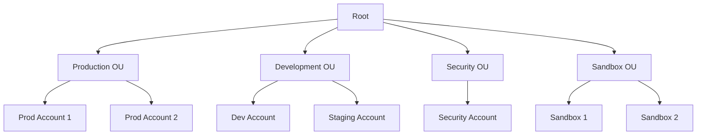

# How to Set Up AWS Organizations Consolidated Billing

Author: [nawazdhandala](https://github.com/nawazdhandala)

Tags: AWS, Organizations, Billing, Cost Management

Description: Step-by-step guide to setting up AWS Organizations consolidated billing to get volume discounts, centralized cost management, and better visibility across multiple accounts.

---

If your company runs more than one AWS account - and most do once they reach a certain size - consolidated billing through AWS Organizations is a no-brainer. It aggregates usage across all accounts for volume pricing discounts, provides a single bill, and gives you centralized visibility into spending across your entire organization.

The setup takes about 30 minutes, and the benefits kick in immediately.

## Why Consolidated Billing Matters

Without consolidated billing, each AWS account is billed independently. That means each account hits volume pricing tiers separately. With consolidated billing, usage across all accounts is pooled together, which means you reach higher discount tiers faster.

Here's a concrete example with S3 storage pricing:

- **First 50TB**: $0.023/GB
- **Next 450TB**: $0.022/GB
- **Over 500TB**: $0.021/GB

If you have five accounts each storing 20TB, individually they all pay $0.023/GB. Consolidated, they total 100TB, so the first 50TB costs $0.023/GB and the next 50TB costs $0.022/GB. That's an automatic savings with zero effort.

The same pooling applies to data transfer, EC2 usage for Reserved Instance sharing, and other volume-tiered services.

## Step 1: Create the Organization

You'll designate one account as the management (payer) account. This should be a dedicated account that doesn't run workloads - just billing and organization management.

```bash
# From the management account, create the organization
aws organizations create-organization --feature-set ALL

# Verify the organization was created
aws organizations describe-organization
```

The `ALL` feature set gives you both consolidated billing and service control policies (SCPs). If you only want billing, you can use `CONSOLIDATED_BILLING`, but I'd recommend `ALL` since you'll likely want SCPs later.

## Step 2: Invite Existing Accounts

For accounts that already exist, send invitations:

```bash
# Invite an existing account to join the organization
aws organizations invite-account-to-organization \
  --target '{"Id": "222233334444", "Type": "ACCOUNT"}' \
  --notes "Joining organization for consolidated billing"

# List pending invitations
aws organizations list-handshakes-for-organization \
  --filter '{"ActionType": "INVITE"}'
```

The invited account needs to accept the invitation:

```bash
# From the invited account: accept the organization invitation
aws organizations accept-handshake \
  --handshake-id h-0a1b2c3d4e5f67890
```

## Step 3: Create New Accounts Directly

For new accounts, it's easier to create them directly within the organization:

```bash
# Create a new member account
aws organizations create-account \
  --email dev-team@example.com \
  --account-name "Development"

# Check the account creation status
aws organizations describe-create-account-status \
  --create-account-request-id car-0a1b2c3d4e5f67890
```

Accounts created this way automatically have consolidated billing enabled and are part of your organization from day one.

## Step 4: Organize with Organizational Units (OUs)

OUs let you group accounts logically and apply policies at the group level. A common structure looks like this:



Create OUs and move accounts:

```bash
# Get the root ID
ROOT_ID=$(aws organizations list-roots --query "Roots[0].Id" --output text)

# Create organizational units
aws organizations create-organizational-unit \
  --parent-id $ROOT_ID \
  --name "Production"

aws organizations create-organizational-unit \
  --parent-id $ROOT_ID \
  --name "Development"

aws organizations create-organizational-unit \
  --parent-id $ROOT_ID \
  --name "Security"

# Move an account to an OU
aws organizations move-account \
  --account-id 222233334444 \
  --source-parent-id $ROOT_ID \
  --destination-parent-id ou-abc1-23456789
```

## Step 5: Enable Cost Allocation Tags

Cost allocation tags let you tag resources across accounts and see costs broken down by tag in the consolidated bill:

```bash
# Activate cost allocation tags (from management account)
aws ce update-cost-allocation-tags-status \
  --cost-allocation-tags-status '[
    {"TagKey": "Environment", "Status": "Active"},
    {"TagKey": "Team", "Status": "Active"},
    {"TagKey": "Project", "Status": "Active"}
  ]'
```

Tags take 24 hours to appear in billing reports after activation.

## Step 6: Share Reserved Instances and Savings Plans

One of the biggest financial benefits of consolidated billing is RI and Savings Plans sharing. When one account purchases an RI, and it has no matching instance in that account, the discount automatically applies to matching instances in other accounts in the organization.

This is enabled by default. You can verify or disable it:

```bash
# Check if RI sharing is enabled (it is by default)
aws organizations describe-organization \
  --query "Organization.AvailablePolicyTypes"

# To disable RI sharing for a specific linked account (rare, but possible)
# This is done through the billing console or API
aws ce update-preferences \
  --member-account-discount-visibility NONE
```

This means you can buy RIs in a central account and have them apply across the organization. No more wondering if each team bought the right reservations for their accounts.

## Step 7: Set Up Cross-Account Cost Visibility

Give team leads and finance visibility into their account's spending:

```bash
# Enable Cost Explorer for all member accounts
aws ce update-cost-allocation-tags-status \
  --cost-allocation-tags-status '[{"TagKey": "CostCenter", "Status": "Active"}]'

# Create a cost anomaly monitor for the entire organization
aws ce create-anomaly-monitor \
  --anomaly-monitor '{
    "MonitorName": "OrgWideMonitor",
    "MonitorType": "DIMENSIONAL",
    "MonitorDimension": "SERVICE"
  }'

# Create an alert subscription
aws ce create-anomaly-subscription \
  --anomaly-subscription '{
    "SubscriptionName": "OrgAlerts",
    "MonitorArnList": ["arn:aws:ce::123456789012:anomalymonitor/monitor-id"],
    "Subscribers": [
      {"Address": "finance@example.com", "Type": "EMAIL"}
    ],
    "Threshold": 100,
    "Frequency": "DAILY"
  }'
```

## Step 8: Set Up Budgets Per Account

Create individual budgets for each account so teams know their limits:

```bash
# Create a monthly budget for a specific linked account
aws budgets create-budget \
  --account-id 111122223333 \
  --budget '{
    "BudgetName": "DevAccountMonthly",
    "BudgetLimit": {"Amount": "5000", "Unit": "USD"},
    "TimeUnit": "MONTHLY",
    "BudgetType": "COST",
    "CostFilters": {
      "LinkedAccount": ["222233334444"]
    }
  }' \
  --notifications-with-subscribers '[
    {
      "Notification": {
        "NotificationType": "FORECASTED",
        "ComparisonOperator": "GREATER_THAN",
        "Threshold": 80
      },
      "Subscribers": [
        {"SubscriptionType": "EMAIL", "Address": "dev-lead@example.com"}
      ]
    },
    {
      "Notification": {
        "NotificationType": "ACTUAL",
        "ComparisonOperator": "GREATER_THAN",
        "Threshold": 100
      },
      "Subscribers": [
        {"SubscriptionType": "EMAIL", "Address": "dev-lead@example.com"},
        {"SubscriptionType": "EMAIL", "Address": "finance@example.com"}
      ]
    }
  ]'
```

## Common Pitfalls

**Don't use the management account for workloads.** Keep it clean - only for billing and organization management. This reduces security risk and makes billing cleaner.

**Be careful with SCPs.** Service Control Policies can accidentally block critical services. Start with deny-list mode (allow everything, explicitly deny specific actions) rather than allow-list mode.

**Plan your OU structure before migrating.** Restructuring OUs later means moving accounts and updating policies. Get it right upfront.

**Enable CloudTrail in the management account.** All organization API calls should be logged for audit purposes:

```bash
# Create an organization-wide CloudTrail
aws cloudtrail create-trail \
  --name organization-trail \
  --s3-bucket-name my-cloudtrail-bucket \
  --is-organization-trail \
  --is-multi-region-trail \
  --enable-log-file-validation
```

## What You Get

After setup, you'll have:

- A single monthly bill for all accounts
- Automatic volume discounts from pooled usage
- Shared RI and Savings Plans benefits
- Centralized cost visibility with Cost Explorer
- Per-account budgets and alerts
- Organizational structure for policy management

For more on managing your AWS costs effectively, check out our guide on [creating a cost optimization strategy for AWS](https://oneuptime.com/blog/post/2026-02-12-create-a-cost-optimization-strategy-for-aws/view) and [using AWS Pricing Calculator for cost estimation](https://oneuptime.com/blog/post/2026-02-12-use-aws-pricing-calculator-for-cost-estimation/view).
