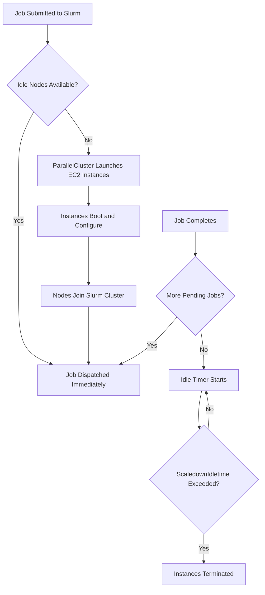

# How to Set Up AWS ParallelCluster for HPC

Author: [nawazdhandala](https://github.com/nawazdhandala)

Tags: AWS, ParallelCluster, HPC, High Performance Computing, EC2, Cloud Computing

Description: A practical guide to setting up AWS ParallelCluster for high-performance computing workloads including cluster configuration, job scheduling, and scaling.

---

Running HPC workloads on AWS does not have to mean managing every instance by hand. AWS ParallelCluster is an open-source cluster management tool that automates the creation and management of HPC clusters on AWS. You define what you want in a configuration file, and ParallelCluster handles provisioning compute nodes, setting up a shared filesystem, configuring a job scheduler, and scaling up or down based on demand.

This guide takes you from zero to a working HPC cluster with Slurm as the job scheduler.

## What Is AWS ParallelCluster?

AWS ParallelCluster is essentially a CloudFormation-based tool that builds and manages HPC clusters. It supports Slurm as the job scheduler (AWS Batch integration is also available but Slurm is the default and most popular choice). It handles:

- Head node and compute node provisioning
- Shared storage setup (EBS, FSx for Lustre, EFS)
- Job scheduler configuration
- Auto-scaling based on job queue depth
- Integration with EFA for low-latency networking

## Prerequisites

You need:

- An AWS account with permissions to create EC2 instances, VPCs, CloudFormation stacks, and IAM roles
- Python 3.7+ installed locally
- An EC2 key pair for SSH access

## Step 1: Install ParallelCluster CLI

ParallelCluster is distributed as a Python package.

```bash
# Install the ParallelCluster CLI
pip3 install aws-parallelcluster

# Verify the installation
pcluster version
```

You also need Node.js for the CDK components that ParallelCluster uses under the hood.

```bash
# Install Node.js if you don't have it
# On macOS:
brew install node

# On Amazon Linux 2:
curl -sL https://rpm.nodesource.com/setup_18.x | sudo bash -
sudo yum install -y nodejs
```

## Step 2: Create the Cluster Configuration

ParallelCluster uses a YAML configuration file. Here is a solid starting point for a general-purpose HPC cluster.

```yaml
# cluster-config.yaml
Region: us-east-1
Image:
  Os: alinux2

HeadNode:
  InstanceType: m6i.xlarge
  Networking:
    SubnetId: subnet-0abc123def456
  Ssh:
    KeyName: my-hpc-keypair
  LocalStorage:
    RootVolume:
      Size: 100

Scheduling:
  Scheduler: slurm
  SlurmQueues:
    - Name: compute
      ComputeResources:
        - Name: c6i-nodes
          InstanceType: c6i.8xlarge
          MinCount: 0
          MaxCount: 100
      Networking:
        SubnetIds:
          - subnet-0abc123def456
        PlacementGroup:
          Enabled: true
    - Name: gpu
      ComputeResources:
        - Name: g5-nodes
          InstanceType: g5.8xlarge
          MinCount: 0
          MaxCount: 20
      Networking:
        SubnetIds:
          - subnet-0abc123def456

SharedStorage:
  - MountDir: /shared
    Name: shared-ebs
    StorageType: Ebs
    EbsSettings:
      VolumeType: gp3
      Size: 500
  - MountDir: /scratch
    Name: scratch-fsx
    StorageType: FsxLustre
    FsxLustreSettings:
      StorageCapacity: 1200
      DeploymentType: SCRATCH_2
```

Let me break down the key sections:

- **HeadNode**: This is the login node where you submit jobs. It does not need to be large since it mainly runs the scheduler.
- **SlurmQueues**: Two queues here. The `compute` queue uses compute-optimized instances, and the `gpu` queue uses GPU instances. MinCount of 0 means nodes spin up only when jobs are submitted.
- **SharedStorage**: An EBS volume for persistent data and FSx for Lustre for high-throughput scratch space.
- **PlacementGroup**: Keeps compute nodes physically close for lower latency.

## Step 3: Create the Cluster

```bash
# Create the cluster (this takes 10-15 minutes)
pcluster create-cluster \
  --cluster-name my-hpc-cluster \
  --cluster-configuration cluster-config.yaml

# Watch the creation progress
pcluster describe-cluster --cluster-name my-hpc-cluster
```

You can also follow along in the CloudFormation console. The status will go from `CREATE_IN_PROGRESS` to `CREATE_COMPLETE`.

## Step 4: Connect to the Head Node

```bash
# SSH into the head node
pcluster ssh --cluster-name my-hpc-cluster -i ~/.ssh/my-hpc-keypair.pem
```

Once connected, you have a fully configured Slurm environment.

```bash
# Check cluster status from the head node
sinfo

# You should see output like:
# PARTITION  AVAIL  TIMELIMIT  NODES  STATE NODELIST
# compute*      up   infinite    100  idle~ compute-dy-c6i-nodes-[1-100]
# gpu           up   infinite     20  idle~ gpu-dy-g5-nodes-[1-20]
```

The `~` suffix on the state means nodes are in "cloud" state, meaning they do not exist yet. They will spin up when jobs request them.

## Step 5: Submit Your First Job

Create a simple job script to test.

```bash
#!/bin/bash
#SBATCH --job-name=test-job
#SBATCH --nodes=2
#SBATCH --ntasks-per-node=32
#SBATCH --partition=compute
#SBATCH --time=00:30:00
#SBATCH --output=output_%j.txt

# Load any modules you need
module load openmpi

# Run an MPI program
mpirun ./my_simulation --input data.dat --output results.dat
```

Submit it:

```bash
# Submit the job
sbatch test-job.sh

# Check job status
squeue

# Watch nodes spin up
sinfo
```

ParallelCluster detects the pending job, launches two c6i.8xlarge instances, configures them, and joins them to the Slurm cluster. This typically takes 3-5 minutes for the first job. Subsequent jobs run faster if nodes are still warm.

## Step 6: Add FSx for Lustre with S3 Integration

For many HPC workflows, you want to pull input data from S3 and push results back. FSx for Lustre has native S3 integration.

```yaml
# Updated SharedStorage section
SharedStorage:
  - MountDir: /scratch
    Name: scratch-fsx
    StorageType: FsxLustre
    FsxLustreSettings:
      StorageCapacity: 1200
      DeploymentType: SCRATCH_2
      ImportPath: s3://my-hpc-input-data
      ExportPath: s3://my-hpc-output-data
      AutoImportPolicy: NEW_CHANGED_DELETED
```

With this setup, anything in the S3 bucket appears as a file under `/scratch`, and you can write results back using `lfs hsm_archive`.

## Step 7: Enable EFA for Low-Latency Communication

If your workload is tightly coupled (like CFD or molecular dynamics), you want Elastic Fabric Adapter for inter-node communication. For details on EFA setup, see our guide on [configuring EFA for HPC](https://oneuptime.com/blog/post/2026-02-12-configure-efa-elastic-fabric-adapter-for-hpc/view).

```yaml
# Update the compute queue to enable EFA
SlurmQueues:
  - Name: compute-efa
    ComputeResources:
      - Name: hpc6a-nodes
        InstanceType: hpc6a.48xlarge
        MinCount: 0
        MaxCount: 50
    Networking:
      SubnetIds:
        - subnet-0abc123def456
      PlacementGroup:
        Enabled: true
    ComputeSettings:
      LocalStorage:
        RootVolume:
          Size: 100
```

The `hpc6a.48xlarge` instances come with EFA built in. ParallelCluster automatically configures the EFA drivers and libfabric.

## Scaling Behavior

ParallelCluster's auto-scaling works like this:



The default scaledown idle time is 10 minutes. You can adjust it in the configuration.

## Cost Optimization Tips

- Set `MinCount: 0` on all queues so you only pay for compute when jobs are running
- Use Spot Instances for fault-tolerant workloads by adding `CapacityType: SPOT` to your compute resources
- Choose the right instance type for your workload. Compute-bound jobs should use C-series, memory-bound should use R-series
- Use FSx for Lustre SCRATCH_2 deployment type for temporary data since it is cheaper than PERSISTENT

For more on saving money with Spot Instances in batch workloads, check out [using AWS Batch with Spot Instances](https://oneuptime.com/blog/post/2026-02-12-use-aws-batch-with-spot-instances-for-cost-savings/view).

## Updating the Cluster

You can update most settings without destroying the cluster.

```bash
# Update the cluster with a modified config
pcluster update-cluster \
  --cluster-name my-hpc-cluster \
  --cluster-configuration updated-config.yaml

# Some changes require stopping compute nodes first
pcluster update-compute-fleet \
  --cluster-name my-hpc-cluster \
  --status STOP_REQUESTED
```

## Monitoring

ParallelCluster integrates with CloudWatch by default. You get logs from the scheduler and the cluster daemons. You can also set up custom dashboards to track job throughput and node utilization.

## Deleting the Cluster

When you are done, clean up.

```bash
# Delete the cluster and all resources
pcluster delete-cluster --cluster-name my-hpc-cluster
```

This tears down all EC2 instances, networking components, and storage. Make sure you have saved any data on the shared volumes first.

## Wrapping Up

AWS ParallelCluster removes the heavy lifting of building an HPC environment. You define your cluster in a YAML file, and it handles everything from Slurm configuration to auto-scaling to shared filesystem setup. For teams that are migrating on-premises HPC workloads to the cloud, or starting fresh with a new simulation or analysis pipeline, ParallelCluster is the fastest path to a working cluster.
