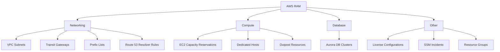

# How to Set Up AWS RAM (Resource Access Manager) for Cross-Account Sharing

Author: [nawazdhandala](https://github.com/nawazdhandala)

Tags: AWS, RAM, Resource Sharing, Multi-Account, Organizations, Networking

Description: Set up AWS Resource Access Manager to securely share resources like VPC subnets, Transit Gateways, and Route 53 zones across multiple AWS accounts.

---

As your AWS footprint grows, you inevitably end up with multiple accounts. Maybe you have separate accounts for dev, staging, and production. Maybe each team has their own account. Maybe you acquired a company and need to integrate their infrastructure. Whatever the reason, you will eventually need resources in one account to be accessible from another.

AWS Resource Access Manager (RAM) lets you share specific AWS resources across accounts without duplicating them. Instead of creating a Transit Gateway in every account, you create it once and share it. Instead of peering VPCs between 20 accounts, you share subnets from a central networking account. This reduces cost, complexity, and the chance of configuration drift.

## What Resources Can You Share

RAM supports sharing a growing list of resource types:



The most commonly shared resources are VPC subnets and Transit Gateways, which we will focus on in this guide.

## Prerequisites

If your accounts are part of an AWS Organization, enable resource sharing within the organization first:

```bash
# Enable RAM sharing within the organization (run from management account)
aws ram enable-sharing-with-aws-organization
```

This allows you to share resources with organizational units (OUs) or the entire organization, which is much cleaner than sharing with individual account IDs.

## Scenario 1: Sharing VPC Subnets

The most common RAM use case is shared VPC subnets. A central networking team creates a VPC with subnets in a dedicated networking account, then shares those subnets with other accounts. Resources in those accounts (EC2 instances, Lambda functions, RDS instances) launch directly into the shared subnets.

### Step 1: Create the Shared VPC (Networking Account)

```bash
# Create the shared VPC in the networking account
aws ec2 create-vpc \
  --cidr-block "10.0.0.0/16" \
  --tag-specifications 'ResourceType=vpc,Tags=[{Key=Name,Value=shared-vpc}]'

# Create subnets for different workloads
# Subnet for team A
aws ec2 create-subnet \
  --vpc-id "vpc-abc123" \
  --cidr-block "10.0.1.0/24" \
  --availability-zone "us-east-1a" \
  --tag-specifications 'ResourceType=subnet,Tags=[{Key=Name,Value=team-a-subnet-1a}]'

# Subnet for team B
aws ec2 create-subnet \
  --vpc-id "vpc-abc123" \
  --cidr-block "10.0.2.0/24" \
  --availability-zone "us-east-1a" \
  --tag-specifications 'ResourceType=subnet,Tags=[{Key=Name,Value=team-b-subnet-1a}]'
```

### Step 2: Share Subnets with RAM

```bash
# Create a resource share for team A's subnets
aws ram create-resource-share \
  --name "TeamA-Networking" \
  --resource-arns '[
    "arn:aws:ec2:us-east-1:111111111111:subnet/subnet-teamA1a",
    "arn:aws:ec2:us-east-1:111111111111:subnet/subnet-teamA1b"
  ]' \
  --principals '[
    "arn:aws:organizations::111111111111:ou/o-abc123/ou-teamA"
  ]' \
  --tags '[
    {"key": "Purpose", "value": "Shared networking for Team A"}
  ]'
```

When sharing with an OU, all current and future accounts in that OU automatically get access to the shared subnets. No manual acceptance required.

### Step 3: Use Shared Subnets (Team Account)

In the team's account, the shared subnets appear just like native subnets. Teams can launch resources into them:

```bash
# Launch an EC2 instance into the shared subnet (from team A's account)
aws ec2 run-instances \
  --image-id "ami-0123456789abcdef0" \
  --instance-type "t3.medium" \
  --subnet-id "subnet-teamA1a" \
  --tag-specifications 'ResourceType=instance,Tags=[{Key=Name,Value=team-a-app-server}]'
```

The instance launches in the shared subnet but is owned by the team's account. Security groups are account-specific, so each team manages their own security groups.

### What Shared Subnets Can and Cannot Do

Resources in shared subnets:

- Can communicate with each other within the VPC (same as any VPC)
- Use security groups from their own account
- Appear in their own account's EC2 console and CLI
- Are billed to their own account

The networking account retains control of:

- The VPC itself (route tables, NACLs, internet gateways)
- Subnet CIDR allocations
- VPC flow logs
- DNS settings

## Scenario 2: Sharing a Transit Gateway

Transit Gateways connect multiple VPCs and on-premises networks. Sharing a Transit Gateway lets multiple accounts attach their VPCs without each account needing its own.

```bash
# Create a Transit Gateway in the networking account
aws ec2 create-transit-gateway \
  --description "Organization-wide Transit Gateway" \
  --options '{
    "AmazonSideAsn": 64512,
    "AutoAcceptSharedAttachments": "enable",
    "DefaultRouteTableAssociation": "enable",
    "DefaultRouteTablePropagation": "enable",
    "DnsSupport": "enable"
  }' \
  --tag-specifications 'ResourceType=transit-gateway,Tags=[{Key=Name,Value=org-transit-gateway}]'

# Share it via RAM
aws ram create-resource-share \
  --name "Org-Transit-Gateway" \
  --resource-arns '[
    "arn:aws:ec2:us-east-1:111111111111:transit-gateway/tgw-abc123"
  ]' \
  --principals '[
    "arn:aws:organizations::111111111111:organization/o-abc123"
  ]'
```

With `AutoAcceptSharedAttachments` enabled, accounts can create VPC attachments to the Transit Gateway without manual approval from the networking account.

In a team account:

```bash
# Attach a VPC to the shared Transit Gateway
aws ec2 create-transit-gateway-vpc-attachment \
  --transit-gateway-id "tgw-abc123" \
  --vpc-id "vpc-team123" \
  --subnet-ids '["subnet-team1a", "subnet-team1b"]' \
  --tag-specifications 'ResourceType=transit-gateway-attachment,Tags=[{Key=Name,Value=team-vpc-attachment}]'
```

## Scenario 3: Sharing Route 53 Resolver Rules

If you have a hybrid DNS setup with forwarding rules to on-premises DNS servers, share those rules so all accounts can resolve on-premises hostnames:

```bash
# Share Route 53 Resolver forwarding rules
aws ram create-resource-share \
  --name "DNS-Forwarding-Rules" \
  --resource-arns '[
    "arn:aws:route53resolver:us-east-1:111111111111:resolver-rule/rslvr-rr-abc123"
  ]' \
  --principals '[
    "arn:aws:organizations::111111111111:organization/o-abc123"
  ]'
```

## Managing Resource Shares

Here are the key management operations:

```bash
# List all resource shares you own
aws ram get-resource-shares --resource-owner "SELF"

# List all resource shares shared with your account
aws ram get-resource-shares --resource-owner "OTHER-ACCOUNTS"

# List resources in a share
aws ram list-resources \
  --resource-owner "SELF" \
  --resource-share-arns '["arn:aws:ram:us-east-1:111111111111:resource-share/abc123"]'

# Add a resource to an existing share
aws ram associate-resource-share \
  --resource-share-arn "arn:aws:ram:us-east-1:111111111111:resource-share/abc123" \
  --resource-arns '["arn:aws:ec2:us-east-1:111111111111:subnet/subnet-new"]'

# Add a principal to an existing share
aws ram associate-resource-share \
  --resource-share-arn "arn:aws:ram:us-east-1:111111111111:resource-share/abc123" \
  --principals '["222222222222"]'

# Remove access
aws ram disassociate-resource-share \
  --resource-share-arn "arn:aws:ram:us-east-1:111111111111:resource-share/abc123" \
  --principals '["222222222222"]'
```

## Security Considerations

**Use Organizations for sharing** whenever possible. Sharing by account ID works but is harder to manage at scale and requires the recipient to accept the share invitation.

**Be deliberate about what you share.** Just because you can share a resource does not mean you should. Share the minimum set of resources needed for the use case.

**Monitor shared resource usage** with CloudTrail. All API calls made against shared resources are logged in both the owner's and the consumer's CloudTrail.

**Use resource-based policies** in combination with RAM when available. For example, KMS keys and S3 buckets have their own cross-account access mechanisms that may be more appropriate than RAM.

**Tag your resource shares** consistently so you can track what is shared with whom and why.

## Wrapping Up

AWS RAM is the clean, manageable way to share infrastructure across accounts. Without it, you end up with a tangle of VPC peering connections, cross-account IAM roles, and duplicated resources. The shared VPC subnet pattern alone can dramatically simplify your networking architecture and reduce costs. Start with your networking resources since those are the most commonly shared, and expand to other resource types as the need arises.
