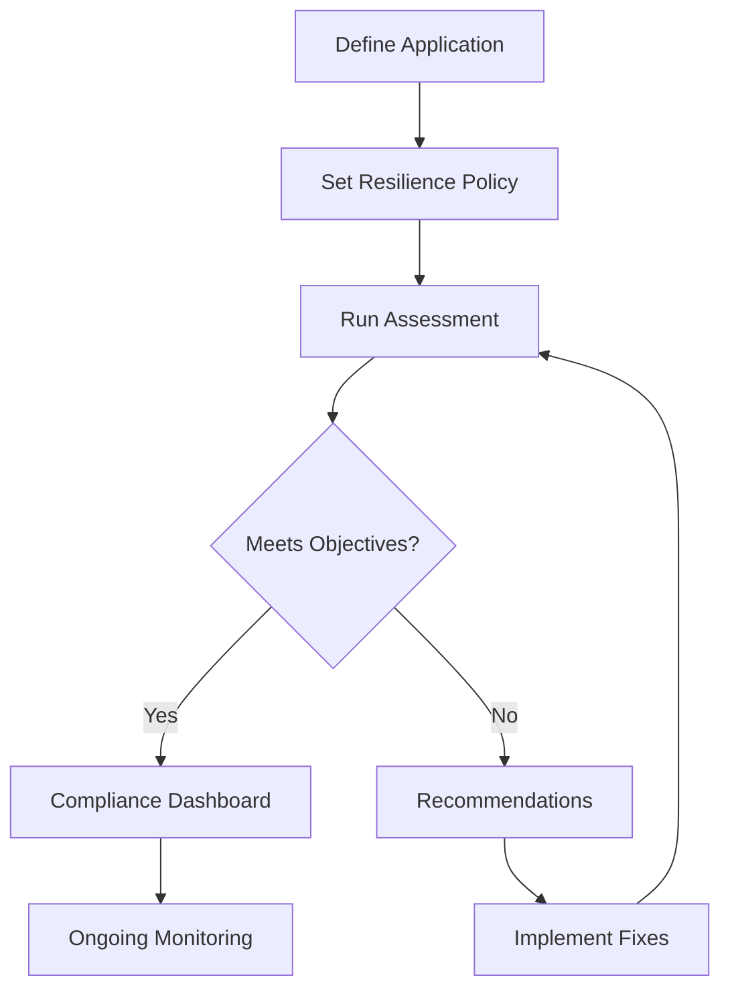

# How to Set Up AWS Resilience Hub for Application Resilience

Author: [nawazdhandala](https://github.com/nawazdhandala)

Tags: AWS, Resilience Hub, Disaster Recovery, Reliability

Description: Guide to setting up AWS Resilience Hub to assess, track, and improve application resilience with recovery time objectives, failure injection testing, and compliance reporting.

---

Most teams don't think about resilience until something breaks. Then it's 3 AM, the database is down, and nobody knows how long recovery will take because nobody ever tested it. AWS Resilience Hub forces you to think about failure modes before they happen. It assesses your application architecture, identifies weaknesses, recommends improvements, and tracks your resilience posture over time.

This guide walks through setting up Resilience Hub, defining resilience policies, running assessments, and acting on the results.

## What Resilience Hub Does

Resilience Hub provides four main capabilities:

1. **Application discovery**: Identifies your application's AWS resources and their dependencies
2. **Resilience assessment**: Tests your architecture against defined recovery objectives
3. **Recommendations**: Suggests specific improvements to meet your objectives
4. **Operational readiness**: Provides runbooks and fault injection tests



## Defining Your Application

Start by telling Resilience Hub about your application and its resources.

```bash
# Create an application in Resilience Hub
aws resiliencehub create-app \
    --name "payment-service" \
    --description "Payment processing service" \
    --app-assessment-schedule "Daily"
```

Import resources from CloudFormation stacks, resource groups, or Terraform state files.

```bash
# Import from a CloudFormation stack
aws resiliencehub import-resources-to-draft-app-version \
    --app-arn "arn:aws:resiliencehub:us-east-1:123456789:app/abc123" \
    --source-arns '["arn:aws:cloudformation:us-east-1:123456789:stack/payment-service-stack/xyz"]'

# Or import specific resources manually
aws resiliencehub import-resources-to-draft-app-version \
    --app-arn "arn:aws:resiliencehub:us-east-1:123456789:app/abc123" \
    --source-arns '[
        "arn:aws:ec2:us-east-1:123456789:instance/i-abc123",
        "arn:aws:rds:us-east-1:123456789:db:payment-db",
        "arn:aws:elasticloadbalancing:us-east-1:123456789:loadbalancer/app/payment-alb/xyz"
    ]'
```

## Setting a Resilience Policy

A resilience policy defines your recovery objectives across different failure scenarios.

```bash
# Create a resilience policy
aws resiliencehub create-resiliency-policy \
    --policy-name "payment-service-policy" \
    --policy-description "Resilience requirements for the payment service" \
    --tier "MissionCritical" \
    --policy '{
        "Software": {
            "rtoInSecs": 300,
            "rpoInSecs": 60
        },
        "Hardware": {
            "rtoInSecs": 600,
            "rpoInSecs": 300
        },
        "AZ": {
            "rtoInSecs": 900,
            "rpoInSecs": 300
        },
        "Region": {
            "rtoInSecs": 3600,
            "rpoInSecs": 900
        }
    }'
```

The policy defines RTO (Recovery Time Objective) and RPO (Recovery Point Objective) for four disruption types:

- **Software**: Application crashes, deployment failures
- **Hardware**: EC2 instance failures, EBS volume issues
- **AZ**: Entire Availability Zone outage
- **Region**: Entire AWS Region outage

For a payment service, you'd want aggressive objectives - 5-minute RTO for software failures, 15-minute for AZ failures.

## Attaching the Policy to Your Application

```bash
# Attach the policy to your application
aws resiliencehub update-app \
    --app-arn "arn:aws:resiliencehub:us-east-1:123456789:app/abc123" \
    --policy-arn "arn:aws:resiliencehub:us-east-1:123456789:resiliency-policy/def456"
```

## Publishing the Application Version

Before running an assessment, publish your application version.

```bash
# Publish the draft app version
aws resiliencehub publish-app-version \
    --app-arn "arn:aws:resiliencehub:us-east-1:123456789:app/abc123"
```

## Running a Resilience Assessment

Now run the assessment. Resilience Hub analyzes your architecture and compares it against your policy.

```bash
# Start a resilience assessment
aws resiliencehub start-app-assessment \
    --app-arn "arn:aws:resiliencehub:us-east-1:123456789:app/abc123" \
    --app-version "release" \
    --assessment-name "initial-assessment"
```

The assessment takes a few minutes. Check its status.

```bash
# Check assessment status
aws resiliencehub describe-app-assessment \
    --assessment-arn "arn:aws:resiliencehub:us-east-1:123456789:app-assessment/ghi789"
```

## Reading Assessment Results

The assessment produces a detailed report showing your compliance status and any gaps.

```bash
# List assessment recommendations
aws resiliencehub list-app-assessment-compliance-drifts \
    --assessment-arn "arn:aws:resiliencehub:us-east-1:123456789:app-assessment/ghi789"

# Get specific recommendations
aws resiliencehub list-recommendation-templates \
    --assessment-arn "arn:aws:resiliencehub:us-east-1:123456789:app-assessment/ghi789"
```

A typical assessment might produce results like this.

```json
{
    "complianceStatus": "PolicyBreached",
    "disruptions": {
        "Software": {
            "achievableRtoInSecs": 120,
            "achievableRpoInSecs": 30,
            "currentRtoInSecs": 120,
            "currentRpoInSecs": 30,
            "complianceStatus": "PolicyMet"
        },
        "AZ": {
            "achievableRtoInSecs": 1800,
            "achievableRpoInSecs": 600,
            "currentRtoInSecs": 1800,
            "currentRpoInSecs": 600,
            "complianceStatus": "PolicyBreached"
        },
        "Region": {
            "achievableRtoInSecs": 7200,
            "achievableRpoInSecs": 3600,
            "currentRtoInSecs": 7200,
            "currentRpoInSecs": 3600,
            "complianceStatus": "PolicyBreached"
        }
    }
}
```

In this example, the application meets software failure objectives but breaches the AZ and Region policies. The assessment will include specific recommendations.

## Acting on Recommendations

Resilience Hub provides concrete recommendations, not just generic advice. Common recommendations include:

**Multi-AZ deployment**: If your database is single-AZ, it recommends enabling Multi-AZ.

```bash
# Enable Multi-AZ for RDS
aws rds modify-db-instance \
    --db-instance-identifier payment-db \
    --multi-az \
    --apply-immediately
```

**Cross-region replication**: For meeting Region-level RTO/RPO.

```bash
# Create a read replica in another region
aws rds create-db-instance-read-replica \
    --db-instance-identifier payment-db-replica \
    --source-db-instance-identifier payment-db \
    --source-region us-east-1 \
    --region us-west-2
```

**Auto Scaling configuration**: Ensuring your application can recover from instance failures.

```bash
# Verify auto scaling is configured properly
aws autoscaling describe-auto-scaling-groups \
    --query "AutoScalingGroups[?contains(Tags[?Key=='Application'].Value, 'payment-service')]"
```

**Backup configuration**: Ensuring backups meet your RPO.

```bash
# Check RDS backup retention
aws rds describe-db-instances \
    --db-instance-identifier payment-db \
    --query "DBInstances[0].BackupRetentionPeriod"
```

## Testing Resilience with Fault Injection

Resilience Hub integrates with AWS Fault Injection Simulator (FIS) to validate your resilience posture through controlled experiments.

```bash
# Create a fault injection experiment template
aws fis create-experiment-template \
    --description "Test AZ failure for payment service" \
    --targets '{
        "ec2-instances": {
            "resourceType": "aws:ec2:instance",
            "resourceTags": {"Application": "payment-service"},
            "selectionMode": "ALL"
        }
    }' \
    --actions '{
        "stop-instances": {
            "actionId": "aws:ec2:stop-instances",
            "parameters": {"startInstancesAfterDuration": "PT5M"},
            "targets": {"Instances": "ec2-instances"}
        }
    }' \
    --stop-conditions '[{
        "source": "aws:cloudwatch:alarm",
        "value": "arn:aws:cloudwatch:us-east-1:123456789:alarm:PaymentServiceCritical"
    }]' \
    --role-arn "arn:aws:iam::123456789:role/FISRole"
```

The stop condition is your safety net - if the alarm triggers, the experiment automatically stops and instances are restored.

## Generating Operational Runbooks

Resilience Hub can generate Systems Manager runbooks for recovery procedures.

```bash
# Create recommendation templates (including runbooks)
aws resiliencehub create-recommendation-template \
    --assessment-arn "arn:aws:resiliencehub:us-east-1:123456789:app-assessment/ghi789" \
    --name "payment-service-runbooks" \
    --recommendation-types '["SopRecommendation", "TestRecommendation"]'
```

This generates:

- **SOP Recommendations**: Standard operating procedures for common failure scenarios
- **Test Recommendations**: FIS experiment templates for validating resilience

## Scheduling Assessments

Run assessments regularly to catch drift as your architecture evolves.

```bash
# Configure daily assessments
aws resiliencehub update-app \
    --app-arn "arn:aws:resiliencehub:us-east-1:123456789:app/abc123" \
    --assessment-schedule "Daily"
```

## Monitoring Resilience Drift

Track your resilience compliance over time.

```python
# resilience_report.py - Track resilience compliance
import boto3

hub = boto3.client('resiliencehub', region_name='us-east-1')

def check_compliance(app_arn):
    """Check current resilience compliance status."""
    # Get the latest assessment
    assessments = hub.list_app_assessments(
        appArn=app_arn,
        assessmentStatus='Success'
    )

    if not assessments['assessmentSummaries']:
        print("No assessments found")
        return

    latest = assessments['assessmentSummaries'][0]
    status = latest['complianceStatus']

    print(f"Application: {latest['appArn']}")
    print(f"Assessment: {latest['assessmentArn']}")
    print(f"Compliance: {status}")

    if status == 'PolicyBreached':
        print("WARNING: Application does not meet resilience objectives")
        # Get details on what's breached
        detail = hub.describe_app_assessment(
            assessmentArn=latest['assessmentArn']
        )
        compliance = detail['assessment']['compliance']
        for disruption, data in compliance.items():
            if data['complianceStatus'] == 'PolicyBreached':
                print(f"  {disruption}: RTO {data['currentRtoInSecs']}s (target: {data['achievableRtoInSecs']}s)")

check_compliance("arn:aws:resiliencehub:us-east-1:123456789:app/abc123")
```

## Wrapping Up

Resilience Hub turns resilience from an afterthought into a measured, tracked metric. Define your recovery objectives, let it assess your architecture, follow its recommendations, and run regular fault injection tests to validate. The dashboard gives you a clear picture of your resilience posture, and scheduled assessments catch drift before it becomes a problem during an actual outage.

Start with your most critical application. Define realistic RTO/RPO targets, run the assessment, and work through the recommendations. Then expand to cover more of your infrastructure. For a broader approach to resilience, check out our guide on [running a Well-Architected Review](https://oneuptime.com/blog/post/run-well-architected-review-with-aws/view).
